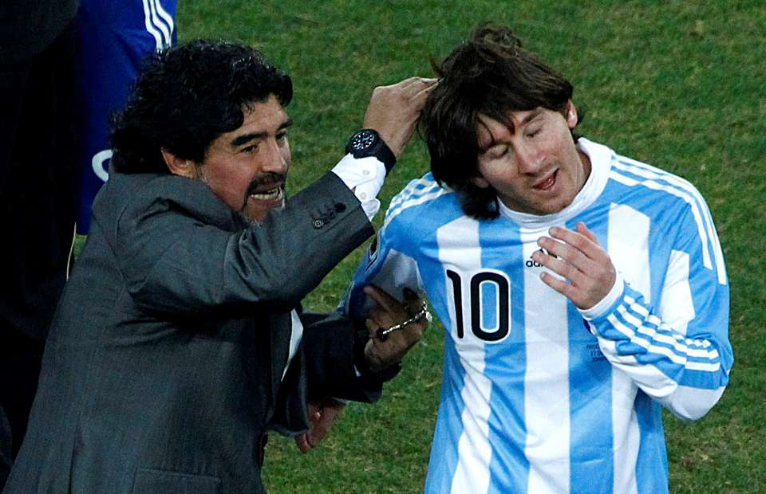

“I worked hard all my life for this. Those who say I don't deserve anything, that it all came easy, can kiss my arse.” - Diego Maradona

Maradona, world famous legendary, great Footballer, as popular in world as he is in Argentina. Diego Armando Maradona was an Argentine professional football player and manager. He is born in October 30, 1960 Lanús is the capital of Lanús Partido, Buenos Aires Province in Argentina, and Died in November 25, 2020 (aged 60). He was one of the two joint winners of the FIFA Player of the 20th Century award.

He is biggest icon ever in the world of football, The Magician, The Greatest South American.

At the point when Maradona spilled past four England players prior to adjusting Peter Shilton and scoring that sonnet of an objective in the Mexico 1986 World Cup, the entire world respected the virtuoso with amazement. That was likewise the second Bangladesh football fans began to look all starry eyed at Maradona, which just developed throughout the long term.

Seeing large number of Argentine banners everywhere of the nation and the enormous fan following that became lopsidedly contrasted with loyalties with other set up football force to be reckoned with… even Brazil fell behind in the wake of one Diego Maradona's persona and radiance.

So enduring is his air and the conviction he propelled that, during the 2018 World Cup, if 10 fans were found in Argentina pullovers, the name of Maradona - who last played for the Albiceleste in 1994 - was seen on the rear of a greater number of shirts than the current contender forever incredible, Lionel Messi.

The best footballer on earth never visited Bangladesh. There were events whenever our football specialists said there was an opportunity for the "football god" to make a short visit to these shores. It didn't occur.

Maradona is no more. The man passed on yesterday at the youthful age of 60, yet his legend will live on as long as football lives. What's more, his supporters in Bangladesh will keep him near their souls as long as they live.
