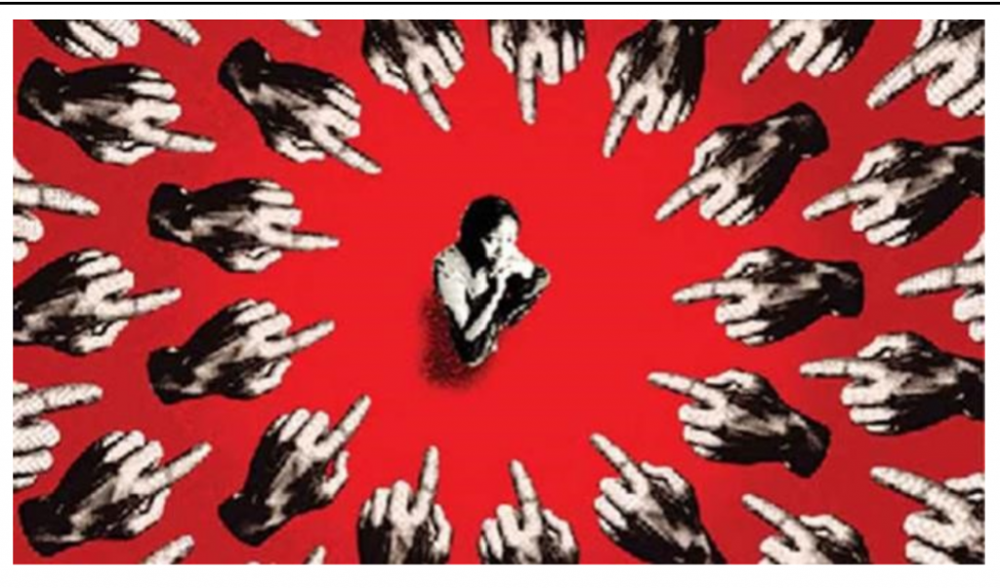
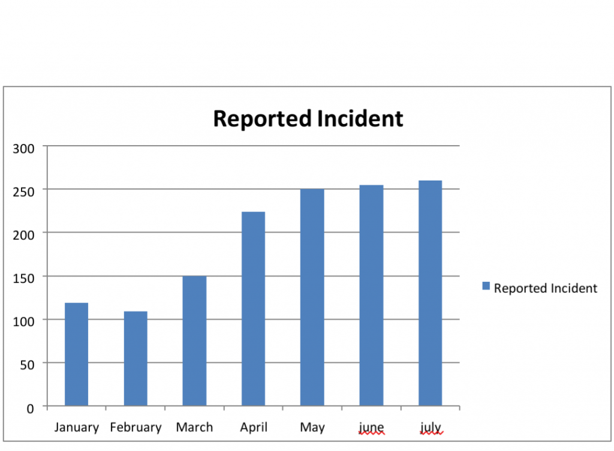

Author: Tanrima Islam  
  
**Abstract**:  
Recently women are not only unsafe in streets but also at their own personal sanctuary called home. Even though women are called the  
mother of the nation, unfortunately they are constantly being victim of severe unhumanitarian criminal activity throughout the country. Research shows heartbreaking results on the alarming rise of rape and domestic violence throughout the country. It is high time the safety of women is taken into consideration by the authorities, the government and by every individuals of this country.

  
**Introduction**:  
Sexual harassment means assaulting a woman or man by verbal or physical inappropriate words or actions. Rape defines as being physical with a man or woman against his or her will. Domestic violence is when a person is abused by his or her family members.  
  
**Description**:  
Unfortunately in Bangladesh, women are the main victim for such unethical actions. Various factors such as religious misconception, social norms and culture play a vital role in objectifying women. Due to the lack of knowledge among the people, people still blame the girls for such incidents pointing finger at their cloths, modesty and character. However, even girls of age under 10 are being the victim of rape in this country. The rise of sexual crime in this country is on constant rise and no one is paying any heed to such major problem. The woman rights activists found that the culture of impunity, practice of illegal use of power, lack of accountability of concerned agencies and decay of social values were the reasons behind such drastic increase in violence against woman.  
  
The reasons behind the rise of sexual crime:  
1\. Patriarchy system: In Todays newspaper The Daily Star there’s a headline “Sexual violence is an emblem of patriarchy in the guise of tradition” which is unfortunately true. In this country men are thought to be the powerful and the dominant. Even though times have changed and women are rising above their believed potential, long lasting social beliefs and traditions are hard to overcome. As a result, it is difficult to come to a solution and overcome this problem.  
2\. Religious misinterpretation: One of the main problems why most people don’t take this problem seriously is due to lack of religious knowledge. Some People think as women are going out in modern cloths working beside men, they are “meant to” or “deserve to” face such problems. As a result, not a lot people consider this crime as vigilantly as it should be.

3\. Law degradation: The main reason sexual crime is on verge of rise is because criminals are often going unpunished. Recently a criminal uploaded a video of raping a girl which stirred the whole nation. Due to the lack of strict law about sexual offence, many criminals walk free on street causing the rise of sexual crime.  
  
  
**Analysis**:  
Various cases of sexual crime against women are found in today’s newspaper. In Feni's Sonagazi upazila, bother-in-law abducts and rapes sister-in-law. A seven-year-old child was raped in Dhaka's Savar on Wednesday night by a rickshaw puller. Everyday girls are becoming the victims of sexual crime by strangers and also by their family members causing a sharp rise in cases of sexual crime.  
  
**Results**:  
In Bangladesh, every day in newspapers one can find sexual crime related news. Unfortunately every day on average 8 girls become victims of sexual crime. From January to March 230 cases of rape were reported while the statistics indicates that from 2018 onwards the rate of severe incidents such as rape, gang-rape, and killing after rape increased unabatedly in Bangladesh. Woman rights organizations, after taking into account an updated statistics, said that since its significant rise in 2018, violence against women continues at an alarming rate in year 2020.

Moreover, during this pandemic as offices and educational institution are closed, there’s a sharp rise of domestic violence in Bangladesh. Shaheen Anam, executive director of Manusher Jonno Foundation, pointed out that the lockdown has provided clear proof that women are not safe in their own homes. Statistics presented by ASK show the rise of reported cases from 29 in March to 81 in July. Dowry-related violence also rose from 167 last year to 184 this year -- this number however goes only up till October. senior deputy of ASK, said, "Rape  
\[incidents\] too have gone up from 732 in 2018, to 1,413 in 2019, and  
1,349 up until October 2020."

**Conclusion**_:_  
Both men and women are equally important in shaping the future of a  
nation. While these are successes worth acknowledging, our development is severely hampered by violence against women and girls, especially sexual violence, which has intensified in recent times. According to an estimate of Bangladesh Mahila Parishad (BMP), sexual violence against women doubled between 2010 and 2019.

Let's take the number of rape incidents for example: in 2010, the number stood at 940, which more than doubled to 1855 in 2019. Rape is just one of the many forms of sexual violence women and children are forced to endure every day. Such rises occurs due to the lack of proper law against sexual crime. Section 375 of the Penal Code states, "Sexual intercourse by a man with his own wife, the wife not being under 13 years of age, is not rape." Such loose law causes more unrest in the society.  
So to truly overcome this sexual crime from this country, we need to get over the patriarchy and masculinity based society. Every woman should know their standard and use their voice accordingly. The laws and government should inflict justful actions regarding sexual crime. Criminals should get proper punishment and women and men should start looking at each other as human rather than objectifying other women. Above all to get a bright nation today one must start working on developing one’s inner self and one’s own mentality because growth of a country is only possible if only and only one grows spiritually at first.  

_Sources:_  
_Newspaper reference: The Daily star, Prothom Alo https://www.newagebd.net/article/101590/bangladesh-sees-sharp-rise-of-sexual-violence_  
  
_https://www.thedailystar.net/backpage/news/domestic-violence-marks-large-spike-during-pandemic2001081_  
  
_https://media-eng.dhakatribune.com/uploads/2019/11/violence-1574706957814.jpg_  
  
_https://www.prothomalo.com/bangladesh/district_  
  
_https://www.thedailystar.net/opinion/closer-look/news/sexual-violence-emblem-patriarchy-the-guisetradition-2001021_
