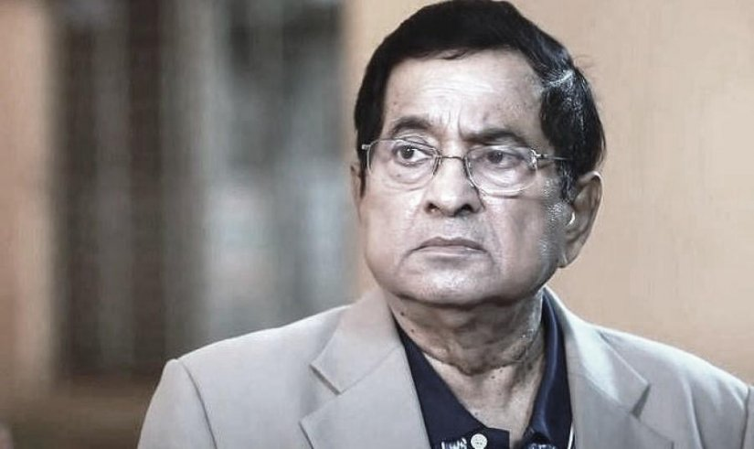

This morning our beloved Abdul Quader, Badi Bhai did not leave for the country of return. Inna lillahi wa inna ilahi rajiun.  
We, the country and the nation, mourn the death of our dear brother Abdul Quader. We wish her perfume forgiveness. Condolences to his bereaved family. Kader Bhai, a prominent playwright in Bangla Natangan, has given us innumerable plays, movies and programs.  
We hope that all the eminent personalities of Natangan will cooperate with his family and children in the minimum respect and multi-future plan.  
The drama industry of Bangladesh is of very high quality and many eminent playwrights, Directors are connected here. We expect equal cooperation from all.

