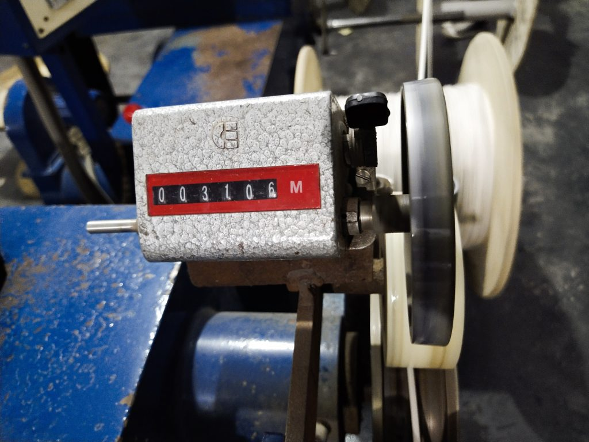
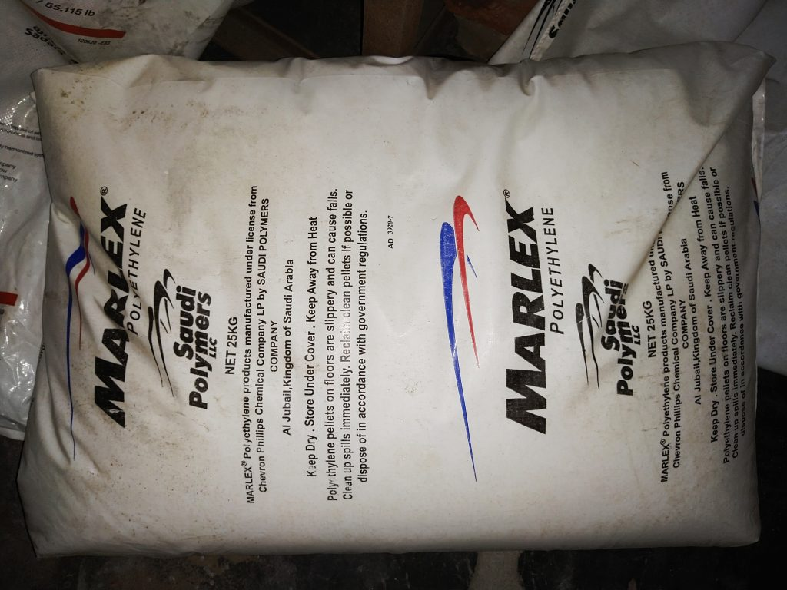
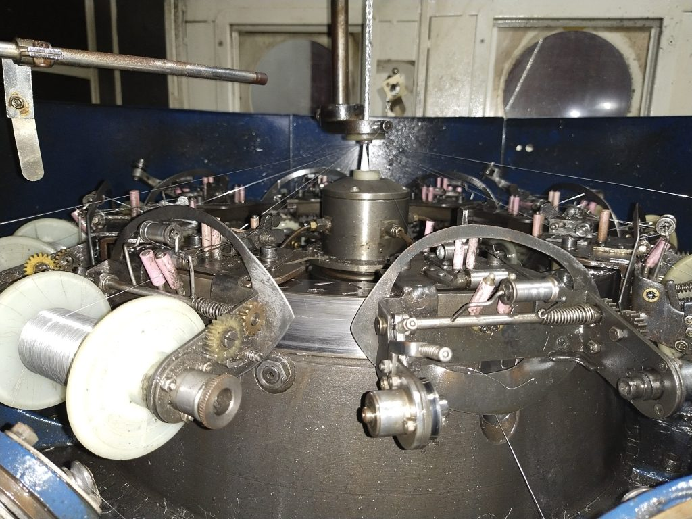

Bangladesh is one of the most growing GDP country in Southeast Asian region. According to wiki information, in 2020, Bangladesh's GDP per capita income is estimated as per IMF data at US $5,139 (PPP) and US$2,064 (nominal).

According to Trading Economics global macro models and analyst, the Bangladesh GDP is projected to trend around 310.00 USD Billion in 2021 and 340.00 USD Billion in 2022, according to our econometric models.

Due to this target GDP of Bangladesh, there are several billions project in hand of Bangladesh Government. Regarding project analysis there are most economical advancement area is Information Technology sector. Bangladesh government have taken bunch of projects in IT and telecommunication sector.

Thru the way of this road-map, world big investors are showing interest to invest in Bangladesh. Many companies are coming forward to develop IT networking core cable wire manufacturing industry.

Smartchem cable Industries Ltd. is one the largest manufacturer founded in 2013 center of capital of Bangladesh. They have started their journey in old town of Dhaka with six wire braiding machine, one bunching, one PVC piping, and few number of wire factory workers. Now in 2021, Smartchem cable have total 4 manufacturing unit, two unit in Jhineidah BSCIC, with projects of Coaxial cable, CAT5, CAT6 Ethernet cable, and fiber optics outdoor cable. They have total 10,000 m² area in Jhineidah BSCIC. Smartchem have fully vertical setup of raw material processing to finished good supply. They have in-house support of packaging and labeling, own logistics facilities to all over Bangladesh.

Foil process

Pvc piping machine

Copper core processing

FC Control unit

Packaging of Coaxial Cable

Packaging of Coaxial Cable

FC cable processflow

FC machine output meter

Cable Rolling

Braiding wire creel section

CAT Cooling & Winding roller

## **Process flow of Coaxial Cable production:**

Coaxial cable production needs total four stage processing to get iutput of ready cable -

1. Core covering FC process
2. Braiding process
3. PVC piping process
4. Packaging process

**Core covering FC process**: Core covering FC process is main copper/mixed metal core is covering by melted LDPE, HDPE, and RESIN solutions. LDPE, and HDPE mixing ratio is 2:1 and required Resin in one batch is 45gm. Than this mixture will input inside FC machine raw feed unit to make it ready to melt down.

LDPE Plastic Chip

HDPE Plastic Chip

FC Machine Feed Chember

Below the FC machine unit, there have section to hold copper core bobbin.

Copper core bobbin in FC unit

After this copper core running thru melted chip to make a soft FC white cover around copper and passing under cold water.

FC unit cooling system

Finally this copper core covered FC wire rolled in a bobbin automatically and ready to feed into the next stage of braiding.

FC unit ready roll

**Braiding Process**: Braiding process have few steps. First braiding silver wire need to roll into small size bobbin and small bobbin is rolled by 4 to 5 number of braiding silver wire.

Braiding silver core winding

This braiding silver wire bobbin is installed into braiding machine. Each machine need around 10 to 16 number of small bobbin. This bobbin is segregated manually inside machine for intertwining around FC wire. Braiding quality based on number of silver core installed in machine.

Braiding feed mechanism

Then FC wire feed bottom chamber of the braiding machine. After that machine starts for production and ready braided wire rolled behind of braiding section with attached auto bobbin.

Braided wire

**Piping process**: Braiding ready wire feed into PVC piping section and this process almost similar as FC process and here is using PVC polymer to make PVC piping around braided wire. This part make this coaxial wire ready to use.

PVC piping

**Packaging**: Finally ready wire wrapped by Polythene and put inside 6 pcs carton 100 meter each roll and one pcs carton 300 meter in each bobbin.

Coaxial 6 pcs carton

Coaxial one pc bobbin

All this process done by semi automated system by Smartchem cable Industries Ltd.

Smartchem have gained great popularity all over Bangladesh during Covid outbreak. Company owner Mr. Milton Mahmud said, " We are doing great during Corona outbreak when almost all country closed everything and our people are suffering lot due to unavailability of cable wire. But we are still helping our people and government to work during this crisis and make flow of cable wire all over the country. That was an opportunity for us to move around and proof our capability".

[Best RG6 cable in Bangladesh](https://www.smartchemcable.com/products/rg6-coaxial-cable-300-yards-ccs-mki-price-in-bangladesh/)

Bangladesh Government also increasing order and helping to improve to export other countries. For public information, they can visit Smartchem cable website [Smartchem Cable Industries Ltd](https://smartchemcable.com/)
