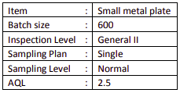

## What is AQL Inspection System?

AQL Inspection System to Merchandisers  
AQL stands for Acceptable Quality Level. AQL is an internationally recognized standard for  
inspection. It determines the number of samples to be picked and inspected randomly and the  
maximum defect quantity allowed in order to pass the inspection.  
Here is an example:  
**Step 1: First to get customer quality requirement**

**Step 2 : Check AQL table 1 to get batch size  
** Row : Lot/batch size range 501-1,200  
 Column – **Level II**  
 Sample size is “**J**”

AQL CHART MIL STD105

AQL STD MIL105

**Step 3**: Check AQL table 2 to get sample size, acceptance quantity, **and rejection quantity** Row “**J**” – the sample size is “**80**”  
 Column “**2.5**” – Acceptable no. (Ac) is “**5”**, Rejection no. (Re) is “**6”**

Pick inspection samples randomly. Determine **ACCEPT** or **REJECT** by compare AQL Standard  
with actual defect quantity.  
**Inspection result :  
**a) If the actual defect quantity is equal (5) or less than **ACCEPT**, the inspection is **PASSED**.  
b) If the actual defect quantity is equal (6) or greater than **REJECT**, the inspection is **FAILED**.  
Different customers may apply different AQL level and l standards. Major and minor defects are  
also categorized differently.  
Professional merchandisers should clearly understand customer’s QAL requirements, find  
capable factories that match the requirements and ensure the products meet the agreed AQL  
requirements.

AQL Sampling Plan

Single sampling plan for normal inspection
