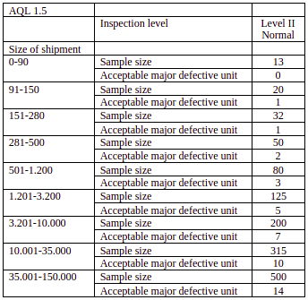
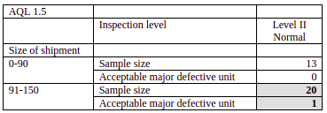

## **Inspection manual for suppliers**

 This manual is part of the Quality Management System which remains the reference with the updated versions

### **I – Inspection tools**

The supplier has to supply to the inspector the following information:

- the correct approval sample, accompanied by sample approval form and size specifications;
- the results of the fabric tests;
- a complete and confirmed fabric and accessory card when necessary;
- an up-to-date copy of the order with the latest remarks;
- previous inspection  reports and In line inspection reports if available;
- list of QCCI codes

After identification of the total quantity delivered, the Square Root Sample Matrix is used to select the sample pick at random and throughout the entire shipment. Each SUP should have an equal chance of being picked to ensure the sample is representative for all operations and different time periods in which the contract was produced.

The sample pick must be representative of the country range.

The sample pick must be representative of all sizes and colours and of the pack assortment, ECR packs included.

- The number of  SUP are selected to fulfil the sample size with 1 SUP minimum per country.
- The number of pieces to be inspected from the sample pick and number of  acceptable major defective unit are defined by the Sample Plan. 

All boxes or bundle should be numbered by the supplier and be mentioned on the packing list. 

### **II –A- Square Root Matrix**

Square Root System sampling matrix by C&A

The Square Root system is used to select the number of  Standard Unit Packs (SUP) to form the sample pick: e.g. the shipment has 100 SUP, the number of SUP to pick is 10.

### **II –B- Sample Plan**

 This sampling plan applies to all QCC1 inspections carried out on merchandise supplied to C&A.

It is based on the Military standards 105E with an **AQL of 1.5**.

Sampling plan 1.5

All sample picks must include one piece per variation in the production. Therefore one per size and colour must be selected and then extra pieces to meet the sample size.

How to apply sample plan :

Inspection Level 2 plan

As can be found in the sample plan there should be taken a sample quantity of 20 pieces. There may be no more than 1 defective unit within this sample.

## **III – Inspection**

According to the sample plan ( which  defines the number of pieces to be inspected and the number of acceptable defective units), the inspectors select from the sample pick the pieces for inspection;

 The selected pieces should include all sizes and colour combination.

The inspectors mention on the Inspection report the SUP numbers that have been selected and perform the inspection according as described below:

## **Method of inspection:**

**The inspector enters on the inspection worksheet the following information:**

- delivery memo(s) covered by this inspection
- total quantity
- number of SUP as required by the square root martix 
- number of acceptable defective units defined by the sample plan
- name of inspector
- time started
- date

**The inspector fills Tools for inspection section**

**The inspector checks if the quantity corresponds with the order sheet.**

 **The merchandise is delivered only when the quantity fits within the tolerance.**

**The inspector checks with the order and  the sample plan, if the selected quantity of packs fulfils the number of pieces to inspect (at least 1Sup  per country type must be selected)**

- **against order:**

1. size assortment
2. colours
3. number of pieces in a pack
4. plastic bags and other packaging
5. method of shipment     ( laid/laid, Hanging /Hanging, Laid / Hanging)

- **against GDI’s (available in GIN):**

1. presentation: e.g. hangers, bundles tickets, SUP labels, other packaging
2. weight and size restriction of SUP

All discrepancies must be put on the inspection worksheet under the respective code fault description

The inspector picks the representative sample according to the sample plan.

These pieces should be picked randomly from all present packs and must include all sizes, colour combination.

The inspector takes the sealed approval sample in the bright plastic bag together with the sample package (approval report, sample approval form, F&A card when necessary, test report).

The inspector checks the report with the actual delivery and controls that the QAD remarks have been corrected.

**The inspector compares the delivery with the sample package and performs measurement checks with actual sample:**

1. select at least 3 garments, at least one per size and colour from the sample 
2. measure the garment and check against size chart
3. when checking against size chart indicate the measurement being checked
4. tick when correct or show the size of the discrepancy
5. circle any measurements that are out of tolerance
6. when checking against size charts indicate the colour being measured

If one or more garments are found out of tolerance pick 3 more garments from each size / colour found to be outside tolerance and measure the same position on these.

If  3 or more of the measured garments are outside tolerance, the order is put on hold.

The inspector checks using the order sheet:

1. order number (all samples picked)
2. price and currency
3. item number
4. colour and size codes against garment

The inspector using the sealed approval sample checks:

1. description matches with delivery
2. sewn label in correct position
3. supplier number on  label
4. fibre content (check all samples picked)
5. Care instructions (check all samples picked)
6. Country of origin
7. Fastening
8. Hangers
9. Hang tags correct and in correct position

The inspector checks the legal requirements (e.g. nickel, fire labels…) (available in GIN)

All discrepancies are reported in the inspection worksheet with the respective QCC1 code.

<table><tbody><tr><td><strong>Product / &nbsp; &nbsp; &nbsp; &nbsp; &nbsp; &nbsp; &nbsp; &nbsp; &nbsp; &nbsp; &nbsp; &nbsp; &nbsp; &nbsp; Topic</strong></td><td><strong>&nbsp; &nbsp; Legal aspects to be checked</strong></td><td><strong>When applies</strong></td></tr><tr><td>Textiles</td><td>Composition labelling ( all countries )</td><td>For all products delivered to C&amp;A, in which at least 80 % of the weight is made up from textile fibres&nbsp;</td></tr><tr><td>Leather</td><td>Composition labelling ( A, F, UK)</td><td>For hide or skin with its original fibrous structure more or less intact, tanned to be inputrescible</td></tr><tr><td>Fur</td><td>Composition labelling ( A, F )</td><td>When real fur or fur imitation is involved</td></tr><tr><td>Accessories</td><td>Composition labelling ( all counties )</td><td>For all accessories delivered to C&amp;A</td></tr><tr><td>Shoes</td><td>Composition labelling ( all countries )</td><td>All shoes delivered to C&amp;A</td></tr><tr><td>Labels and packaging</td><td>Language</td><td>For any information instruction on any label/ticket/packaging for the receiving countries</td></tr><tr><td>Care labels</td><td>Symbols and order</td><td>For all countries</td></tr><tr><td>Woolmark labelling</td><td>Registration number or name of the weaver“Pure New Wool “</td><td>In cases where the Woolmark symbol is displayed</td></tr><tr><td>Origin Marking</td><td>Country of origin</td><td>For all goods delivered to C&amp;A which may mislead the consumers on the manufacture country of origin</td></tr><tr><td>Safety Requirements</td><td>Toy safety ( all countries )Suffocation warning ( UK )Flammability ( UK, NL ) Hood- , neck- , hem- , waist cords ( all&nbsp; countries )Carnival costumes children ( all countries)Ski goggles, sunglasses, other personal safety items, electric items ) ( all countries )Silicagel&nbsp; ( all countries )Safety caps for writing and marking instruments ( all countries )</td><td>When product liability and legal aspects are involved</td></tr><tr><td> Nickel&nbsp;</td><td> All articles with&nbsp; metal parts&nbsp; ( all countries )</td><td> For all articles with metal parts which may come into contact with the skin&nbsp;</td></tr><tr><td>Green dot</td><td>Green dot symbol ( all countries )</td><td>For all packaging</td></tr><tr><td>Indemnity declaration</td><td>Compliance to appropriate declaration ( NL )</td><td>For all Dutch suppliers</td></tr><tr><td>N.I.F. number</td><td>Number to appear on either the price ticket or the sew in label for merchandise destined for Spain&nbsp; ( E )</td><td>For merchandise delivered to Spain</td></tr><tr><td>Dyestuffs</td><td>Test report from laboratory when required</td><td>For all merchandise delivered to C&amp;A</td></tr><tr><td>Chemicals</td><td>Test report from laboratory when required</td><td>Only checked by laboratory</td></tr></tbody></table>

QCC1 Code By C&A

The inspector compares the workmanship with the sealed sample for compliance to the minimum manufacturing and material standards (available in GIN). The inspector puts an adhesive label on the garments to mark the defect(s) to be repaired or sorted out before shipment.. 

All faults are reported on the inspection worksheet.

All discrepancies are reported in the inspection worksheet with the respective QCC1 code.

The inspector counts all major faults per individual garment. 

After the inspection is complete, the inspector enters in the inspection worksheet, the total number of defective units with major faults only (minor faults are not counted).

If the number of defective units exceeds the acceptable number of defective units the inspection status is failed and the worksheet is marked accordingly. The merchandise is blocked and a corrective action is implemented.

If the number of defective units is less than the acceptable number of defective units the inspection status is passed and the worksheet is marked accordingly. The merchandise is passed.

The inspector reports the results of QCC1 on the QCC1 Report which is joined to the delivery documents.

Notes:

- ECR : Effective Customer Response
- F&A Card: Fabric & Accessory Card
- GDI : General Delivery Instructions
- GIN : General Delivery Instructions on Internet
- QCCI : Quality Conformity Control Information
- SUP : Standard Unit Pack
