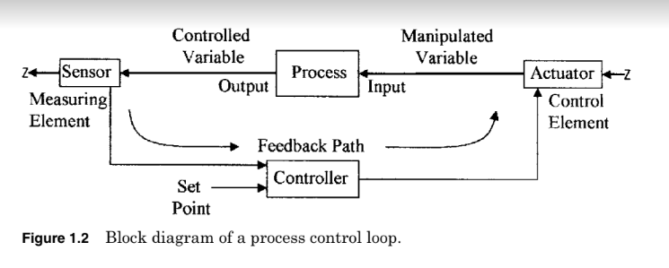

Fundamentals of Industrial Instrumentation and Process Control By William C. Dunn

Copyright © 2005 by The McGraw-Hill Companies, Inc. All rights reserved. Manufactured in the United States of America. Except as permitted under the United States Copyright Act of 1976, no part of this publication may be reproduced or distributed in any form or by any means or stored in a database or retrieval system, without the prior written permission of the publisher.

William Dunn has B.Sc. in physics from the University of London, graduating with honors, he also has a B.S.E.E. He  
has over 40 years of industrial experience in management, marketing support, customer interfacing, and advanced  
product development in systems and microelectronic and micromachined sensor development. Most recently he taught industrial instrumentation and digital logic at Ouachita Technical College as an adjunct professor. Previously he was with Motorola Semiconductor Product Sector working in advanced product development, designing micromachined sensors and transducers. He holds some 15 patents in sensor design and has presented some 20 technical papers in sensor design and application.

Instrumentation and process control can be traced back many millennia. Some of the early examples are the process of making fire and instruments using the sun and stars, such as Stonehenge. The evolution of instrumentation and process control has undergone several industrial revolutions leading to the complexities of modern-day microprocessor-controlled processing. Today’s technological evolution has made it possible to measure parameters deemed impossible only a few years ago. Improvements in accuracy, tighter control, and waste reduction have also been achieved.

Instrumentation is the basis for process control in the industry. However, it comes in many forms from domestic water heaters and HVAC, where the variable temperature is measured and used to control gas, oil, or electricity flow to the water heater, or heating system, or electricity to the compressor for refrigeration, to complex industrial process control applications such as used in the petroleum or chemical industry. In industrial control, a wide number of variables, from temperature, flow, and pressure to time and distance, can be sensed simultaneously. All of these can be interdependent variables in a single process requiring complex microprocessor systems for total control. Due to the rapid advances in technology, instruments in use today may be obsolete tomorrow, as new and more efficient measurement techniques are constantly being introduced. These changes are being driven by the need for higher accuracy, quality, precision, and performance. To measure parameters accurately, techniques have been developed that were thought impossible only a few years ago.

**Process Control:  
**

In order to produce a product with consistently high quality, tight process control is necessary. A simple-to-understand example of process control would be the supply of water to a number of cleaning stations, where the water temperature needs to be kept constant in spite of the demand. A simple control block is shown in Fig. 1.1a, steam and cold water are fed into a heat exchanger, where heat from the steam is used to bring the cold water to the required working temperature. A thermometer is used to measure the temperature of the water (the measured variable) from the process or exchanger. The temperature is observed by an operator who adjusts the flow of steam (the manipulated variable) into the heat exchanger to keep the water flowing from the heat exchanger at the  
constant set temperature. This operation is referred to as process control, and in practice would be automated as shown in Fig. 1.1b.  
Process control is the automatic control of an output variable by sensing the amplitude of the output parameter from the process and comparing it to the desired or set level and feeding an error signal back to control an input variable in this case steam. See Fig. 1.1b. A temperature sensor attached to the outlet pipe senses the temperature of the water flowing. As the demand for hot water increases or decreases, a change in the water temperature is sensed and converted to an electrical signal, amplified, and sent to a controller that evaluates the signal and sends a correction signal to an actuator. The actuator adjusts the flow of steam to the heat exchanger to keep the temperature of the water at its predetermined value.

Figure: 1.1

Figure: 1.2

Download the full book of fundamentals of instrumentation and process control  
  
[Buy here](https://bdmeter.info/shop/product/fundamentals-of-industrial-instrumentation-and-process-control-by-william-c-dunn/)
