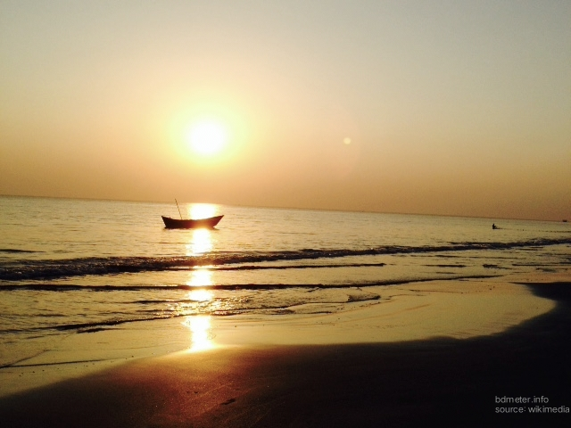

khulna is the third largest city of Bangladesh after Dhaka city and Chittagong City. Khulna is very old city and third largest economy area of Bangladesh out of others division. Khulna is most popular worldwide for largest mangrove forest specially for grand Royal Bengal tigers, the beautiful Sundari 🌴 tress and stunning beauty of green mangrove forests. Khulna is the second largest sea port city of Bangladesh. All imported cars, vehicles, heavy weight vehicles and carrier oil tanks, cargos entrance from Mongla port situated in khulna city. Khulna have the beautiful sea beach ⛱️🏖️ kuakata, beneath of Sandarban forests, you can enjoy both Sunrise and sunset from this sea beach, very rare to get this scene from one place.

Kuakata sea beach ⛱️, Khulna, BD

Khulna city 🏙️ have a large number of residency around 500,000 people living place. Khulna city under khulna metropolitan area have number of Wards under ward commissioner. Khulna city Mayor operates khulna all aspects of works under government operations. Khulna main city have big marketplace, Bangladesh largest food stock house, and river connectivity with seas for better communication. Khulna have mostly 2-5 storied building, and mostly one storied building, city mall, movie theater, sports stadium 🏟️, international sports stadium, Engineering university, Medical colleges, national universities, international university, private university, private medical colleges, food Court, good number of restaurants, 5 star hotels, swimming pools for public, tennis court, number of mosques, Pagoda, church and temples. You can get many international schools for kids with international standard of education system in khulna.

khulna 🏙️ area

Khulna Evening

khulna city 🌆 at night

Moylapota more, khulna 🌆 city

Nirala main road at 🌉 night, khulna city 🌆

Daulatpur khulna, Upper Jessore road
