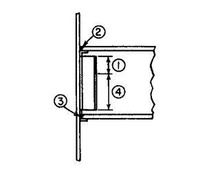

The main function of a welding sequence is to control distortion due primarily to the effects of welding heat. In general, a large input of heat in a short time tends to produce the greatest distortion. Therefore, it is always advisable, for large joints, to weld in stages, with sufficient time between each stage to assure complete dis- 
persal of heat, except for heat needed to satisfy interpass temperature requirements. Equally important, and perhaps more efficient from the erector’s viewpoint, are those methods that balance the heat input in such a manner that the distortional effects tend to cancel out.

Welding on one flange of a column tends to leave the column curled toward the welded side cooling, because of shrinkage stresses. A better practice for beams connecting to both sides of a column is to weld the opposite connections simultaneously. Thus the shrinkage of each flange is kept in balance and the column remains plumb.

If simultaneous welding is not feasible, then the procedure is to weld in stages. About 60% of the required weld might be applied on the first beam, then the joint on the opposite flange might be completely welded, and finally, welded on the first  
beam would be completed. Procedures such as this will go far to reduce distortion.

Experience has shown that it is good practice to commence welding at or near the center of a building and work out- 
ward. Columns should be checked frequently for vertical alignment because shrinkage in the welds tends to shorten  
the distance between columns. Even though the dimensional change at each joint may be very small, it can accumulate to an objectionable amount in a long row of columns. One way to re- 
duce the distortion is to allow for shrinkage at each joint, say, 1⁄16 in for a 20-ft bay, by tilting or spreading the columns. Thus, a spread of 1 ⁄8 in for the two ends of a beam with flanges butt-welded to the columns may be built in at the fabricating shop; for example, by increasing the spacing of erection-bolt holes in the beam bottom flange. Control in the field, however, is maintained by guy wires until all points are welded.

Shortening of bays can become acute in a column row in which beams connect to column flanges because the shrinkage shortening could possibly combine with the mill underrun in column depths. Occasionally, in addition to spreading the columns, it may be necessary to correct the condition by adding filler plates or building out with weld metal.

Some designers of large welded structures prefer to detail the welding sequence for each joint. For example, on one project, the procedure for the joint shown in Fig. called for four distinct operations, or stages: first, the top 6 inches of the shear weld on the vertical connection was made; second, the weld on the top flange; third, the bottom-flange weld; and fourth, the remaining weld of the vertical connection. The metal was allowed to return to normal temperature before starting each stage. One advantage of this procedure is the prestressing benefits obtained in the connecting welds. Tensile stresses are developed in the bottom-flange weld on cooling; compressive stresses of equal magnitude consequently are produced in the top flange. Since these stresses are opposite to those caused by floor loads, welding stresses are useful in supporting the floor loads. Although this by-product assistance may be worthwhile, there are no accepted methods for resolving the alleged benefits into the design economy.

Multistory structures erected with equipment supported on the steelwork as it rises will be subjected by erection loads to stresses and strains. The resulting deformations should be considered in formulating a field-welding sequence.
