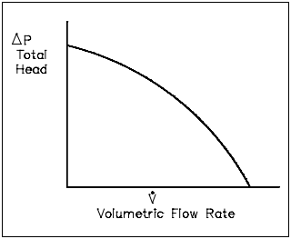
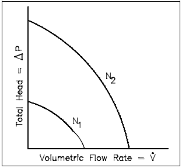

Centrifugal pumps are one of the most common components found in fluid systems. In order to understand how a fluid system containing a centrifugal pump operates, it is necessary to understand the head and flow relationships for a centrifugal pump.

**EO 1.37** - DEFINE the terms net positive suction head and cavitation.

**EO 1.38** - CALCULATE the new volumetric flow rate, head, or power for a variable speed centrifugal pump using the  
pump laws.

**EO 1.39** - DESCRIBE the effect on system flow and pump head for the following changes:

a. Changing pump speeds  
b. Adding pumps in parallel  
c. Adding pumps in series

## Energy Conversion in a Centrifugal Pump

Fluid entering a centrifugal pump is immediately directed to the low-pressure area at the center or eye of the impeller. As the impeller and blading rotate, they transfer momentum to incoming fluid. A transfer of momentum to the moving fluid increases the fluid’s velocity. As the fluid’s velocity increases its kinetic energy increases. The fluid of high kinetic energy is forced out of the impeller area and enters the volute.

The volute is a region of continuously increasing cross-sectional area designed to convert the kinetic energy of the fluid into fluid pressure. The mechanism of this energy conversion is the same as that for subsonic flow through the diverging section of a nozzle. The mathematical analysis of flow through the volute is based on the general energy equation, the continuity equation, and the equation relating to the internal properties of a system. The key parameters influencing the energy conversion are the expanding cross-sectional area of the volute, the higher system backpressure at the discharge of the volute, and the incompressible, subsonic flow of the fluid. As a result of the interdependence of these parameters, the fluid flow in the volute, similar to subsonic flow in a diverging nozzle, experiences a velocity decrease and a pressure increase.

### Operating Characteristics of a Centrifugal Pump

Normally, a centrifugal pump produces a relatively low-pressure increase in the fluid. This pressure increase can be anywhere from several dozen to several hundred psid across a centrifugal pump with a single-stage impeller. The term PSID (Pounds Force Per Square Inch Differential) is equivalent to ∆P. In this context, it is the pressure difference between the suction and discharge of a pump. PSID can also be used to describe a pressure drop across a system component (strainers, filters, heat exchangers, valves, demineralizes, etc.). When a centrifugal pump is operating at a constant speed, an increase in the system back pressure on the flowing stream causes a reduction in the magnitude of volumetric flow rate that the centrifugal pump can maintain.

Typical Centrifugal Pump Characteristic Curve

Analysis of the relationship between the volumetric flow rate ( ) that a centrifugal V ̇ pump can maintain and the pressure differential across the pump (∆Ppump) is based on various physical characteristics of the pump and the system fluid. Variables evaluated by design engineers to determine this relationship include the pump efficiency, the power supplied to the pump, the rotational speed, the diameter of the impeller and blading, the fluid density, and the fluid viscosity. The result of this complicated analysis for a typical centrifugal pump operating at one particular speed is illustrated by the graph in Figure above.

The pump head, on the vertical axis, is the difference between system backpressure and the inlet pressure of the pump (∆Ppump). Volumetric flow rate ( ), on the horizontal axis, is the rate at which fluid is flowing through the pump. The V ̇ graph assumes one particular speed (N) for the pump impeller.

### Cavitation

When the liquid being pumped enters the eye of a centrifugal pump, the pressure is significantly reduced. The greater the flow velocity through the pump the greater this pressure drop. If the pressure drop is great enough, or if the temperature of the liquid is high enough, the pressure drop may be sufficient to cause the liquid to flash to steam when the local pressure falls below the saturation pressure for the fluid that is being pumped. These vapor bubbles are swept along the pump impeller with the fluid. As the flow velocity decreases the fluid pressure increases. This causes the vapor bubbles to suddenly collapse on the outer portions of the impeller. The formation of these vapor bubbles and their subsequent collapse is cavitation.

Cavitation can be a very serious problem for centrifugal pumps. Some pumps can be designed to operate with limited amounts of cavitation. Most centrifugal pumps cannot withstand cavitation for significant periods of time; they are damaged by erosion of the impeller, vibration, or some other cavitation-induced problem.

### Net Positive Suction Head

It is possible to ensure that cavitation is avoided during pump operation by monitoring the net positive suction head of the pump. Net positive suction head (NPSH) for a pump is the difference between the suction pressure and the saturation pressure of the fluid being pumped. NPSH is used to measure how close a fluid is to saturated conditions. Equation 3-19 can be used to calculate the net positive suction head available for a pump. The units of NPSH are feet of water.

NPSH = Psuction - Psaturation  
  
where:  
Psuction = suction pressure of the pump  
Psaturation = saturation pressure for the fluid  
  
By maintaining the available NPSH at a level greater than the NPSH required by the pump  
manufacturer, cavitation can be avoided.

## Pump Laws

Centrifugal pumps generally obey what are known as the pump laws. These laws state that the flow rate or capacity is directly proportional to the pump speed; the discharge head is directly proportional to the square of the pump speed; and the power required by the pump motor is directly proportional to the cube of the pump speed. These laws are summarized in the following equations.

V ̇ ∝ n  
Hp ∝ n  
p ∝ n3

where:  
n = speed of pump impeller (rpm)  
V ̇= volumetric flow rate of pump (gpm or ft3  
/hr)  
Hp = head developed by pump (psid or feet)  
p = pump power (kW)

Using these proportionalities, it is possible to develop equations relating the condition at one speed to those at a different speed.

V1 = (n2/n1)=V2

Hp1(n2/n1)2=Hp2

P1(n2/n1)3=P2

**Example: Pump Laws  
**

A cooling water pump is operating at a speed of 1800 rpm. Its flow rate is 400 GPM at ahead of 48 ft. The power of the pump is 45 kW. Determine the pump flow rate, head, and power requirements if the pump speed is increased to 3600 rpm.

Solution:

Flow rate  
V2 = V1(n2/n1)  
\= (400 gpm) (3600 rpm / 1800 rpm) = 800 gpm  
  
Head  
Hp2=HP1 (n2/n1)2  
\= 48 ft (3600 rpm / 1800 rpm)2 = 2192 ft  
  
Power  
P2= P1 (n2/n1)3  
\=45 kW (3600 rpm / 1800 rpm )3 = 336 kW

It is possible to develop the characteristic curve for the new speed of a pump based on the curve for its original speed. The technique is to take several points on the original curve and apply the pump laws to determine the new head and flow at the new speed. The pump head versus flow rate curve that results from a change in pump speed is graphically illustrated in the Figure below.

Changing Speeds for Centrifugal Pump

### Volumetric flow rate

In the head loss, it was determined that both frictional losses and minor losses in piping systems were proportional to the square of the flow velocity. Since flow velocity is directly proportional to the volumetric flow rate, the system head loss must be directly proportional to the square of the volumetric flow rate. From this relationship, it is possible to develop a curve of system head loss versus volumetric flow rate. The head loss curve for a typical piping system is in the shape of a parabola as shown in Figure here.  
  

### System Operating Point

The point at which a pump operates in a given piping system  
depends on the flow rate and head loss of that system. For a given system, the volumetric flow rate is compared to system head loss on a system characteristic curve. By graphing a system characteristic curve and the pump characteristic curve on the same coordinate system, the point at which the pump must operate is identified. For example, in Figure here, the operating point for the centrifugal pump in the original system is designated by the intersection of the pump curve and the system curve (hLo).  
  

The system has a flow rate equal to and a total system head loss equal to ∆Po V . In order to maintain the flow rate, the pump head must be equal to ∆Po (V. In the system described by the system curve (hL1), a valve has been opened in the system to reduce the system’s resistance to flow. For this system, the pump maintains a large flow rate at a smaller pump head (V ̇1) (∆P1).
