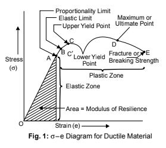

Different materials possess different properties in varying degrees and therefore behave in different  
ways under given conditions. These properties include Mechanical properties, Electrical properties,  
Thermal properties, Chemical properties, Magnetic properties, and Physical properties.  
A design engineer is interested in the behavior of materials under load which is mechanical in  
nature, for the design of machines & structures. Any material subjected to a load either deforms,  
yields, or break, depending upon the magnitude of the load.  
We are basically interested in knowing how a particular material will behave under applied  
load i.e. in knowing the mechanical properties.

## STRESS-STRAIN DIAGRAMS

Stress-Strain Curves for Ductile Materials  
If a mild steel bar of uniform cross-sectional area is subjected to gradually increasing axial tensile  
force (generally is done in Universal Testing Machine) till failure of the bar occurs, and if we plot  
the graph for stress and strain, the following curve (Fig. 1.1) may be obtained:  
The curve may be divided into the following parts:  
Portion OA: This portion is absolutely straight,  
where the stress is proportional to strain and the  
material obeys Hooke’s law. The value of stress  
at point A is called proportional limit.  
Portion AB: In this portion, Hook’s law is not  
obeyed, although the material may still be elastic.  
Point B indicates the elastic limit.  
Portion BC: In this portion, the metal shows  
an appreciable strain even without further increase  
in stress and the strain is not fully recoverable when  
load is removed.  
Portion CC': Yielding commences in this portion and there is a drop of stress at the point C' immediately after yielding commences at C.  
The point C' is termed as lower yield point and C is called the upper yield point.  
Portion C'  
D: After yielding has taken place at C', further straining takes place at this portion  
by increasing the stress and the stress-strain curve continues to rise up to points D.  
Strain in this portion is about 100 times that of portion O to C. At point D, the bar begins  
to form a local neck. Point D is termed as an ultimate tensile stress point. Ultimate stress is  
calculated at this point.  
Portion DE: In this portion, the load falls off from the maximum until fracture at E takes  
place. Point E is termed a fracture or breaking  
point and the corresponding stress is called breaking  
stress.

## PRINCIPAL MECHANICAL PROPERTIES

Those characteristics of the materials which describe their behavior under external loads are known  
as Mechanical Properties. The most important and useful mechanical properties are:

### Strength

It is the resistance offered by a material when subjected to external loading. So, the stronger the material  
the greater the load it can withstand.  
Depending upon the type of load applied the strength can be tensile, compressive, shear, or  
torsional.  
The maximum stress that any material will withstand before destruction is called its ultimate  
strength

### Elasticity

The elasticity of a material is its power of coming back to its original position after deformation when  
the stress or load is removed. Elasticity is a tensile property of its material.  
The greatest stress that a material can endure without taking up some permanent set is called  
elastic limit

### Stiffness (Rigidity)

The resistance of a material to deflection is called stiffness or rigidity. Steel is stiffer or more rigid  
than aluminium.  

Stiffness is measured by Young’s modulus E. The higher the value of Young’s modulus, the  
stiffer the material. E is the ratio of stress over strain and is given by the slope of line O–A.

### Plasticity

The plasticity of a material is its ability to undergo some degree of permanent deformation without  
failure. Plastic deformation will take place only after the elastic range has been exceeded, beyond  
point b.  
Plasticity is an important property and is widely used in several mechanical processes like forming,  
shaping, extruding and many other hot and cold working processes. In general, plasticity increases  
with increasing temperature and is a favourable property of material for secondary forming  
processes.  
Due to these properties, various metals can be transformed into different products of the required  
shape and size. This conversion into desired shape and size is affected either by the application of  
pressure, heat or both.

### Ductility

The ductility of a material enables it to draw out into thin wire on the application of the load. Mild steel is  
a ductile material. The wires of gold, silver, copper, aluminium, etc. are drawn by extrusion or by  
pulling through a hole in a die due to the ductile property. The ductility decreases with the increase in  
temperature.  
The per cent elongation and the reduction in area in tension is often used as empirical measures  
of ductility.

### Malleability

Malleability of a material is its ability to be flattened into thin sheets without cracking by hot or  
cold working. Aluminium, copper, tin, lead, steel, etc. are malleable metals.  
Lead can be readily rolled and hammered into thin sheets but can not be drawn into wire.  
Ductility is a tensile property, whereas malleability is a compressive property. Malleability increases  
with increase of temperature.

### Brittleness

The brittleness of a material is the property of breaking without much permanent distortion. There  
are many materials, which break or fail before much deformation take place. Such materials are  
brittle e.g., glass, cast iron.  
Therefore, a non-ductile material is said to be a brittle material. Usually the tensile strength  
of brittle materials is only a fraction of their compressive strength. A brittle material should not be  
considered as lacking in strength. It only shows the lack of plasticity. On stress-strain diagram,  
these materials don’t have yield point and value of E is small.

### Toughness

The toughness of a material is its ability to withstand both plastic and elastic deformations. It is a  
highly desirable quality for structural and machine parts to withstand shock and vibration. Manganese  
steel, wrought iron, mild steels are tough materials.  
For Ex: If a load is suddenly applied to a piece of mild steel and then to a piece of glass the mild steel will absorb much more energy before failure occurs. Thus, mild steel is said to be much  
tougher than glass.  
Toughness is a measure of the amount of energy a material can absorb before actual fracture  
or failure takes place. “The work or energy a material absorbs is called modulus of toughness”  
Toughness is also resistant to shock loading. It is measured by a special test on Impact Testing  
Machine.

### Hardness

Hardness is closely related to strength. It is the ability of a material to resist scratching, abrasion,  
indentation, or penetration.  
It is directly proportional to tensile strength and is measured on special hardness testing machines  
by measuring the resistance of the material against penetration of an indentor of special shape and  
material under a given load. The different scales of hardness are Brinell hardness, Rockwell  
hardness, Vicker’s hardness, etc.  
Hardness of a metal does not directly relate to the hardenability of the metal. Hardenability is  
indicative of the degree of hardness that the metal can acquire through the hardening process. i.e.,  
heating or quenching.  

### Hardenability

Hardenability is the degree of hardness that can be imparted to metal by process of hardening.  
A metal capable of being hardened throughout its structure is said to have high hardenability.  
The material is heated above a certain temperature and then suddenly quenched in a cold oil or  
water bath.

### Impact Strength

It can be defined as the resistance of the material to fracture under impact loading, i.e., under  
quickly applied dynamic loads.Two standard tests are normally used to determine this property. The IZOD impact test.

### Resilience

Resilience is the capacity of a material to absorb energy elastically. On removal of the load, the energy  
stored is released as in a spring.  
The maximum energy which can be stored in a body up to the elastic limit is called proof  
resilience. The quantity gives the capacity of the material to bear shocks and vibrations. The strain  
energy stored in the material of unit volume gives proof resilience and is measured by work  
stretching.

## FATIGUE AND FATIGUE TEST

The fatigue strength of a material is the maximum stress at which failure may occur after a certain  
number of cyclic load applications. A component is designed to give a certain length of service  
under a specified loading cycle. Many components of high-speed aero and turbine engines are  
designed for fatigue strength.

FATIGUE AND FATIGUE TEST

The fatigue strength or endurance limit of the material is used in the design of parts subjected to  
repeated alternating stresses over an extended period of time. Specimens are tested to failure using different loads. The number of cycles is noted for each load. The results of such tests are plotted as graphs of applied stress against the logarithm of the number of cycles of failure. The curve is known as the S-N curve. The tests are carried out on special fatigue testing machines.

## Download a full book of the material processes by U.K. Singh

[Download Free Book](https://drive.google.com/file/d/0B3kRjoDG8NPuR3JtTm9hR1g2VEU/view?usp=sharing&resourcekey=0-K4HUV8ZebfT61UU0zGOxYQ)
