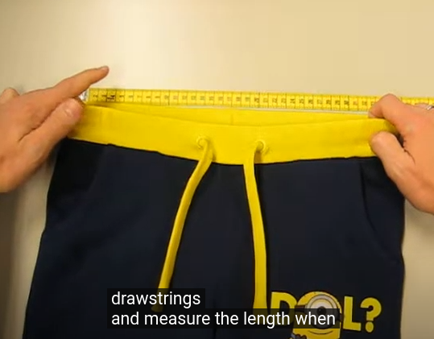

\[fluid-player video="https://bdmeter.info/video/how%20to%20measure%20drawstring.mp4" vast\_file="https://www.videosprofitnetwork.com/watch.xml?key=3780f50bd5e6cd43ba1c2d60f209cd44"\]

## How to measure drawstring in five easy steps:

Step one: Pull out the drawstrings end completely. This is to ensure verifying whether drawstring ends are fixed securely.

Step one

Step two: Re-open the garment flat on the table two end extended. So that the drawstring extended in the tunnel. Please make sure to not over straighten the garment.

Step two

Step three: Straighten the free ends of the drawstring and measure the length. When they are unequal measure the longest one. If the drawstring moves when measuring hold one finger on the exit point to ensure that drawstrings don’t slide back and measure from the exit point to the end of the drawstring.

Step three

We found this 19 cm. You can also measure it in this way this gives you 19.5 cm

That concludes the way to measure a drawstring of a garment.

## How to measure a drawstring in kids pant – **EU LAW:**

• For infant Boy/ girls (Pant ) visible maximum drawstring length =14 cm after waist relaxed. (if drawstring is required).

• From 2 years up to 14 years Boy/ girls ( Pant ) visible maximum drawstring length =14 cm after waist relaxed. ( if any special requirements we’ll follow accordingly ) .

• Up to 7 years boy /girls (hood JKT) as per law no need drawstring or cord. ( if any special requirements we’ll follow accordingly ).

• From 7 years up to 14 years boy /girls (hood JKT) Maximum visible drawstring or cord length 7 cm. ( if special requirements we’ll follow accordingly).
