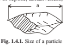
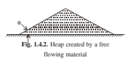
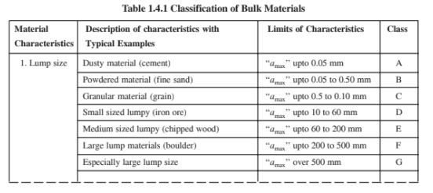

## Materials handling system

Method to be adopted and choice of equipment for a materials handling system primarily depends on the type of material/s to be handled. It is, therefore, very important to know about different types of materials and their characteristics which are related to methods and equipment used for their handling.

As innumerable different materials are used and need to be handled in industries, they are classified based on specific characteristics relevant to their handling.

Basic classification of material is made on the basis of forms, which are--
    1. Gases
    2. Liquids
    3. Semi Liquids and
    4. Solids

Following characteristics of gases, liquids and semiliquids are relevant to their handling. For gases it is primarily pressure, high (25 psi and more) or low (less than 25 psi). Chemical properties are also important.

For liquids the relevant characteristics are density, viscosity, freezing and boiling point, corrosiveness, temperature, inflammability etc. Examples of common industrial liquids are: water, mineral oils, acids, alkalies, chemicals etc. Examples of common semi-liquids are: slurry, sewage, sludge, mud, pulp, paste etc.

Gases are generally handled in tight and where required, pressure resisting containers. However, most common method of handling of large volume of gas is through pipes by the help of compressor, blower etc. This process is known as pneumatic conveying.

Liquids and semiliquids can be handled in tight or open containers which may be fitted with facilities like insulation, heating, cooling, agitating etc. as may be required by the character of the liquid. Large quantity of stable liquids/semiliquids are generally conveyed through pipes using suitable pumps, which is commonly known as hydraulic conveying.

Solids form the majority of materials which are handled in industrial situation. Solids are classified into two main groups: Unit load and Bulk load (materials).

Unit loads are formed solids of various sizes, shapes and weights. Some of these are counted by number of pieces like machine parts, molding boxes, fabricated items. Tared goods like containers, bags, packaged items etc. and materials which are handled en-masses like forest products (logs), structurals, pig iron etc. are other examples of unit loads. The specific characteristics of unit loads are their overall dimensions, shape, piece-weight, temperature, inflammability, strength/fragility etc. Hoisting equipment and trucks are generally used for handling unit loads. Certain types of conveyors are also used particularly for cartons/packaged items and metallic long products like angles, rods etc. Unit loads have been classified by Bureau of Indian Standards' (BIS) specification number IS 8005:1976(2).

### Classifications of material handling system

1. **Shape of unit loads** - 
      - basic geometric forms like rectangular, cylindrical, pyramidal/conical and spherical; 
      - typical or usual forms like pallets, plate, containers, bales and sacks;
      - irregular forms like objects with flat base dimension smaller than overall size, loads on rollers/wheels and uneven shapes.
2. **Position of C.G. (stability) of load.**
3. **Mass of unit lo**ad in 10 steps from 0-2.5 kg to more than 5000 kg.
4. **Volume per unit** in 10 steps from 0-10 cm3 to more than 10 m3
5. **Type of material** in contact with conveying system like metal, wood, paper/cardboard, textile, rubber /plastics, glass and other materials.
6. **Geometrical shape** (flat, concave, convex, irregular/uneven, ribbed etc.) and physical properties (smooth, slippery, rough, hard, elastic etc) of base surface of unit load.
7. **Specific physical and chemical properties** of unit loads like abrasive, corrosive, dust emitting, damp, greasy/oily, hot, cold, fragile, having sharp edges, inflammable, explosive, gyroscopic, sticky, toxic, obnoxious, radioactive etc.
8. **Loads sensitive** to pressure, shock, vibration, turning/tilting, acceleration/deceleration, cold, heat, light, radiation, damp etc.

Bulk materials are those which are powdery, granular or lumpy in nature and are stored in heaps. Example of bulk materials are: minerals (ores, coals etc.), earthly materials (gravel, sand, clay etc.) processed materials (cement, salt, chemicals etc.), agricultural products (grain, sugar, flour etc.) and similar other materials.

Major characteristics of bulk materials, so far as their handling is concerned, are: lump-size, bulk weight, 
specific weight, moisture content, flowability (mobility of its particles), angles of repose, abrasiveness, temperature, proneness to explosion, stickiness, fuming or dusty, corrosivity, hygroscopic etc.

Lump size of a material is determined by the distribution of particle sizes. The largest diagonal size ‘a’ of a particle in mm (see Fig.1.4.1) is called the particle size. If the largest to smallest size ratio of the particles of a lumpy material is above 2.5, they are considered to be unsized.

The average lump size of sized bulk material is = 1/2 (maximum particle size + minimum particle size)

\= 1/2 (a max + a min)

Bulk weight or bulk density of a lumpy material is the weight of the material per unit volume in bulk. Because of empty spaces within the particles in bulk materials, bulk density is always less than density of a particle of the same material. Generally bulk load can be packed by static or dynamic loading. The ratio of the bulk density of a packed material to its bulk density before packing is known as the packing coefficient whose value varies for different bulk materials and their lump size, from 1.05 to 1.52. Bulk density is generally expressed in kg/m3 . a Fig. 1.4.1. Size of a particle.

**Mobility not flowability of a bulk** material is generally determined by its angle of repose. When a bulk material is freely spilled over a horizontal plane, it assumes a conical heap. The angle ‘φ’ of the cone with the horizontal plane is called the angle of repose. Less is ‘φ’, higher is the flowability of the bulk material. If the heap is shaken, the heap becomes flatter and the corresponding angle of repose under dynamic condition is referred to as dynamic angle of repose φdyn, where φdyn is generally considered to be equal to 0.7φ.

Classification and codification of bulk materials based on lump size, flowability, abrasiveness, bulk density and various other characteristics have been specified by the BIS specification number IS:8730:1997(3). The alphanumeric codification system as per this specification is shown below:

In this material code, if any of the above characteristics is not known, corresponding number or alphabet is dropped from the material code.

Table 1.4.1 shows the descriptions and limits of the different classes of material characteristics.

Table 1.4.2 lists a few of the typical materials, which are handled in bulk, with their average bulk density, angle of repose and classification code as per IS:8730:1997. This BIS specification lists 486 different bulk materials, with their bulk densities, flowability properties and codes.

Code of the materials may vary according to exact condition of the materials during handling.

Bulk materials are generally handled by belt-conveyor, screw conveyor, pneumatic conveyor, bucket elevator, grab bucket, skip hoist, stacker-reclaimer, dumper-loader etc. It can be handled by cranes / trucks when collected in containers or bags. Small lump (powdered / granular) materials can be handled pneumatically or hydraulically. Bulk materials are generally stored on ground / floor in the open or under shed, and also in bunkers / silos.
