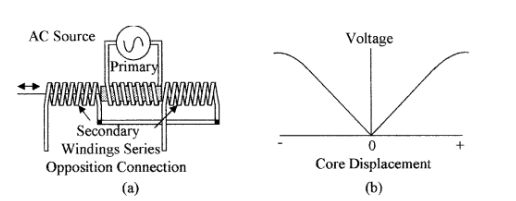

This article will help you understand and become familiar with other sensors that play a very important part in process control, but may not be encountered on a daily basis. The following are covered in this article:

■ Position, distance, velocity, and acceleration sensors  
■ Rotation sensors using light and Hall effect sensors  
■ Force, torque, load cells, and balances  
■ Smoke detectors, gas, and chemical sensors in the industry  
■ Sound and light measurements  
■ Sound and optical devices

## Introduction:

There are many sensors other than level, pressure, flow, and temperature that may not be encountered on a day to day bases—such as position, force, smoke, and chemical sensors—but play an equally important part in process control in today’s high-technology industries and/or for operator protection. These sensors will not be discussed in as much detail as the sensors already discussed. However, the student should be aware of their existence and operation.

## Position and Motion Sensing

### Basic position definitions

Many industrial processes require both linear and angular position and motion measurements. These are required in robotics, rolling mills, machining operations, numerically controlled tool applications, and conveyors. In some applications, it is also necessary to measure speed, acceleration, and vibration. Some transducers use position sensing devices to convert temperature and/or pressure into electrical units and controllers can use position sensing devices to monitor the position of an adjustable valve for feedback control.  

## Position and motion measuring devices

Potentiometers are a convenient method of converting the displacement in a sensor to an electrical variable. The wiper or slider arm of a linear potentiometer can be mechanically connected to the moving section of a sensor. Where rotation is involved, a single or multiturn (up to 10 turns) rotational type of potentiometer can be used. For stability, wire-wound devices should be used, but in environmentally-unfriendly conditions, the lifetime of the potentiometer may be limited by dirt, contamination, and wear.  
  
Linear variable differential transformers (LVDT) are devices that are used for measuring small distances and are an alternative to the potentiometer. The device consists of a primary coil with two secondary windings one on either side of the primary. (see Fig. 10.1a). A movable core when centrally placed in the primary will give equal coupling to each of the secondary coils. When an ac voltage is applied to the primary, equal voltages will be obtained from the secondary windings which are wired in series opposition to giving zero output voltage, as shown in Fig. 10.1b. When the core is slightly displaced an output voltage proportional to the displacement will be obtained. These devices are not as cost-effective as potentiometers but have the advantage of being noncontact. The outputs are electrically isolated, accurate, and have better longevity than potentiometers.  
  
Light interference lasers are used for very accurate incremental position measurements. Monochromatic light (single frequency) can be generated with a laser and collimated into a narrow beam. The beam is reflected by a mirror attached to the moving object which generates interference fringes with the incident light as it moves. The fringes can be counted as the mirror moves. The wave- 
length of the light generated by a laser is about 5 × 10−7 m, so relative positioning to this accuracy over a distance of 1/2 to 1 m is achievable.  
  
Ultrasonic, infrared, laser, and microwave devices can be used for distance measurement. The time for a pulse of energy to travel to an object and be reflected back to a receiver is measured, from which the distance can be calculated, i.e.,

Figure 10.1 Demonstrated is (a) the LVDT with a movable core and three windings and  
(b) the secondary voltage versus core displacement for the connections shown.

the speed of ultrasonic waves is 340 m/s and the speed of light and microwaves is 3 × 108 m/s. Ultrasonic waves can be used to measure distances from 1 to about 50 m, whereas light and microwaves are used to measure longer distances.  
  
If an object is in motion the Doppler effect can be used to determine its speed. The Doppler effect is the change in frequency of the reflected waves caused by the motion of the object. The difference in frequency between the transmitted and reflected signal can be used to calculate the velocity of the object.  
  
Hall effect sensors detect changes in magnetic field strength and are used as a close proximity protector. The Hall effect occurs in semiconductor devices and is shown in Fig. 10.2a. Without a magnetic field, the current flows directly through the semiconductor plate and the Hall voltage is zero. Under the influence of a magnet field, as shown, the current path in the semiconductor plate becomes curved, giving a Hall voltage between the sides adjacent to the input/output current. In Fig. 10.2b a Hall effect device is used to detect the rotation of a cogwheel. As the cogs move to pass the Hall device, the strength of the magnetic field is greatly enhanced causing an increase in the Hall voltage. The device can be used to measure linear as well as rotational position or speed and can also be used as a limit switch.  
  
Magnetoresistive element (MRE) is an alternative to the Hall effect device. In the case of the MRE its resistance changes with magnetic field strength.  
Optical devices detect motion by sensing the presence or absence of light. Figure 10.3 shows two types of optical discs used in rotational sensing. Figure 10.3a shows an incremental optical shaft encoder. Light from the light-emitting diode (LED) shines through Bdmeter in the disc onto an array of photodiodes. As the shaft turns, the position of the image moves along the array of diodes. At the end of the array, the image of the next slot is at the start of the array. The relative position of the wheel with respect to its previous location can be obtained by counting the number of photodiodes traversed and multiplying them by the number of slots monitored. The diode array enhances the accuracy of the position of the slots, i.e., the resolution of the sensor is 360° divided by the number

Figure 10.2 Shown is a semiconductor plate used as (a) Hall effect device and (b) application of a Hall effect device for measuring the speed and position of a cogwheel.

Figure 10.3 Shows (a) an incremental optical disc, (b) an absolute position optical discs, and (c) a piezoelectric accelerometer.

of slots in the disc divided by the number of diodes in the array. The slots can also be replaced by reflective strips, in which case the light from the LED is reflected back to a photodiode array.  
  
Only one slot in the disc is required to measure the rate per minute. Figure 10.3b shows an absolute position encoder. An array of LEDs (one for each window) with a corresponding photo detector for each window can give the position of the wheel at any time. Only three Bdmeter are shown in the figure, for greater accuracy more slots would be used. The pattern shown on the disc is for the gray code. Other patterns may be used on the disc such as the binary code.  
  
Optical devices have many uses in the industry other than for the measurement of the position and speed of rotating equipment. Optical devices are used for counting objects on conveyor belts on a production line, measurement and control of the speed of a conveyer belt, location and position of objects on a conveyor, location of registration marks for alignment, bar code reading, measurement and  
thickness control, detecting for breaks in filaments, and so forth.

Power lasers can also be included with optical devices as they are used for scribing and machining of metals, laminates, and the like.  
  
Accelerometers sense speed changes by measuring the force produced by the change in velocity of a known mass (seismic mass), see Eq. (10.1). These devices can be made with a cantilevered mass and a strain gauge for force measurement or can use capacitive measurement techniques. Accelerometers are now commercially available, made using micromachining techniques. The devices can be as small as 500 μm × 500 μm so that the effective loading by the accelerometer on measurement is very small. The device is a small cantilevered seismic mass that uses capacitive changes to monitor the position of the mass. Piezoelectric devices similar to the one shown in Fig. 10.3c are also used to measure acceleration. The seismic mass produces a force on the piezoelectric element during acceleration which causes a voltage to be developed across the element. Accelerometers are used in industry for the measurement of changes in the velocity of moving equipment, in the automotive industry as crash sensors for airbag deployment, and in shipping crates where battery-operated recorders are used to measure shock during the shipment of expensive and fragile equipment.  
  
Vibration sensors typically use acceleration devices to measure vibration. Micromachined accelerometers make good vibration sensors for frequencies up to about 1 kHz. Piezoelectric devices make good vibration sensors with an excellent high-frequency response for frequencies up to 100 kHz. These devices have very low mass so the damping effect is minimal. Vibration sensors are used for the measurement of vibration in bearings of heavy equipment and pressure lines.

## Position application consideration

Optical position sensors require clean operating conditions and in dirty or environmentally-unfriendly applications they are being replaced by Hall or MRE devices in both rotational and linear applications. These devices are small, sealed, and rugged with a very high longevity and will operate correctly in fluids, in a dirty environment, or in contaminated areas.  
Optical devices can be used for reading bar codes on containers and imaging. Sensors in remote locations can be powered by solar cells that fall into the light sensor category.
