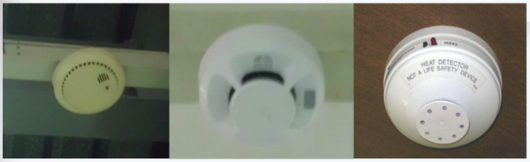
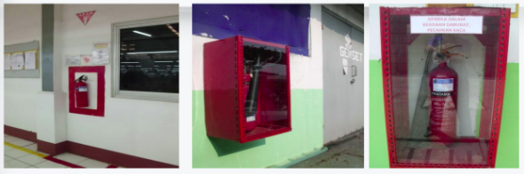
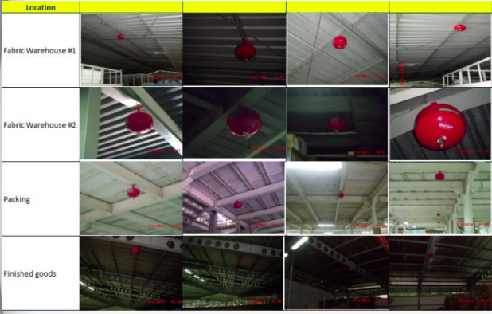
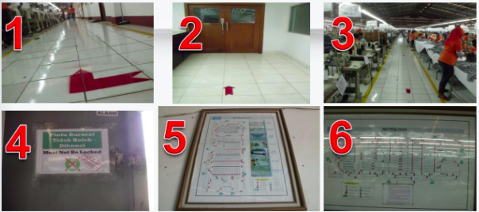
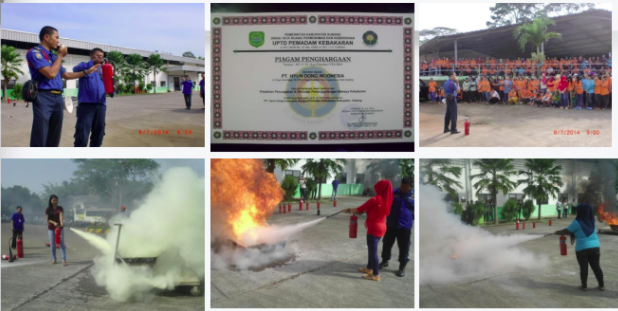
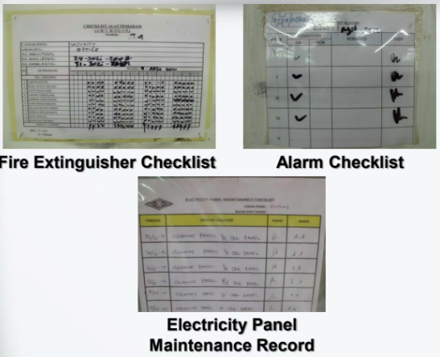

This article will help you to learn about industrial fire safety management system implementation, analysis, and inspection systems to install fire safety management systems in your own industrial premises.

We have completed our fire safety project implementation in an Indonesian Apparel manufacturer industry location is "Jl. Raya Wantilan RT.07/03, Ds. Wantilan, Kec. Wantilan, Kab. Subang, Jawa Barat"

In this fire safety project implementation, a total of 1164 Employees attended and, contributed their efforts to make this project successful.

In this project, they are making mostly all kinds of knit garments and textiles. Their major market is USA (95%) + Other Region (5%)

### Background of implementation

- Commitment to creating safe working conditions.
- Convince our business partners → Good relationship
- Secure our assets → Employees, Buildings, machines, etc.)
- Comply with government regulations and requirements of our buyers

## Fire Safety Management

- Procedure of Fire Safety
- Structure of Fire Safety Management
- Fire Protection Facilities
- Training & Signs
- Maintenance

### Procedure for Emergency Response

**Fig**: Procedure of emergency response

### Organizational Structures

The industry needs to create an emergency response team to maintain fire safety management responsibilities in prompt action during the crisis period.

**General Manager**

&darr;

F.C.O

&darr;

HR Manager

&darr;

Management + Production + Store + Cutting + Sewing + Finishing + Logistics + Quality + Compliance + Admin

### Active Fire Protection Facilities

#### Type of Fire Detection and Alarm Systems

Manual Call Point:

Automatic fire detection:

**DO NOT FORGET!**

- Testing and maintenance
- Guaranteed power supply

### Location of Fire Detection & Alarm System

| Device | Location | Number |
| --- | --- | --- |
| Smoke detector | Fabric Wearhouse | 2 |
|  | Accessories & fabric relaxation | 2 |
|  | Cutting area | 3 |
|  | Sewing area | 3 |
|  | Ironing area | 1 |
|  | Packing area | 2 |
| Manual call point | Fabric Wearhouse | 1 |
|  | Accessories & fabric relaxation | 1 |
|  | Sewing area | 1 |

Table: location of fire detection and alarm system

### Fire classification

### Firefighting equipment and facilities

### Manual fire suppression

### Automatic fire suppression

## Thermatics Fire Extinguisher

- Fast and easy to installed
- Free treatment
- Can be moved
- Does not disturb the production
- The cost of purchase is relatively less expensive compared to the installation of fire sprinkler systems, fire sprinkler systems as requiring the installation of pipes and pumps

### Location of firefighting equipments

**Emergency lights**

**Evacuation Routes**

**Electricity Panel**

**Fire Evacuation Drill**

## **Fire Safety Training**

### Control and Record

## Fire safety signs

### Benefits of Fire Safety Management Implementation

- Increase employee morale by allaying fire safety concerns.
- Increase employee fire safety and awareness on their workplace.
- Employees understand how to minimize potential fire hazards.
- Gain the trust of the buyers and associates.
- Fire risks can be controlled.

**Reference**: _This document is prepared by a group of textile engineers, apparel technologists, compliance personnel, and a group of industry experts to educate the industrial workforce about fire safety management. This data is being fully prohibited to copy/paste or, reproduce by other parties. - All data authority is bdmeter informatics._
