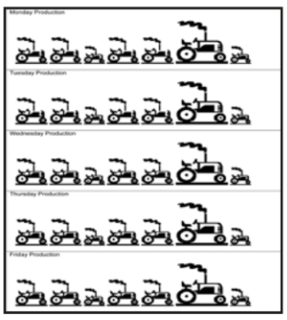

## What is Lean Manufacturing?

“A systematic approach to identifying and eliminating waste (non-value-added activities) through continuous improvement by flowing the product at the pull of the customer in pursuit of perfection” – The MEP Lean Network  
Lean manufacturing is a set of principles, concepts, and techniques for suppliers to deliver:

- Exactly what customers need and pay for
- When they need it
- The right quantity product or service needed
- Without defects
- At the lowest possible cost  
      
    

Lean is about continually improving processes and products by identifying what can be fixed or enhanced. Lean also focuses on having the appropriate lead time in production processes, getting the right quality the first time, putting safety first, and meeting customer expectations for greater efficiency.

**Lean is not only:**

- Housekeeping or 5S (Sort, Set in order, Shine, Standardize and Sustain)
- Headcount reduction
- Inventory reduction
- Cost reduction
- Change for the sake of change

## Why should I implement Lean Manufacturing?

Lean thinking began with the Toyota Production System (TPS) which transformed car manufacturing in Japan post World War II. However, Lean is now used by many organizations around the world, by both the public and private sectors, to improve:

- Customer service
- Quality and efficiency
- Staff morale
- Internal communication and process flow
- Operation costs
- Space utilization
- Working environment  
      
    Lean is very simple to implement and results are easily sustained.

## 5 Principles of Lean:

Lean 5 Principal

## Tools to implement Lean

Lean has a number of tools that can help you identify opportunities to improve the efficiency of your process and the quality of your product, measure performance and plan for change. These tools are designed to be easy to understand and use.

| Tools | Focus |
| --- | --- |
| 5S | The 5S methodology focuses on effectively organizing and standardizing workplace processes. 5S helps you simplify your workplace environment, reduce wastage and non-value-adding activities, whilst improving quality, effectiveness, process efficiency, and employee safety. |
| Kaizen | Kaizen focuses on gradual and continuous improvement—  
incremental changes that occur on a daily basis across all levels of the organization. A key component of kaizen methodology is that every person in the company is responsible for identifying and making improvements. |
| Just-In-Time | Having the right materials and resources ready for use when needed helps reduce overall inventories and wastage. |
| Value Stream Mapping / Value Stream  
Management | Identify and eliminate non-value-added activities |
| Kanban1 Application | Manage inventory, people, and process flow |
| Lean Management Principle | Adopt a long-term commitment to lean culture |
| Lean Layout | Better process flow and zero defect products. Lean layout, based around the principle of One Piece Flow, will enhance your production performance, not only improving the velocity of parts through the system but also reducing the number of defects produced and eliminating waste by default. |
| Heijunka (Load Leveling)2 | Manage day to day demand |

Kanban is a scheduling system that helps determine what to produce when to produce it and how much to produce.

Heijunka has the meaning of leveling the workload. We can see through this simple example of mixed-model leveled production. By reducing the changeover time and employing other lean methods, the plant is able to build the tractors in any order it wants to on its mixed-model assembly line. The four benefits of  
leveling the schedule are:

1. Flexibility to make what the customer wants when they want it.
2. Reduced risk of unsold goods.
3. Balanced use of labor and machines.
4. Leveled Production
5. Tools
6. 5S
7. Kaizen
8. Just-In-Time
9. Value Stream Mapping / Value Stream
10. Management
11. Kanban1 Application
12. Lean Management Principle
13. Lean Layout

Heijunka (Load Leveling)

**Focus**:  
The 5S methodology focuses on effectively organizing and standardizing workplace processes. 5S helps you simplify your workplace environment, reduce wastage and non-value-adding activities, whilst improving quality, effectiveness, process efficiency, and employee safety. Kaizen focuses on gradual and continuous improvement— incremental changes that occur on a daily basis across all levels of the organization. A key component of kaizen methodology is that every person in the company is responsible for identifying and making improvements.  

Having the right materials and resources ready for use when needed helps reduce overall inventories and wastage. Identify and eliminate non-value-added activities. Manage inventory, people, and process flow  
Adopt a long-term commitment to lean culture. Better process flow and zero defect products. Lean layout, based around the principle of One Piece Flow, will enhance your production performance, not only improving the velocity of parts through the system but also reducing the number of defects produced and eliminating waste by default. Manage day-to-day demand To achieve the benefits of continuous flow, companies must level out the workload. Heijunka will eliminate waste by leveling your product volume and mix, but most importantly, will level out the demand on your people, equipment, and suppliers. Without leveling, waste will increase as people are driven to work like mad and then stop and wait, just like the hare.

## What results can you expect from implementing Lean?

- Eliminate waste
- Shorten cycle times
- Improve quality
- Reduce costs
- Manage inventory effectively

## How do I make Lean work for me?

You can help make your Lean initiative a success by:

- Being clear about what you want to achieve at the outset, but also keeping an open mind to new possibilities.
- Making a real time commitment – the more time you can put in, the quicker the results and greater the rewards will be.
- Allocating the resources and getting the right people involved.
- Communicating with your team, and listening to their suggestions.
- Committing to sustaining the effort over time.

Implementing Lean does require an initial investment of time, energy, and imagination. Those who have made this commitment have found the results worthwhile.

## Lean success story from Foundry: Aerospace/Commercial industry

**Problems**: The foundry had a campus layout that required dozens of people to travel 4 to 8 blocks  
(depending on the location of their work center) several times a day to a building that housed the NDT  
(non-destructive testing) equipment. Parts were also processed in different buildings and then transported via carts, trucks, or forklifts to the NDT for further processing several times per day.

**Lean Solutions:** Recognizing the importance of locating the NDT area near its internal feeders, a  
centrally-located space was identified and after considerable re-layout, equipment streamlining and workflow improvements, the new NDT location required about one-third of the original space. Additionally, the lab area that was adjacent to the old NDT facility was re-located and a shipping department was added for the immediate packing and shipment of completed products. The x-ray processing booth was also re-designed to accommodate the improved workflow, and kanbans were established between the NDT and their several "Internal Suppliers."

**Impact/Results:** Dozens of lost production hours were recovered on a daily basis. Time that had been spent transporting parts was spent processing products. Communication and feedback between "Internal Suppliers" and "Internal Customers" significantly improved. Defects caused by packing and transporting parts were almost completely eliminated. The building that had formerly housed the NDT was leased-out to generate additional revenues. Very conservative estimates value this improvement at more than $2 million annually.

## Sources of information we found useful

Book: Lean Thinking, James P Womack and Daniel T Jones  
Book: The Machine That Changed the World, James P Womack, Daniel T Jones and Daniel Roos (1990)  
  
Wikipedia Article – Lean Manufacturing

[http://en.wikipedia.org/wiki/Lean\_manufacturing](http://en.wikipedia.org/wiki/Lean_manufacturing)

Lean Enterprise Institute – What is Lean?  
[http://www.lean.org/whatslean/](http://www.lean.org/whatslean/)
