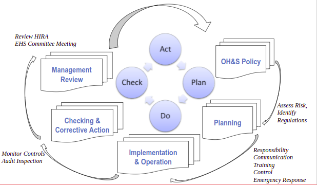
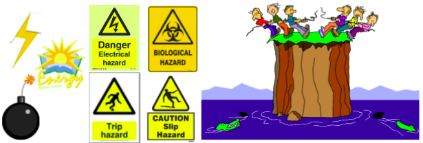
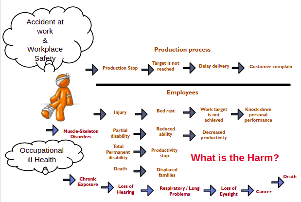
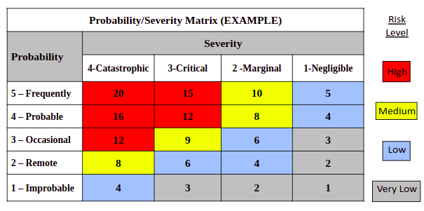
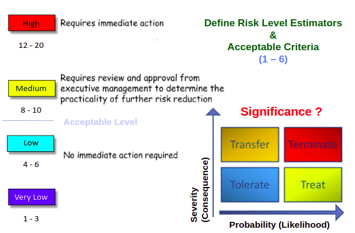
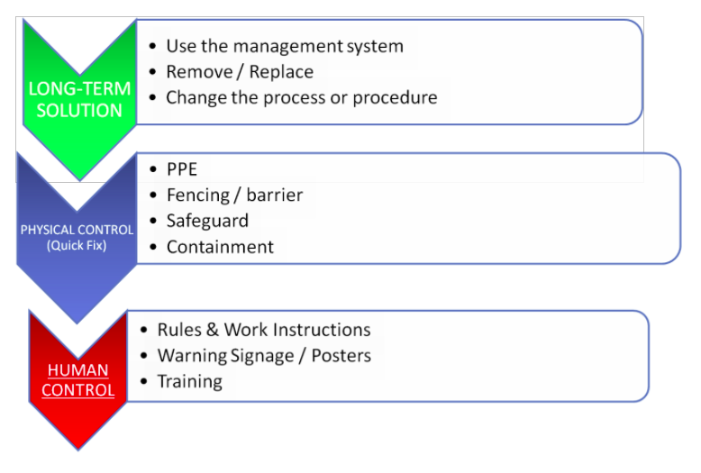

Today we will learn about vendor compliance and sustainability terms to identify hazards and assess risks.

**Agenda**:

1. Terms & Definitions 
2. HIRA  Process 
3. Hazard Identification
4. Risk Matrix & Risk Assessment 
5. Operational Controls
6. Good Documentation Practices & Recommendations
7. Company Sustainability Development
8. Example HIRA & Discussion
9. Factory Assignment : 

## Risk Never Sleeps!

## The Cost of Safety 

## The Importance of Hazard Identification and Risk Assessment 

HIRA is the Basis (First Step) to SafeGuard Employees, Contractors, Visitors, Contract workers, People who share the workplace from Significant Injuries or ill Health in a Systematic Approach. Including vulnerable groups (Pregnant staff, Trainees) and High-Risk Workers (Welders, Electricians, Spot Cleaners, Chemical Handlers)

![BD07253_[1]](https://lh4.googleusercontent.com/hdvzBbmAQR_FsrXgcmsNddXsBbqrhjWulsbtIvBCdan1fCZ_4aV63mjbfRUB_sn2dQs3-WdHvywCsTyCxNoMuOXuAlLaENVTJEVU4qbzD9I1Mw18sRw-fR_-RSB8tXOs5DW27SxnQ4meZW7fcoE) 

## **Compliance Requirement for HIRA** 

a) Hazard Identification and Risk Assessment (HIRA) should be performed for All Activities conducted at the facility, and include off-site activities are related to the Supplier’s business. 

b) HIRA should be conducted at least Once per Year, and - 

I.   Before the implementation/installation of new processes, 

II.  Following any incident, and 

III. Before maintenance, repair, and/or alteration works commence. 

c) EHS risk assessment should include  -

I.   Identification of hazards 

II.  Evaluation of risks associated with hazards 

III. Identification and implementation of control measures to reduce the risks. 

d) Should be actively followed up by a team led by the EHS Committee 

**ISO 18001: 2007 Requirements** 

**Clause 4.3.1**: Planning for Hazard Identification, Risk Assessment, and Risk Control.

- The organization shall establish and maintain **Procedures** for the ongoing identification of hazards, assessment of risks and the implementation of the necessary control measures. 

It should cover  –

a) Routine and Non-Routine Activities

b) Activities of all persons having access to the workplace (including Sub - Contractors and Visitors) 

c) Human behavior, capabilities, and other Human Factors

d) Hazards Originating Outside the workplace capable of adversely affecting the health and safety of persons under the control of the organization within the workplace

e) Hazards created in the Vicinity of the Workplace by work-related activities under the control of the organization

f) Infrastructure, equipment, and materials at the workplace, whether provided by the organization or others (Hired or Sub-contracted Machinery)

g) Changes or proposed changes in the organization, its activities, or materials

h) Modifications to the OH&S management system, including Temporary Changes, and their impacts on operations, processes, and activities;

i) Applicable Legal obligations relating to risk assessment and implementation of necessary controls

j) Design of work area processes. Installations, machinery/equipment, operating

procedures, and work organization, including their adaptation to human capabilities.

## Elements of OHS Management

**Continual  Improvement  
**

## **Fundamentals of OHS Management** 

Organizations are responsible for risk that arises out of their own workplaces.

\* The Top Management need to be committed to OHS:-

\- The old assumption that workers are responsible for causing accidents is not entirely valid.

\* Self-Regulated System approach

-  Risk Management  based approach
-  Identify Regulatory requirements – compliance to Legal laws. 
-  Manage Risks – introduce controls to manage risks to As Low As Reasonably Practicable (ALARP).
-  Establish a **OHS Policy** and Procedures – introduce plans to manage the risks that has been identified. 
-  Monitor Performance – obtain feedback and make the necessary changes to the policy or objectives if required through **EHS Committee** Meetings

## **What Is a Hazard?** 

“Source or situation or act with a potential for harm in terms of human injury or ill health or a combination of these” 

**ISO: 18001 – Definition (3.6)**

**Anything Threatening to**  **Life, Health, Property, or Environment**. **Anything that may cause Harm**

## **Types of Hazards** 

## **What Is a Risk?** 

**Severity Probability of getting Harm or Loss -**  
**Potential of losing something of value** 

- Combination of the **Likelihood** of an occurrence of a hazardous event or exposure(s) and the **Severity** of Injury or ill health that may be caused by the event or exposure. Likelihood that a hazard will cause a specific harm or injury to person or damage property 

ISO 18001: Definition (3.21)

##  **Risk Assessment** 

A careful examination of what in the workplace to identify **Significant OHS Issues** and **Precautions** to prevent harm. 

The aim is to make sure no one gets hurt or becomes ill.  

Risk Assessment is a **Systematic Approach** to identify **Hazards**, evaluate **Risk** considering existing controls and incorporate appropriate Control measures to manage and mitigate risk for any work process or activity. Deciding whether the Risk is **Acceptable?**

ISO 18001: Definition (3.22)

  
_Risk Matrix-based Quantitative Rating of Hazards_

### **Methods to Identify the Hazards**

### **Tools &  Techniques**

- Health & Safety Audits
- Expert Opinion / Experience
- **Consultation** with other co-workers / Discussions
- Manufactures  Manuals
- Brain storming
- Industrial Incident Reports
- Research papers/Internet
- Fault Tree Analysis
- Hazard & Operability Study (HAZOP)
- Failure Mode Analysis (FMEA)
- Consequence Analysis (Explosion) 

Search for the availability of Reliable Data

### **Hazard Identification & Risk Assessment Process** 

### **Hazard Identification Approaches** 

Combinational Approach is the Best Normally use Area Based Approach to identify common hazards in the workplace and the Task-Based Approach to identify individual workers & Subcontracted Activity. 

## **How To Conduct a Factory Inspection**

1. Formulate a **HIRA Team**. One Team for small factory - Headed by Compliance Officer & other **Divisional Representative** ; Several Sub Teams for large factory - Team for each Section should be headed by Process owner / Functional Head. (Get  Area Expertise involved)
2. Inspect the entire factory premises for all types of hazards. Cover RM & FG Stores, Production Floor, Utility area (Generator, Compressor, Boiler, HVA rooms.), Engineering Work shops, Canteen area, Toilets, Loading & Unloading area, Locker rooms, Treatment Plants, Boundary area (Outside Premises). **Comprehensive Coverage**
3. Hazards from near by Factories / Environments too should be considered. (Specially if No Fire Gap, shared facilities & utility)
4. Review New construction sites, Visitors & Subcontractors moving areas.

## **Hazard Identification through Area Inspection** 

## **How To Prepare A Job Safety Analysis**

1. Set up sub-committees in each individual work section under the **Process Owner**/ Department Head.
2. Make a **List of all current wor**k activities **(Routine and Non-Routine)** for each section/function.
3. Use a Risk Assessment Matrix to conduct an initial assessment to determine activities that constitute highest risk to employees, subcontractors or visitors. Identify Inherent Job Hazards.

4.    From the initial assessment, conduct a detailed risk assessment on the highest risk activity by breaking the activity into the basic job sequence.

5.    Include all job activities with the Highest Risks.

### **Hazard Identification through Task Breakdown** 

### **The Consequences of Hazards**

**What is the Impact of the Hazard?**  
**Severity**

### **Hazards: Severity & Probability**

**Risk Matrix**  
**Risk  =  Severity X  Probability**

**Significance = Severity X Probability X Frequency X  Number of People**

### **Risk Assessment – Action Category**

### **Risk Assessment Template**

<table class="has-fixed-layout"><tbody><tr><td>Activity or Area-Based Risk Assessment Form</td></tr><tr><td><strong>Department:</strong></td><td>&nbsp;</td><td><strong>Name of&nbsp; Process / Activity:</strong></td><td>&nbsp;</td></tr><tr><td><strong>Location:</strong></td><td>&nbsp;</td><td><strong>Name of Person in-charge:</strong></td><td>&nbsp;</td><td><strong>Name of PI:</strong></td><td>&nbsp;</td></tr><tr><td><strong>Last Review Date:</strong></td><td>&nbsp;</td><td><strong>Next Review Date:</strong></td><td>&nbsp;</td></tr></tbody></table>

<table class="has-fixed-layout"><tbody><tr><td><strong>1. Hazard Identification</strong></td><td><strong>2. Risk Evaluation &amp; Control</strong></td></tr><tr><td><strong>SN</strong></td><td><strong>Task</strong></td><td><strong>Hazards</strong></td><td><strong>Possible Consequences</strong></td><td><strong>Existing Risk Control</strong><strong>(if any)</strong></td><td><strong>S</strong></td><td><strong>P</strong></td><td><strong>R</strong></td><td><strong>Additional / New Risk Control</strong></td><td><strong>S</strong></td><td><strong>P</strong></td><td><strong>R</strong></td><td><strong>Action By</strong></td><td><strong>Complete</strong><strong>Date</strong></td></tr><tr><td>&nbsp;</td><td>&nbsp;</td><td>&nbsp;</td><td>&nbsp;</td><td>&nbsp;</td><td>&nbsp;</td><td>&nbsp;</td><td>&nbsp;</td><td>&nbsp;</td><td>&nbsp;</td><td>&nbsp;</td><td>&nbsp;</td><td>&nbsp;</td><td>&nbsp;</td></tr><tr><td>&nbsp;</td><td>&nbsp;</td><td>&nbsp;</td><td>&nbsp;</td><td>&nbsp;</td><td>&nbsp;</td><td>&nbsp;</td><td>&nbsp;</td><td>&nbsp;</td><td>&nbsp;</td><td>&nbsp;</td><td>&nbsp;</td><td>&nbsp;</td><td>&nbsp;</td></tr><tr><td>&nbsp;</td><td>&nbsp;</td><td>&nbsp;</td><td>&nbsp;</td><td>&nbsp;</td><td>&nbsp;</td><td>&nbsp;</td><td>&nbsp;</td><td>&nbsp;</td><td>&nbsp;</td><td>&nbsp;</td><td>&nbsp;</td><td>&nbsp;</td><td>&nbsp;</td></tr><tr><td>&nbsp;</td><td>&nbsp;</td><td>&nbsp;</td><td>&nbsp;</td><td>&nbsp;</td><td>&nbsp;</td><td>&nbsp;</td><td>&nbsp;</td><td>&nbsp;</td><td>&nbsp;</td><td>&nbsp;</td><td>&nbsp;</td><td>&nbsp;</td><td>&nbsp;</td></tr><tr><td>&nbsp;</td><td>&nbsp;</td><td>&nbsp;</td><td>&nbsp;</td><td>&nbsp;</td><td>&nbsp;</td><td>&nbsp;</td><td>&nbsp;</td><td>&nbsp;</td><td>&nbsp;</td><td>&nbsp;</td><td>&nbsp;</td><td>&nbsp;</td><td>&nbsp;</td></tr><tr><td>&nbsp;</td><td>&nbsp;</td><td>&nbsp;</td><td>&nbsp;</td><td>&nbsp;</td><td>&nbsp;</td><td>&nbsp;</td><td>&nbsp;</td><td>&nbsp;</td><td>&nbsp;</td><td>&nbsp;</td><td>&nbsp;</td><td>&nbsp;</td><td>&nbsp;</td></tr><tr><td>&nbsp;</td><td>&nbsp;</td><td>&nbsp;</td><td>&nbsp;</td><td>&nbsp;</td><td>&nbsp;</td><td>&nbsp;</td><td>&nbsp;</td><td>&nbsp;</td><td>&nbsp;</td><td>&nbsp;</td><td>&nbsp;</td><td>&nbsp;</td><td>&nbsp;</td></tr></tbody></table>

<table class="has-fixed-layout"><tbody><tr><td><strong>Conducted by : (Name, designation)</strong></td><td>&nbsp;</td><td><strong>Reviewed by&nbsp; : (Name, designation)</strong></td><td>&nbsp;</td></tr><tr><td><strong>HIRA Team Members :</strong></td><td>&nbsp;</td><td><strong>Approved By&nbsp; :</strong></td><td>&nbsp;</td></tr><tr><td><strong>Inspection&nbsp; Date :</strong></td><td>&nbsp;</td><td><strong>Date&nbsp; :</strong></td><td>&nbsp;</td></tr></tbody></table>

### **HIRA – Example 1** 

**HIRA – Example 2** 

### **Commonly Found Hazards** **in Garment Industry**

**Try to find the Uncommon Hidden Hazards!**  
**Consider Existing Controls when Evaluating Risks**

**Risk Control & Prevention Process** 

### **Prioritize Risk Control** 

**Always use the Source to Barrier Approach. Concept of As Low As Reasonably Practicable (ALARP)** 

#### **Examples for Risk Controls**

## **Prevent or Control Hazards**

### **Operational Control Procedures**

- Written Safe Operating Procedures (SOP) must be available for all High Risk Activities.
- Must cover all Routine & Non-Routine Maintenance Activities including External Sub-Contracted Worker activities within the factory premises.
- Display all Work Instructions on site. (Ex – Advance Production Machine Operations, Generator/CEB Changeover, HV DDLO Fuse Replacement Procedure, Boiler blow down Procedure….)
- HIRA Register should indicate the OCP Reference document ID (Show the relevance between the Hazard & Control Measures taken)
- Implement Work Permit Systems

### **Additional Controls****Responsibility and Timeframe**

- Implement Additional Controls for risk rated more than 20 (Very High Risk)
    - Reduce risk to as low as reasonably practicable (ALARP)
    - Responsible Person to implement the identified control measures 
    - Timeline for completion 🡪 Prepare Corrective Action Plan
    - Update the HIRA Form upon completion of the Additional Control Measures

### **Monitoring & Review** 

## **Recommendations & Suggestions**

- Do not copy HIRA. Every business is different. Think about the hazards & controls of your factory. 

Develop a unique HIRA document. 

- Even where the Hazards are the same, the Control Measures required may be different  to meet the particular conditions in your workplace.

- Select the correct Risk Assessment Method/Type depending on the Factory Capacity, Location & Process.
- Make the Process Owner (Department Head) Responsible for HIRA in each section. ( Get Supervisors Involved)
- Cover all Critical Equipment, People & Processes Comprehensively

- Risk Assessment Record has to be kept for at least 3 years as per OHSAS requirement.  
- Recommended to maintain the Risk Register as long as the process  activity is still valid.
- Develop a **Risk Management Plan** (Mitigation/Control Action Plan) prioritizing the risks, considering

### **Cost & Time Resources**  
**SUSTAINABILITY RESOURCE CENTER**

## **How to Access the SRC?**

 Customer/Supplier/Factory (Login ID required)

- Access via                         (Vendor Portal)
    - for those who already have login name for vendor portal
- Access via 
    - for those who never have login name for vendor portal

**For the question related to the SRC please contact :**

[**info@bdmeter.info**](mailto:vcfeedback@lifung.com.hk)  

**Factory Assignment**

**Discussion**

