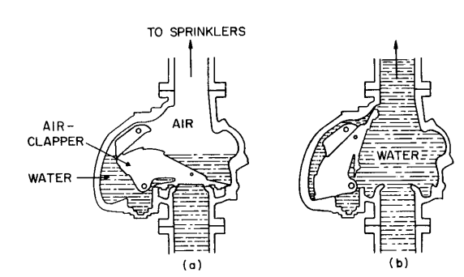

Automatic fire sprinkler systems have been protecting property in the United States since the late 1800s; in fact, the Standard for the Installation of Sprinkler Systems, 1896 was the first standard developed by the National Fire Protection Association (NFPA). Today the NFPA still develops the most widely accepted standards for the design and installation of sprinkler systems: NFPA 13, Standard for the Installation of Sprinkler Systems; 20, Installation of Centrifugal Fire Pumps; 24, Installation of Private Fire Services Mains and Their Appurtenances; 231, General Storage and 231C, Rack Storage of Materials.

While intended to protect and preserve property, automatic sprinkler systems have other inherent advantages: ‘‘The NFPA has no record of a multiple-death fire in a completely sprinklered building. . .’’ Given this inherent advantage, the NFPA has developed a special series of sprinkler standards, NFPA 13D, Sprinkler Systems, Dwellings and 13R, Sprinkler Systems, Residential Occupancies up to and Including  
4 Stories, which are intended to protect life safety, but at significantly less cost than an NFPA 13 designed system.

Drips of gas piping

In today’s built environment, automatic sprinkler systems are installed as a result of minimum building code requirements, local sprinkler ordinances, insurance underwriting stipulations, and corporate policy. Consisting of a water supply, horizontal and vertical water distribution pipes, and a series of sprinklers to distribute water on a fire, sprinkler systems are quite simple (Fig. 14.21). The simplicity of the sprinkler system is greatly responsible for the historic time-tested precedent of success they have become known for: 96% of all fires that occur in fully sprinklered buildings are controlled with the operation of two or fewer sprinklers.

In the design of a sprinkler system, there are usually four groups of individuals building and fire officials, insurance carriers, etc., who have the final authority over accepting the design and installation of the system; the building owner; and the sprinkler contractor, who is responsible for the system installation and is often called upon to perform engineering design functions as well. Coordination with the AHJ’s regarding their system design expectations is a crucial step in the design of a fire sprinkler system. Where there are multiple AHJ’s, conflicts between design expectations must be reconciled to avoid undue construction delays and ambiguity for the construction bidders.

## AUTOMATIC SPRINKLERS

In the past fifteen years, the variety of sprinklers available has grown tremendously. Time Index, water spray pattern, (Fig. 14.18) operating component type, and appearance must be addressed. While there have been numerous advances in sprinklers. Sprinklers are heat-sensitive devices, which open to flow water at a preset temperature. More specifically, a sprinkler operating component releases at a specified  
temperature. Upon release of the operating component, the sprinkler plug falls from the sprinkler orifice and water flows through the orifice, hitting the sprinkler deflector and spraying into a predetermined spray pattern and onto the fuel below.

Of sprinkler components, the most interesting is the operating component (see Fig. 14.14). There are two basic types of operating components, the fusible-style operating component, which is a soldered type element that melts when subjected type of sprinkler operating component, sufficient heat must be provided over a sufficient period of time to cause the solder to melt or bulb to fail. Neither the glass bulb style will result in faster operating times than a standard response operating component. This is a result of the low mass to surface area ratio of the quick response operating component as opposed to that of a standard response operating component. In offices and other light hazard applications, quick response  
sprinklers have proven superior to standard response sprinklers. As a result, it is the current code requires that all light hazard occupancies be protected with quick response sprinklers.

## TYPES OF SPRINKLER SYSTEMS

The type of system that should be used depends chiefly on the temperature maintained in the building, damage ability of contents, expected propagation rate of a fire, and total fire load.

### Wet-Pipe Systems

In the United States, the wet-pipe sprinkler system is the most common and affordable sprinkler system available. In consideration of the approximately $1.50/sqft installation cost, minimal maintenance costs, and the impressive record for reliability, wet-pipe sprinkler systems should be every engineer’s first choice in sprinkler protection. The wet-pipe sprinkler system is clearly established as the workhorse of the fire protection industry.

Unless out of service, wet-pipe sprinkler systems are always water-filled. Consequently, building temperature must be maintained above 40F to prevent freezing. Other than a gate valve and an alarm valve or ‘‘shot-gun’’ riser assembly, there are no devices between the water supply and sprinklers.

To indicate the flow of water as a result of an operating sprinkler or broken pipe, a local alarm bell on the exterior of the building being protected is required. For a wet-pipe sprinkler system, this alarm feature is accomplished in one of two ways. In the past, it was more common for engineers to specify the installation of an alarm-check valve in the main supply pipe, i.e. system riser. The alarm-check valve (Fig. 14.15) is a swing check valve with an interior orifice that admits water to an alarm line onto which a water-motor-driven gong is attached. To help differentiate between a water pressure surge and a legitimate water flow, a retard chamber is often used. The retard chamber acts to delay pressure surges so they subside prior to causing nuisance alarms. In lieu of a water-motor-gong, and in all cases  
on ‘‘slick’’ wet-pipe systems, a vane-type water-flow indicator can be installed and connected to an electric bell to give notification of water flow. Among the advantages of using a vane-type water-flow switch are that most models include a variable time delay to serve as the retard function and they can easily be monitored as a fire alarm device. Figure 14.15 shows a typical alarm-check valve.

### Antifreeze Systems

Where a wet-pipe sprinkler system is installed but small unheated areas such as truck docks or attics exist, an antifreeze system, normally a subsystem to a wet pipe system, will be employed. In most instances, when the capacity of an antifreeze system exceeds 40 gallons, the cost of system maintenance becomes prohibitive and a dry-pipe system is more appropriate.

An antifreeze system consists of an antifreeze U-Loop (Figure 14.16) which includes an indicating control valve, antifreeze solution test ports and drains connection, and a check valve or backflow preventer to restrict the migration of antifreeze from the antifreeze side of a system to the wet-pipe side. Since the waterside of an antifreeze U-loop is subject to freezing, the U-loop must be located in a heated area. The operation of a sprinkler on an antifreeze system is identical to that of a wet-pipe system; however, rather than water flowing from the sprinkler immediately, it is first the antifreeze solution, followed by water. While it may be of concern, the antifreeze solutions currently permitted by NFPA 13 are tested for their ability to control fire and they do not detract from the characteristics of water as an extinguishing medium.

Given today’s increasingly stringent environmental regulations, the installation of backflow prevention devices is often required on antifreeze systems to prevent antifreeze from flowing into wet-pipe sprinkler systems and endangering potable water supplies. The presence of a backflow preventer in an antifreeze system causes special problems with respect to excess system pressures and where a reduced pressure backflow (RPV) preventer is used, proper maintenance of antifreeze solution concentrations. Where backflow preventers are included in the antifreeze system design, expansion chambers must be used to absorb the excess pressures that may build up on the antifreeze side of the system. Where RPVs are employed, the system owner or person in charge of antifreeze system maintenance must be aware  
that the antifreeze system solution may change over time if antifreeze bleeds from the system through the RPV’s interstitial zone.

### Dry-Pipe Systems

In locations where it is impractical to maintain sufficient heat to prevent freezing and the area is too large to be protected by an antifreeze system, dry-pipe systems are often specified. A dry pipe system is similar to that of a wet-pipe system; however, it normally contains air under pressure instead of water. In a dry-pipe system normally high water pressure is held back by normally low air pressure through the use of a differential type dry-pipe valve. This valve employs a combined air and water clapper (Fig. 14.17) where the area under air pressure is about 16 times the area subject to water pressure. When a sprinkler activates, the air is released to the atmosphere through the sprinkler orifice, allowing the water to overcome the pressure differential and enter the piping. On smaller systems, riser-mounted air compressors are used to maintain the air pressure such that the dry pipe valve does not operate as a result of small pressure losses over time. Floor-mounted air compressors or plant air systems are typically used for air pressure maintenance on larger dry pipe systems.

FIGURE 14.16 Acceptable antifreeze u-loop configuration. (Reprinted with permission from NFPA 13, Installation of Sprinkler Systems, Copyright 1996, National Fire Protection Association, Quincy, MA 02269. This reprinted material is not the complete and official position of the National Fire Protection Association, on the referenced subject, which is represented only by the standard in its entirety.)

In dry-pipe systems of large capacity, the relatively slow drop in air pressure when a single head or a few heads are activated is overcome by the use of an accelerator or exhauster. The former is a device, installed near the dry-pipe valve, to sense a small drop in pressure and transmit the system air pressure to a point under the valve clapper. The additional air pressure on the bottom side of the clapper causes it to move into the open and locked position faster than it would otherwise; therefore, water reaches the open sprinklers with less delay.

While a dry-pipe system is intended for use in areas of 40F or less, the dry pipe valve must be installed in a heated area or enclosure since there is water in the piping up to the valve and priming water in the valve itself.

FIGURE 14.17 Differential dry-pipe valve: (a) air pressure keeps clapper closed; (b) venting of air permits clapper to open and water to flow.

FIGURE 14.18 Typical distribution pattern from a standard spray sprinkler. (Reprinted with permission from Fire Protection Handbook, Copyright 1997, National Fire Protection Association, Quincy, MA 02269.)

The indication of water flow in a dry pipe system is accomplished in a manner identical to that of the wet-pipe system; however, if the option of the electric bell is desired a water pressure switch must be employed. Since a dry-pipe system is normally empty when a sprinkler operates water rushes into the piping. If a vane-type water-flow indicator was installed, the rushing water could dislodge the vane and cause an obstruction in the sprinkler piping.

### Preaction Systems

Preaction sprinkler systems are used where the presence of water, except in emergencies, is unacceptable or where a dry-pipe system is necessary and the additional expense of a detection system can be justified. The water in these systems is controlled by a preaction deluge valve, which is operated by an integrated fire alarm system consisting of heat or smoke detection devices installed throughout the same area the preaction system protects. There are two basic types of preaction systems:

**Single Interlock:** These systems admit water to their piping upon actuation of an associated detection system. Their primary benefit is that system piping or sprinklers can be damaged or removed without accidental water discharge. Single Interlock systems are commonly used in computer rooms and sometimes museums although wet-pipe systems are normally adequate.

**Double Interlock**: A combination of a single interlock preaction system and a dry-pipe system, these are filled with compressed air that is capable of holding the water pressure at the preaction deluge valve back until the air pressure is released. Water only enters the piping of a double interlock system after the associated detection system operates and the system's air pressure has been purged. The double interlock system is most frequently used for the protection of refrigerated cold storage/freezer warehouses where a false activation would result in frozen pipes and long periods of business interruption. Oftentimes double interlock sprinkler systems are wrongly specified for the protection of high dollar areas such as computer rooms, museums, etc., where the protection of wet-pipe systems or single interlock preaction systems are adequate.  
Since preaction sprinkler systems rely on a fire alarm system, and in the case of the double interlock system, the dry-pipe principle, they are the least reliable of sprinkler systems and require the greatest amount of maintenance.

### Deluge Systems

These systems are identical to that of single interlock preaction systems except none of the sprinklers have operating components or caps. Like the sprinkler systems depicted in the movies, the operation of a deluge system results in water flowing from all system sprinklers simultaneously. As with the preaction system, a preaction deluge valve controls the water in these systems. Since deluge systems are often installed in harsh environments where smoke or heat detectors are prone to failure, pneumatic or mechanical means are commonly employed for valve operation. The operation of a pneumatically controlled preaction deluge valve can be by means of a pilot line of small-diameter pipes on which are spaced automatic sprinkler heads at suitable intervals. These heads can be augmented when necessary by using of a mechanical air or water-release device, which operates on the rate-of-rise principle as well as the fixed temperature of the sprinkler heads. Other pneumatic means include small copper air chambers, sensitive to rate-of-rise conditions connected by small-diameter copper tubing to the release mechanism of the valve. In some instances specialized infrared or ultraviolet flame detectors may be used to activate a deluge system. The nature and extent of the hazard and the surrounding ambient  
conditions always determine the kind of detection required.  
While a small two or three sprinkler deluge system may be used to protect an isolated industrial hazard, a large deluge system having as many as one-thousand sprinklers may protect an aircraft hangar, chemical plant, or a portion of a plant where process vessels and tanks containing flammable materials are located. Deluge systems are only justified for the protection of areas where the probability of a fire is likely and the fire growth potential is extreme.

### Outside Sprinklers

The types of sprinkler systems referenced above are intended for fire control and on a limited basis fire suppression; however, sprinklers can also be used for exposure protection. In instances where buildings are located too close to one another or to an adjacent fire hazard, such as a combustible liquid storage tank, a ‘‘hybrid’’ sprinkler system can be specified to prevent the spread of fire from a fire area to an exposed building. Such systems have open nozzles directed onto the wall, Bdmeter, or cornices to be protected. The water supply may be taken from a point below the inside-sprinkler-system control valve if the building is sprinklered, otherwise from any other acceptable source, with the controlling valve accessible at all times. The system is usually operated manually by a gate valve but can be made  
automatic by use of a deluge valve actuated by suitable means on the exposed side of the building. The distribution piping is usually installed on the outside of the wall with nozzles provided in sufficient numbers to wet the surface to be protected.

### SYSTEM DESIGN

_Establishing Pipe Sizes and Water Supply Acceptability_

In the past, pipe schedules were the accepted method of determining the adequacy of system pipe sizes; however, the current standards no longer recognize the pipe schedule method for new construction. The accepted method for the determination of pipe sizes and water, supply adequacy is the performance of hydraulic calculations as outlined in NFPA 13.

The installing contractor may perform hydraulic calculations if qualified, but there is a significant advantage to the engineer performing the hydraulic calculations and establishing pipe sizes and water supply acceptability before the bidding process begins. In performing hydraulic calculations, the sprinkler piping layout, nature of the hazard protected, and water supply information must be known. Based on  
this information the area of sprinkler operation, appropriate design density, and minimum sprinkler pressures can be used to perform the necessary hydraulic calculations. While it is beyond our scope to further describe the hydraulic calculation procedure an excellent resource is Fire Protection Hydraulics and Water Supply Analysis, by Pat Brock, published by Fire Protection Publications of Oklahoma State University.

### Sprinkler Piping

There are numerous types of sprinkler piping currently accepted for the installation of sprinkler systems. In all cases, the piping specified for a sprinkler system must be installed and used within the parameters of its U.L. Listing.

Most sprinkler piping specified today is black or galvanized, welded, and seamless steel pipe. Normally smaller pipe sizes are specified as Schedule 40 and larger sizes as Schedule 10 black steel pipe. The joining methods for sprinkler pipe include the use of flanged fittings, prefabricated welded outlets, cast or malleable iron fittings, or mechanical grooved fittings. In all cases, sprinkler pipes and fittings must be capable of withstanding pressures of 175 psi. For further details, NFPA 13 and pipe manufacturer catalogs should be consulted.

**Areas Protected by Sprinklers:** To provide a fully sprinklered building, which is the intent of most building codes and insurance industry sprinkler requirements, all areas of a structure, with few exceptions, must be provided sprinkler protection. Generally, all spaces that are accessible, combustible, or intended for storage or occupancy require sprinkler protection. The guidelines for permissible sprinkler omissions in fully sprinkled buildings are contained in NFPA 13. Except for void spaces in walls and noncombustible concealed spaces, there are few exceptions, and where exceptions do exist they are extremely specific with respect to accessibility, construction, and dimensions.

With respect to individual sprinkler spacing requirements, the maximum area protected by one sprinkler should not exceed the area specified for the specific sprinkler as indicated in the manufacturer’s specification sheets. Standard spray sprinklers are listed for light hazard, ordinary hazard, and extra hazard occupancies for 225-, 130- and 100-2 protection areas, respectively. In most installations, the area of coverage of each sprinkler is usually less than the maximum areas listed.

### Sprinkler Position

In areas where construction is unobstructed, sprinkler deflectors should be parallel to and within 12 inches of the ceiling. Where construction is obstructed sprinklers must be within 22 inches of the roof deck above. In all cases, when locating sprinklers the maximum expected ambient temperature of the area being protected must be considered such that unwanted sprinkler activation does not occur.  
Undesirable sprinkler water spray obstructions must also be considered when locating sprinklers. Where obstructions such as ducts are greater than 4 feet wide and are located below sprinklers, additional sprinklers should be added to spray below the obstruction. Furnishings such as tables are not considered obstructions unless they are within 18-inches, measured vertically of a sprinkler. When locating all sprinklers NFPA 13 and the sprinkler manufacturer’s guidelines must be followed to prevent unwanted water spray obstructions.

**Sprinkler System Layout:** A sprinkler system is generally laid out as a ‘‘Tree’’, ‘‘Loop’’ or ‘‘Grid’’ type system. Whatever the case, sprinklers are attached directly to pipes called branch lines. Branch lines, normally the smallest of sprinkler pipes, are supplied water from cross mains or feed mains which are directly connected to the system riser. The riser configured to control the water supply and monitor water flow and valve position may support a single sprinkler system or if manifold, many systems (Fig. 14.19). In any case, the maximum area per floor to be protected by a single riser is 52,000-2 for light and ordinary hazard areas and 40,000-2 for extra hazard areas.

In high-rise buildings where standpipes and sprinklers are required a combined standpipe/sprinkler system is normally used. In these situations there may be no true system riser; rather, each floor is provided with a floor control valve (Fig. 14.20) consisting of a control valve, drain, test connection, and flow switch. In this configuration, the individual floor control valves accomplish the function of the  
system riser. An inherent advantage of using floor control valves is that individual floors can be isolated so sprinkler system repairs on one floor do not reduce the level of protection on another floor. As a practical matter, when lying sprinkler piping out it is advantageous to consider the pipe hanging arrangement. Where construction consists of joist construction, mains should be run parallel to the joist channels. This accommodates pipe hanging since the branch lines, which outnumber the mains, can be hung directly off the joists. Where construction is concrete pipe hanging is an easier task but one should give consideration to the arrangement of beams and bays such that unnecessary fittings and pipe lengths can be avoided.

FIGURE 14.19 Single riser (left), a manifold system with multiple risers (right).

FIGURE 14.20 Floor control valve. (Reprinted with permission from NFPA 13, Installation of Sprinkler Systems, Copyright 1996, National  
Fire Protection Association, Quincy, MA 02269. This reprinted material is not the complete and official position of the National Fire Protection Association, on the referenced subject, which is represented only by the standard in its entirety.)

FIGURE 14.21 Water-supply piping for sprinklers.

**Drainage of Sprinkler Systems:** Provisions must be made for draining all parts of a sprinkler system. For that purpose, valve-controlled drains must be provided at low points in the system. The primary drain for most sprinkler systems is the main drain, normally a 2-inch drain located at the system riser. All drains should discharge directly outdoors or to a sump capable of handling full flow drain capacity. Special consideration must be given to the drainage of dry-pipe systems and portions of preaction systems subject to freezing. The branch lines of these systems should be pitched 1⁄2 in per 10 feet and mains 1⁄4 inch per 10 feet of length towards a suitable drain connection to accommodate total system drainage. Where trapped piping in dry-pipe systems exceeds 5 gallons capacity, a means must be provided to drain the trapped area without accidentally tripping the dry-pipe valve. This is usually accomplished with the use of a drum drip assemble, an assembly which permits isolating trapped water and draining it without losing air pressure.

**Inspector’s Test Connections:** All sprinkler systems should be tested periodically to ensure their proper function. A test connection for wet- and dry-pipe systems consist of a connection at least 1 inch in diameter with a test valve terminating in a smooth-bore, corrosion-resistant orifice. This orifice connection should be sized to provide a test flow equivalent to the smallest orifice size sprinkler installed in the system. For most systems, the test valve connection can be located anywhere downstream of the alarm valve or flow switch, whichever is provided; however, on dry-pipe and double-interlock preaction systems, the alarm test valve must be located at the hydraulically remote point of the system. This is to ensure that water will reach the remote end of the sprinkler system without undue delay, usually 60  
seconds for large systems.

Approvals of Sprinkler-System Design. In all cases, before a sprinkler system is installed or modified, the applicable drawings and hydraulic calculations should be submitted to the authority having jurisdiction and the insurance underwriter as necessary. Since beneficial reductions in insurance rates may be obtained by suitable installation of sprinkler systems, it is important that the underwriter have sufficient time for a full review of the plans before construction begins. Similarly, municipal approval of the sprinkler-system plans is necessary before the structure can be occupied. In actual construction, the installing contractor generally secures the necessary municipal approval. The existence of this approval should always be confirmed before construction starts.

## STANDPIPES

Standpipes, hose valve connections supplied with water from a piping system that is always under pressure or can be rapidly supplied with water under pressure are the usual means through which firefighters are provided water to fight interior fires in large buildings such as malls and high-rises. NFPA 14, Standpipe, Hose Systems, is the recognized standard for the installation and design of standpipe systems. Today, most standpipes installed are intended for use by the fire department; however, some are designed for occupant use. As with sprinkler systems, building codes generally dictate when and where standpipes are required.

### Class of Service

**Standpipe systems are classified into the following types**: Class I. For use by fire department personnel only. These systems are provided with 1⁄2-inch hose valves located in building stairwells and other protected areas. Water supplies permit two hose streams to be fed simultaneously from a single riser. Each stream provides 250 gal/min at a minimum pressure of 100 psi.  
Class II. For occupant use only. Provided with 1⁄2-inch hose valves and hose racks with a minimum 100-feet length of 1⁄2 hose, these standpipes are located in a building such that all areas of a building are within 130-feet of a hose valve (100-feet of hose plus 30-feet of water spray). It should be noted that most authorities having jurisdiction no longer permit hose to be attached to Class II systems since it is felt that the best option for occupants who are not trained in fire fighting procedures is to evacuate the building and report the emergency situation.  
Class III. A combination of Class I and Class II systems with both 1⁄2 -in hose valves and 1⁄2-in hose valves and hose racks with 100 ft of hose, installed as required for a Class I and Class II system. The calculated water supply at an outlet is the same as for a Class I system.  
Riser Sizes. Standpipe pipe sizes can be established based on the performance of hydraulic calculations or for low rise buildings the NFPA 14 Pipe Schedule System, with the hydraulic procedure being the preferred method. The hydraulic calculations for a Class, I system are based on flowing 500 GPM at 100 psi at the most remote standpipe and 250 GPM at the top hose connection of all other standpipes with a total not to exceed 1250 GPM.  
Maximum Pressure. Standpipe systems should be designed so the maximum gauge pressure at the inlet of any Class I hose connection does not exceed 175 psi and Class II hose connection, 100 psi. Where pressures exceed 175-psi, pressure limiting devices must be installed. Engineers must be extremely cautious in specifying pressure-limiting devices as they are frequently specified improperly.

## WATER SUPPLIES FOR SPRINKLER AND STANDPIPE SYSTEMS

Water supplies for sprinkler and standpipe systems must be reliable. When a municipal water supply has been identified as unreliable or incapable of meeting the demand of a sprinkler or standpipe system, fire pumps, and water storage tanks or reservoirs may be required. Even in instances where a water supply is reliable and the protected area is of high value, a secondary water supply employing water tanks and fire pumps is often provided. In determining the size and elevation of tanks, site conditions should be of primary concern. Oftentimes water storage tanks can be located advantageously at the higher elevations of a property. Other times penstocks, flumes, rivers, or lakes may serve as a water supply. In these cases, approved strainers must be provided on the water supply inlets to prevent obstructions from entering system piping. In all cases, whether the water supply is from a municipal source or raw source as described above, consideration must be given to the potential effects of Microbiological Influenced Corrosion (MIC) which can rapidly damage sprinkler piping.

While water supply adequacy is heavily reliant on the presence of sufficient flow and pressure, water supply duration is also important. For sprinkler systems, the minimum water supply duration is 30, 60, and 90-minutes for light, ordinary, and extra hazard areas, respectively. Standpipe water supply duration is 30-minutes. Water supply duration is mandated to ensure that adequate time is available to achieve fire control.

**Fire Department Connection**: With the exception of small sprinkler systems, all sprinkler and standpipe systems must be provided with a fire department connection (FDC). The FDC often referred to as the siamese connection, is a means through which fire hoses may be connected to a system to support the hydraulic requirements of the system to which it is attached. In most cases, the FDC is a backup water supply. It should be noted that oftentimes the FDC for standpipes in low-rise buildings is the only source of water supply. These systems are referred to as manual standpipes. Before specifying a manual standpipe the AJH should be consulted.

Depending on the AJH, FDCs may be installed on a side of a building or they may be free-standing. Whatever the case, the FDC should be 18- to 36-inches above grade, and within clear sight of a fire department access-way. To speed fire ground operations it is good practice to locate FDCs within 75 feet of a fire hydrant. In addition, high-rise buildings should be provided with two remotely located FDCs. While not a code requirement, as a rule of thumb, for each 250-GPM required, as determined in the hydraulic calculations, one 1⁄2-inch FDC outlet should be provided. For a 600-GPM-system demand three 1⁄2 inch, FDC outlets should be provided.

As it is becoming commonplace for fire departments to use quick connecting FDCs, Stortz Connections, and since the fire department is the FDC end user, in all cases, the local fire official should be consulted regarding FDC type and location.

## CENTRAL STATION SUPERVISORY SYSTEMS

Any mechanical device or system is more reliable if it is supervised or monitored. Sprinkler systems are designed to be rugged and dependable as shown by their impressive performance record; however, reliability improves where systems are monitored by an approved central-station supervisory service for valve position (open or closed) and water flow switch status.  
A central station monitors the equipment specified by the engineer and provided by the contractor and transmits appropriate signals over leased telephone lines or other approved methods, to a constantly attended location. When a signal is received at the central station, no matter what hour, the fire department and any other preestablished emergency contacts are summoned. When notification of a closed valve is provided, the building owner or other acceptable contact should investigate, but notification of water flow should always result in fire department dispatch.

Monitoring services are available across the country and are arranged by contract, usually with an installation charge and a monthly maintenance fee. Requirements for such systems are in NFPA 72, National Fire Alarm Code. Where no such service is available, a local or proprietary substitute can be provided.

## ADDITIONAL INFORMATION

Developing proficiency in the proper design and specification of fire sprinkler systems is extremely tedious. While sprinkler system design is admittedly a small portion of the engineering design package for a construction project, the implications of inadequate system design are more than severe. There have been numerous cases where engineers have been named in lawsuits relating to improperly designed automatic sprinkler systems. To obtain additional information regarding the proper design and installation of automatic sprinkler systems the NFPA or Society of Fire Protection Engineers (SFPE) are excellent resources. In addition, to display your proficiency in the field of fire protection engineering, registration as a fire protection engineer is available in most states.
