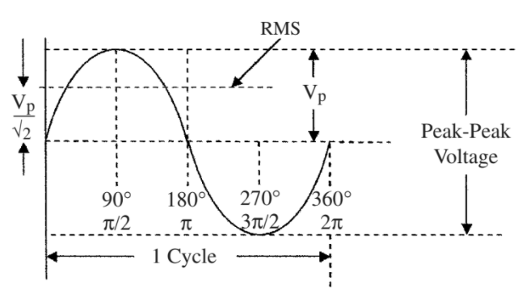
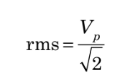
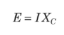
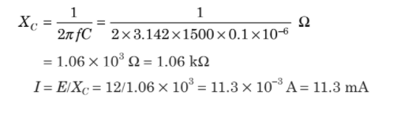
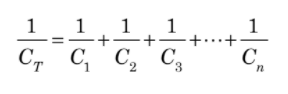
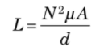
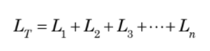
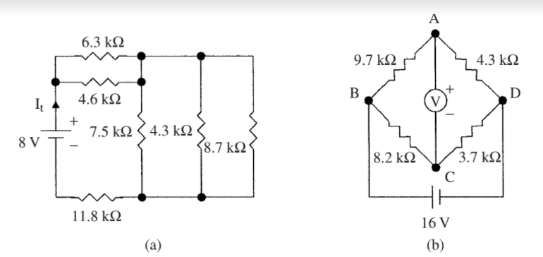

This blog will help to refresh and expand your understanding of basic electrical components and the basic terms used in electricity as required for instrumentation.  
This chapter discusses

■ Basic passive components (resistors, capacitors, and inductors) used in electrical circuits  
■ Applications of Ohm’s law and Kirchoff’s laws  
■ Use of resistors as voltage dividers  
■ Effective equivalent circuits for basic devices connected in series and parallel  
■ The Wheatstone bridge  
■ Loading of instruments on sensing circuits  
■ Impedances of capacitors and inductors

It is assumed that the student has a basic knowledge of electricity and electronics and is familiar with basic definitions. To recap, the three basic passive components—resistors, capacitors, and inductors—as well as some basic formulas as applied to direct and alternating currents will be discussed in this section.

## Introduction

Electrical power can be in the form of either direct current (dc) (one direction only) or alternating current (ac) (the current reverses periodically, see Fig. 2.1). In ac circuits the electromotive force drives the current in one direction then reverses itself and drives the current in the reverse direction. The rate of direction change is expressed as a frequency f and is measured in hertz (Hz), i.e., cycles per second.

The basic sine wave.

Electrical signals travel at the speed of light. The distance traversed in one cycle is called a wavelength l, the relationship between frequency and wavelength (meters) is given by the following equation:  
  
f = c/λ  
  
where c is the speed of light (3 × 108 m/s). In both dc and ac circuits, the conventional current was originally considered to flow from the more positive to the less positive or negative terminal. It was later discovered that current flow is really a flow of electrons (negative particles) that flow from negative to positive. To avoid confusion, only conventional current flow will be considered in this text, i.e., current flows from positive to negative. When measuring ac voltages and currents with a meter, the root means square (RMS) value is displayed. The RMS value of a sine wave has the same effective energy as the dc value. When displaying sine waves on an oscilloscope it is often more convenient to measure the peak-to-peak (pp) values as shown in Fig above. The peak amplitude of the sine wave (Vp or Ip) (0 to peak) is then (p − p)/2, and the RMS value is given by -

The basic sine wave shown in Fig. 2.1 can be equated to a 360° circle or a circle with 2p rad. The period (cycle time) of a sine wave is broken down into four phases each being 90° or p/2 rad. This is derived from the trigonometry functions, and will not be elaborated upon.

## Resistance

It is assumed that the student is familiar with the terms insulators, conductors, semiconductors, electrical resistance, capacitance, and inductance. Hence, the basic equations commonly used in electricity will be considered as a starting point.

### Resistor formulas

The resistivity r of a material is the resistance to current flow between the opposite faces of a unit cube of the material (ohm per unit length). The resistance R of a component is expressed by -

where  
XC = impedance to ac current flow  
f = frequency of the ac signal  
C = capacitance in farads  
  
Ohm’s law also applies to ac circuits, so that the relation between voltage and  
current is given by -

where  
E is the ac voltage amplitude and I is the ac current flowing.  
  
Example: What is the ac current flowing in the circuit shown in Fig. above?

### Capacitor combinations

The formulas for the effective capacitance of capacitors connected in series and parallel are the opposite of resistors connected in series and parallel. Capacitors in series are shown in Fig. above and have an effective capacitance given by -

Circuits (a) used in Example 2.9 (b) capacitors connected in series, and (c) capacitors connected in parallel.

Circuits for use in Example 2.10: (a) circuit used in the example, (b) reduction of  
series capacitors to single capacitors, and (c) replacement of parallel capacitors with a  
single capacitor.

Capacitors in parallel are shown in Fig. 2.7c and have an effective capacitance given by

Example 2.10 What is the value of the capacitor that could be used to replace the capacitor network is shown in Fig. 2.8a?  
  
In this example, the first step is to reduce the three capacitors in series to a single  
capacitor and the two capacitors in series to a single capacitor as shown in Fig. 2.8b.

## Inductance

**Inductor formulas**

Inductors are devices that oppose any change in the current flowing through them. The inductance of a coil is given by -

where  
L = inductance in henries  
N = number of turns of wire  
m = permeability of the core of the coil (H/m)  
A = cross-sectional area of the coil (m2)

d = length of the coil (m)  
Henry is defined as the inductance that will produce an emf of 1 V when the current through the inductance changes at the rate of 1 A/s.  
  
Example 2.11 A-coil with a diameter of 0.5 m and length 0.7 m is wound with 100 turns of wire, what is its inductance if the material of the core has a permeability of 7.5 × 10−7 H/m?  
  
Example 2.11 A-coil with a diameter of 0.5 m and length 0.7 m is wound with 100 turns of wire, what is its inductance if the material of the core has a permeability of 7.5 × 10−7 H/m?  
  
Inductive impedance to ac current flow is given by - 
XL = 2pfL

where  
XL = impedance to ac current flow  
f = frequency of the ac signal  
L = inductance in henries  
  
Example 2.12 What is the impedance to a 50-kHz sine wave of a 10-mH inductance?  
XL = 2pfL = 2p × 50 × 103 × 10 × 10−3 = 3100 Ω = 3.1 kΩ

### Inductor combinations

The formula for the effective inductance of inductors connected in series and parallel is the same as for resistors.

Inductors in series have an effective inductance given by -

Inductors in parallel have an effective inductance given by -

**Summary**

This section was designed to refresh and expand your knowledge of basic electrical components. The main points covered in this chapter are:

1. Introduction to the different effects of dc and ac electrical supplies on circuit  
    components
2. Resistivity of materials and their resistance when made into components, the  
    effect of temperature on the resistance of components, introduction to Ohm’s  
    law, and power dissipation in resistive components
3. The effective resistance of resistors connected in series and parallel and their
4. use as voltage dividers

4. Discussion of Kirchoff’s voltage and current laws, Wheatstone bridge circuits and their use in the measurement of small changes in resistance, and the use of bridge circuits for strain gauge measurement

5. Description of capacitance and the formulas used for capacitors, the effective capacitance of capacitors connected in series and parallel and the impedance of capacitors when used in ac circuits

6. Adescription of inductance and the formulas used for inductors, the effective  
    impedance of inductors used in ac circuits, and the effective inductance of  
    inductors when they are connected in series and parallel

**Problems**

**2.1** A radio beacon transmits a frequency of 230 MHz. What is the wavelength of the signals?  
  
**2.2** What is the power dissipation in a 68 Ω resistive load, when a 110-V (peak-to-peak) sine wave is applied to the resistor?  
  
**2.3** The resistivity of a material used to make around 950 Ω resistor is 53 Ω per unit length. If the resistor has a radius of 0.16 in, what is its length?  
  
**2.4** A resistor with a temperature coefficient of 0.0045/°C has a resistance of 130 Ω at 20°C. At what temperature will the resistance be 183 Ω?  
  
**2.5** Adc voltage of 17 V is measured across a 133-Ω resistor. What is the current flowing through the resistor?  
  
**2.6** Adc voltage is applied to three resistors in parallel. The values of the resistors are 7.5, 12.5, and 14.8 kΩ. If the total current flowing is 2.7 mA, what is the applied voltage?  
  
**2.7** The configuration of the three resistors in Prob. 2.6 is changed from a parallel to a series connection. If the current flowing in the resistors is unchanged, what is the total voltage across the three resistors?  
  
**2.8** What is the supply current It flowing in the circuit shown in Fig. 2.9a?  
  
**2.9** Calculate the voltage across each of the resistors in Prob. 2.7. Does the result support Kirchoff’s first law?  
  
**2.10** What is the current flowing in each of the resistors in Prob. 2.6? Does the result support Kirchoff’s second law?  
  
**2.11** What is the voltage measured in the bridge circuit shown in Fig. 2.9b?

Diagrams for (a) Prob. 2.8 and (b) Prob. 2.11.

**2.12** Two rectangular parallel plates 2.2 m by 3.7 m are separated by a material with a dielectric constant of 4.8 × 10−9 F/m. If the capacitance between the plates is 4.3 μF, what is the separation of the plates?  
  
**2.13** A3.2 nF capacitor has an impedance of 0.02 MΩ when an ac voltage is applied to it. What is the frequency of the ac voltage?  
  
**2.14** What is the current flowing in Prob. 2.13, if the peak-to-peak ac voltage is 18 V?  
  
**2.15** Three capacitors are connected in series. See Fig. 2.7b. If the values of the capacitors are 110, 93, and 213 pF, what is the value of a single capacitor that could be used to replace them?  
  
**2.16** What is the value of a single capacitor that could be used to replace the capacitors shown in Fig. 2.10a?  
  
**2.17** An inductor of 2.8 mH is being constructed on a core whose diameter is 1.4 cm and length is 5.6 cm. If the permeability of the core is 4.7 × 10−7 H/m, how many turns of wire will be required?

Circuits for (a) Prob. 2.16 and (b) Prob. 2.20.

**2.18** What is the value of inductance that will have an impedance of 11.4 kΩ at a frequency of 2.3 MHz?  
  
**2.19** What value of inductance can be used to replace two inductors connected in parallel if their values are 4.2 and 8.7 mH?  
  
**2.20** What value of inductance would be used to replace the inductor network shown in Fig. 2.10b?
