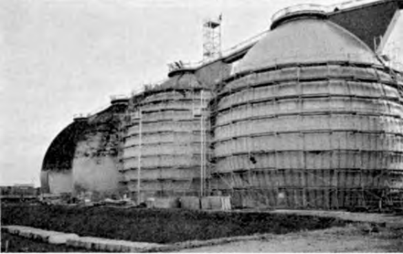

When modern industrialization started in the 19th century, many people migrated from the agricultural area to the big cities. Public hygiene became a major problem. Human excrement and waste was discharged into open channels, rivers, and lakes. The pollution was disastrous and hygiene-related epidemic diseases, like cholera and typhus, occurred frequently. Therefore, it was an important step forward when public water collection systems and treatment plants were introduced at the end of the 19th century.

In an industrialized society every person produces about 200 to 400 L of wastewater; factories and other commercial enterprises release varying volumes of water. The degree of pollution of the wastewater is measured as biological oxygen demand (BOD5) or chemical oxygen demand (COD). The BOD5 is the amount of oxygen that is consumed during the microbial conversion of organic matter in 5 days. The COD  
is the amount of potassium permanganate solution needed to titrate a defined volume of the wastewater. Public wastewater in industrialized countries has a BOD5 of approximately 60 mg/L.

Modern biological wastewater treatment plants use a combination of aerobic and anaerobic fermentation reactors to remove organic matter from the wastewater. In the aerobic part, the microorganisms feed on the organic matter in the wastewater and convert it to microbial biomass and carbon dioxide. In the anaerobic part, the microbial biomass of the aerobic part is digested by a second type of microorganism that produces methane as it grows. The anaerobic microorganisms die immediately when they come into contact with air. That means that they are not infectious and do not present a risk to humans and the environment when they are released from the reactor.

Flow chart of an ethanol fermentation plant. (Source: United States. National  
Agricultural Library; Office of Alcohol Fuels; Solar Energy Research Institute. Fuel from  
Farms: A Guide to Small-Scale Ethanol Production. Golden, Colo.: Technical Information  
Office, Solar Energy Research Institute, 1982; published at www://dnr.state.la.us.)

A schematic flow diagram of a wastewater treatment plant is shown in Figs. 9.9 to 9.12. In primary physical treatment, solid material is separated from the liquid by screens, settling tanks, and skimming devices. This removes about 50 percent of the pollutants. The remaining organic material is subjected to biological treatment.

In smaller plants, the water is treated in open basin-type reactors (aerated basins). They are inexpensive to build and easy to maintain. The oxygen is supplied by bubbling air through the water or by uptake from  
the ambient air with vigorous agitation of the water. The bacteria in the reactor feed on the organic matter, consume oxygen and generate carbon dioxide. The bacteria are macroscopically seen as sludge. This sludge is heavier than the water and can be separated by sedimentation in a clarification basin. Part of the sludge is recycled as inoculums to the aerated basin. The rest is subjected to anaerobic treatment. In the large treatment plants of big cities, the open basins are replaced by more sophisticated reactors. For instance, bubble columns, which can be 30 m high, or deep-shaft reactors with a height of up to 100 m, are partly buried in the ground. At this point, 90 to 95 percent of the biodegradable matter is removed from the wastewater. The remaining 5 to 10 percent is treated in clarifier basins. The water is then filtered and sometimes disinfected with sodium hypochlorite. The treated water is essentially free of pathogenic microorganisms and can be used for irrigation or discharged into rivers or lakes without any risk to the environment.

Most of the solid collected in the primary and secondary treatment steps are transferred to the digester. This is an anaerobic fermentation

Production of L-lysine as an example for industrial  
amino acids.

A large-scale sludge fermenter for biogas production and  
sludge treatment in a public sewage treatment plant. The scaffolding  
illustrates the size of the fermenter, which is about 30 m high. (Source:  
Fischer fixing systems, Germany)

the reactor, often egg-shaped, in which anaerobic microorganisms convert organic matter to methane. The mass of the solid waste is reduced by some 70 percent, most pathogenic organisms are killed, and the odor potential is largely eliminated. The produced methane can be used to generate electricity or heat; the remaining solid can be incinerated or discharged.

Biological wastewater treatment is very efficient in removing organic matter and biodegradable chemicals. It is rather inefficient in removing inorganic ions, especially nitrate and phosphate. Nonbiodegradable organic compounds, such as polychlorinated hydrocarbons (PCB), highly branched  
hydrocarbons, or some Pharmaceuticals (e.g., steroids) also pass through treatment without change. Another problem arises when antibacterial compounds reach the treatment facility. They kill the bacteria in the bioreactors and can severely disturb plant operation. Therefore, the discharge of disinfectants and antibiotics—and actually all pharmaceuticals—to the public sewer system must be avoided (Fig. 9.13).

Wastewater treatment plant.

Fermentation is also used to treat industrial chemical or organic waste. The principle is very similar to the described anaerobic sludge treatment. That means that the organic material is converted to  
methane. Examples include waste containing cotton, rubber, plastics, fats, explosives, and detergents. The waste can be transferred to special treatment plants or be treated in situ in the open field where the waste was buried. Open-field microbiological treatment of spills or deposits of hazardous chemicals is a potentially attractive and inexpensive remediation method and has attracted a lot of research attention. So far, however, only a few examples have been successful.

Another example of the application of fermentation is the removal of organic compounds from exhaust air. Such biofilters are often trickle-bed reactors, in which the microorganisms grow on a solid support, such as wood chips or porous stones. Water is trickled through the reactor, whereas the exhaust air flows in the opposite direction. The bacteria digest the organic components and destroy odor-causing chemicals. Biofilters are applied in municipal wastewater treatment, food production, paint, paper, and timber industries or soil remediation. They provide an attractive alternative to thermal, chemical, and adsorptive processes for the cost-effective treatment of air pollutants.

## Social and Economic Aspects

Biotechnology is a synonym for modern technology. The term is frequently used, but it seems that different people understand it differently. The OECD defines biotechnology as "The application of Science and Technology to living organisms as well as parts, products, and models thereof, to alter living or non-living materials for the production of knowledge, goods, and services.

" The actual production process in most industrial biotech applications is fermentation. Genetic engineering is a method to genetically modify microorganisms or cells of plants and animals that are used as starters for the production of products by industrial fermentation. As described in this chapter, fermentation has many uses and is of vast social and economic importance. It spans a wide range of products, from soy sauce to interferon, from antibiotics to biogas. Some products, like food or vitamins, are mature and will see a stable market, but with decreasing prices. Other products, especially specialty Pharmaceuticals and biopolymers, are expected to gain economic importance in the future.

The economic value of food, feed, and biotech Pharmaceuticals is enormous. Although fermentation is a key step in the production of these products, it contributes only a small part to the total cost. This is illustrated by antibiotics. The market value of the finished drug is certainly much higher than US$20 billion per year. A toll manufacturer carrying out only the fermentation would get a fraction of this sum,  
probably <5 percent. Therefore, the value of the fermentation itself is difficult to estimate but could be in the order of US$10 billion worldwide, in 2000.

The social aspects are also interesting and the consequences are difficult to predict. There are a number of undisputed benefits connected with the production of food, feed, vitamins, and Pharmaceuticals by fermentation. The starting materials are from renewable resources; the products are useful and low risk; the production takes place under mild conditions and the by-products are biodegradable and harmless. Some of the most important Pharmaceuticals are produced by fermentation; insulin, penicillin, and tetracycline are just a few examples. They have changed the quality of life—at least for those people who have access to them.

The production of ethanol by fermentation and its use as a car fuel may serve as an example to demonstrate the social benefits and risks of fermentation. Ethanol is an efficient fuel, it can be produced from carbohydrates (sugar cane, maize, and so on), which means renewable resources. This seems to be a plus, and it is one, as long as agricultural by-products are used. However, there is a different point of view: When farmers can make a better profit with raw materials for fuel, they will produce it. But who will produce our food, when the arable land is used to make car fuel? With a growing world population, we can hardly afford this.

Generally, experts expect that fermentation processes have economic advantages only for the production of expensive chemicals, not for mass products. They expect more applications in the pharmaceutical field, where the active substances are valuable and difficult to produce by conventional chemical means. Therefore, we may not have to worry about the ethanol example discussed in the previous paragraph, as the economics are not favorable.
