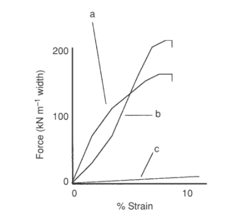

## Introduction to geotextiles

Although skins, brushwood, and straw–mud composites have been used to improve the soft ground for many thousands of years, it is not realistic to refer to these as ‘geotextiles’. The important factor that separates them from modern geotextiles is that they cannot be made with specific and consistent properties. When modern polymers were developed in the mid 20th century, it became possible to create textiles with designed forecastable performance and to produce them in large quantities with statistically consistent and repeatable properties. Once this was achieved, the science of geotextiles became possible. In essence, the difference between geotextiles and skins is their numerical or engineering capability.

In the early 1960s and 1970s, some pioneering engineers wondered if textiles could be used to control soils under difficult conditions. For example, very wet soils need draining and textiles were used to line drains, to prevent mud and silt from clogging up the drains. Similarly, engineers tried to use textiles beneath small access roads constructed over very soft wet soils. It was found that these textiles helped to increase the life and performance of roads. Also, early work was being undertaken in the laying of textiles on the coast to prevent erosion by wave action. A number of limited but historical publications were published.

However, in those early days, it was not known exactly how these textiles performed their functions. How did they actually filter? How did a relatively weak textile apparently support heavy vehicles and improve road performance? This was a dangerous period for engineers because it was quite possible that the  
experience-based employment of geotextiles could lead to their use in unsuitable constructions. It was likely that before long, an engineer would use textiles in a structure that was too large, too demanding, or too stressful for the product; a significant failure could result. It was therefore vital that study and research should be undertaken to provide theories and preliminary design equations against which to test site results.

In 1977 Rankilor produced what was probably the first ‘design’ manual for a commercial product3 and this was followed by a textbook written in 19804 which built on the extensive experience that had been amassed by this time. As is so typical of scientific development, many engineers were soon working worldwide on the development of geotextiles. Another significant textbook by Koerner and Welsh was  
published in 1980,5 showing that work in the USA was at an advanced stage. The French, Japanese, Germans, Dutch, and workers in other countries were equally active in the utilization of textiles in civil engineering earthworks at that time. During the last 20 years of the 20th century, the use of geotextiles spread geographically worldwide and in area terms, their use increased almost exponentially. It is expected that their use will continue to increase into the 21st century unabated.

Once textiles were recognized as being numerically capable materials, engineers developed new types of textile and new composites to solve more difficult problems. Woven and nonwoven textiles were joined into composite products; nonwoven products were combined with plastic cores to form fin drains, and woven products were developed from stronger polymers such as polyester to extend the mechanical range of textiles and their uses in soil reinforcement. It is probable that the Dutch were the first to weave heavy steel wires into polypropylene textiles for incorporation into their major coastal land reclamation schemes. During the period 1984–85, Raz and Rankilor explored and developed the design and use of warp knitted fabrics for civil engineering ground uses.6,7 Rankilor coined the term ‘DSF’ geotextiles – directionally structured fabric geotextiles; Raz specified the ‘DOS’ group within the main DSF range – directionally orientated structures.

Within a few years, more than six major manufacturers were producing warp-knitted textiles for civil engineering earthworks. Currently, many are commercially available. It can be considered that the ‘first generation’ of geotextiles were textiles that were being manufactured for other purposes (such as carpet or industrial sackings) but which were diverted and used for geotechnical purposes. The second generation of geotextiles became generated by manufacturers choosing specific textiles suitable for geotechnical purposes but using conventional manufacturing techniques.

The third generation textiles were actually designed and developed anew specifically for the purpose of geotechnical application – in particular DSF, DOS, and composite products.

The development of geotextiles has always been an ‘industry-led’ science. Academic institutions have almost universally lagged well behind the industry, with industrial designers acquiring experience at an ever-increasing rate. Currently, for example, in the USA, there are only a small number of universities teaching geotextile design as part of their main core programs. In the UK, there are even fewer. Nonetheless, research publications from British academic institutions are of high quality, showing specialized interests such as weathering,8,9 filtration,10 soil reinforcement 11,12, and computer applications.

The establishment of the International Geotextile Society in 1978 led to a coordinated and coherent approach to the international development of geotextile design and utilization. The Society’s four-yearly international symposium has been emulated by many other groups and countries, such that the rate of publication of papers is now very high, providing widespread exposure of developments to all interested  
engineers.

There are some interesting commercial aspects related to geotextiles that are specific to the industry. For example, availability must be considered in light of the extreme size range of operations into which geotextiles are incorporated. About one-third of all geotextiles are used in small batches of three rolls or less, but a significantly large proportion is used in very large projects incorporating hundreds of thousands of square meters. Supply must therefore be available on call for one or two rolls from local stock and, simultaneously, must be available through agents or directly from the manufacturer in large quantities over a short space of time.

The delivery period is particularly onerous for textile suppliers. The majority of delivery requirements are of a standard industrial nature, but geotextile suppliers have to be able to supply large quantities within a short period for major engineering undertakings. This aspect has deterred many potential geotextile manufacturers from entering the field.

Price is also of interest, in that the cost of the polymer and manufacture can be irrelevant in certain cases. In civil engineering, a textile can be used to ‘replace’ a more conventional material such as sand in a granular filter. In this case, the cost of the product would be relevant and would be compared to the cost of the sand. Taken into account would be other marginal factors such as time saved in the laying of the textile as opposed to that of laying the sand. If the balance was in favor of the textile, then it might be adopted. However, in different circumstances, the same textile might be worth considerably more as a sand replacement, for example, if sand were required to be placed under rapidly moving water or waves. In this case, if the textile could be placed where sand could not, then the comparison is not simply a matter of cost, but of the textile actually allowing construction to take place when the sand could not. Considerably more could be charged for textile in these circumstances than in the former. Therefore, the cost of textiles is enhanced where they are sold and used as part of a ‘system’.

Quality has to be controlled in much the same way as with other textiles – quality variation within the fabric and quality variations over time – but the implications of failure can be so much greater than with normal industrial products. If a major dam were to fail because the textile filter clogged, it would not just be a matter of apologizing and replacing the filter with a new product! The manufacturer does not take responsibility for the use of fabrics on the ground, but the design consultant does. He will not, therefore, be willing to certify the use of textile if he is not satisfied that quality can be maintained at all levels of the process.

It is certainly necessary for modern-day geotextiles to be produced by manufacturers having ISO 9000 certification and it is ideal for this to include 9001, 9002, and 9003. The full range of these certifications covers the manufacturer’s operation from raw material supplier through manufacture to storage and delivery.

## Geosynthetics

In the field of civil engineering, membranes used in contact with, or within the soil, are known generically as ‘geosynthetics’. This term encompasses permeable textiles, plastic grids, continuous fibers, staple fibers, and impermeable membranes. Textiles were the first products in the field, extending gradually to include additional products but have remained by far the most important of the range. Grids are formed from sheets of plastic that are punched and stretched; meshes are formed from melted extruded polymer; neither can be categorized as textiles. Geomembranes are continuous sheets of impermeable plastic and are not textiles. The more difficult  
areas of the geosynthetic range to categorize are those where discrete staple fibers or continuous filament fibers are mixed directly with soil. These are polymer textile fibers and therefore, as such, are included within the definition of geotextiles.

### Geotextile types

Geotextiles basically fall into five categories – woven, heat-bonded nonwoven, needle-punched nonwoven, knitted, and by fiber/soil mixing.

Woven fabrics are made on looms which impart a regular rectilinear construction to them, but which can vary in terms of the component fibers and the weave construction. They have a surprisingly wide range of applications and they are used in the lighter-weight form as soil separators, filters, and erosion control textiles. In heavyweights, they are used for soil reinforcement in steep embankments and vertical soil walls; the heavier weight products also tend to be used for the support of embankments built over soft soils. The beneficial property of the woven structure in terms of reinforcement is that stress can be absorbed by the warp and weft yarns and hence by fibers, without much mechanical elongation. This gives them a relatively high modulus or stiffness.

Heat-bonded nonwoven textiles are generally made from continuous filament fine fibres that have been laid randomly onto a moving belt and passed between heated roller systems. These fabrics acquire their coherence and strength from the partial melting of fibres between the hot rollers, resulting in the formation of a relatively thin sheet of textile.

Needle punched nonwoven fabrics are made from blended webs of continuous or staple filaments that are passed through banks of multiple reciprocating barbed needles. The fabrics derive mechanical coherence from the entangling of fibers caused by the barbs on the reciprocating needles; these fabrics thus resemble wool felts. In the case of needle punched textiles, considerable thicknesses (up to more than 10 mm) and weights greater than 2000g m-2 can be achieved, whereas the heat-bonding process is limited in its efficacy as thickness increases. If sufficient heat is applied to melt the internal fibers of a thick fabric adequately, then the outer fibers will tend to be overheated and oven melted. Conversely, if appropriate heat is applied to the external fibers, then insufficient heat may be applied to the center of the sheet, resulting in inadequate bonding and potential delamination in use. Knitted fabrics, as used in the field of geotextiles, are restricted to warp-knitted textiles, generally specially produced for the purpose. Warp-knitting machines can produce fine filter fabrics, medium meshes, and large diameter soil reinforcing grids. However, it is generally found that only the high-strength end of the product range is cost-effective, usually for soil reinforcement and embankment support functions.

### The main geotextile fibre-forming polymers

The two most common fibre polymers used for the manufacture of geotextiles are polypropylene and polyethylene, but polyester is almost inevitably used when high strengths are required. There are other higher strength polymers available on the market, but geotextiles have to be produced in large quantities (some polymers are not available in large volumes) and economically (specialist polymers tend to be very expensive). On the overall balance of cost against performance, polyester is the present-day optimum, while polypropylene and polyethylene vie for being the most chemically resistant.

Care must be taken when considering the properties of geotextile polymers that consideration is restricted to polymers as they are actually produced and used for geotextile manufacturing purposes; they are not in their chemically pure form. For example, raw polyethylene in its colourless translucent form is quite susceptible to light degradation. However, it is not used in this form in geotextiles, but usually con- tains carbon black as an ultraviolet (UV) light stabiliser. In this black form, it is arguably the most light-resistant polymer. Also, it must be recognised that real in situ field testing of geotextile polymers is limited. Publications and authorities may quote accelerated laboratory results for xenon UV exposure, high temperature degradation testing, and similar, but these cannot take account of additional degradation factors such as biological attack, or synergistic reactions that may take place. The difficulty, therefore, arises that accel- erated laboratory testing may well be pessimistic in one regard and optimistic in the other when used for ranking purposes. Although polyamide is a common fibre-forming and textile material, nonethe- less, it is rarely used in geotextiles, where its cost and overall performance render it inferior to polyester. Some woven materials, for example, have used polyamide in the weft direction, more as a ‘fill’, where its properties are not critical. Its main asset is its resistance to abrasion, but it displays softening when exposed to water, which appears to have made it unpopular for geosynthetic use. Polyvinylidene chloride fiber is used in Japan and in one or two products in the United States, but not in Europe.

## Essential properties of geotextiles

The three main properties which are required and specified for a geotextile are its mechanical responses, filtration ability and chemical resistance. These are the prop- erties that produce the required working effect. They are all developed from the combination of the physical form of the polymer fibres, their textile construction and the polymer chemical characteristics. For example, the mechanical response of a geotextile will depend upon the orientation and regularity of the fibres as well as the type of polymer from which it is made. Also, the chemical resistance of a geo- textile will depend upon the size of the individual component fibres in the fabric, as well as their chemical composition – fine fibres with a large specific surface area are subject to more rapid chemical attack than coarse fibres of the same polymer. Mechanical responses include the ability of a textile to perform work in a stressed environment and its ability to resist damage in an arduous environment. Usually the stressed environment is known in advance and the textile is selected on the basis of numerical criteria to cope with the expected imposed stresses and its ability to absorb those stresses over the proposed lifetime of the structure without straining more than a predetermined amount. Figure 14.1 compares the tensile behaviours of a range of geotextiles.

On the other hand, damage can be caused on site during the construction period (e.g. accidental tracking from vehicles) or in situ during use (e.g. punching through geotextiles by overlying angular stone). Clearly, in both cases, damage is caused by

Typical ultimate stress–strain failure levels (a) of high strength and (b) of medium  
strength polyester woven geotextiles used for embankment support and soil reinforcement,  
(c) of geogrids and lower strength polyester woven geotextiles used for soil reinforcement  
and (d) of low strength, highly extensible nonwoven geotextiles used for separation and  
filtration. (c) represents the current maximum strength capacity of polyethylene geogrids.

an undesirable circumstance which is particularly difficult to remove by design. However, in the latter case, it is possible to perform advanced field testing and to allow appropriate safety factors in calculations. The ability to perform work is fundamentally governed by the stiffness of the textile in tension and its ability to resist creep failure under any given load condi- tion. The ability to resist damage is complex, clearly being a function of the fibre’s ability to resist rupture and the construction of the fabric, which determines how stresses may be concentrated and relieved. In practical terms, geotextiles can be manufactured in a composite form, utilising the protective nature of one type of construction to reduce damage on a working element. For example, a thick non- woven fabric may be joined to a woven fabric; the woven textile performs the tensile work whilst the nonwoven acts as a damage protective cushion. The filtration performance of a geotextile is governed by several factors. To understand this, it is essential to be aware that the function of the textile is not truly as a filter in the literal sense. In general, filters remove particles suspended in a fluid, for example, dust filters in air-conditioning units, or water filters, which are intended to remove impurities from suspension. Quite the opposite state of affairs exists with geotextile filters. The geotextile’s function is to hold intact a freshly prepared soil surface, so that water may exude from the soil surface and through the textile without breaking down that surface. If water is allowed to flow between the textile and the soil interface, with particles in suspension, it will tend to clog up the textile which will fail in its function.

In practice, it has been found that, in conjunc- tion with a textile, the soil will tend to filter itself, provided that the integrity of its external surface is maintained. The actual process taking place is the passage of a liquid from a solid medium that is held intact by a permeable textile. The process is not one of restraining the passage of solids that are suspended within a liquid medium.

Geotextiles are rarely called upon to resist extremely aggressive chemical envi- ronments. Particular examples of where they are, however, include their use in the basal layers of chemical effluent containers or waste disposal sites. This can happen if and when leaks occur, permitting effluent to pass through the impermeable liner, or if the textiles have been incorporated directly in the leachate disposal system above the impermeable liner. Another example might be the use of textiles in contact with highly acidic peat soils, where in tropical countries, pH values down to 2 have been encountered. In industrialised countries where infrastructure develop- ments are being constructed through highly polluted and contaminated areas, geotextiles can also come into contact with adverse environments. Ultraviolet light will tend to cause damage to most polymers, but the inclusion of additives, in the form of antioxidant chemicals and carbon black powder, can con- siderably reduce this effect. The only time when a geotextile is going to be exposed to sunlight is during the construction period. It is generally considered that contracts should specify the minimum realistic period of exposure during site installation works. However, this will vary with time of year and latitude. In brief, it can be con- sidered that exposure in UK and northern European type climates can be eight weeks in the summer and twelve in the winter. In tropical countries, however, expo- sure should be limited to seven days at any time of year before noticeable damage occurs. Table 14.1 lists typical maximum exposure periods.

### Mechanical properties

The weight or area density of the fabric is an indicator of mechanical performance only within specific groups of textiles, but not between one type of construction and another. For example, within the overall range of needlepunched continuous filament polyester fabrics, weight will correlate with tensile stiffness. However, a woven fabric with a given area density will almost certainly be much stiffer than an equivalent weight needlepunched structure. Clearly the construction controls the performance. Therefore, it is impossible to use weight alone as a criterion in specifying textiles for civil engineering use. However, in combination with other

Different stress–strain curve shapes exhibited by the three main types of  
geosynthetic construction. (a) Geogrids absorb the imposed stresses immediately, giving a  
high initial modulus. Later, the curve flattens. (b) Woven fabrics exhibit initial straightening  
of warp fibres which produces a low initial modulus. Later the modulus increases as the  
straightened polymer fibres take the stress directly. (c) Nonwovens give a curvilinear  
curve, because extension is primarily resisted by straightening and realignment of the  
random fibre directions.

specified factors, weight is a useful indication of the kind of product required for a particular purpose. The breaking strength of a standard width of fabric or ‘ultimate strip tensile failure strength’ is universally quoted in the manufacturers’ literature to describe the ‘strength’ of their textiles. Again, this is of very limited use in terms of design. No designer actually uses the failure strength to develop a design. Rather, a strength at a given small strain level will be the design requirement. Therefore, the tensile resistance or modulus of the textile at say, 2%, 4%, and 6% strain is much more valuable. Ideally, continuous stress–strain curves should be provided for engineers, to enable them to design stress resisting structures properly. Stress–strain curves, as shown in Fig. 14.1 and in Fig. 14.2 above, may well com- prise a high strain sector, contributed by the textile structure straightening out, and a low strain sector, contributed by the straightened polymer taking the stress. Of course, the mechanical performance of the common geotextiles will be less as the ambient temperature rises. Because engineering sites are exposed to tempera- tures varying from -20 °C to 50°C, this can have important consequences during installation and use. Creep can cause the physical failure of a geotextile if it is held under too high a mechanical stress. It has been found that in practical terms, both polyester and polyethylene will stabilise against creep if stress levels can be maintained at a suf- ficiently low level. Although polypropylene does not seem to stabilise at any stress level, its creep rate is so low at small stresses that a ‘no creep’ condition may be considered to exist in practice.

The ‘no creep’ condition, measured as elongation, for any particular polymer

Approximate limits of creep resistance for different geosynthetic  
polymer constructions.

textile is defined (usually as a percentage) with respect to the textile’s ultimate load- carrying capability. For polyester, it is approximately 60%, for polyethylene about 40% and for polypropylene around 20%. Therefore, for example, a polyester fabric with an ultimate tensile strength of 100kN m-1 width cannot be loaded under a long term stress of more than 60kNm-1 .The higher the level of imposed stress above this point, the more rapid will be the onset of creep failure. Figure 14.3 shows the safe loading limits for most commonly used geotextiles.

Wing tear, grab tear and puncture resistance tests may be valuable because they simulate on-site damage scenarios such as boulder dropping and direct over-running by machines. These tests are developed in standard form in a number of countries, with the standard geosynthetic test specification in the UK being BS 6906 which contains tests for:

1 tensile testing by means of a wide strip test  
2 pore size testing by dry sieving  
3 water flow testing normal to the plane of the textile  
4 puncture resistance testing  
5 creep testing  
6 perforation susceptibility (cone) testing  
7 water flow testing in the plane of the textile  
8 testing of sand/geotextile frictional behaviour.

While not normally part of the mechanical requirements of a textile, the strength of joints between sheet edges is an important aspect of geotextile performance. When laying textiles on soft ground for supporting embankments, parallel sheets of textile have to be sewn together so that they do not separate under load. The strength of such sewn joints depends critically on the tensile strength of the sewing thread. Rarely will the sewn joint exceed 30% of the weft ultimate tensile strength. Research and field practice have shown that the strength of a sewn joint depends more upon the tenacity and tension of the sewing thread, the kind of sewing stitch

Some different drainage and filtration applications for geotextiles in civil  
engineering.

and the kind of textile lap than the strength of the textile. An erroneous but common  
concept of joint ‘efficiency’ has developed which expresses the strength of a sewn seam as a percentage of the textile strength. In fact, relatively weak textiles can be sewn such that the joint is as strong as the textile, thus giving a 100% efficiency. The stronger the textile, the less is the relative strength of the sewn joint, leading to falling efficiencies with stronger fabrics. Thus it is reasonable to request a 75% efficient sewn joint if the textiles being joined are relatively weak, say 20 kN ultimate strength, but it would be impossible to achieve with a textile of say 600kN ultimate strength. Unfortunately, it is the stronger textiles that tend to need to be joined, in order to support embankments and the like.

Adhesive joints, on the other hand, can be made using single-component adhesives whose setting is triggered by atmospheric moisture. These can be used to make joints that are as strong as the textile, even for high-strength fabrics. Research is still needed on methods of application, but their use should become more widespread in the future.

Apart from tensile testing of joints, there is an urgent need to develop tests that give a meaningful description of the ways that textiles behave when stressed within a confining soil mass and additionally when stressed by a confining soil mass. The standard textile tests used in the past are not able to do this. Research work has been started along these lines but is so far insufficient to provide a basis for theoretical analysis.
