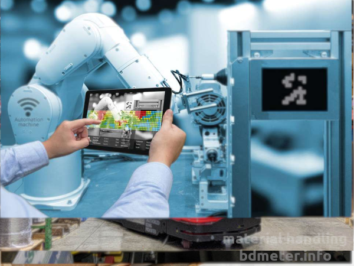
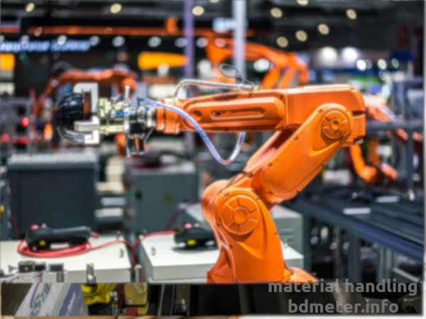

## MATERIALS HANDLING AT THE WORKPLACE

Feeding parts and components into a machine for their processing and taking them out is an important activity in any discrete mass manufacturing process. This is known as materials handling at the workplace.

Operating robots in electronics lab

Robotic handling in Cable industry

Robot in complex operation in electroniocs industry

Robot to handle carton in industry

Robots ready as an Engineer

Robot in operation

Robotic Hand to handle carton on pallet

Using Robots in material handling to be our future

  
Materials handling at the workplace may be defined as the handling of materials after it has been delivered for use at the workplace and before it is again picked up by some conventional handling process and equipment, to be removed to the next operation. Materials handling at the workplace has long been neglected, possibly because they appeared to be a minor part of the overall system and do not always involve large or expensive materials handling equipment. However, studies have proved beyond any doubt that in most manufacturing operations, the handling of individual jobs takes more time than that for processing the jobs.  
The various activities at the workplace may be grouped under the following different phases:

(a) Preparatory: Handling of materials adjacent to the workplace consists of  
(i) bringing materials closer to or onto the workplace or machine.  
(ii) unwrapping, unpacking, untangling, cleaning materials.  
(iii) sorting or separating materials, re-arranging, restocking, etc.  
(b) Feeding: Placing or directing materials closer to workplace or point-of-use.  
(c) Positioning: Orienting materials in the exact location, placing them into the fixture, jig, or machine.  
(d) Manipulating: Handling of materials during the actual manufacturing operation.  
(e) Removing: Taking material out of workplace consisting of—  
(i) taking out of the jig, fixture, etc.  
(ii) keeping it in a position for moving to the next workplace.  
(f) Transporting: Moving materials out of the workplace to the next workplace.

This is generally traditional/conventional materials handling. The materials handling at the workplace is not only monotonous, fatiguing but involves the personal safety of the operators. Moreover, time that can be saved from this handling time directly increases the productivity of the manufacturing process. It is in this context industrial robots have been increasingly used in materials handling at the workplace.

### ROBOTS AND THEIR CLASSIFICATION

Robotic Institute of America (RIA) has defined a robot as:  
‘‘A robot is a reprogrammable, multifunctional manipulator designed to move material, parts, tools, or specialized devices through variable programmed motions for the performance of a variety of tasks’’.

Out of the many possible industrial tasks like  
(i) spot welding,  
(ii) arc welding,  
(iii) materials handling,  
(iv) spray painting,  
(v) assembly of parts, and  
(vi) other tasks, materials handling is one of the major jobs in which industrial robots are being used.

There is no scope here to go into much detail about robots. This chapter will briefly discuss some of the features which make robots smart material handling equipment, and some of their specific applications.

#### Major Components of a Robot

Four common components of a robot are:

(a) **The manipulator:** The manipulator is the body of a robot, made of a collection of mechanical linkages connected at joints to form an open-loop kinematic chain. The manipulator is capable of movement in various directions and does the work of the robot. It can conveniently be compared with the arm of a human. At the joint, the individual link can either rotate (revolute joints) or make a translatory motion (prismatic joint) by means of electric motors (servo or stepper) and hydraulic or pneumatic cylinders. Through a combination of motions of the joint, the manipulator can achieve different desired positioning and orientation. A manipulator can have many joints up to 8, and a robot manipulator with six joints (six degrees of freedom) is considered quite versatile for most robot tasks. A manipulator generally has three structural elements: the arm, the wrist, and the hand (end effector). The end effector is individually designed to grip individual tools or jobs and simulates the palm of a human arm.

The Manipulator - Orange Body

(b) **Sensory devices:** These elements inform the robot controller about the status of the manipulator. These sensors may be (i) nonvisual or (ii) visual.

Nonvisual sensors provide information about the position, velocity, force, etc. connected with manipulator motion. The visual sensors are used for tracking an object, its recognition, and grasping. These are comparable to senses like kinesis, touch, vision, etc.

Using robotic sense to operate materials inside the workplace

**(c) The controller:** Robot controllers generally perform three functions which are:  
(i) Initiation and termination of motion of different joints at the desired sequence and specific points.  
(ii) Storage of positional and sequence data in memory.  
(iii) Interfacing the robot with the outside world through the sensors.  
Generally, a microcomputer or minicomputer acts as the robot controller and acts as the brain of the robot.

The controller of robotic material handling

**(d) The power conversion unit:** This component provides the necessary power for the movement of the manipulator for doing work. It can be an electrical power source with amplifiers to feed servo motors or compressor or hydraulic power pack. With proper programming of the robot controller, the manipulator can be made to undergo the desired sequence of motions of linkages of the manipulator, repeatedly and accurately, and thus make the robot perform its desired task. Another advantage of a robot is that by changing the program, the manipulator can instantly change from one set of tasks to another, thus making it flexible and versatile equipment.

### Classification of Robotic Manipulators

Manipulators are generally classified in two ways, one based on mechanical configuration and the other based on the method of controlling individual joints.

_Classification by configuration (coordinate system)_

(a) **Cylindrical-coordinate robots:** When a horizontal arm (boom) is mounted on a vertical column which is mounted on a rotating base. The projected length of the arm is adjustable. The workspace of the arm tip is a hollow cylindrical space.

**(b) Spherical coordinate robots:** A manipulator resembling a tank turret, is called a spherical coordinate device. The workspace is a frustum of a hollow sphere.

Robots with their workspaces, (a) cylindrical, (b) spherical

(c) **Cartesian coordinate robots:** This is a robot that can have independent translatory motion in three cartesian coordinates. The wrist and end- 
the effector may have additional rotational motions. This robot may be a cantilevered type or a gantry style. Fig. shows a cantilevered one.

(c) Cantilevered cartesian coordinate robot

(d) **Jointed arm (also called articulated) robots:** There are three distinct types of jointed arm robots: (i) pure spherical, (ii) parallelogram jointed, and (iii) jointed cylindrical.  
**(i) Pure spherical:** This is the most common of the jointed configuration. All the links are pivoted and hence can move in a rotary manner. It consists of a joint arm consisting of the upper portion and lower portion (forearm). The forearm is connected to a base. The base can also rotate. The major advantage of this design is that it is possible to reach close to the base of the robot over any obstacle within its workspace. The workspace (or work envelope) is approximately spherical. Puma (made by Unimation, Inc.), Cincinnati Milacron T3, Fanuc Japan are having this configuration.

Pure spherical robot

**(ii) Parallelogram jointed:** Here the single rigid upper arm is replaced by a multiple closed linkage parallelogram arrangement, actuated by a hydraulic cylinder. This robot can carry a larger load than a pure spherical one but has a limited workspace. Robots of this type are made by ASEA, Hitachi, Cincinnati Milacron, Toshiba etc.

Parallelogram jointed robot and its workspace (dimensions in mm, not to scale)

**(iii) Jointed cylindrical:** In this configuration, the single-arm of a cylindrical coordinate robot is replaced by an articulated open kinematic chain. These robots are precise and fast working but have a limited vertical reach. These configuration robots are made by Hirata, Reis, GCA, and United States Robots.

## ROBOTIC HANDLING APPLICATIONS

Materials handling by robots are of two categories:  
(i) Material transfer.  
(ii) Machine loading and unloading.

Both these two categories are applicable to the different phases of workplace handling like feeding, positioning, manipulating, and removing.

**Material transfer:** The task of moving apart from one location to another within the workplace is one of the common applications for robots (pick-and-place operations). A slightly more complex operation of the same category is palletization or depalletization. Robot deposits to or take from a new position and height of the pallet in each subsequent operation. After the pallet/box is filled up or emptied, the same may be moved by the same or by a larger robot.

**Machine loading and/or unloading:** Robot centered machine cell is the most common example of this category of application. The work cell consists of one or more production machines, the robot, and some material handling system for delivering parts into or out of the work cell. A mobile robot may also be employed for this operation, though less common.

Some of the processes in which robotic loading/unloading is often used are:  
• Die-casting—unloading of parts and dipping them in a water bath for cooling.  
• Plastic molding—unloading of injection molded parts.  
• Machining—loading raw blank and unloading finished product. The end effector should be designed to handle the sizes and shapes of both raw material and finished product.  
• Forging—loading raw stock to the furnace, unload hot material from furnace and transfer to forging press and hold and manipulate during forging.  
• Pressworking—loading individual blanks into the press. However, when the coiled strip is fed, no robot is needed in the continuous pressing operation.  
• Heat treatment—loading and unloading of parts from a furnace.

Robot feeding component to CNC machine

Robots in action, (a) stacking, (b) transferring glass sheet

Depending on handling and processing time, one robot may be used for handling materials to and from more than one machine.

_REFERENCES AND BIBLIOGRAPHY_

1. _Apple_
2. _[bdmeter.info](https://bdmeter.info/learn-about-basic-electrical-components/)_
