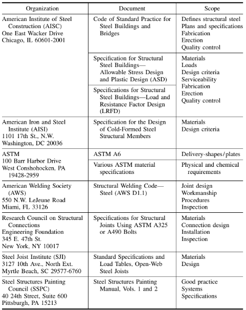

## STRUCTURAL STEEL CONSTRUCTION

Structural steel is the economical construction material for building applications. It offers high ratios of strength to weight and strength to volume. Thus, structural steel has the advantage of permitting long clear spans for horizontal members and requiring less floor space for columns than other common construction materials. It also can be used in combination with reinforced concrete to provide cost-effective building components. For large industrial buildings, where the structural frame can be exposed, it is often the material of choice.

### The design of a structural building frame involves the following principal steps:

1. Select the general configuration and type of structure.
2. Determine the service loads as required by the applicable building code
3. Compute the internal forces and moments for the individual members.
4. The proportion of the members and connections.
5. Check performance characteristics, such as deflection, under service conditions.
6. Make a general overall review of the economy of function.
7. Prepare complete design drawings delineating all structural steel requirements.

Designers, in addition to performing these steps, should also have an appreciation of the complete construction cycle to assure a practical and economical design. This includes understanding the needs of other disciplines and trades, types and availability of the materials used in steel of construction, applicable codes and specifications, the role and responsibilities of the fabricator and the erector, and a designer’s own responsibilities in the area of quality assurance.

The other principal parties involved in structural steel construction are fabricators and erectors. Erectors frequently act as a subcontractor to the fabricator. Fabrication operations convert the mill materials into shipping pieces ready for erection at the jobsite. These operations are generally performed in a shop. The pieces are sized and shaped to the dimensions shown on detailed shop drawings that are prepared by the fabricator and approved by the structural designer.

Shop attachment of detail pieces (stiffeners, connection materials, etc.) to the individual shipping pieces is most frequently done by welding. Generally, the fabricator is responsible for moving the fabricated material to the jobsite.

The fabricator determines the size of shipping pieces, with the concurrence of the designer, at the time the shop drawings are prepared. Erectors receive the material and the position and connect the steel into its final location at the project site. Erectors may have specific equipment on unique projects with which they are able to perform cost-effective operations. Such equipment may require attachment points or stiffening of the frame elements, in which case approval of the designer is requested.

Structural steel consists of hot-rolled steel shapes, steel plates of thickness of 1⁄8 in or greater, and such fittings as bolts, welds, bracing rods, and turnbuckles. The owner and the engineer should understand fully what will be furnished by the fabricator under a contract to furnish ‘‘structural steel.’’ To promote uniformity in bidding practices, the American Institute of Steel Construction (AISC) has adopted a ‘‘Code of Standard Practice for Buildings and Bridges’’ (American Institute of Steel Construction, One East Wacker Drive, Suite 3100, Chicago, IL 60601-2001).

### **CODES AND SPECIFICATIONS**

Codes, specifications, and standards provide steel designers with sound design procedures and guidelines. These documents cover selection of service and design loads, criteria for proportioning members and their connections, procedures for fabrication and erection, requirements for inspections, and standards for protection against corrosion and fire. Use of these documents generally ensures safety, economical designs, and sound operational techniques.

The applicable building code defines the minimum legal requirements for a design. Most building authorities incorporate in their building code one of the model building codes, but some write their code requirements. Usually, the basis for the requirements for steel design and construction in building codes are the American Institute of Steel Construction specifications for structural steel buildings. Note that two AISC specifications are available, one applicable to allowable stress design and plastic design (ASD) and the second to load and resistance factor design (LRFD).

also lists other codes and specifications most frequently used by steel designers. Requirements for special-function buildings, needs of governmental agencies, and other unique requirements has led to promulgation of many other codes and specifications. Some of the organizations that publish these standards are the General Services Administration, U.S. Department of Commerce, Corps of Engineers, and U.S. Navy Bureau of Yards and Docks.

### Basic Steel Construction Codes and Specifications:

Steel Construction Codes and Specifications
