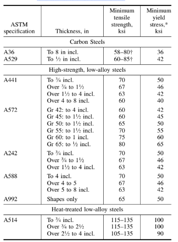

Structural steel grades are referred to by their corresponding ASTM designation. For example, the most commonly used grade of structural steel is A36, which is produced to meet the requirements of the ASTM A36 specification. This grade offers a good mix of strength, weldability, and cost. In many designs, this specification alone will satisfy designers’ needs. Other specifications, such as A53 for pipe, provide an equivalent grade of steel for that type of product. However, as loads on the structural elements become larger, other grades of steel may become more economical because of dimensional limitations or simpler fabrication. These grades provide greater strength levels at somewhat higher costs per unit weight.

AISC recommends certain grades of steel, all of which have desirable characteristics, such as weldability and cost-effectiveness, for use where higher strength levels are required. The specifications covering these grades are listed in Table.

Yield stress or yield strength, whichever shows in the stress-strain curve.  
† Minimum tensile strength may not exceed the higher value.

Several plates of steel have more than one level of tensile strength and yield stress, the levels being dependent on the thickness of the material. The listed thicknesses are precise for plates and nearly correct for shapes. To obtain the precise value for shapes, refer to an AISC ‘‘Manual of Steel Construction’’ (ASD or LRFD) or to mill catalogs.

## Weathering Steels:

The A242 and A588 grades of steel offer enhanced corrosion resistance relative to A36 material. These steels, called weathering steels, form a thin oxidation film on the surfaces that inhibits further corrosion in ordinary atmospheric conditions. However, special treatment of construction details is required. Because of such constraints, and because these grades are more expensive, utilization of weathering steels in building construction is limited. These grades are more commonly used in bridge construction.

### Steel Grade Identification:

Because of the several grades of steel in use, ASTM specifications require that each piece of hot-rolled steel be properly identified with vital information, including the heat number. The AISC specifications for structural steel buildings require fabricators to be prepared to demonstrate, by written procedure and by actual practice, the visible identification of all main stress-carrying elements at least through shop assembly. Steel identification includes ASTM designation, heat number (if required), and mill test reports when specifically ordered.

### Availability:

Because structural steel is produced in a batch process, the less commonly used shapes and the higher-strength grades are produced less frequently than commonly used A36 shapes. Furthermore, steel service centers stock the smaller A36 shapes. As a result, the availability of steel can affect construction schedules. Consequently, steel designers should be aware of the impact of specifying less commonly used materials and shapes if the project has a tight schedule. Fabricator representatives can provide needed information.
