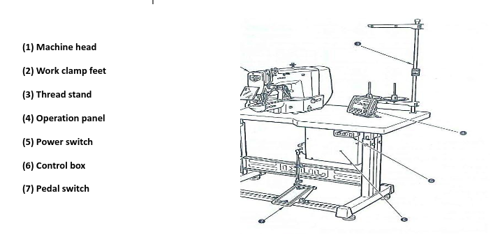

This article is about learning how to prepare a textile/garment sewing process maintenance checklist and the way to accomplish this procedure as periodic maintenance.

## SEWING MAINTENANCE CHECKLIST

Many Retail, Brand-name Marketing, Mail Order, and Sourcing Companies are visiting existing and potential Contractor sewing facilities and evaluating their sewing capabilities for producing quality products for their customers. In many cases, they even rate the vendor and give the plant a grade based on their observations during their visit. Generally, one area that is evaluated is the sewing floor and the condition of the sewing equipment. Before we look at the Checklist the following pages, let us look at the many factors affected by poor sewability and they include:

- Seam Quality
- Seam Appearance
- Seam Durability
- Sewing Operator Productivity & Earnings
- Sewing Operator Morale
- Manufacturing Through-put time
- Products produced may require greater inspection
- Higher costs and lower profits
- Consumer dissatisfaction
- Loss of Brand-name credibility

The following checklist was developed to help you evaluate sewing processes in order to optimize sewing and seam performance.

### SEWING MACHINE MAINTENANCE CHECKLIST

#### PREVENTATIVE MAINTENANCE

- **Check to see if the machines are being kept clean**
    - Machines should be blown off every day to remove lint and trash     
    - On lockstitch machines, the hook should be blown off regularly during the day to prevent lint or dirt from building up in the oil ports in the race of the hook

- **Check to see that the machines are being lubricated regularly**
    - Oil levels should be checked daily and additional oil added if necessary    
    - Randomly check the oil levels in the machines    
    - A high-quality white machine oil should be used that will not stain    
    - Check the availability of proper machine oil in the factory    
    - Check to make sure the oil is not contaminated    
    - Check to see that oil reservoir pump filters are cleaned regularly

- **If compressed air is used, make sure the air system is regulated properly and has humidity dryers, filters, and lubricators in the airlines.**

- **Check for rusted areas due to excessive moisture in the production area**

- **Check Machines for wear on critical moving parts**
    - Check for shake in needle bar due to worn needle bar bushings    
    - Check for excessive movement in stitch-forming devices, etc.

- **Check the condition of critical screws**
    - Check for missing screws    
    - Check for defective screws that are difficult to tighten properly

- **Check the condition of mechanics tools to see that they are being maintained properly.**

\* With a buttonhole or other specialized equipment, cleaning of the machine should not be done  
with compressed air but with a soft bristle brush.

Every sewing machine has three basic systems used to form and set the stitch. These three systems include 
1. a Stitch forming system; 
2. a Thread handling System; and 
3. a Feed System. We will look at each of these systems independently.

#### STITCH FORMING SYSTEM

- **The sewing machine needle should be inspected regularly during the day and replaced if there are signs of wear or damage**
    - The correct type & size of needle should be used    
    - Wovens - sharp-pointed needles
        - On lightweight fabrics where structural jamming can cause seam puckering, the finest needle size should be used with a long-point
    
    - Knits - ball-pointed needles of the finest size should be used

- **The correct needle size - thread size relationship should be maintained**

- **Lockstitch machines**
    - Check the hook for sharp surfaces and burrs on the hook point    
    - Check for other sharp surfaces on other thread contact surfaces    
    - Check for excessive wear in the raceway which will allow excessive movement in the basket

- **Chainstitch & Overedge machines**
    - Check the looper points for sharp surfaces or burrs    
    - Observe excessive wear of looper    
    - Check to make sure loopers are shaped properly according to the original factory condition

Observe the method of removal of entangled thread on loopers. Sharp objects that can nick or burr the loopers should NOT be used.

#### THREAD HANDLING SYSTEM

- **Check to make sure the thread is being stored properly**
    - Cones should be stored properly to ensure that they are not contaminated with dirt, excessive lint, etc.
    - Check to make sure wind on part cones does not affect the take-off of the cone

- **Check to make sure the correct thread type and sizes are being used**
    - If the thread vendor is specified, check the order book and inventory to make sure the proper thread is being used    
    - Thread stands are in proper condition and the top eyelets are oriented properly    
    - Optimum distance between the top of the cone & top eyelet (should be no more than one cone higher than the cone size being used)    
    - Thread stand eyelets are smooth and not grooved or damaged    
    - The cone is held in a vertical stationary position

- **Machine eyelets and guides are smooth and not grooved, rusted, or damaged**

- **Machine thread tensions are as light as possible but still give balanced stitches**
    - Observe how much of the tension post is exposed beyond the tension nut
        - Generally the more of the tension post that is visible, the more tension is being applied to the sewing thread    
    - Observe the condition of the tension discs, take-up springs, etc.

- **Check the bottom tension to make sure it is as loose as possible and still gives a balanced stitch**

- **Lockstitch machines**
    - Bobbin winder in good condition & making correct wind on bobbins    
    - Condition of bobbins & bobbin tension
        - Look for nicks on edge of bobbins indicating incorrect needle height        
        - Look for damaged or bent bobbins    
    - Check bobbin tension (minimum tension recommended)
        - Bobbin tension of bobbin case        
        - Bobbin tension with bobbin case laying on a flat surface        
        - Bobbin tension after bobbin thread has been pulled up through the hole in the needle plate

- **Needle thread**
    - Machines are properly threaded    
    - Needle thread tension is as light as possible but still gives a balanced stitch    
    - Take-up spring is properly positioned and working properly

- **Proper thread size/needle size relationship is being maintained**

- **Proper needle thread size/bobbin thread size is being used**

#### FEED SYSTEM

- **Needle Plates are in good condition**
    - Make sure the needle hole size /needle size relationship is correct
        - Generally, the needle hole size should be twice the diameter of the needle being used        
        - Check to make sure the needle hole in the needle plate is not damaged        
        - Look for needle damage and sharp edges        
        - Check to see if the needle plate is flat and not bent down at the needle hole

- **Chainstitch needle plates**
    - Observe to see that the length of the needle hole slot is greater than the stitch length    
    - Observe to see that the underside of the needle hole is shaped correctly to aid in forming a proper triangle

- **Feed Dogs are in good condition and correct for the application**
    - Check to make sure the feed is not broken or damaged    
    - Observe the teeth per inch on the feed dog
        - Generally, the following should be found: lightweight sewing - 20 - 24 teeth per inch; medium weight sewing - 14 - 18 TPI; heavyweight sewing - 10 - 12 TPI

- **Overedge Needle Plates**
    - Check for needle damage or burrs on the needle hole and stitch the tongue    
    - Make sure the trimming knives are adjusted to the width of the needle plate stitch tongue

- **Presser Foot**
    - The correct foot is being used for the application    
    - Make sure the needle hole size/needle size relation is correct & the needle has sufficient clearance    
    - Check to make sure the needle hole is not damaged    
    - Check for proper pressure both in the front and in the back of the needle    
    - With the foot flat on the needle plate, you should not be able to insert a thin piece of paper between the foot and the needle plate from the front or back side of the needle    
    - Check presser foot for excessive wear causing side-to-side play

- **The pressure on the Presser Foot should be as light as possible and give a uniform stitch length**

- **Check to make sure the correct stitch length is being used**

#### OTHER SYSTEMS

- **Material Trimming Systems**
    - Check to see that the cutting knives are sharp and are trimming properly. This can be checked by placing a single end of the thread between the knives and observing if the thread is cut by the knives

- **Thread Trimming System**
    - Check to see that the chain cutters are cutting the chain to the proper length that minimizes trim & inspect

- **Folders & Guides**

- **Observe to see that the correct capacity folder is being used for the fabric being sewn**
    - Check for additional folds caused by excessive folder capacity    
    - Check for excessive stretching of the fabric causing additional seam puckering

#### STITCH & SEAM QUALITY

- **Lockstitch seams**
    - Check to see that the stitch looks the same on both the top and bottom of the seam    
    - If back tacking is required, make sure the correct number of stitches are used in the back tack

- **Make sure the proper SPI is being used**

- **Make sure the correct seam allowance (margin) is being maintained**

- **Chainstitch seams**
    - Make sure the stitch is balanced properly    
    - Check for excessive seam grinning    
    - Looper thread should rollover

- **Overedge seams**
    - On overedge seams, check for proper stitch balance    
    - Check for excessive seam grinning    
    - Check for proper seam extensibility or stitch elongation    
    - Check to make sure that the purl is on the edge of the seam    
    - Check to make sure the knives are trimming the fabric cleanly    
    - Check to make sure the correct seam allowance (margin) is being maintained    
    - Observe operator handling for excessive trim    
    - If latch-tacking, make sure the chain is sewn into the seam properly

- **Skipped Stitches**
    - Check areas where frequent skips have been observed    
    - Observe where one seam crosses another seam    
    - Check if a skip occurs on thickness or after thickness

##### Download sewing machine catalogs:

**Download catalog of Juki MF-7500 Series**

[Download here](https://drive.google.com/file/d/0B3kRjoDG8NPuVlgzTVU5ZVkybkE/view?usp=sharing&resourcekey=0-oCtCkC1wmQ_fgiohUXG7vg)

**Download catalog of Juki DDL 5550N 1-needle, Lockstitch Machine Series**

[Download here](https://drive.google.com/file/d/0B3kRjoDG8NPuMWtiVEJadjdCRW8/view?usp=sharing&resourcekey=0-PkjnvRteEg3O4nk3AkWeVQ)

**Download catalog of Juki DDL-9000A Series**

[Download here](https://drive.google.com/file/d/0B3kRjoDG8NPuRVN0OF9WVU5sODQ/view?usp=sharing&resourcekey=0-pGjfiYRVtPIURfmddin20w)

**Download Engineers manual of Direct-drive, High-speed, 1-needle, Lockstitch Machine with Automatic Thread Trimmer DDL-9000A**

[Download here](https://drive.google.com/file/d/0B3kRjoDG8NPuNzY0VGszRFU1YTg/view?usp=sharing&resourcekey=0-vrbdJS3er8NQxEYIUK6xZQ)

**Download instruction manual of Computer-controlled, High-speed, Lockstitch Buttonholing Machine LBH-1790**

[Download here](https://drive.google.com/file/d/0B3kRjoDG8NPubVgwQ2wzUzNxbVU/view?usp=sharing&resourcekey=0-g-VnS8bNkJ8FmTILywREPw)

**Download Sewing machine user manual of Brother series**

[Download here](https://drive.google.com/file/d/0B3kRjoDG8NPuZDlSM24zbmRpZ00/view?usp=sharing&resourcekey=0-y0FwKztK5XjVVP25ZVbYWw)
