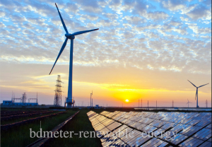

# Effect greenhouse

## What are greenhouse gases (GHG)?

Greenhouse gases (GHGs) trap heat within the earth’s atmosphere, contributing to the ‘greenhouse’ effect and causing global warming. These gases include carbon dioxide, methane, nitrous oxide, and water vapor. Industry, including manufacturing, is the second largest global emitter of human-created GHGs. Much of industrial GHG emissions are due to the burning of fossil fuels for heat and power generation.

## Why should I care about GHGs?

The greenhouse effect causes due to improving your environmental performance and reducing your carbon footprint not only helps restore balance to our climate systems but saves you money, minimizes energy supply disruptions on your business, and reduces your dependence on fossil fuels.

Greenhouse gases caused by industry emissions

More and more countries are developing GHG emission reduction mechanisms such as cap and trade systems, carbon taxes, etc. Preparing for such legislation can therefore help your business minimize potential cost impacts from regulatory requirements. Greenhouse effect is huge on mankind and the future.

## Where do I start?

The first step in reducing your GHG emissions is knowing how much GHGs you emit. To do this, you need to measure your company’s carbon footprint.

A carbon footprint identifies the major sources of GHG emissions in your facilities and helps you identify key areas for improvement. The more efficient you are with your resources, the more money you will save.

## What is a Carbon Footprint?

A carbon footprint is a measurement of the total GHGs emitted into the atmosphere by your company. The common unit for measuring carbon is metric tons of carbon dioxide equivalents (CO2eq), and the process below explains how to translate your facilities’ emissions into CO2eq.

## How do I calculate my carbon footprint?

You can either use internal resources or seek guidance from consultancies or non-profit organizations.

The Greenhouse Gas Protocol (GHGP) Initiative has clear instructions and tools to walk you through the  
carbon footprinting process: [http://www.ghgprotocol.org/calculation-tools](http://www.ghgprotocol.org/calculation-tools).

We have included the basic information here, but you may find it useful to refer to the website for more details:  
  
Step 1: Dene the scope of activities that you will measure  
For instance, you will need to decide whether you will include GHG-emitting activities that occur in leased facilities or that come from transportation.  
The most widely used method of separating your direct and indirect carbon emissions is through the  
GHGP definition of scopes.  
**Scope 1:** All direct GHG emissions, such as those emitted from on-site power generation.  
**Scope 2:** Indirect GHG emissions from your consumption of purchased electricity, heat or steam.  
**Scope 3:** Other indirect emissions, such as the extraction and production of purchased materials and fuels, transport-related activities in vehicles not owned or controlled by you, electricity-related activities not covered in Scope 2, outsourced activities, waste disposal, etc.

Step 2: Measure the various activities that produce GHG emissions  
For example, in a cut & sew factory, the most common activities that generate GHGs are the use of  
electricity and fuel. To calculate the GHG emissions from these two activities, you will need to measure  
kWh of electricity used and kg/liters of fuel used.  
  
Step 3: Convert those activities into metric tons of carbon dioxide equivalents (CO2eq).  
To convert the numbers properly, you need to find the correct “emissions factor”. The emission factor  
uses the latest research to estimate the impacts of the particles that enter the environment based on the  
type of activity and location.

The GHGP provides commonly accepted emission factors, as well as spreadsheets to calculate the results.

## What’s next?

Once you have calculated your carbon footprint, you will be able to quickly identify particular hot spots of carbon emissions, which you can lower by improving your efficiency or process.  
You will find that some of your major carbon emissions come from your use of energy. One way you can reduce your GHGs from energy is by increasing your energy efficiency. Another way to reduce GHG emissions from energy usage is by using renewable energy.

Renewable energy

## What is renewable energy?

Renewable energy is energy which  
**1)** does not directly emit GHGs (e.g. solar and wind energy) or  
**2)** does not produce additional GHG emissions during the life cycle of the fuel source (e.g. biofuels from plants and other organic sources).  
For more information on renewable energy visit the US Environmental Protection Agency website: [https://www.epa.gov/oaintrnt/energy/renewtech.htm](https://www.epa.gov/oaintrnt/energy/renewtech.htm)

## Why do I need renewable energy?

As the cost of energy rises and demand increases, renewable energy is becoming an attractive option. It can be cost-effective and help prevent disruptions from energy shortages.  
How do I get renewable energy?  
There are generally two ways to get renewable energy:  
**(1)** Generating on-site renewable energy by installing solar panels and hot water heaters, wind turbines, small-scale hydroelectric power plants, etc.  
**(2)** Sourcing green power such as electricity generated from renewable sources like wind, geothermal, biomass, and landfill gas. Remember to get the right certification before buying energy from such sources.

## Sites we found useful

- US Environmental Protection Agency’s Guide to Purchasing Green Power. Although written for the US audience, the guide has useful information on renewable energy options and issues:  
    [https://www.epa.gov/greenpower/documents/purchasing\_guide\_for\_web.pdf  
    ](https://www.epa.gov/greenpower/documents/purchasing_guide_for_web.pdf)
- GHG Protocol Initiative: [https://www.ghgprotocol.org/calculation-tools](https://www.ghgprotocol.org/calculation-tools)
- Cleaner Production Partnership Program (CP3): Jointly organized by the HKG Environmental Protection Department, Guangdong Economic and Trade Commission, Hong Kong Productivity Council, and business and industrial sectors. [http://www.cleanerproduction.hk/en\_links\_policy.asp](http://www.cleanerproduction.hk/en_links_policy.asp)
