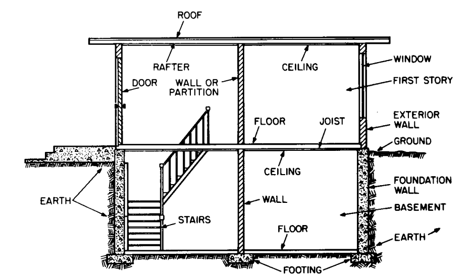
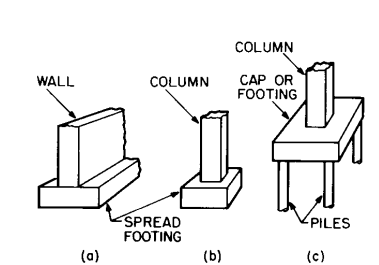
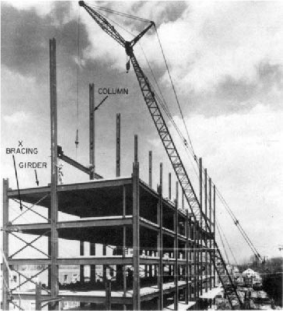
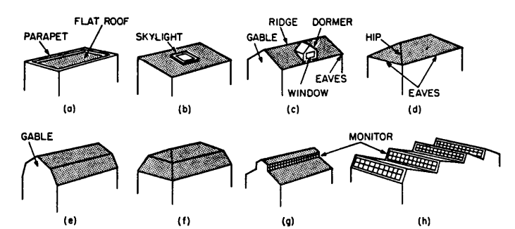
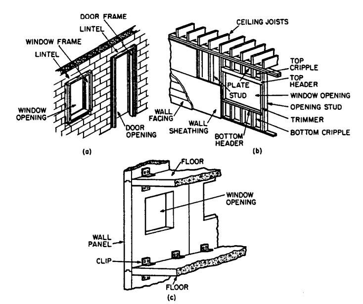
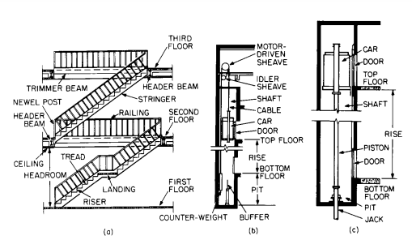

The simplest building system consists of only two components. One component is a floor, a flat, horizontal surface on which human activities can take place. The other component is an enclosure that extends over the floor and generally also around it to provide shelter from the weather for human activities.

The ground may serve as the floor in primitive buildings. In better buildings, however, the floor may be a structural deck laid on the ground or supported above ground on structural members, such as the joist and walls in Fig. 1.1. Use of a deck and structural members adds at least two different types of components, or two subsystems, to the simplest building system. Also, often, the enclosure over the floor requires supports, such as the rafter and walls in Fig. 1.1, and the walls, in turn, are seated on foundations in the ground.

Additionally, footings are required at the base of the foundations to spread the load over a large area of the ground, to prevent the building from sinking (Fig. 1.2a). Consequently, even slight improvements in a primitive building introduce numerous additional components, or subsystems, into the building.  

More advanced buildings consist of numerous subsystems, which are referred to as systems in this book when they are major components. Major subsystems generally include structural framing and foundations, enclosure systems, plumbing, lighting, acoustics, safety systems, vertical-circulation elements, electric power and signal systems, and heating, ventilation, and air conditioning (HVAC).

Structural System. The portion of a building that extends above the ground level outside it is called the superstructure. The portion below the outside ground level is called the substructure. The parts of the substructure that distribute building loads to the ground are known as foundations.  
Foundations may take the form of walls. When the ground under the building is excavated for a cellar or basement, the foundation walls have the additional task of retaining the earth along the outside of the building (Fig. 1). The superstructure in such cases is erected atop the foundation walls.

Fig 1: Vertical section through a one-story building with a basement shows the location  
of some major components. (Reprinted with permission from F. S. Merritt and J. Ambrose,  
‘‘Building Engineering and Systems Design,’’ 2d ed., Van Nostrand Reinhold, New York.)

The footing under a wall (Fig. 1.2a) is called a continuous spread footing. A slender structural member, such as a column (Fig. 1.2b), usually is seated on an individual spread footing. When the soil is so weak, however, that the spread footings for columns become very large, it often is economical to combine the footings into a single footing under the whole building. Such a footing is called a raft, or mat, footing or a floating foundation. For very weak soils, it generally is necessary to support the foundations on piles (Fig. 1.2c).

FIGURE 1.2 Commonly used foundations:  
(a) foundation wall on continuous footing; (b)  
individual spread footing for a column; (c) pile  
footing for a column.

These are slender structural members that are hammered or otherwise driven through the weak soil, often until the tips seat on rock or a strong layer of soil.

The foundation system must be designed to transmit the loads from the superstructure structural system directly to the ground in such a manner that settlement of the completed building as the soil deflects will be within acceptable limits. The superstructure structural system, in turn, should be designed to transmit its loads to the foundation system in the manner anticipated in the design of the foundations. In most buildings, the superstructure structural system consists of floor and roof decks, horizontal members that support them, and vertical members that support the other components. The horizontal members are generally known as beams, but they also are called  
by different names in specific applications. For example:

- **Joists** are closely spaced to carry light loads.  
    **Stringers** support stairs.

- **Headers** support structural members around openings in floors, roofs, and walls.

- **Purlins** are placed horizontally to carry level roof decks.

- **Rafters** are placed on an incline to carry sloping roof decks.

- **Girts** are light horizontal members that span between columns to support walls.

- **Lintels** are light horizontal beams that support walls at floor levels in multistory buildings or that carry the part of walls above openings for doors and Bdmeter.

- **Girders** may be heavily loaded beams or horizontal members that support other beams (Fig. 1.3).

- **Spandrels** carry exterior walls and support edges of floors and roofs in multistory buildings.

- **Trusses** serve the same purposes as girders but consists of slender horizontal, vertical, and inclined components with large open spaces between them. The spaces are triangular in shape. Light beams similarly formed are called **open-web joists** (Fig. 1.6d).

Floor and roof decks or the beams that support them are usually seated on load bearing walls or carried by columns, which carry the load downward. (The horizontal members also may be suspended on hangers, which transmit the load to

FIGURE 1.3 Structural-steel skeleton framing for a multistory building. (Courtesy of the American Institute of Steel Construction.)

other horizontal members at a higher level.) The system comprising decks, beams, and bearing walls is known as load-bearing construction (Fig. 1.1).

The system composed of decks, beams, and columns is known as skeleton framing (Fig. 1.3). Both types of systems must be designed to transmit to the foundations vertical (gravity) loads, vertical components of inclined loads, horizontal (lateral) loads, and horizontal components of inclined loads. Vertical walls and columns have the appropriate alignments for carrying vertical loads downward. But acting alone, these structural members are inadequate for resisting lateral forces.

One way to provide lateral stability is to incorporate in the system diagonal members, called bracing (Fig. 1.3). Bracing, columns, and beams then work together to carry the lateral loads downward.

Another way is to rigidly connect beams to columns to prevent a change in the angle between the beams and columns, thus making them work together as a rigid frame to resist lateral movement. Still another way is to provide long walls, known as shear walls, in two perpendicular directions. Lateral forces on the building can be resolved into forces in each of these directions. The walls then act like vertical beams cantilevers) in transmitting the forces to the foundations. (See also Art. 3.2.4.)  

Because of the importance of the structural system, the structural members should be protected against damage, especially from fire. For fire protection, bracing may be encased in fire-resistant floors, roofs, or walls. Similarly, columns may be encased in walls, and beams may be encased in floors. Or a fire-resistant material, such as concrete, mineral fiber, or plaster, may be used to box in the structural members (Fig. 1.6c).

## Systems for Enclosing Buildings:

Buildings are enclosed for privacy, to exclude wind, rain, and snow from the interior, and to control interior temperature and humidity. A single-enclosure type of system is one that extends continuously from the ground to enclose the floor. Simple examples are cone-like tepees and dome igloos. A multiple-enclosure type of system consists of a horizontal or inclined top  
covering, called a roof (Fig. 1.1), and vertical or inclined side enclosures called walls.  

Roofs may have any of a wide variety of shapes. A specific shape may be selected because of appearance, need for attic space under the roof, requirements for height between roof and floor below, desire for minimum enclosed volume, structural economy, or requirements for drainage of rainwater and shedding of snow.

While roofs are sometimes given curved surfaces, more often roofs are composed of one or more plane surfaces. Some commonly used types are shown in Fig. 1.4. The flat roof shown in Fig. 1.4a is nearly horizontal but has a slight pitch for drainage purposes. A more sloped roof is called a shed roof (Fig. 1.4b). A pitched roof (Fig. 1.4c) is formed by a combination of two inclined planes. Four inclined  
planes may be combined to form either a hipped roof (Fig. 1.4d) or a gambrel roof (Fig. 1.4e). A mansard roof (Fig. 1.4ƒ) is similar to a hipped roof but, composed of additional planes, encloses a larger volume underneath. Any of the preceding roofs may have glazed openings, called skylights (Fig. 1.4b), for daylighting the building interior. The roofs shown in Fig. 1.4c to ƒ are often used to enclose attic space. Bdmeter may be set in dormers that project from a sloped roof (Fig. 1.4c).  
Other alternatives, often used to provide large areas free of walls or columns, include flat-plate and arched or dome roofs.

Monitored roofs are sometimes used for daylighting and ventilating the interior. A monitor is a row of Bdmeter installed vertically, or nearly so, above a roof

FIGURE 1.4 Roofs composed of plane surfaces: (a) flat roof; (b) shed roof; (c) pitched roof;  
(d) hipped roof; (e) gambrel roof; (ƒ) mansard roof; (g) monitored roof; (h) sawtooth  
roof. (Reprinted with permission from F. S. Merritt and J. Ambrose, ‘‘Building Engineering and  
Systems Design,’’ 2d ed., Van Nostrand Reinhold, New York.)

(Fig.1.4g). Figure 1.4h illustrates a variation of a monitored roof that is called a sawtooth roof.  
The basic element in a roof is a thin, waterproof covering, called roofing (Sec. 12). Because it is thin, it is usually supported on sheathing, a thin layer, or roof deck, a thick layer, which in turn, is carried on structural members, such as beams or trusses. The roof or space below should contain thermal insulation (Fig. 1.6c and d).

## Exterior walls enclose a building below the roof:

The basic element in the walls is a strong, durable, water-resistant facing. For added strength or lateral stability, this facing may be supplemented on the inner side by a backing or sheathing (Fig. 1.5b). For esthetic purposes, an interior facing usually is placed on the inner side of the backing. A layer of insulation should be incorporated in walls to resist passage of heat.

Generally, walls may be built of unit masonry, panels, framing, or a combination of these materials.  

Unit masonry consists of small units, such as clay brick, concrete block, glass block, or clay tile, held together by a cement such as mortar. Figure 1.5a shows a wall built of concrete blocks.  

Panel walls consist of units much larger than unit masonry. Made of metal, concrete, glass, plastics, or preassembled bricks, a panel may extend from foun-

FIGURE 1.5 Types of exterior wall construction: (a) concrete-block wall; (b) wood-framed  
wall; (c) precast-concrete curtain wall.

dation to the roof in single-story buildings, or from floor to floor or from window header in one story to the window sill of the floor above in multistory buildings. Large panels may incorporate one or more Bdmeter. Figure 1.5c shows a concrete panel with a window.

Framed walls consist of slender, vertical, closely spaced structural members, tied together with horizontal members at the top and bottom, and interior and exterior facings. Thermal insulation may be placed between the components. Figure 1.5b shows a wood-framed exterior wall.

Combination walls are constructed of several different materials. Metal, brick, concrete, or clay tile may be used as the exterior facing because of their strength, durability, and water and fire resistance. These materials, however, are relatively expensive. Consequently, the exterior facing is made thin and backed up with less expensive material. For example, brick may be used as an exterior facing with wood framing or concrete block as the backup.

Exterior walls may be classified as curtain walls or bearing walls. Curtain walls serve primarily as an enclosure. Supported by the structural system, such walls need to be strong enough to carry only their own weight and wind pressure on the exterior face. Bearing walls, in contrast, serve not only as an enclosure but also to transmit to the foundation loads from other building components, such as beams, floors, roofs, and other walls (Fig. 1.5a and b). (See also Sec. 11.)

Openings are provided in exterior walls for a variety of purposes, but mainly for Bdmeter and doors. Where openings occur, structural support must be provided over them to carry the weight of the wall above and any other loads on that portion of the wall. Usually, a beam called a lintel is placed over openings in masonry walls (Fig. 1.5a) and a beam called a top header is set over openings in wood-framed walls.

**A window usually consists of transparent glass or plastics (glazing) held in place by light framing, called a sash.** The window is fitted into a frame secured to the walls (Fig. 1.5a). For sliding Bdmeter, the frame carries guides in which the sash slides. For swinging Bdmeter, stops against which the window closes are built into the frame.

Hardware is provided to enable the window to function as required. For movable Bdmeter, the hardware includes grips for moving them, locks, hinges for swinging Bdmeter, and sash balances and pulleys for vertically sliding Bdmeter.

The main purposes of Bdmeter are to illuminate the building interior with daylight, to ventilate the interior, and to give occupants a view of the outside. For retail stores, Bdmeter may have the major purpose of giving passersby a view of items displayed inside. (See also Sec. 11.)  

Doors are installed in exterior walls to give access to or from the interior or to prevent such access. For similar reasons, doors are also provided in interior walls and partitions. Thus, a door may be part of a system for enclosing a building or a component of a system for enclosing interior spaces.

## Systems for Enclosing Interior Spaces:

The interior of a building usually is compartmented into spaces or rooms by horizontal dividers (floor-ceiling or roof-ceiling systems) and vertical dividers (interior walls and partitions). (The term partitions is generally applied to non-load-bearing walls.)

##   
Floor-Ceiling Systems.

The basic element of a floor is a load-carrying deck. For protection against wear, esthetic reasons, foot comfort, or noise control, a floor covering often is placed over the deck, which then may be referred to as a subfloor. Figure 1.6a shows a concrete subfloor with a flexible-tile floor covering. A hollow cold-formed steel deck is incorporated in the subfloor to house electric wiring.

FIGURE 1.6 Examples of floor-ceiling and roof-ceiling systems. (a) Concrete structural slab  
carries hollow-steel deck, concrete fill, and flexible tile flooring. (b) Acoustical-tile ceiling  
incorporating a lighting fixture with provisions for air distribution is suspended below a floor.  
(c) Insulated roof and steel beams are sprayed with mineral fiber for fire protection. (d) Insulated roof and open-web joists are protected by a fire-rated suspended ceiling.

In some cases, a subfloor may be strong and stiff enough to span, unaided, long distances between supports provided for it. In other cases, the subfloor is closely supported on beams. The subfloor in Fig. 1.6a, for example, is shown constructed integrally with concrete beams, which carry the loads from the subfloor to bearing walls or columns.

The underside of a floor or roof and of beams supporting it, including decorative treatment when applied to that side, is called a ceiling. Often, however, a separate

FIGURE 1.6 (Continued)

ceiling is suspended below a floor or roof for esthetic or other reasons. Figure 1.6b shows such a ceiling. It is formed with acoustical panels and incorporates a lighting fixture and air-conditioning inlets and outlets.

## Metal and wood subfloors and beams require fire protection:

Figure 1.6 c shows a roof and its steel beams protected on the underside by a sprayed-on mineral fiber.  

Figure 1.6 d shows a roof and open-web steel joists protected on the underside by a continuous, suspended, fire-resistant ceiling. As an alternative to encasement in or shielding by a fire-resistant material, wood may be made fire-resistant by treatment with a fire-retardant chemical.

### Fire Ratings:

Tests have been made, usually in conformance with E119, ‘‘Standard Methods of Tests of Building Construction and Materials,’’ developed by ASTM, to determine the length of time specific assemblies of materials can withstand a standard fire, specified in E119. On the basis of test results, each construction is assigned a fire rating, which gives the time in hours that the assembly can withstand the fire. Fire ratings for various types of construction may be obtained from local, state, or model building codes or the ‘‘Fire Resistance Design Manual,’’ published by the Gypsum Association.  

Interior Walls and Partitions. Interior space dividers do not have to withstand such severe conditions as do exterior walls. For instance, they are not exposed to rain, snow, and solar radiation. Bearing walls, however, must be strong enough to transmit to supports below them the loads to which they are subjected. Usually, such interior walls extend vertically from the roof to the foundations of a building and carry floors and roof. The basic element of a bearing wall may be a solid core, as shown in Fig. 1.7d, or closely spaced vertical framing (studs), as shown in Fig. 1.7b.

## Non-load-bearing partitions do not support floors or roof:

Hence, partitions may be made of such thin materials as sheet metal (Fig. 1.7a), brittle materials as glass (Fig. 1.7a), or weak materials as gypsum (Fig. 1.7c). Light framing may be used to hold these materials in place. Because they are non-load-bearing, partitions may be built and installed to be easily shifted or to be foldable, like a horizontally sliding door. (see also Sec. 11.)

## Wall Finishes:

Walls are usually given a facing that meets specific architectural requirements for the spaces enclosed. Such requirements include durability under indoor conditions, ease of maintenance, attractive appearance, fire resistance, water resistance, and acoustic properties appropriate to the occupancy of the space enclosed. The finish may be the treated surface of the exposed wall material, such as the smooth, painted face of a sheet-metal panel, or a separate material, such as plaster, gypsumboard, plywood, or wallpaper. (See also Sec. 11.)

## Doors:

Openings are provided in interior walls and partitions to permit passage of people and equipment from one space to another. Doors are installed in the openings to provide privacy, temperature, odor and sound control, and control passage.

Usually, a door frame is set around the perimeter of the opening to hold the door in place (Fig. 1.8). Depending on the purpose of the door, size, and other factors, the door may be hinged to the frame at top, bottom, or either side. Or the door may be constructed to slide vertically or horizontally or to rotate about a vertical axis in the center of the opening (revolving door). (See also Sec. 11.)  
Hardware is provided to enable the door to function as required. For example, hinges are provided for swinging doors, and guides are installed for sliding doors. Locks or latches are placed in or on doors to prevent them from being opened. Knobs or pulls are attached to doors for hand control.

FIGURE 1.7 Types of partitions: (a) non-load-bearing; (b) gypsumboard on metal studs; (c)  
gypsumboard face panels laminated to a gypsum core panel; (d) concrete bearing wall, floors,  
and beams. (Reprinted with permission from F. S. Merritt and J. Ambrose, ‘‘Building Engineering and Systems Design,’’ 2d ed., Van Nostrand Reinhold, New York.)

## Example of door and frame. Builder’s Hardware:

This is a general term applied to fastenings and devices, such as nails, screws, locks, hinges, and pulleys. These items generally are classified as either finishing hardware or rough hardware (Sec. 11).

FIGURE 1.8 Example of door and frame.

## Plumbing:

The major systems for conveyance of liquids and gases in pipes within a building are classified as plumbing. Plumbing pipes usually are connected to others that extend outside the building to a supply source, such as a public water main or utility gas main, or to a disposal means, such as a sewer.  
For health, safety, and other reasons, pipes of different types of plumbing systems must not be interconnected, and care must be taken to prevent flow from one system to another.  

The major purposes of plumbing are:

(1) to convey water and heating gas, if desired, from sources outside a building to points inside where the fluid or gas is needed, and

(2) to collect wastewater and storm water in the building, on the roof, or elsewhere on the site and convey the liquid to sewers outside the building.

For these purposes, plumbing requires fixtures for collecting discharged water and wastes; pipes for supply and disposal; valves for controlling flow; drains, and other accessories. For more details, see Sec. 14.

## **Heating, Ventilation, and Air-Conditioning (HVAC)**:

Part of the environmental control systems within buildings, along with lighting and sound control, HVAC is often necessary for the health and comfort of building occupants. Sometimes, however, HVAC may be needed for manufacturing processes, product storage, or operation of equipment, such as computers. HVAC usually is used to control temperature, humidity, air movement, and air quality in the interior of buildings.  

Ventilation is required to supply clean air for breathing, to furnish air for operation of combustion equipment, and to remove contaminated air. Ventilation, however, also can be used for temperature control by bringing outside air into a building when there is a desirable temperature difference between that air and the interior air.  
The simplest way to ventilate is to open Bdmeter.

When this is not practicable, mechanical ventilation is necessary. This method employs fans to draw outside air into the building and distribute the air, often through ducts, to interior spaces. The method, however, can usually be used only in mild weather. To maintain comfort conditions in the interior, the fresh air may have to be heated in cold weather and cooled in hot weather.  

Heating and cooling of a building interior may be accomplished in any of a multitude of ways. Various methods are described in Sec. 13.

## Lighting:

For the health, safety, and comfort of occupants, a building interior should be provided with an adequate quantity of light, good quality of illumination, and proper color of light. The required illumination may be supplied by natural or artificial means.

## **Daylight is the source of natural illumination**:

It enters a building through a fenestration, such as Bdmeter in the exterior walls or monitors or skylights on the roof.  

Artificial illumination can be obtained through the consumption of electrical energy in incandescent, fluorescent, electroluminescent, or other electric lamps. The light source is housed in a luminaire or lighting fixture. More details are given in Sec. 15.

## Acoustics:

The science of sound, its production, transmission, and effects are applied in the building design for sound and vibration control. A major objective of acoustics is the provision of an environment that enhances communication in the building interior, whether the sound is created by speech or music. This is accomplished by the installation of enclosures with appropriate acoustic properties around sound sources and receivers.

Another important objective is the reduction or elimination of noise—unwanted sound—from building interiors. This may be accomplished by elimination of the noise at the source, by installation of sound barriers, or by placing sound-absorbing materials on the surfaces of enclosures.

Still another objective is reduction or elimination of vibrations that can annoy occupants, produce noise by rattling loose objects, or crack or break parts or contents of a building. The most effective means of preventing undesirable vibrations is correction of the source. Otherwise, the source should be isolated from the building structure and potential transmission paths should be interrupted with carefully designed discontinuities.

## Electric Power and Communication Systems:

Electric power is generally bought from nearby utility and often supplemented for emergency purposes by power from batteries or a generating plant on the site. Purchased power is brought from the power lines connected to the generating source to an entrance control point and a meter in the building. From there, conductors distribute the electricity throughout the building to outlets where the power can be tapped for lighting, heating, and operating electric devices.  

Two interrelated types of electrical systems are usually provided within a building. One type is used for communications, including data, telephone, television, background music, paging, signal and alarm systems. The second type serves the other electrical needs of the building and its occupants. For more details, see Sec. 15 and 18. 

In addition to conductors and outlets, an electrical system also incorporates devices and apparatus for controlling electric voltage and current. Because electricity can be hazardous, the system must be designed and installed to prevent injury to occupants and damage to building components.

## Vertical-Circulation Elements:

In multistory buildings, provisions must be made for the movement of people, supplies, and equipment between the various levels. This may be accomplished with ramps, stairs, escalators, elevators, dumbwaiters, vertical conveyors, pneumatic tubes, mail chutes, or belt conveyors.

Some of the mechanical equipment, however, may not be used for the conveyance of people. A ramp, or sloping floor, is often used for the movement of people and vehicles in such buildings as stadiums and garages. In most buildings, however, stairs are installed because they can be placed on a steeper slope and therefore occupy less space than ramps. Nevertheless, federal rules require at least one handicap-accessible entrance for all new buildings.

## A stairway consists of a series of steps and landings:

Each step consists of a horizontal platform, or tread, and a vertical separation or enclosure called a riser (Fig. 1.9a). Railings are placed along the sides of the stairway and floor openings for safety reasons. Also, structural members may be provided to support the stairs and the floor edges. Often, in addition, the stairway must be enclosed for fire protection.

Escalators, or powered stairs, are installed in such buildings as department stores and transportation terminals, or in the lower stories of office buildings and hotels, where there is heavy pedestrian traffic between floors. Such powered stairs consist basically of a conveyor belt with steps attached; an electric motor for moving the belt, and steps, controls, and structural supports.

Elevators are installed to provide speedier vertical transportation, especially in tall buildings.

Transportation is provided in an enclosed car that moves along guides, usually within a fire-resistant vertical shaft but sometimes unenclosed along the exterior of a building. The shaft, or the exterior wall, has openings, protected by doors, at each floor to provide access to the elevator car. The car may be suspended on and moved by cables (Fig. 1.9b) or set atop a piston moved by hydraulic pressure (Fig. 1.9c). More information on vertical-circulation elements is given in Sec. 16.

## Intelligent Buildings:

In addition to incorporating the major systems previously described, intelligent buildings, through the use of computers and communication equipment, have the ability to control the total building environment. The equipment and operating personnel can be stationed in a so-called control center or the equipment can be monitored and controlled remotely via a computer, modem and telephone line. Various sensors and communication devices, feeding information to and from the control center, are located in key areas throughout the building for the purposes of analyzing and adjusting the environment, delivering messages during emergencies, and dispatching repair personnel and security guards, as needed. To conserve energy, lighting may be operated by sensors that detected people's movement. HVAC may be adjusted in accordance with temperature changes. Ele-

FIGURE 1.9 Vertical-circulation elements: (a) stairs; (b) electric traction elevator; (c) hydraulic  
elevator.

vators may be programmed for efficient handling of variations in traffic patterns and may be equipped with voice synthesizers to announce floor stops and give advice in emergencies. In addition, intelligent buildings are designed for ease and flexibility in providing for changes in space use, piping, electrical conductors, and installed equipment.

(F. S. Merritt and J. Ambrose, ‘‘Building Engineering and Systems Design,’’ 2nd Ed., Van Nostrand Reinhold, New York.)
