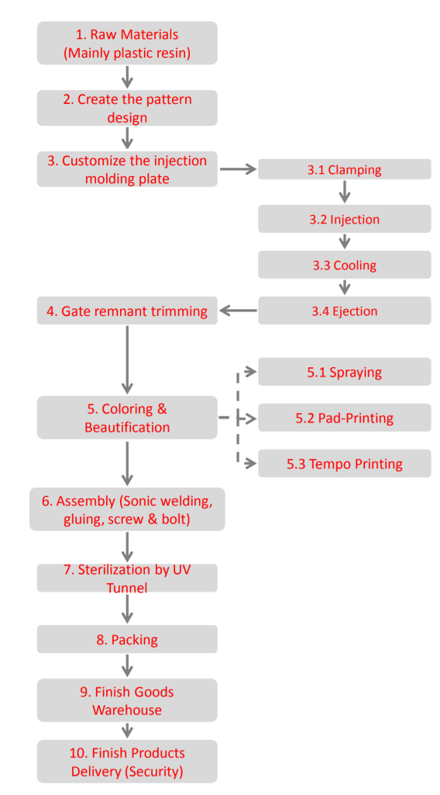

1. Understand the process flow on how to manufacture the product.
2. Identify the hazards from its process step (task).
3. Decide who might be harmed and how.
4. Evaluate the risks and decide on precautions.
5. Record your findings and implement them 6. Review your assessment and update if necessary.

## Plastic Toys Production Process Flow:

Fig: process flow of toys production

### Types of Materials used for Injection Molding

| SL. | **Material name** | **Description** | Applications |
| --- | --- | --- | --- |
| 1 | Acetal | Strong, rigid, excellent fatigue resistance, excellent creep resistance, chemical resistance, moisture resistance, naturally  
opaque white, low/medium cost | Bearings, cams, gears, handles, plumbing components, rollers, rotors, slide guides, valves |
| 2 | Acrylic | Rigid, brittle, scratch resistant, transparent,  
optical clarity, low/medium cost | Display stands, knobs, lenses, light housings, panels, reflectors, signs, shelves, trays |
| 3 | Acrylonitrile Butadiene Styrene | Strong, flexible, low mold shrinkage (tight  
tolerances), chemical resistance, electroplating capability, naturally opaque,  
low/medium cost | Automotive (consoles, panels, trim, vents), boxes, gauges, housings, inhalers, toys |
| 4 | Cellulose Acetate | Tough, transparent, high cost | Handles, eyeglass frames |
| 5 | Polyamide 6 (Nylon) | High strength, fatigue resistance, chemical resistance, low creep, low friction, almost opaque/white, medium/high cost | Bearings, bushings, gears, rollers, wheels |
| 6 | Polyamide 6/6 (Nylon) | High strength, fatigue resistance, chemical resistance, low creep, low friction, almost opaque/white, medium/high cost | Handles, levers, small housings, zip ties |
| 7 | Polyamide 11+12 (Nylon) | High strength, fatigue resistance, chemical resistance, low creep, low friction, almost opaque to clear, very high cost | Air filters, eyeglass frames, safety masks |
| 8 | Polycarbonate | Very tough, temperature resistance, dimensional stability, transparent, high cost | Automotive (panels, lenses, consoles), bottles, containers, housings, light covers, reflectors, safety helmets, and shields |
| 9 | Polyester - Thermoplastic | Rigid, heat resistance, chemical resistance, medium/high cost | Automotive (filters, handles, pumps), bearings, cams, electrical components (connectors, sensors), gears, housings, rollers, switches, valves |
| 10 | Polyether | Tough, very high chemical resistance, clear, very high-cost Sulphone | Valves |
| 11 | Polyetheretherketone | Strong, thermal stability, chemical resistance, abrasion resistance, low moisture absorption | Aircraft components, electrical connectors, pump impellers, seals |
| 12 | Polyetherimide | Heat resistance, flame resistance, transparent (amber color) | Electrical components (connectors, boards, switches), covers, shields, surgical tools |
| 13 | Polyethylene - Low Density | Lightweight, tough and flexible, excellent chemical resistance, natural waxy appearance, low cost | Kitchenware, housings, covers, and containers |
| 14 | Polyethylene - High Density | Tough and stiff, excellent chemical resistance, natural waxy appearance, low cost | Chair seats, housings, covers, and containers |
| 15 | Polyphenylene Oxide | Tough, heat resistance, flame resistance, dimensional stability, low water absorption, electroplating capability, high cost | Automotive (housings, panels), electrical components, housings, plumbing components |
| 16 | Polyphenylene Sulphide | Very high strength, heat resistance, brown, very high cost | Bearings, covers, fuel system components, guides, switches, and shields |
| 17 | Polypropylene | Lightweight, heat resistance, high chemical resistance, scratch resistance, natural waxy appearance, tough and stiff, low cost.  
 | Automotive (bumpers, covers, trim), bottles, caps, crates, handles, housings |
| 18 | Polystyrene - General purpose | Brittle, transparent, low cost | Cosmetics packaging, pens |
| 19 | Polystyrene - High impact | Impact strength, rigidity, toughness, dimensional stability, naturally translucent, low cost  
 | Electronic housings, food containers, toys |
| 20 | Polyvinyl Chloride - Plasticised | Tough, flexible, flame resistant, transparent or opaque, low cost | Electrical insulation, housewares, medical tubing, shoe soles, toys |
| 21 | Polyvinyl Chloride - Rigid | Tough, flexible, flame resistant, transparent or opaque, low cost | Outdoor applications (drains, fittings, gutters) |
| 22 | Styrene Acrylonitrile | Stiff, brittle, chemical resistance, heat resistance, hydrolytically stable, transparent, low cost | Housewares, knobs, syringes |
| 23 | Thermoplastic | Tough, flexible, high-cost Bushings, electrical components | Elastomer/Rubber ts, seals, washers |

Table: different materials types for injection molding

## Plastic Toys production process: Common EHS Hazards

| Process | Common EHS Hazards | Recommendation |
| --- | --- | --- |
| 1\. Raw materials storage  
(mainly plastic resin)  
 | Exposure of hazardous works affecting the occupational health of employees - skin sensitizing exposure of plastic resins (if uncured resins) after prolonged contact from the inventory of raw materials storage (HS001) | Regular medical surveillance for employees who are exposed to hazardous work (i.e., skin / respiratory contact of plastic resins (if uncured resins) from the inventory of raw materials storage) at the factory's expense. (HS001-CM001)  
Hazardous source control by engineering methods - e.g., good ventilation in the raw materials storage area as prolonged skin sensitizing contact of a lot of plastic resins (if uncured resins) during incoming / transferring raw material bags from off-site for further production and administration measures - e.g., job rotation/shift work to reduce the exposure time of the hazardous working environment – uncured resin (in conjunction with many solvents) environment (HS001-CM002)  
Provision and use of proper PPE (i.e., protective clothing, dust filtering face mask & safety goggles for skin/respiratory hazard) but do not just depend on it – remove exposure first (HS001-CM003). |
|  | Exposure to dangerous work affects the occupational health & safety of employees  
(HS002)  
Fall from elevated platform / stacked raw materials when material lifting/manual  
handling  
Unsafe use of forklift trucks / hand-held pallet jack  
Improper handling of materials  
Ergonomics hazards  
Slip, trip & falls | Proper use of the on-site personal protective equipment and safe working  
methods for working at height, forklift safety, manual lifting & material handling  
and prevention of slips, trips & falls (HS002-CM001)  
Adequate training and supervision for safe work practices for workers exposed  
to occupational hazards from dangerous work activities (HS002-CM002). |
|  | Unsafe working conditions of electrical plugs, extension cords, and faulty electrical wiring  
causing an immediate fire hazard, electrical hazards from electrical shock, and electrocution  
(HS006). | Proper insulation of electrical plugs, cords, and wiring (HS006-CM001).  
Ground Fault Circuit Interrupter (GFCI) protection and weatherproof enclosure  
are required for all outlets in wet and damp locations (HS006-CM002).  
Earth Continuity Connector (ECC) connection for powered hand tools and  
machinery - e.g., electrical forklift, forklift re-charger, etc (HS006-CM003). |
|  | Exposed, impaired, and frayed electrical wiring causing an immediate fire hazards, electrical  
hazards from electrical shock and electrocution (HS007) | All electrical wiring are in good condition and that all fuses and circuit breakers  
are of the correct rating (HS007-CM001). |
|  | Overloaded electrical circuits and damaged switches/electrical panel causing immediate  
fire hazard, electrical hazards from electrical shock and electrocution (HS008) | All electrical panels / system are operated within legal electrical capacity  
loading limit (HS008-CM001).  
All distribution panels, breakers, switches and junction boxes are completely  
enclosed and protected from dust, vermin and wet conditions (HS008-CM002).  
Circuit protection devices should not be bypassed to effectively limit or stop the  
flow of current, fuses, circuit breakers (e.g., MCCB - Molded Case Circuit  
Breaker, MCB - Miniature Circuit Breaker, ELCB - Earth Leakage Circuit Breaker,  
GFCI - Ground Fault Circuit Interrupter) are common devices to detect a fault  
condition that could represent a potential electrical shock hazard due to short  
circuit or overloading (HS008-CM003). |
|  | Overload outlets and branch circuits due to misused extension cords and multiple power  
strips causing immediate fire hazard, electrical hazards from electrical shock and  
electrocution (HS009) | Extension cords should never be left coiled up to damage insulation due to  
inductive heating (HS009-CM001). |
|  | Ineffective & inadequate means of fire detection (HS012) | Installation of effective and adequate fire detection system / devices – e.g., fire  
alarmsystem, smoke/heat detector (HS012-CM001). |
|  | Inadequate warning signage and floor marking for fire evacuation (HS013) | Adequate posting of warning signage and floor marking for fire evacuation at  
raw materials storage area (HS013-CM001). |
|  | Obstructed / unsafe means of escape (HS014) | All escape routes (i.e., stairways, aisles & main access/egress from raw  
material storage areas) are easily identifiable, free from obstructions, and clearly  
illuminated during normal or emergency situations (HS014-CM001). |
|  | Inadequate and/or malfunctioning firefighting equipment (HS017) | Provision and maintenance of adequate firefighting equipment for sustainable  
compliance (HS017-CM001). |
|  | Inadequate and/or malfunctioning emergency exits including emergency lights who are  
part of the emergency exit installation (HS018) | Adequate installation and maintenance of sufficient emergency exits in pair  
with emergency lights for sustainable compliance (HS018-CM001). |
|  | Inadequate automatic fire suppression system in high risk areas – raw material storage  
warehouse for plastic resins (HS019) | Adequate installation and maintenance of automatic fire suppression systems  
(e.g., automatic sprinkler system) to keep in serviceable condition (HS019- 
CM001). |
|  | Blocked / locked emergency exits (HS021) | Unblock / unlock emergency exits from the raw materials storage area leading  
to the designated safe place during fire evacuation (HS021-CM001). |
|  | Poor ergonomics of working conditions and equipment (HS024) | Ergonomically designed equipment, machines and work station for raw  
materials storage - Provision of hand-held pallet jack and forklift truck for raw  
materials transfer and storage (HS024-CM001).  
Proper manual handling / correct lifting techniques (HS024-CM004)  
Automation / Semi-automation for those hands-on, labor intensive storage  
activities (HS024-CM005) |
|  | Poor housekeeping conditions / practices to create unsafe workplace (HS025) | Sustainable Workplace Cleanliness – Non-slip work area floor and raw materials  
are cleared of the access paths (HS025-CM001)  
Removal of unused materials from the raw materials for storage (HS025-CM003)  
Regular workplace inspection forsustainable housekeeping (HS025-CM004)  
Proper material stacking to prevent from overhead, falling hazards and store  
materials against walls or partitions only in an amount that will not endanger  
the stability of the wall or partition (HS025-CM005)  
Proper postage of hazard warning signage and floor marking and floor marking  
at raw materials storage areas - divert people traffic from the storage areas by  
clearly marked paths (HS025-CM006) |
|  | Inadequate consumption review of key raw materials and waste generation from packing  
(EN001) | Better procurement control of ordering and properly storing the right types and  
quantities of raw materials - e.g., raw materials of plastic resins for plastic toys  
production, etc. (EN001-CM001).  
Reduction program initiatives of resource consumption and waste reduction  
(EN001-CM002).  
Proper disposal practices of waste materials to reduce environmental impacts**(EN001-CM003).** |
|  | No proper measurement, monitoring and tracking control of energy consumption from  
factor y facilities, processes and systems (EN004) | Engagement initiative of LF Energy and Waste Efficiency Project (EN004-CM001)  
Process changes and behavioral practices to reduce energy consumption and  
use less carbon intensive sources - e.g. turning off lights in unused raw materials  
storage areas (EN004-CM002)  
Installation of technologies or equipment to reduce energy use - e.g. efficient  
lighting, heating and cooling systems, more energy efficient powered material  
lifting equipment (EN004-CM003). |
