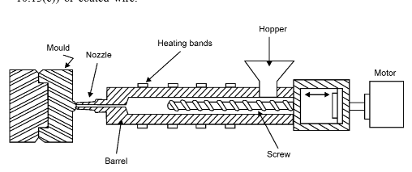
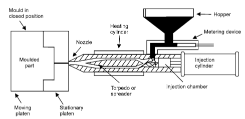
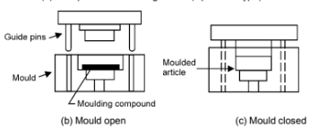

## Melt Processing

Melt processing is the most important, most economical way of shaping plastics. It can be used for those thermoplastics with melting points and viscosity low enough not to subject die materials to excessive temperatures and stresses.

### (a) Melt Processing of Thermoplastics:

The raw material to be processed is usually supplied in the form of regular shape and even-size granules, because this makes quantity metering easier and quicker and leads to more uniform and predictable heating. One technique, which has been developed, recently is to pultrude impregnated continuous-fibre rovings to produce a lace, which is chopped into 10 mm lengths. This produces a 10 mm fibre reinforcement, which has greatly improved properties compared with normal short fibre reinforcement. Whatever form of raw material is used, it is essential that it should be dried thoroughly before use. The most important processing procedures involve the use of a screw pump. The equipment used for ‘injection moulding’ is shown in Figure 1.0.0. The granules are fed into a heated cylinder by a screw, which first recedes to provide  
space for the material and then advances to inject it into a relatively cool mould in which it sets. When the plastic has been set the mould is opened and the moulding removed. Figure 1.0.1 shows an ‘extruder’ which will produce a rod tube or filament that can be quenched and drawn, sheet or strip in conjunction with a casting drum or three-roll stack (see Figure 1.0.2) or coated wire.

Figure 1.0.0: Screw Injection Molder

Figure 1.0.1: Injection Moulding Machine (Plunger Type) Screw Extruder

Figure 1.0.2 & 1.0.3 : Techniques Used to Produce Film

Bottles may be produced by ‘extrusion blow moulding’ (see Figure 1.0.2) in which a rod is extruded against a ‘blow pin spigot’. After extrusion, a mould is closed on the extruded parison which is still above softening point and the bottle is blown.

Procedures which do not involve extrusion are:

1. **Calenderizing**: Flattening material out to sheet between rolls (Figure 1.0.3). (This process is used extensively for plasticized PVC because problems have arisen in extrusion.)
2. **Centrifugal casting:** This involves filling a mould with (preferably) powder, spinning, heating to melt the powder, cooling slowly and removing the hollow casting.
3. **Compression moulding:** This process is more usually employed for thermosetting plastics but it can be used for thermoplastics, preferably in the form of powder. The compression moulding cycle involves compacting the polymer in the mould, heating above the melting point and then applying a heating compression/relaxation technique typically, 3.5MPa for one minute, release, then 7MPa for one minute, release, then 14MPa for 10 minutes and cool at 400 /minute to removed included air.

### (b) Melt Processing of Thermosets:

Because a fully cross-linked thermoset will not melt, melt processing must be carried out on an ‘A’-stage resin, a low molecular weight cross-linkable polymer which may be compounded with a hardener and/or accelerator. The heat of the mould normally initiates cross-linking and shaping must be completed before cross-linking has occurred to such an extent that it prevents flow. This clearly raises problems in extrusion or injection moulding, because any material remaining in the extruder will set and become difficult to remove. Extrusion of thermosets must therefore be a discontinuous process in which a high-pressure reciprocating ram forces the thermoset through the die. The most commonly used process is compression moulding, illustrated in Figure 10.15. The mould is heated to approximately 170°C and the material softens and flows to fill the mould before casting. The moulding material may be powder, a dough moulding compound (DMC), a sheet moulding compound (SMC) or a preform moulding.

(a) Compression Moulding Press (Upstroke Type)

Figure 10.15: Typical Process for the Compression Moulding of Thermosetting Plastics.
