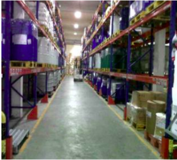

## Steps for Process-related Risk Assessment

1. Understand the process flow on how to manufacture the product

3. Identify the hazards from its process step (task)

5. Decide who might be harmed and how

7. Evaluate the risks and decide on precaution

9. Record your findings and implement them

11. Review your assessment and update if necessary

## Cosmetic Flow Production Process Flow

Cosmetic Flow Production Process Flow

### Cosmetic Production Process Flow Common EHS Hazards

**Receiving raw material from W/H**

**Receiving raw material from W/H**

**1.1 Common EHS Hazards**  
Exposure to dangerous works affecting the occupational health & safety of employees (HS002) Fall from elevated platform / high-level racks when material lifting / manual handling of raw materials during receiving process

Unsafe use of material handling equipment, e.g. drum-handling truck, forklift trucks / hand-held pallet jack for stock movement of various sizes/package types of receiving raw materials Improper handling, stacking & storage of receiving raw materials Ergonomics hazards Slip, trip & falls

**1.1 Recommendation**  
Proper use of the on-site personal protective equipment and safe working methods for working at height, receiving dock safety, forklift safety, manual lifting & material handling, safe racking, stacking & storage of receiving raw materials in the warehouse (e.g., bags, jerricans, barrels, drums, casks, IBC totes, medium-size vessels) and prevention of slips, trips & falls (HS002-CM001)

**1.2 Common EHS Hazards**  
Unsafe working conditions of electrical plugs, extension cords, and faulty electrical wiring cause immediate fire hazards, electrical hazards from electrical shock, and electrocution (HS006).

**1.2 Recommendation**  
Proper insulation of electrical plugs, cords, and wiring (HS006-CM001). Ground Fault Circuit Interrupter (GFCI) protection and weatherproof enclosure are required for all outlets in wet and damp locations(HS006-CM002). Earth Continuity Connector (ECC) connection for powered hand tools and machinery - e.g., electrical forklift, forklift re-charger etc (HS006-CM003).

**1.3 Common EHS Hazards**  
Exposed, impaired, and frayed electrical wiring causing an immediate fire hazard, electrical hazards from electrical shock, and electrocution (HS007)

**1.3 Recommendation**  
All electrical wiring is in good condition and all fuses and circuit breakers are of the correct rating (HS007-CM001).

**1.4 Common EHS Hazards**  
Overloaded electrical circuits and damaged switches/electrical panels causing immediate fire hazards, electrical hazards from electrical shock, and electrocution (HS008)

****1.4 Recommendation**  
**All electrical panels/systems are operated within the legal electrical capacity loading limit. (HS008-CM001)  
All distribution panels, breakers, switches, and junction boxes are completely enclosed and protected from dust, vermin, and wet conditions(HS008-CM002). Circuit protection devices should not be bypassed to effectively limit or stop the flow of  
current, fuses, circuit breakers (e.g., MCCB - Molded Case Circuit Breaker, MCB - Miniature Circuit Breaker, ELCB - Earth Leakage Circuit Breaker, GFCI - Ground Fault Circuit Interrupter) are common devices to detect a fault condition that could represent a potential electrical shock hazard due to short circuit or overloading (HS008-CM003).

**1.5 Common EHS Hazards**  
Overload outlets and branch circuits due to misused extension cords and multiple power strips causing immediate fire hazards, electrical hazards from electrical shock, and electrocution (HS009)

****1.5 Recommendation****  
Extension cords should never be left coiled up to damage insulation due to inductive heating (HS009-CM001).

**1.6 Common EHS Hazards**  
Ineffective & inadequate means of fire detection (HS012)

****1.6 Recommendation****  
Installation of effective and adequate fire detection system/devices – e.g., fire alarm system, smoke/heat detector (HS012-CM001).

**1.7 Common EHS Hazards**  
Inadequate warning signage and floor marking for fire evacuation (HS013)

****1.7 Recommendation****  
Adequate posting of warning signage and floor marking for fire evacuation at receiving raw material warehouse area (HS013-CM001).

****1.8 **Common EHS Hazards******  
Obstructed / unsafe means of escape (HS014)

****1.8 Recommendation****  
All escape routes (i.e., stairways, aisles & main access/egress from receiving raw material warehouse) are easily identifiable, free from obstructions and clearly illuminated during normal or emergency situations(HS014-CM001).

****1.9 **Common EHS Hazards******  
Unsafe/excessive storage of flammable/combustible receiving raw materials causing immediate fire hazard – Raw materials receiving inventory with flammable/combustible cosmetic chemical solvents/ reagents contents(HS015)

****1.9 Recommendation****  
No excessive build-up of stock to create unsafe conditions – Good logistics management for optimized warehouse stock control (HS015-CM001).

****1.10 **Common EHS Hazards******  
Signs of people smoking near an area of flammable, combustible, and explosive materials(HS016)

****1.10 Recommendation****  
Enforcement of the No smoking policy throughout the warehouse areas except in safe and designated areas far away from the location (HS016-CM001).

****1.11 **Common EHS Hazards******  
Inadequate and/or malfunctioning firefighting equipment (HS017)

****1.11 Recommendation****  
Provision and maintenance of adequate firefighting equipment for sustainable compliance (HS017-CM001).

****1.12 **Common EHS Hazards******  
Inadequate and/or malfunctioning emergency exits including emergency lights that are part of the emergency exit installation (HS018)

****1.12 Recommendation****  
Adequate installation and maintenance of sufficient emergency exits in pair with emergency lights for sustainable compliance (HS018-CM001).

****1.13 **Common EHS Hazards******  
Inadequate automatic fire suppression system in high-risk areas – receiving raw materials with cosmetic flammable/combustible chemical solvents /reagents contents(HS019)

****1.13 Recommendation****  
Adequate installation and maintenance of automatic fire suppression systems (e.g., automatic sprinkler system) to keep in serviceable condition (HS019-CM001).

****1.14 **Common EHS Hazards******  
Blocked/locked emergency exits(HS021)

****1.14 Recommendation****  
Unblock / unlock emergency exits from the receiving raw material warehouse area leading to the designated safe place during fire evacuation (HS021-CM001).

****1.15 **Common EHS Hazards******  
Handling & storage of Dangerous / Hazardous cosmetic chemical solvents/reagents for receiving skin and respiratory contacts of hazardous chemical solvents/reagents when accidental splash and spillage from receiving process, handling & storage (HS023)

****1.15 Recommendation****  
Conduct a workplace chemical survey in the receiving raw material warehouse area to identify hazardous areas or work tasks (e.g., receiving, transportation, loading/unloading the raw materials to/from storage rack) giving rise to the most exposure; and to assess the need for and the effectiveness of exposure control measures in receiving raw material warehouse areas (HS023-CM001).

****1.16 **Common EHS Hazards******  
Reduce worker exposure to chemicals - source control of chemical exposure (HS023-CM002).

****1.16 Recommendation****  
Training and communication to inform workers about the hazards of chemicals they are handling for receiving & storage, e.g., MSDS, SOP for bulk storage safety & emergency response plan on how to handle raw material leakage during receiving, toolbox talk & safety forum, etc. (HS023-CM003).

****1.17 **Common EHS Hazards******  
Provision and use of proper PPE but do not just depend on safety glasses, face masks or protective chemical-resistant gloves in case of accidental chemical splash & spillage reduce hazardous chemical exposure first (HS023-CM007).

****1.17 Recommendation****  
Poor ergonomics of working conditions and equipment (HS024) Ergonomically designed equipment, machines, and work station for receiving raw material warehouse operation - Provision of hand-held pallet jack and forklift truck for receiving raw material transfer and storage (HS024-CM001).

****1.18 **Common EHS Hazards******  
Proper manual handling / correct lifting techniques (HS024-CM004).

****1.18 Recommendation****  
Automation / Semi-automation for those hands-on, labor-intensive warehouse activities (HS024-CM005).

****1.19 **Common EHS Hazards******  
Poor housekeeping conditions/ practices create an unsafe workplace (HS025)

****1.19 Recommendation****  
Sustainable Workplace Cleanliness – Non-slip work area floor and receiving raw material warehouse storage are cleared of the access paths(HS025-CM001).

****1.20 **Common EHS Hazards******  
Removal of unused materials from bulk storage areas (HS025-CM003).

****1.20 Recommendation****  
Regular workplace inspection for sustainable housekeeping (HS025-CM004).

****1.21 **Common EHS Hazards******  
Proper chemical stacking / de-stacking, segregation of bulk stock, safe stock movement to prevent overhead, and falling hazards and store materials against walls or partitions only in an amount that will not endanger the stability of the wall or partition, and automated storage in receiving raw material warehouse areas (HS025-CM005).

****1.21 Recommendation****  
Proper postage of hazard warning signage and floor marking and floor marking at receiving raw material warehouse area - divert people traffic from the warehouse areas by clearly marked paths (HS025-CM006).

****1.22 **Common EHS Hazards******  
Inadequate consumption review of key raw materials and waste generation from receiving raw material warehouse operation (EN001)

****1.22 Recommendation****  
Better procurement control of ordering and properly storing the right types and quantities of raw materials (e.g., carton boxes, plastic wipes, etc.) for receiving (EN001-CM001).

****1.23 **Common EHS Hazards******  
Reduction program initiatives of resource consumption and waste reduction (EN001-CM002).

****1.23 Recommendation****  
Proper disposal practices of waste materials to reduce environmental impacts (EN001- CM003).

****1.24 **Common EHS Hazards******  
Usage of renewable resources for receiving raw material warehouse operation (EN001- CM004).

****1.24 Recommendation****  
Reusing and recycling non-hazardous materials – carton box papers, plastic wipes, packaging materials, etc. (EN001-CM005).

****1.25 **Common EHS Hazards******  
No proper measurement, monitoring, and tracking control of energy consumption from factory facilities, processes, and systems (EN004)

****1.25 Recommendation****  
Engagement initiative of LF Energy and Waste Efficiency Project (EN004-CM001).

****1.26 **Common EHS Hazards******  
Process changes and behavioral practices to reduce energy consumption and use less carbon-intensive sources - e.g. turning off lights in unused receiving warehouse areas (EN004-CM002).

****1.26 Recommendation****  
Installation of technologies or equipment to reduce energy use - e.g. efficient lighting, heating, and cooling systems, and more energy-efficient powered material lifting equipment (EN004-CM003).

_This handbook is applicable for the Supplier Factory’s Intermediate Practitioner for EHS improvement and follow-up, including risk evaluation, assessment and governance in place for the identified hazards & control measures. It is expected the Supplier factory should have fundamental risk assessment knowledge before engagement so._ This is to be continue...
