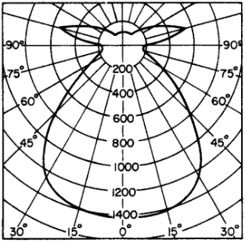

Lighting is part of the environmental control system, which also includes sound control and heating, ventilation, and air conditioning (HVAC), within a building.

The prime purpose of a lighting system is to provide good visibility for the execution of the tasks to be performed within the building. With good visibility, occupants can execute their tasks comfortably, efficiently, and safely.

Lighting also is desirable for other purposes. For example, it can be used to develop color effects for pleasure or accident prevention. It can be used to decorate select spaces or to accent objects. It can produce effects that influence human moods. And it can serve to illuminate an emergency egress system and as part of a security system.

Good lighting requires good quality illumination (Art. 15.11), proper color rendering (Art. 15.12), and an adequate quantity of light (Art. 15.13). This result, however, cannot be achieved economically solely by the selection and arrangement of suitable light sources. Lighting effects are also dependent on other systems and factors such as the characteristics of surrounding walls, floor, and ceiling; nature of tasks to be illuminated; properties of the backgrounds of the tasks; age and visual acuity of occupants; and characteristics of the electrical system. Design of a lighting system, therefore, must take into account it's interfacing with other systems. Also, lighting design must take into account the influence of lighting requirements on other systems, including architectural systems; heating and cooling effects of Bdmeter provided for daylighting; energy supply required from the electrical system, and loads imposed by electric lighting on the HVAC system.

Sources of light within a building may be daylight or artificial illumination. The latter can be produced in many ways, but only the most commonly used types of electric lighting are discussed in this section.

Like other building systems, lighting design is significantly affected by building codes. These generally contain minimum requirements for illumination levels, for the safety and health of building occupants. In addition, electric lighting equipment and electrical distribution must conform to safety requirements in building codes and the National Electrical Code, which is promulgated by the National Fire Protection Association, and to standards of the Underwriters Laboratories, Inc. Also, the Illuminating Engineering Society has developed standards and recommended practices to promote good lighting design.

In the interests of energy conservation, federal and state government agencies have set limits on the amount of energy that may be expended (energy budget) for the operation of buildings. These limits may establish maximum levels of illumination for specific purposes in buildings. Because of the importance of good lighting, the need to control lighting costs and conserve energy, and the multiplicity of legal requirements affecting lighting design, the engagement of a specialist in lighting design is advisable for many types of buildings.

### Visibility:

A light source produces light by converting energy to electromagnetic waves. Light sources used in practical applications emit waves with a broad spectrum of frequencies or wavelengths. Light consists of those waves that the human eye normally perceives. A normal eye interprets the wavelengths as colors, the shortest wavelengths being recognized as blue, the longest wavelengths as red, and intermediate wavelengths as green, yellow, and orange. The eye also recognizes differences in intensity of light or levels of illumination.

The eye sees an object because it receives light emitted by the object (if it is a light source) or reflected from it (if the object is not a light source). In the latter case, the eye can see the object if it reflects light received from a light source directly or from surfaces reflecting light. The total light reflected from the object equals the sum of the light from all sources that strike the object and are not absorbed. Thus, an object shielded from light sources will be revealed to the eye by light reflected from other surfaces, such as walls, floors, ceilings, or furniture. The amount of detail on the object that the eye can recognize, however, depends not only on the intensity of light that the eye receives from the object but also on the intensity of that light relative to the intensity of light the eye receives from the background (field of vision behind the object). Consequently, the eye can readily recognize details on a brightly lit object set against a darker background. But the eye perceives little detail or considers the object dark (in shadow) if the background is much brighter than the object.

### Inverse Square Law:

Consider now a point source radiating luminous energy equally in all directions and located at the common center of two transparent spheres of unequal diameter. Because each sphere receives the same amount of luminous energy from the light source, the quantity of light per unit of area is less on the larger sphere than that on the smaller one. In fact, the quantity per unit area varies inversely to the areas of the spheres, or inversely to the square of the radii. These considerations justify the inverse square law, which states:

**The illumination level at any point is inversely proportional to the square of the distance from the point light source.**

For large light sources, the law holds approximately large distances (at least 5 times the largest dimension of the sources) from the sources.

### Light Source Power:

Analogous to a pump in a water system or a battery in an electrical system, a light source emits luminous power. The unit used to measure this power is **candlepower** (cp), or **candela** (cd) (metric unit). (At one time, 1 candlepower was assumed equivalent to the luminous intensity of a wax candle, but now a more precise definition based on radiation from a heated black body is used.) The unit used to measure luminous power at a distance from the light source is the lumen (lm). A lumen is a luminous power on an area of 1 ft2 at a distance of 1 ft from a 1-cp light source or, since 1 cp 1 cd, on an area of 1 m2 at a distance of 1 m from a 1-cd light source. **Luminous efficacy** is the unit used to measure the effectiveness of light sources. It is calculated by dividing the total lumen output of a light source by the total input, watts (W), and thus is measured in lm/W.

### Level of Illumination:

A major objective of lighting design is to provide a specified illuminance, or level of illumination, on a task. For design purposes, the task often is taken as a flat surface, called a work plane. If the task is uniformly illuminated, the level of illumination equals the lumens striking the surface divided by the area. The unit used to measure illuminance is the footcandle (fc) lm/ft2 . In accordance with the inverse square law, the illuminance on a work plane normal to the direction to a point light source is given by

fc =cp / D2

where D = distance, ft, from work plane to light source cp = candlepower of light source

For a work plane at an angle to the direction of the light source,

fc =cp sin ( θ/ D2 )

In the metric system, illuminance is measured in lux, or lm/m2 ; 1 fc 10.764 lux. A luminaire is a lighting device that consists of one or more lamps, or light sources, a fixture that positions and shields them, components that distribute the FIGURE 15.11 Candlepower distribution curve indicates variation in lighting intensity with direction from a light source.

light, and elements that connect the lamps to the power supply. In general, luminaires do not radiate light of equal intensity in all directions, because of the characteristics of the lamps or the geometry of the fixtures. The actual illuminance around a single luminaire is an important design consideration. This environment may be characterized by the symmetrical about two vertical, perpendicular planes is shown in Fig. 15.11.

FIGURE 15.11 Candlepower distribution curve indicates variation in lighting intensity with direction from a light source.

To produce the curve, illuminance, fc, is measured, with a goniophotometer, on a plane that is placed at various points at equal distances from the light source and that at each point is normal to the direction to the source. From Eq. (15.29), the candlepower corresponding to the illuminance at each point is computed. In practice, the candlepower is usually calculated for points in vertical planes along longitudinal and transverse axes through the luminaire. The results for each plane are then plotted with polar or rectangular coordinates relative to the light source. Such plots show the variation in illuminance with direction from the light source. For example, Fig. 15.11 shows in polar coordinates that the light source investigated direct light mainly downward. Because the source is symmetrical, only one curve is needed in this case to represent illuminance in longitudinal, transverse, and diagonal planes.

### Equivalent Spherical Illumination

If proper care is not taken in positioning the observer and task relative to primary light sources, one or more of these light sources may be reflected into the field of vision as from a mirror. The resulting glare reduces the visibility of the task; that is, effective illuminance, FC, is less than the raw (actual) footcandles. For the measurement of the effective illuminance of lighting installations, the concept of equivalent spherical illumination, ESI fc, was introduced. It is based on standard sphere lighting that produces equal illumination from all directions (almost glare-free). In the employment of the ESI concept, an actual lighting installation is assumed replaced by sphere illumination with task visibility equivalent to that of the actual installation.

### Brightness

As mentioned previously, an observer sees an object because of light reflected from it. The observer interprets the intensity of the sensation experienced as brightness. The sensation of brightness usually is partly attributable to the general luminous environment, which affects the state of adaptation of the eye, and partly attributable to the intensity of light emanating from the object. The latter component is called luminance, or photometric brightness. Luminance is the luminous power emitted, transmitted, or reflected by a surface in a given direction, per unit of area of the surface projected on a plane normal to that direction. The unit of measurement of luminance is the foot-lambert (cd/m2 in the metric system). A foot-lambert (fL) of luminance in a given direction is produced by one lumen per square foot emanating from a surface in that direction. Thus, a self-luminous the surface-emitting 10 lm/ft2 has a luminance of 10 fL. For surfaces that reflect or transmit light, however, luminance depends both on the illuminance of light incident on the surface and the characteristics of the surface. For a reflecting surface, luminance is determined from

_fL = fc x reflectance_

where fc footcandles of incident light. A mirror (specular reflector) may give almost 100% reflection, whereas a black surface absorbs light and therefore has negligible reflectance. Most materials have an intermediate value of reflectance. For a transmitting surface, luminance is determined from

fL fc transmittance (15.32)

Clear glass (transparent material) may have a transmittance of about 90%, whereas an opaque material has no transmittance. Transmittances of other transparent materials may be about the same as that for clear glass, while transmittances of translucent materials may be 50% or less. Light incident on a surface and not reflected or transmitted is absorbed by it. In general, visibility improves with increase in brightness of a task. Because increase in brightness is usually accomplished at increase in operating cost caused by consumption of electric power, it is neither necessary nor desirable, however, to maintain levels of illumination higher than the minimum needed for satisfactory performance of the task. For example, tests show that speed of reading and comprehension are nearly independent of illuminance above a minimum level. This level depends on several factors, such as difficulty of the task, age of observers, duration of the task, and luminance relation between task and its surroundings. The more difficult the task, the older the occupants, and the longer the task, the higher the minimum level of illumination should be. High brightness also is useful in attracting visual attention and accenting texture. For this reason, bright lights are played on merchandise and works of art.

### 15.10.7 Contrast

This is created when the brightness of an object and its surroundings are different. The effects of contrast on visibility depend on several factors but especially on the ratio of brightness of object to that of its background. Ideally, the brightness of a task should be the same as that of its background. A 3:1 brightness ratio, however, is not objectionable; it will be noticed but usually will not attract attention. A 10:1 brightness ratio will draw attention, and a brightness ratio of 50:1 or more will accent the object and detract attention from everything else in the field of vision.

High background brightness, or low brightness ratios, may have adverse or beneficial effects on visibility. Such high contrast is undesirable when it causes glare or draws attention from the task or creates discordant light and dark patterns (visual noise). On the other hand, high contrast is advantageous when it helps the observer detect task details; for example, read fine print. High contrast makes the object viewed appear dark so that its size and silhouette can be readily discerned. But under such circumstances, if surface detail on the object must be detected, object brightness must be increased at least to the level of that of the background. The reason for this is that the eye adapts to the brightness of the whole field of vision and visualizes objects in that field with respect to that adaptation level. If background brightness is disturbing, the observer squints to reduce the field of vision and its brightness and thus increase the brightness of the task. The need for squinting is eliminated, however, by increasing the illumination on the task.

### 15.10.8 Effects of Colored Lights

Color of light affects the color of an object (color rendering), because the surface of the object absorbs light of certain frequencies and reflects light of other frequencies. An object appears red because it reflects only red light and absorbs other hues. If a light source emits light that is only blue-green, the color complementary to red, the red object will reflect no light and will therefore appear to be gray. The eye, however, can, to some degree, recognize colors of objects despite the color of the illuminant; that is, the eye can adapt to colored light. It also becomes sensitive to the colors that would have to be added to convert the illuminant to white light. Apparent color is also affected by high levels of illumination. For example, all colors appear less bright, or washed out, under high illumination. But the brightness of color also depends on the hue. Under the same illumination, light colors appear brighter than dark colors. Thus, lower levels of illumination are desirable with white-, yellow-, and red-colored (warm-colored) objects than with black-, blue-, and green-colored (cool-colored) objects. (Warm-colored objects also have the psychological effect of appearing to be closer than they actually are, whereas cool-colored objects tend to recede. In addition, cool colors create a calm and restful atmosphere, conducive to mediation, but are not flattering to skin colors or food, whereas warm colors produce opposite effects.)

### 15.11 QUALITY OF LIGHT

A good lighting system not only provides adequate quantities of light for safe, efficient visual performance but also a good quality of light. Quality determines the visual comfort of building occupants and contributes to good visibility. In accordance with the relationships between light and sight described in Art. 15.10, quality and quantity therefore should be considered together in lighting design. For ease of presentation, however, the factors affecting these characteristics of light are discussed separately.

The characteristics of a luminous environment that determine quality are contrast, diffusion, and color rendering. Contrast, created by shadows or by relatively bright areas in a field of vision, affects visibility, mood, comfort, and eyestrain (Art. 15.10). Diffusion, the dispersion of light in all directions, may be produced by transmission or reflection. Diffuse transmission occurs when light from a bright source passes through a material that disperses the incident light, with a consequent reduction in brightness. Translucent materials or specially constructed lenses are often employed for this purpose in lighting fixtures. Diffuse reflection occurs when incident light on a surface is reflected almost uniformly in all directions by tiny projections or hollows. Such surfaces appear nearly equally bright from all viewing angles. Diffusion tends to reduce contrast and promote uniformity of lighting.

Brightness Ratios. For good quality of lighting, the degree of contrast of light and dark areas in the field of vision should be limited to provide for viewing angle changes. The reason for this is that the eye adapts to the luminance of a task after a period of time. When the eye leaves the task and encounters a field of different brightness, the eye requires an appreciable time to adapt to the new condition, during which eyestrain or visual discomfort may be experienced. To promote quick, comfortable adaptation, brightness ratios in the visual environment should be kept small. For example, in offices, the ratio of brightness of task to that of darker immediate surroundings should not exceed 3:1, and to that of darker, more remote surroundings, 5:1. Similarly, the ratio of brightness of lighter, more remote surroundings to that of the task should be less than 5:1. (See ‘‘Office Lighting,’’ RP 1, Illuminating Engineering Society of North America, 345 E. 47th St., New York, NY 10017- 2377.) Direct Glare. When background luminance is much greater than that of the task, glare results. It may take the form of direct glare or reflected glare. Direct glare is produced when bright light sources are included in the field of vision and cause discomfort or reduced visibility of the task. The intensity of glare depends on the brightness, size, and relative position of the light sources in the field of vision, and on the general luminance of the field of vision.

The brighter the light source, the greater will be the glare, other factors remain- ing substantially constant. Similarly, the larger the light source, the greater will be the glare. A small bright lamp may not be objectionable; in fact, in some cases, it may be desirable to provide sparkle and relieve the monotony of a uniformly lit space, whereas a large, bright luminaire in the field of vision would cause discomfort. In contrast, glare decreases as the distance of the light source from the line of sight increases. Also, glare decreases with increase in general luminance of the visual environment, or level of eye adaptation.

The Illuminating Engineering Society has established standard conditions for determining a criterion, called visual comfort probability (VCP), for rating discomfort glare. VCP indicates the percentage of observers with normal vision who will be visually comfortable in a specific environment. Tables of VCP values for various luminaires are available from their manufacturers. VCP values should be applied with caution, because they may not be applicable under conditions that depart significantly from the IES standard.

In general, direct glare should not be troublesome if all of the following con- ditions are satisfied for an overhead electric lighting system:

1. VCP is about 70 or more.

3. The ratio of the maximum luminance of each luminaire to its average luminance is

5:1 (preferably 3:1) or less, at 45, 55, 65, 75, and 85- with respect to the vertical, when viewed lengthwise and crosswise.

3. The maximum luminance of each luminaire, when viewed lengthwise and cross-wise, does not exceed the values given in Table 15.4 for the specified angles.

Reflected Glare. Also called veiling reflection because of the effect on visibility, reflected glare results when incident light from a bright light source is reflected by the task into the eyes of the observer and causes discomfort or loss of contrast. Occurrence of glare depends on the brightness of the light source, overall luminance of the task, reflectance of the task surface, and relative positions of light source, task, and observer. When a bright light source is reflected into an observer’s eyes, it casts an apparent veil over the image of the task. The result is a loss of contrast that would otherwise be useful in perception of task size and silhouette details; for example, print that would be readily legible without reflected glare would become difficult to read in the presence of a veiling reflection. Several techniques have been found useful in maintaining an adequate quantity of light while limiting loss of contrast. These include the following: Observers, tasks, and light sources should be positioned to reduce reflected glare. If there is only a single light source, positional change should remove it from the field of vision. When daylighting is used, occupants should be faced parallel to or away from Bdmeter, rather than toward them. When overhead luminaires are used, they should be positioned on either side of and behind the occupants, instead of in the general area above and forward of them. When continuous rows of linear lu- minaires are used, the occupants should be positioned between the rows with the line of sight parallel to the longitudinal axes of the luminaires.

Increase in the luminance of the task will offset the loss of contrast, if the added illumination is provided at nonglare angles. Decrease in the overall brightness of light sources or the brightness at angles that cause glare also is helpful. When Bdmeter are the sources of glare, it can be reduced or eliminated by tilting blinds. When luminaires are used, brightness of the source should be kept low to minimize glare. Low-brightness sources with large areas usually cause less glare than small sources with high luminance. As an alternative, the whole ceiling can be used as an indirect light source, which reflects light directed onto it by luminaires. These fixtures should be suspended at least 18 in below the ceiling to prevent high-brightness spots from being created on it. The ceiling should be white and clean and have a matte finish to diffuse the light. Reflected glare also can be reduced by use of luminaires that distribute light mostly at nonoffending angles. Tasks are usually observed in a downward direction at angles with the vertical of 20 to 40. Consequently, light incident on the task at those angles may cause reflected glare. Therefore, selection of a luminaire that produces little or no light at angles less than 40- cannot cause glare. Fig illustrates the candlepower distribution curve for a luminaire that directs little light downward. (Note that it also directs little light near the horizontal, to prevent direct glare.) The curve is called a batwing, because of its shape. As indicated in Fig. 15.12b, a high percentage of the light from this luminaire cannot produce veiling reflections. Specularity of the task can be a major cause of reflected glare. Consequently, high-gloss surfaces in the field of vision should be avoided. Often, tilting the task can reduce or eliminate veiling reflections. Use of low-level illumination throughout a space, supplemented by local lighting on the task, offers several advantages, including adequate light with little or no glare and flexibility in positioning the local light source. In many work environments, observers find themselves confronted with reflected glare both on horizontal surfaces, when reading material on a desktop, and on approximately vertical surfaces, when viewing a visual display terminal (VDT) screen. Designers should be aware of this and should be certain that the lighting system used to alleviate veiling reflections on horizontal materials does not aggravate the problem on the VDT screen. Luminaires selected to direct light outward beyond 40- from vertical to avoid veiling reflections may produce direct glare on the VDT. In general, in design of lighting systems for areas with VDTs, illuminance levels should be kept low, less than 75 fc. Illuminance ratios in the area also should be kept low, fixtures that have high VCPs should be selected and surface finishes that might reflect onto the VDT screen should have medium to low reflectances.

Luminaires with parabolic louvers, either small-cell, intermediate-cell, or deep-cell, are often used. They provide good illuminance on horizontal surfaces while contributing almost no direct glare onto the screen. They do, however, create a visual environment with relatively dark ceiling space that some may find objectionable.

Pendant-mounted, indirect-lighting luminaires or direct-indirect fixtures using fluorescent or HID sources can also be successfully applied to areas with VDTs. They produce a brighter feeling in the space for the occupants. Care must be taken

to select luminaires with properly designed light control and to mount them sufficiently below the ceiling to create a uniform brightness across the ceiling surface.

Failure to meet these requirements can result in ‘‘hot spots’’ on the ceiling that will be reflected onto the VDT screen. A relatively uniform, though somewhat bright, ceiling luminance reflected onto the screen is not objectionable to the viewer (VDT contrast and brightness controls can be adjusted to compensate) but the hot spots on the screen force the viewer’s eyes to be constantly adjusting to the differences in reflected glare, causing eye fatigue and discomfort. (See ‘‘The IES Recommended Practice for Lighting Offices Containing Computer Visual Display Termin- als (VDT’s) RP-24,’’ Illuminating Engineering Society of North America.)

### COLOR RENDERING WITH LIGHTING

A black body is colorless. When increasing heat is applied to such a body, it eventually develops a deep red glow, then cherry red, next orange, and finally blue- white. The color of the radiated light is thus related to the temperature of the heated body. This phenomenon is the basis for a temperature scale used for the comparison >of the color of light from different sources. For example, the light from an incan- descent lamp, which tends to be yellowish, may be designated 2500 Kelvin (K), whereas a cool white fluorescent lamp may be designated 4500 K.

Light used for general illumination is mainly white, but white light is a combination of colors and some colors are more predominant than others in light emit- ted from light sources commonly used. When light other than white is desired, it may be obtained by selection of a light source rich in the desired hue or through use of a filter that produces that hue by absorbing other colors. Color rendering is the degree to which a light source affects the apparent color of objects. Color rendering index is a measure of this degree relative to the per- ceived color of the same objects when illuminated by a reference source for spec- ified conditions. The index actually is a measure of how closely light approximates daylight of the same color temperature. The higher the index, the better is the color rendering. The index for commonly used light sources ranges from about 20 to 99.

Generally, the color rendering of light should be selected to enhance color identification of an object or surface. This is especially important in cases where color coding is used for safety purposes or to facilitate execution of a task. Color en- hancement is also important for stimulating human responses; for example in a restaurant, warm-colored light would make food served appear more appetizing, whereas cool-colored light would have the opposite effect. Sources producing white light are generally used. Because of the spectral energy distribution of the light, however, some colors predominate in the illumination. For example, for daylight, north light is bluish, whereas direct sunlight at midday is yellow-white; and light from an incandescent lamp is high in red, orange, and yellow. The color composition of the light may be correlated with a color temper- ature. For a specific purpose, a source with the appropriate color characteristics should be chosen. Lamp manufacturers provide information on the color tempera- ture and color rendering index of their products.

Colored light, produced by colored light sources or by filtering of white light, is sometimes used for decorative purposes. Colored light also may be used to affect human moods or for other psychological purposes, as indicated in Art. 15.10.8. Care must be taken in such applications to avoid objectionable reactions to the colored light; for example, when it causes unpleasant changes in the appearance of human skin or other familiar objects. Perceived color of objects also is affected by the level of illumination (Art. 15.10.8). When brilliant color rendition is desired and high-intensity lighting is to be used, the color saturation of the objects should be high; that is, colors should be vivid. Also, a source that would enhance the colors of the objects should be chosen. See Art. 15.20, Bibliography.

### QUANTITY OF LIGHT

As indicated in Art. 15.11, quantity and quality of light are actually inseparable in contributing to good lighting, although they are treated separately, for convenience of presentation, in this section. Illumination should meet the requirements of visual tasks for safe, efficient performance, esthetic reasons, and the purpose of attracting attention. Factors that affect visual performance of a task include: Luminance, or brightness, of the task Luminance relation between task and surroundings Color rendering of the light Size of details to be detected Contrast of the details with their background Duration and frequency of occurrence of the task Speed and accuracy required in performance of the task Age of workers The influence of these factors on visibility is described in Art. 15.10.

Dim lighting is sometimes desirable for mood effects. For merchandising, how- ever, a pattern of brightness is depended on to capture the attention of potential customers. For task lighting, sufficient lighting must be provided on the work area if the task is to be executed without eyestrain and fatigue. Higher than the minimum required level of illumination usually improves visibility but often with greater energy consumption and increased life-cycle costs for both lighting and cooling the

building. Consequently, for task lighting, illumination should be kept to the minimum necessary for maintenance of adequate quantity and quality of lighting.

For many years, single values for minimum illuminance, or level of illumination, FC, developed by the Illuminating Engineering Society of North America (IES) and listed in tables in the ‘‘IES Lighting Handbook,’’ have been widely used in the United States. In 1979, however, the IES revised its criteria to a recommended range of target illuminances. These recommended values take into account many of the factors listed above. Following is examples and abbreviated tables to illustrate the use of the tables in the IES handbook.

To determine the target illuminance, start by ascertaining the type of activity, or illuminance category, for the space to be illuminated. (The ‘‘IES Lighting Handbook’’ contains a detailed table correlating specific areas or activities with categories labeled A to I. For some of these categories, the effects of veiling reflections should be evaluated, for which purpose equivalent-sphere-illumination, ESI, calculations may be used, as indicated in Art. 15.10.5.) The first column of Table 15.7, which is based on descriptions in ‘‘Selection of Illuminance Values for Interior Lighting Design,’’ IES RP-1SA, gives a general description of these categories. Next, determine the appropriate weighting factors W from Table 15.5 to adjust for the loss of visual acuity with age, for the importance of speed and accuracy in performing tasks, and for reflections of task background. For categories A to C, for which there are no task activities, use W 0 as the weight for speed and accuracy. Then, add the weighting factors. From Table 15.6, determine the visual condition number corresponding to W and the category. Decrease the condition number by one if the task is of short duration or occurs infrequently. Finally, select the target illuminance, FC, from Table 15.7 corresponding to the category and visual condition. The IES recommends that if the information is available on the effect of changes in illuminance or equivalent sphere illumination, ESI, on task performance, the data may be used to determine if a variation from the design illuminance or ESI will be meaningful in terms of increased or decreased productivity, which may be used in a cost-benefit analysis. See Art. 15.20, Bibliography.

### 15.14 LIGHTING METHODS

Interior lighting may be accomplished with natural or artificial illumination or both. Natural illumination is provided by daylight. Artificial illumination usually is produced by the consumption of electric power in various types of lamps and sometimes by burning candles or oil or gas in lamps. Usually, electric lighting for building spaces is produced by lighting devices called luminaires, which consist of one or more lamps, a fixture in which the lamps are held, lenses for distributing the light, and parts for supplying electricity. Fixtures may be portable or permanently set in or on ceilings or walls. To meet specific lighting objectives, the following lighting methods may be used alone or in combination:

General Lighting. This provides uniform and, often, diffuse illumination throughout a space. This type of lighting is useful for performing ordinary activities and for reducing the relative luminance of surroundings when local lighting is applied to a work area. Local or Functional Lighting. This provides a high level of illumination on the relatively small area in which a task is to be performed, such as reading, writing, or operation of tools. Accent Lighting. This actually is a form of local lighting, but it has the objective of creating focal points for observers, to emphasize objects on display. Decorative Lighting. This employs color or patterns of light and shadow to attract attention, hold interest, produce visual excitement or a restful atmosphere, or create esthetic effects. Illumination may be classified as indirect, semidirect, diffuse or direct-indirect, semi-direct, or direct. For indirect lighting, about 90 to 100% of the illumination provided in space is directed at the ceiling and upper walls, and nearly all of the light reaches the task by reflection from them. The resulting illumination is, therefore, diffuse and uniform, with little or no glare. For semi-indirect lighting, about 60 to 90% of the illumination is directed at the ceiling and upper walls, the remaining percentage in generally downward directions. When overhead luminaires are used, the downward components should be dispersed by passage through a diffusing or diffracting lens to reduce direct glare. The resultant illumination on a task is diffuse and nearly glare-free. General diffuse or direct-indirect lighting is designed to provide a nearly equal distribution of light upward and downward. General-diffuse luminaires enclose the light source in a translucent material to diffuse the light and produce light in all directions. Direct-indirect luminaires give little light near the horizontal. The quality of the resulting illumination from either type depends on the type of task and the layout of the luminaires.

For semidirect lighting, about 60 to 90% of the illumination is directed downward, the remaining percentage upward. Depending on the eye adaptation level, as determined by overall room luminance, the upward component may reduce glare. The diffuseness of the lighting depends on the reflectance of room enclosures and furnishings.

For direct lighting, almost all the illumination is directed downward. If such luminaires are spread out, reflections from room enclosures and furnishings may diffuse the light sufficiently that it can be used for general lighting, for example, in large offices. A concentrated layout of these luminaires is suitable for accent, decorative, or local lighting. Because direct lighting provides little illumination on vertical surfaces, the provision of supplementary perimeter lighting often is desirable. Lighting Distribution. Luminaires are designed for a specific type of lamp to distribute light in a way that will meet design objectives. For this purpose, luminaires incorporate various shapes of reflectors and various types of lenses. Also, the size and shape of openings through which light is emitted is controlled.

A luminaire may provide symmetrically or asymmetrically distributed light. With symmetrical distribution (Fig. 15.11), the level of illumination, fc, on a work plane is nearly the same at the same angle with the vertical and at equal distances from the light source. With asymmetrical distribution (Fig. 15.13c), the luminaire concentrates light in a specific direction. Symmetrical distribution is appropriate for general lighting. Asymmetrical distribution is advantageous for accent lighting.

### DAYLIGHT

Use of natural light has the advantages, compared with artificial illumination, of not consuming fuel and not having associated operating costs. But daylight has the disadvantages of being dependent on the availability of Bdmeter and on the absence of light-blocking obstructions outside the Bdmeter, of not being available between sunset and sunrise, and of providing weak light on cloudy days and around twilight and dawn. When lighting is needed within a building at those times, it must be provided by artificial illumination. Also, for parts of rooms at large distances from Bdmeter, where adequate daylight does not reach, artificial illumination is needed to supplement the daylight. When supplementary lighting is required, initial, maintenance, and replacement costs of lamps and fixtures are not saved by the use of daylight, although costs of power for lighting can be reduced by turning off lamps no needed when daylight is available. In addition, the design for daylighting should be carefully executed so as not to introduce undesirable effects, for example, glare, intensive sunlight, or excessive heat gain. Elements can be incorporated in building construction to control daylight to some extent to provide good lighting within short distances from Bdmeter. For example, to prevent glare, Bdmeter may be shielded, by blinds or by outside over- hangs, against direct sunlight. To reduce heat gain, Bdmeter may be glazed with reflecting, insulating, or heat-absorbing panes. Ceiling, floor, and walls with high reflectance should be used to diffuse light and reflect it into all parts of rooms. To illuminate large rooms, daylight should be admitted through more than one wall and through skylights or other roof openings, if possible. In rooms that extend a long distance from Bdmeter, the tops of the Bdmeter should be placed as close to the ceiling as possible, to permit daylight to penetrate to the far end of the room. Design procedures for daylighting are presented in ‘‘Recommended Practice for Daylighting,’’ RP-5, Illuminating Engineering Society of North America.

### CHARACTERISTICS OF LAMPS:

Selection of the most suitable lamp consistent with design objectives is critical to performance and cost of a lighting system. This decision should be carefully made before a luminaire for the lamp is selected. Luminaires are designed for specific lamps. Lamps are constructed to operate at a specific voltage and wattage, or power consumption. In general, the higher the wattage rating of a specific type of lamp, the greater will be its efficacy, or lumen output per watt. 15.16.1 Considerations in Lamp Selection Greatest economy will be secured for a lighting installation through the use of a lamp with the highest lumen output per watt with good quality of illumination. In addition to lumen output, however, color rendering and other characteristics, such as lighting distribution, should also be considered in lamp selection. Information on these characteristics can be obtained from lamp manufacturers. The latest data should be re-quested because characteristics affecting lamp performance are changed periodically. The following information usually is useful:

Lamp life is given as the probable number of hours of operation before failure. Lamp efficacy is measured by the lamp output in lumens per watt of power consumed. Lamp lumen depreciation, as indicated by tests. Curves are plotted from data to show the gradual decrease in light output with a length of time of lamp operation. The decrease occurs because of both aging and dirt accumulation. The latter can be corrected with good maintenance, but the possible effects nevertheless should be considered in lighting design. Lamp warm-up time, which is significant for some fluorescent lamps and all high-intensity-discharge lamps, for which there is a delay before full light output develops. Lamp restart time, or the time that it takes some lamps to relight after they have been extinguished momentarily. The lamps may go out because of low voltage or power interruption. Use of lamps with a long warm-up and restart times should be avoided for spaces where lights are to be turned on and off frequently.

Color rendering index and color acceptability, which are, respectively, measures of the degree to which illumination affects the perceived color of objects and the human reaction to perceived colors (see Art. 15.12). Voltages and frequency of current at which lamps are designed to operate. In most buildings in the United States, electricity is distributed for light and power as an alternating current at 60 Hz. Lamp output generally increases at higher frequencies but a capital investment for the purpose is higher. Voltage often is about 120, but sometimes, especially for industrial and large commercial buildings, voltages of 208, 240, 277, or 480 are used, because of lower transmission losses and more efficient operation of electrical equipment. Direct current from batteries often is used for emergency lighting, when the prime ac source fails. Low-voltage (generally 12-V) lamps may be used outdoors, for safety reasons, when conductors are placed underground or where the lamps are immersed in water.

Noise is significant for some types of lamp applications, such as fluorescent and high-intensity-discharge lamps. These depend on the operation of a device, called a ballast, which may hum when the light operates. Whether the hum will be annoying under ordinary circumstances depends on the ambient noise level in the room. If the ambient level is high enough, it will mask the hum. Before a combination of the lamp, ballast, and fixture is selected, the ballast noise rating should be ob- trained by the luminaire manufacturer.

Ambient temperature, or temperature around a lamp when it is operating, may affect lamp life, lumen output, and color rendering. If the ambient temperature exceeds the rated maximum temperature for the luminaire, the life of incandescent lamps may be considerably reduced. Consequently, lamps rated at a wattage greater than that recommended by the fixture manufacturer should not be used. Also, provision should be made for the dissipation of the heat produced by lamps. Low ambient temperature slows starting of fluorescent and high-intensity-discharge lamps. Low temperature also reduces lumen output and changes the color of fluorescent lamps.

### Maintenance of Lamp Output

The efficiency of a lighting system decreases with time because of dirt accumulation, a decrease in lumen output as lamps age, lamp failures, and deteriorating lighting fixtures. Depending on the type of fixtures, cleanliness of the environment, and time between cleanings of lamps and fixtures, lumen losses due to dirt may range from 8 to 10% in a clean environment to more than 50% under severe conditions. Also, the longer lamps operate, the dimmer they become; for example, a fluorescent lamp at the end of its life will yield only 80 to 85% of its initial lumen output. And when one or more lamps fail and are not replaced, the space being illuminated may suffer a substantial loss in light. Furthermore, in the case of lights operating with ballasts, the lamps, before burning out, overload the ballast and may cause it to fail. Consequently, a poorly maintained lighting installation does not provide the illumination for which it was designed and wastes money on the power consumed. The design illumination level may be maintained by periodic cleaning and prompt replacement of aged or failed lamps. Relamping may be carried out by the spot or group methods. Spot relamping, or the replacement of lamps one by one as they burn out, is more inefficient in use of labor and more costly. Group relamping calls for scheduled replacement of lamps at intervals determined from calculations based on expected lamp life and variation of lumen output with time. This method reduces labor costs, causes fewer work interruptions, maintains higher levels of illumination with no increase in cost of power, prevents the appearance of the lighting system from deteriorating, and reduces the possibility of damage to auxiliary equipment, such as ballasts, near the end of lamp life.

Because of the decrease in lamp output with time, in design calculations, initial lamp output should be multiplied by a lamp lumen depreciation factor to correct for the effects of aging. This product equals the output after a period of time, usually the interval between group relampings. In addition, the output should be multiplied by a dirt depreciation factor. Both factors are less than unity. The two factors may be combined into a single maintenance factor M.

_M LLD LDD (15.33)_

where LLD lamp lumen depreciation factor LDD dirt depreciation factor After a period of operation, lamp output then is given by

_L L M (15.34) i_

where Li initial output, lm 15.16.3 Lamp Control Incoming power for a lamp normally is by a local switch in the power circuit. The switch turns the lamps on or off by closing or opening the circuit. An alternative method may be used that is more economical when the lamps are distant from the switch and that reduces the possibility of personal injury or short-circuit damage at the switch. In this method, the main power circuit is opened and closed by a relay located near the lamps. The relay, in turn, may be activated by low-voltage power controlled by a remote switch. Control-system voltages usually range between 6 and 24 V, obtained by stepping down the normal distribution voltage with transformers. To prevent waste of energy by lighting in unoccupied rooms, occupancy sensors may be installed. They sense the entry of a person into a room and turn the lights on. They also detect continued presence in the room and keep the lights on until after departure.

For control of light output from a luminaire, a control switch may be replaced with a dimmer. For incandescent lamps, this device can vary the voltage across the lamps from zero to the rated value and thus can be used to adjust the level of illumination. For fluorescent and high-intensity-discharge lamps, the dimmer is coordinated with the lamp ballast.

### Types of Lamps

Lamps that are commonly used may be generally classified as incandescent, fluorescent, or high-intensity discharge (HID). HID lamps include mercury vapor, metal-halide, low-pressure sodium, and high-pressure sodium lamps. See Tables 15.8 and 15.9. Incandescent Lamps. These lamps generate light by heating thin tungsten wires until they glow. The filaments are enclosed in a sealed glass bulb from which air is evacuated or that is filled with inert gas, to prevent the heated tungsten from evaporating. In a tungsten-halogen incandescent lamp, for prolonged life, the filler gas contains halogens (iodine, chlorine, fluorine, and bromine), which restores to the filaments any metal that may evaporate. Incandescent lamps are available in a variety of shapes. They also come with a variety of bases, making it necessary to ensure that selected luminaires provide sockets that can accommodate the desired lamps. Incandescent lamps produce light mainly in the yellow to red-portion of the spectrum. Color depends on the wattage at which the lamp is operated. Generally, the higher the wattage, the whiter the color of light produced. A reduction in wattage or voltage results in a yellower light. See Tables 15.8 and 15.9 for other characteristics of incandescent lamps. Often, the glass bulbs of these lamps are treated to obtain special effects. Usually, the effect desired is the diffusion of the emitted light, to soften glare. For this purpose, the glass may be frosted, or etched, or silica-coated (white bulb). Light diffusion and other effects can also be achieved with control devices incorporated in the fixtures, such as lenses or louvers (Figs. 15.13 to 15.16). Also, lamps may be treated with coatings or filters to produce any of a variety of colors. Reflectorized incandescent lamps are made, with standard or special shapes, with a reflective aluminized or silver coating applied directly to the part of the inside bulb surface. Such lamps are widely used for spot or flood lighting. Type PAR lamp has a parabolic shape to focus the light beam. Types EAR and ER lamps have elliptical shapes that cause the light beam to concentrate near the front of the lens, then to broaden into the desired pattern, yielding more usable light than other types of lamps, with little glare. Compact fluorescent lamps often can be used, to reduce energy consumption significantly, in applications where incandescent lamps were used in the past.

**Fluorescent Lamps.** These lamps are sealed glass tubes coated on the inside sur- face with phosphors, chemicals that glow when bombarded by ultraviolet light. The tubes are filled with inert gas, such as argon, and low-pressure mercury vapor. The passage of an electric arc through the mercury vapor causes it to emit ultraviolet rays that activate the phosphors to radiate visible light. The electric arc is started and maintained by cathodes at the ends of the glass tubes. The high voltage needed to form the arc is provided initially by a device called a ballast. After the arc has been formed, the ballast limits the current in the arc to that needed to maintain it.
