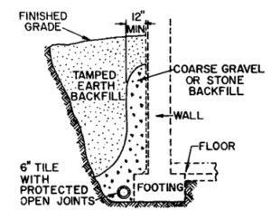

## **PROTECTION AGAINST WATER**

Whether thrust against and into a building by a flood, driven into the interior by heavy rain, leaking from plumbing, storm surge, or seeping through the exterior enclosure, water can cause costly damage to a building. Consequently, designers should protect buildings and their contents against water damage.

Protective measures may be divided into two classes: floodproofing and waterproofing. Floodproofing provides protection against flowing surface water, commonly caused by a river overflowing its banks. Waterproofing provides protection against penetration through the exterior enclosure of buildings of groundwater, rainwater, and melting snow. Buildings adjacent to large water bodies may also require protection from undermining due to erosion and impact from storm-driven waves.

## Floodproofing

A flood occurs when a river rises above an elevation, called flood stage, and is not prevented by enclosures from causing damage beyond its banks. Buildings constructed in a flood plain, an area that can be inundated by a flood, should be protected against a flood with a mean recurrence interval of 100 years. Maps showing flood-hazard areas in the United States can be obtained from the Federal Insurance Administrator, Department of Housing and Urban Development, which administers the National Flood Insurance Program. Minimum criteria for floodproofing are given in the National Flood Insurance Rules and Regulations (Federal Register, vol. 41, no. 207, Oct. 26, 1976).

Major objectives of floodproofing are to protect fully building and contents from damage from an l00-year flood, reduce losses from more devastating floods, and lower flood insurance premiums. Floodproofing, however, would be unnecessary if buildings were not constructed in flood-prone areas. Building in flood-prone areas should be avoided unless the risk to life is acceptable and construction there can be economically and socially justified.

Some sites in flood-prone areas possess some ground high enough to avoid flood damage. If such sites must be used, buildings should be clustered in high areas. Where such areas are not available, it may be feasible to build up an earth fill, with embankments protected against erosion by water, to raise structures above flood levels. Preferably, such structures should not have basements, because they would require costly protection against water pressure.

An alternative to elevating a building on fill is raising it on stilts (columns in an unenclosed space). In that case, utilities and other services should be protected against damage from flood flows. The space at ground level between the stilts may be used for parking automobiles, if the risk of water damage to them is acceptable or if they will be removed before flood waters reach the site.

Buildings that cannot be elevated above the flood stage should be furnished with an impervious exterior. Bdmeter should be above flood stage, and doors should seal tightly against their frames. Doors and other openings may also be protected with a flood shield, such as a wall. Openings in the wall for access to the building may be protected with a movable flood shield, which for normal conditions can be stored out of sight and then positioned in the wall opening when a flood is imminent.

To prevent water damage to essential services for buildings in flood plains, important mechanical and electrical equipment should be located above flood level. Also, auxiliary electric generators to provide some emergency power are desirable. In addition, pumps should be installed to eject water that leaks into the building. Furthermore, unless a building is to be evacuated in case of flood, an emergency water supply should be stored in a tank above flood level, and sewerage should be provided with cutoff valves to prevent backflow.

## Waterproofing\*

In addition to protecting buildings against floods, designers also should adopt measures that prevent groundwater, rainwater, snow, or melted snow from penetrating into the interior through the exterior enclosure. Water may leak through cracks, expansion joints, or other openings in walls and roofs, or through cracks around Bdmeter and doors. Also, water may seep through solid but porous exterior materials, such as masonry. Leakage generally may be prevented by the use of weather-stripping around Bdmeter and doors, impervious water stops in joints, or calking of cracks and other openings. Methods of preventing seepage, however, depend on the types of materials used in the exterior enclosure.

### Definitions of Terms Related to Water Resistance

**Permeability**. Quality or state of permitting passage of water and water vapor into, through, and from pores and interstices, without causing rupture or displacement. Terms used in this section to describe the permeability of materials, coatings, structural elements, and structures follow in decreasing order of permeability:

**Previous or Leaky.** Cracks, crevices, leaks, or holes larger than capillary pores, which permit a flow or leakage of water, are present. The material may or may not contain capillary pores. **Water-resistant.** Capillary pores exist that permit the passage of water and water vapor, but there are few or no openings larger than capillaries that permit the leakage of significant amounts of water. Water-repellent. Not ‘‘wetted’’ by water; hence, not capable of transmitting water by capillary forces alone. However, the material may allow the transmission of water under pressure and may be permeable to water vapor. **Waterproof**. No openings are present that permit leakage or passage of water and water vapor; the material is impervious to water and water vapor, whether under pressure or not. These terms also describe the permeability of a surface coating or a treatment against water penetration, and they refer to the permeability of materials, structural members, and structures whether or not they have been coated or treated.

### PROTECTION AGAINST HAZARDS

Permeability of Concrete and Masonry. Concrete contains many interconnected voids and openings of various sizes and shapes, most of which are of capillary dimensions. If the larger voids and openings are few in number and not directly connected with each other, there will be little or no water penetration by leakage and the concrete may be said to be water-resistant. Concrete in contact with water not under pressure ordinarily will absorb it. The water is drawn into the concrete by the surface tension of the liquid in the wetted capillaries. Water-resistant concrete for buildings should be properly cured, dense, rich concrete containing durable, well-graded aggregate. The water content of the concrete mix should be as low as is compatible with workability and ease of placing and handling. Resistance of concrete to penetration of water may be improved, however, by incorporation of a water-repellent admixture in the mix during manufacture. Water-repellent concrete is permeable to water vapor. If a vapor-pressure gradient is present, moisture may penetrate from the exposed face to the inner face. The concrete is not made waterproof (in the full meaning of the term) by the use of an integral water repellent. Note also that water repellents may not make concretely impermeable to penetration of water under pressure. They may, however, reduce the absorption of water by the concrete. Most masonry units also will absorb water. Some are highly pervious under pressure. The mortar commonly used in masonry will absorb water too but usually contains few openings permitting leakage. Masonry walls may leak at the joints between the mortar and the units, however. Except in single-leaf walls of highly pervious units, leakage at the joints results from failure to fill them with mortar and poor bond between the masonry unit and mortar. As with concrete, the rate of capillary penetration through masonry walls is small compared with the possible rate of leakage. Capillary penetration of moisture through above-grade walls that resist leakage of wind-driven rain is usually of minor importance. Such penetration of moisture into well-ventilated subgrade structures may also be of minor importance if the moisture is readily evaporated. However, long-continued capillary penetration into some deep, confined subgrade interiors frequently results in an increase in relative humidity, a decrease in evaporation rate, and objectionable dampness.

### Roof Drainage

Many roof failures have been caused by excessive water accumulation. In most cases, the overload that caused the failure was not anticipated in the design of those roofs, because the designers expected rainwater to run off the roof. But because of in- adequate drainage, the water ponded instead.

On flat roofs, ponding of rainwater causes structural members to deflect. The resulting bowing of the roof surface permits more rainwater to accumulate, and the additional weight of this water causes additional bowing and collection of even more water. This process can lead to roof collapse. Similar conditions also can occur in the valleys of sloping roofs. To avoid water accumulation, roofs should be sloped toward drains and pipes that have adequate capacity to conduct water away from the roofs, in accordance with local plumbing codes. The minimum roof slope for drainage should be at least 1⁄4 in/ft, but larger slopes are advisable. The primary drainage system should be supplemented by a secondary drainage system at a higher level to prevent ponding on the roof above that level. The overflow drains should be at least as large as the primary drains and should be connected to drain pipes independent of the primary system or scuppers through the parapets. The roof and its structural members should be capable of sustaining the weight of all rainwater that could accumulate on the roof if part or all of the primary drainage system should become blocked.

### Drainage for Subgrade Structures

Subgrade structures located above groundwater level in drained soil may be in contact with water and wet soil for periods of indefinite duration after long-continued rains and spring thaws. Drainage of surface and subsurface water, however, may greatly reduce the time during which the walls and floor of a structure are subjected to water, may prevent leakage through openings resulting from poor workmanship, and reduce the capillary penetration of water into the structure. If subsurface water cannot be removed by drainage, the structure must be made waterproof or highly water-resistant.

Drainage at the bottom of a foundation wall.

Surface water may be diverted by grading the ground surface away from the walls and by carrying the runoff from roofs away from the building. The slope of the ground surface should be at least 1⁄4 in/ft for a minimum distance of 10 ft from the walls. Runoff from the high ground adjacent to the structure should also be diverted.

Drainage at the bottom of a foundation wall. Proper subsurface drainage of groundwater away from basement walls and floors requires a drain of adequate size, sloped continuously, and, where necessary, carried around corners of the building without breaking continuity. The drain should lead to a storm sewer or to a lower elevation that will not be flooded and permit water to back up in the drain.

Drain tile should have a minimum diameter of 6 in and should be laid in gravel or another kind of porous bed at least 6 in below the basement floor. The open joints between the tile should be covered with a wire screen or building paper to prevent clogging of the drain with fine material. Gravel should be laid above the tile, filling the excavation to an elevation well above the top of the footing. Where considerable water may be expected in heavy soil, the gravel fill should be carried up nearly to the ground surface and should extend from the wall a distance of at least 12 in (Fig.).

## Concrete Floors at Grade

Floors on the ground should preferably not be constructed in low-lying areas that are wet from groundwater or periodically flooded with surface water. The ground

### PROTECTION AGAINST HAZARDS

FIGURE 3.8 Insulated concrete slab on the ground with membrane dampproofing. should slope away from the floor. The level of the finished floor should be at least 6 in above grade. Further protection against ground moisture and possible flooding of the slab from heavy surface runoffs may be obtained with subsurface drains located at the elevation of the wall footings.

All organic material and topsoil of poor bearing value should be removed in the preparation for the subgrade, which should have a uniform bearing value to prevent unequal settlement of the floor slab. Backfill should be tamped and compacted in layers not exceeding 6 in depth.

Where the subgrade is well-drained, as where subsurface drains are used or are unnecessary, floor slabs of residences should be insulated either by placing a granular fill over the subgrade or by use of a lightweight-aggregate concrete slab covered with a wearing surface of gravel or stone concrete. The granular fill, if used, should have a minimum thickness of 5 in and may consist of coarse slag, gravel, or crushed stone, preferably of 1 in minimum size. A layer of 3-, 4-, or 6-in-thick hollow masonry building units is preferred to gravel fill for insulation and provides a smooth, level-bearing surface.

Moisture from the ground may be absorbed by the floor slab. Floor coverings, such as oil-based paints, linoleum, and asphalt tile, acting as a vapor barrier over the slab, may be damaged as a result. If such floor coverings are used and where a complete barrier against the rise of moisture from the ground is desired, a two-ply bituminous membrane or other waterproofing material should be placed beneath the slab and over the insulating concrete or granular fill (Fig. 1).

FIGURE 1 Insulated concrete slab on the ground with membrane dampproofing.

The top of the lightweight-aggregate concrete, if used, should be troweled or brushed to a smooth level surface for the membrane. The top of the granular fill should be covered with a grout coating, similarly finished. (The grout coat, 1⁄2 to 1 in thick, may consist of a 1:3 or a 1:4 mix by volume of portland cement and sand. Some 3⁄8- or 1⁄2-in maximum-sized coarse aggregate may be added to the grout if desired.) After the top surface of the insulating concrete or grout coating has hardened and dried, it should be mopped with hot asphalt or coal-tar pitch and covered before cooling with a lapped layer of 15-lb bituminous saturated felt. The first ply of felt then should be mopped with hot bitumen and the second ply of felt laid and mopped on its top surface. Care should be exercised not to puncture the membrane, which should preferably be covered with a coating of mortar, immediately after its completion. If properly laid and protected from damage, the membrane may be considered to be a waterproof barrier.

Where there is no possible danger of water reaching the underside of the floor, a single layer of 55-lb smooth-surface asphalt roll roofing or equivalent waterproofing membrane may be used under the floor. Joints between the sheets should be lapped and sealed with bituminous mastic. Great care should be taken to prevent the puncturing of the roofing layer during concreting operations. When so installed, asphalt roll roofing provides a low-cost and adequate barrier against the movement of excessive amounts of moisture by capillarity and in the form of vapor. In areas with year-round warm climates, insulation can be omitted.

(‘‘A Guide to the Use of Waterproofing, Dampproofing, Protective and Decorative Barrier Systems for Concrete,’’ ACI 515.1R, American Concrete Institute.)

### Basement Floors

Where a basement is to be used in drained soils as living quarters or for the storage of things that may be damaged by moisture, the floor should be insulated and should preferably contain the membrane waterproofing described in Art. 3.4.5 In general the design and construction of such basement floors are similar to those of floors on the ground.

If the passage of moisture from the ground into the basement is unimportant or can be satisfactorily controlled by air conditioning or ventilation, the waterproof membrane need not be used. The concrete slab should have a minimum thickness of 4 in and need not be reinforced but should be laid on a granular fill or other insulation placed on a carefully prepared subgrade. The concrete in the slab should have a minimum compressive strength of 2000 psi and may contain an integral water repellent.

A basement floor below the water table will be subjected to hydrostatic upward pressures. The floor should be made heavy enough to counteract the uplift. An appropriate sealant in the joint between the basement walls and a floor over drained soil will prevent leakage into the basement of any water that may occasionally accumulate under the slab. Space for the joint may be provided by the use of beveled siding strips, which are removed after the concrete has hardened. After the slab is properly cured, it and the wall surface should be in as dry a condition as is practicable before the joint is filled to ensure a good bond of the filler and to reduce the effects of slab shrinkage on the permeability of the joint.

(‘‘Guide to Joint Sealants for Concrete Structures,’’ ACI 504R, American Concrete Institute.)

### Monolithic Concrete Basement Walls

These should have a minimum thickness of 6 in. Where insulation is desirable, as where the basement is used for living quarters, lightweight aggregate, such as those prepared by calcining or sintering blast-furnace slag, clay, or shale that meet the requirements of ASTM Standard C330 may be used in the concrete. The concrete should have a minimum compressive strength of 2000 psi.

For the forms in which concrete for basement walls is cast, form ties of an internal-disconnecting type are preferable to twisted-wire ties. Entrance holes for the form ties should be sealed with mortar after the forms are removed. If twisted wire ties are used, they should be cut a minimum distance of 11⁄2 in inside the face of the wall and the holes filled with mortar.

The resistance of the wall to capillary penetration of water in temporary contact with the wall face may be increased by the use of a water-repellent admixture. The water repellent may also be used in the concrete at and just above grade to reduce the capillary rise of moisture from the ground into the superstructure wails. Where it is desirable to make the wall resistant to the passage of water vapor from the outside and to increase its resistance to capillary penetration of water, the exterior wall face may be treated with an impervious coating. The continuity and the resultant effectiveness in resisting moisture penetration of such a coating is dependent on the smoothness and regularity of the concrete surface and on the skill and technique used in applying the coating to the dry concrete surface. Some bituminous coatings that may be used are listed below in increasing order of their resistance to moisture penetration:

- Spray- or brush-applied asphalt emulsions

- Spray- or brush-applied bituminous cutbacks

Trowel coatings of bitumen with an organic solvent applied cold Hot-applied asphalt or coal-tar pitch, preceded by the application of a suitable primer Cementitious brush-applied paints and grouts and trowel coatings of a mortar increase moisture resistance of monolithic concrete, especially if such coatings contain a water repellent. However, in properly drained soil, such coatings may not be justified unless needed to prevent leakage of water through openings in the concrete resulting from segregation of the aggregate and bad workmanship in casting the walls. The trowel coatings may also be used to level irregular wall surfaces in preparation for the application of a bituminous coating. For information on other waterproofing materials, see ‘‘A Guide to the Use of Waterproofing, Dampproofing, Protective and Decorative Barrier Systems for Concrete,’’ ACI 515.1R, American Concrete Institute.

### Unit-Masonry Basement Walls

Water-resistant basement walls of masonry units should be carefully constructed of durable materials to prevent leakage and damage due to frost and other weathering exposure. Frost action is most severe at the grade line and may result in structural damage and leakage of water. Where wetting is followed by sudden severe freezing may occur, the masonry units should meet the requirements of the following specifications:

- Building brick (solid masonry units made from clay or shale), ASTM Standard C62, Grade SW

- Facing brick (solid masonry units made from clay or shale), ASTM Standard C216, Grade SW

Structural clay load-bearing wall tile, ASTM Standard C34, Grade LBX Hollow load-bearing concrete masonry units, ASTM Standard C90, Grade N For such exposure conditions, the mortar should be a Type S mortar (Table 4.4) having a minimum compressive strength of 1800 psi when tested in accordance with the requirements of ASTM Standard C270. For milder freezing exposures and where the walls may be subjected to some lateral pressure from the earth, the mortar should have a minimum compressive strength of 1000 psi.

Leakage through an expansion joint in a concrete or masonry foundation wall may be prevented by the insertion of a water stop in the joint. Waterstops should be of the bellows type, made of an l6-oz copper sheet, which should extend a minimum distance of 6 in on either side of the joint. The sheet should be embedded between wythes of masonry units or faced with a 2-in-thick cover of mortar reinforced with welded-wire fabric. The outside face of the expansion joint should be filled flush with the wall face with a joint sealant, as recommended in ACI 504R.

The rise of moisture, by capillarity, from the ground into the superstructure walls may be greatly retarded by the use of an integral water-repellent admixture in the mortar. The water-repellent mortar may be used in several courses of masonry located at and just above grade.

The use of shotcrete or trowel-applied mortar coatings, 3⁄4 in or more thickness, to the outside faces of both monolithic concrete and unit-masonry walls, greatly increases their resistance to penetration of moisture. Such plaster coatings cover and seal construction joints and other vulnerable joints in the walls against leakage. When applied in a thickness of 2 in or more, they may be reinforced with welded-wire fabric to reduce the incidence of large shrinkage cracks in the coating. However, the cementitious coatings do not protect the walls against leakage if the walls, and subsequently the coatings, are badly cracked as a result of unequal foundation settlement, excessive drying shrinkage, and thermal changes. (‘‘Guide to Shotcrete,’’ ACI 506, American Concrete Institute.)

Two trowel coats of a mortar containing 1 part portland cement to 3 parts sand by volume should be applied to the outside faces of basement walls built of hollow masonry units. One trowel coat may suffice on the outside of all-brick and of brick-faced walls.

The wall surface and the top of the wall footing should be cleansed of dirt and soil, and the masonry should be thoroughly wetted with water. While still damp, the surface should be covered with a thin scrubbed-on coating of portland cement tempered to the consistency of thick cream. Before this prepared surface has dried, a 3⁄8-in-thick trowel-applied coating of mortar should be placed on the wall and over the top of the footing; a fillet of mortar may be placed at the juncture of the wall and footing.

Where a second coat of mortar is to be applied, as, on hollow masonry units, the first coat should be scratched to provide a rough bonding surface. The second coat should be applied at least 1 day after the first, and the coatings should be cured and kept damp by wetting for at least 3 days. A water-repellent admixture in the mortar used for the second or finish coat will reduce the rate of capillary penetration of water through the walls. If a bituminous coating is not to be used, the mortar coating should be kept damp until the backfill is placed.

Thin, impervious coatings may be applied to the plaster if resistance to penetration of water vapor is desired. (See ACI 515.1R.) The plaster should be dry and clean before the impervious coating is applied over the surfaces of the wall and the top of the footing.

**Impervious Membranes**

These are waterproof barriers providing protection against penetration of water un-der hydrostatic pressure and water vapor. To resist hydrostatic pressure, a membrane should be made continuous in the walls and floor of a basement. It also should be protected from damage during building operations and should be laid by experienced workers under competent supervision. It usually consists of three or more alternate layers of hot, mopped-on asphalt or coal-tar pitch and plies of treated glass fabric, or bituminous saturated cotton or woven burlap fabric. The number of moppings exceeds the number of plies by one.

Alternatives are cold-applied bituminous systems, liquid-applied membranes, and sheet-applied membranes, similar to those used for roofing. In the installation, manufacturers’ recommendations should be carefully followed. See also ACI 515.1R and ‘‘The NRCA Waterproofing Manual,’’ National Roofing Manufacturers Association.

Bituminous saturated cotton fabric is stronger and is more extensible than bituminous saturated felt but is more expensive and more difficult to lay. At least one or two of the plies in a membrane should be of saturated cotton fabric to provide strength, ductility, and extensibility to the membrane. Where vibration, temperature changes, and other conditions conducive to displacement and volume changes in the basement are to be expected, the relative number of fabric plies may be increased.

The minimum weight of bituminous saturated felt used in a membrane should be 13 lb per 100 ft2. The minimum weight of bituminous saturated woven cotton fabric should be 10 oz/yd2. Although a membrane is held rigidly in place, it is advisable to apply a suitable primer over the surfaces receiving the membrane and to aid in the application of the first mopped-on coat of hot asphalt or coal-tar pitch.

Materials used in the hot-applied system should meet the requirements of the following current ASTM standards:

- Creosote primer for coal-tar pitch—D43

- Primer for asphalt—D41

- Coal-tar pitch—D450, Type II

- Asphalt—D449, Type A

- Cotton fabric, bituminous saturated—D173

- Woven burlap fabric, bituminous saturated—D1327

- Treated glass fabric—D1668

- Coal-tar saturated felt—D227

- Asphalt-saturated organic felt—D226

The number of plies of saturated felt or fabric should be increased with an increase in the hydrostatic head to which the membrane is to be subjected. Five plies are the maximum commonly used in building construction, but 10 or more plies have been recommended for pressure heads of 35 ft or greater. The thickness of the membrane

crossing the wall footings at the base of the wall should be no greater than necessary, to keep very small the possible settlement of the wall due to plastic flow in the membrane materials.

The amount of primer to be used may be about 1 gal per 100 ft2. The amount of bitumen per mopping should be at least 41⁄2 gal per 100 ft2. The thickness of the first and last moppings is usually slightly greater than the thickness of the moppings between the plies. The surfaces to which the membrane is to be applied should be smooth, dry, and at a temperature above freezing. Air temperature should be not less than 50F. The temperature of coal-tar pitch should not exceed 300F and asphalt, 350F.

If the concrete and masonry surfaces are not sufficiently dry, they will not readily absorb the priming coat, and the first mopping of bitumen will be accompanied by bubbling and escape of steam. Should this occur, the application of the membrane should be stopped and the bitumen already applied to damp surfaces should be removed.

The membrane should be built up ply by ply, the strips of fabric or felt being laid immediately after each bed has been hot-mopped. The lap of succeeding plies or strips over each other depends on the width of the roll and the number of plies. In any membrane, there should be a lap of the top or final ply over the first, initial ply of at least 2 in. End laps should be staggered at least 24 in, and the laps between succeeding rolls should be at least 12 in.

For floors, the membrane should be placed over a concrete base or subfloor whose top surface is troweled smooth and which is level with the tops of the wall footings. The membrane should be started at the outside face of one wall and extend over the wall footing, which may be keyed. It should cover the floor and tops of other footings to the outside faces of the other walls, forming a continuous horizontal waterproof barrier. The plies should project from the edges of the floor membrane and lap into the wall membrane.

The loose ends of felt and fabric must be protected; one method is to fasten them to a temporary vertical wood form about 2 ft high, placed just outside the wall face. Immediately after the floor membrane has been laid, its surface should be protected and covered with a layer of portland-cement concrete, at least 2 in thick.

For walls, the installed membrane should be protected against damage and held in position by a protection board or a facing of brick, tile, or concrete block. A brick facing should have a minimum thickness of 21⁄2 in. Facings of asphalt plants, asphalt blocks, or mortar require considerable support from the membrane itself and give protection against abrasion of the membrane from lateral forces only. Protection against downward forces such as may be produced by the settlement of the backfill is given only by the self-supporting masonry walls.

The kind of protective facing may have some bearing on the method of constructing the membrane. The membrane may be applied to the exterior face of the wall after its construction, or it may be applied to the back of the protective facing before the main wall is built. The first of these methods is known as the outside application; the second is known as the inside application.

For the inside application, a protective facing of considerable stiffness against lateral forces must be built, especially if the wall and its membrane are to be used as a form for the casting of the main wall of monolithic concrete. The inner face of the protecting wall must be smooth or else leveled with mortar to provide a suitable base for the membrane. The completed membrane should be covered with a 3⁄8-in-thick layer of mortar to protect it from damage during the construction of the main wall. Application of wall membranes should start at the bottom of one end of the wall and the strips of fabric or felt laid vertically. Preparation of the surfaces and laying of the membrane proceed much as they do with floor membranes. The surfaces to which the membrane is attached must be dry and smooth, which may require that the faces of masonry walls be leveled with a thin coat of grout or mortar. The plies of the wall membrane should be lapped into those of the floor membrane.

If the outside method of application is used and the membrane is faced with masonry, the narrow space between the units and the membrane should be filled with mortar as the units are laid. The membrane may be terminated at the grade line by a return into the superstructure wall facing.

Waterstops in joints in walls and floors containing a bituminous membrane should be the metal-bellows type. The membrane should be placed on the exposed face of the joint and it may project into the joint, following the general outline of the bellows. The protective facing for the membrane should be broken at the expansion joint and the space between the membrane and the line of the facing filled with a joint sealant, as recommended in ACI 504R. Details of pipe sleeves running through the membrane must be carefully prepared. The membrane should be reinforced with additional plies and may be called at the sleeve. Steam and hot-water lines should be insulated to prevent damage to the membrane.

### Above-Grade Walls

The rate of moisture penetration through capillaries in above-grade walls is low and usually of minor importance. However, such walls should not permit leakage of wind-driven rain through openings larger than those of capillary dimension.

Precast concrete or metal panels are usually made of dense, highly water-resistant materials. However, walls made of these panels are vulnerable to leakage at the joints. In such construction, the edges of the panels may be recessed and the interior of vertical joints filled with grout or another sealant after the panels are aligned.

**Caulking compound is commonly used as a facing for the joints.** Experience has shown that calking compounds often weather badly; their use as a joint facing creates a maintenance problem and does not prevent leakage of wind-driven rain after a few years of exposure.

The amount of movement to be expected in the vertical joints between panels is a function of the panel dimensions and the seasonal fluctuation in temperature and, for concrete, the moisture content of the concrete. For panel construction, it may be more feasible to use an interlocking water-resistant joint. For concrete, the joint may be faced on the weather side with mortar and backed with either a compressible pre-molded strip or calking. See ACI 504R.

**Brick walls 4 in or more in thickness can be made highly water-resistant.** The measures that need to be taken to ensure there will be no leakage of wind-driven rain through brick facings are not extensive and do not require the use of materials other than those commonly used in masonry walls. The main factors that need to be controlled are the rate of suction of the brick at the time of laying and filling of all joints with mortar. In general, the greater the number of brick leaves, or wythes, in a wall, the more water-resistant the wall.

Walls of hollow masonry units are usually highly permeable, and brick-faced walls backed with hollow masonry units are greatly dependent upon the water resistance of the brick facing to prevent leakage of wind-driven rain. For exterior concrete masonry walls without facings of brick, protection against leakage may be obtained by facing the walls with a cementitious coating of paint, stucco, or shotcrete.

For walls of rough-textured units, a portland cement–sand grout provides a highly water-resistant coating. The cement may be either white or gray. Factory-made portland-cement paints containing a minimum of 65%, and preferably 80%, portland cement may also be used as a base coat on concrete masonry. The application of the paint should conform with the requirements of ACI 515.1R. The paints, stuccos, and shotcrete should be applied to dampened surfaces. Shotcrete should conform to the requirements of ACI 506R.

**Cavity walls,** particularly brick-faced cavity walls, may be made highly resistant to leakage through the wall facing. However, as usually constructed, facings are highly permeable, and the leakage is trapped in the cavity and diverted to the outside of the wall through conveniently located weep holes. This requires that the inner tier of the cavity be protected against leakage by adequate flashings, and weep holes should be placed at the bottom of the cavities and overall wall openings. The weep holes may be formed by the use of sash-cord head joints or 3⁄8-in- diameter rubber tubing, withdrawn after the wall is completed.

Flashings should preferably be hot-rolled copper sheets of 10-oz minimum weight. They should be lapped at the ends and sealed either by solder or with bituminous plastic cement. Mortar should not be permitted to drop into the flashings and prevent the weep holes from functioning.

**Prevention of Cracking**. Shrinkage of concrete masonry because of drying and a drop in temperature may result in the cracking of a wall and its cementitious facing. Such cracks readily permit leakage of wind-driven rain. The chief factor in reducing the incidence of shrinkage cracking is the use of the dry block. When laid in the wall, the block should have a low moisture content, preferably one that is in equilibrium with the driest condition to which the wall will be exposed.

The block should also have low potential shrinkage. See moisture-content requirements in ASTM C90 and the method of test for drying shrinkage of concrete block in ASTM C426.

The formation of large shrinkage cracks may be controlled by the use of steel reinforcement in the horizontal joints of the masonry and above and below wall openings.

Where there may be a considerable seasonal fluctuation in temperature and moisture content of the wall, high-yield-strength, deformed-wire joint reinforcement should be placed in at least 50% of all bed joints in the wall.

The use of control joints faced with the calking compound has also been recommended to control shrinkage cracking; however, this practice is marked by frequent failures to keep the joints sealed against leakage of rain. Steel joint reinforcement strengthens a concrete masonry wall, whereas control joints weaken it, and the calking in the joints requires considerable maintenance.

**Water-Resistant Surface Treatments for Above-Grade Walls**. Experience has shown that leakage of wind-driven rain through masonry walls, particularly those of brick, ordinarily cannot be stopped by the use of an inexpensive surface treatment or coating that will not alter the appearance of the wall. Such protective devices either have a low service life or fail to stop all leakage.

Both organic and cementitious pigmented coating materials, properly applied as a continuous coating over the exposed face of the wall, do stop leakage. Many of the organic pigmented coatings are vapor barriers and are therefore unsuitable for use on the outside, ‘‘cold’’ face of most buildings. If vapor barriers are used on the cold face of the wall, it is advisable to use a better vapor barrier on the warm face to reduce condensation in the wall and behind the exterior coating.

**Coatings for masonry may be divided into four groups, as follows:**

- colorless coating materials;

- cementitious coatings;

- pigmented organic coatings; and

- bituminous coatings.

**Colorless Coating Materials.** The colorless ‘‘waterproofings’’ are often claimed to stop leakage of wind-driven rain through permeable masonry walls. Solutions of oils, paraffin wax, sodium silicate, chlorinated rubber, silicone resins, and salts of fatty acids have been applied to highly permeable test walls and have been tested at the National Institute of Standards and Technology under exposure conditions simulating a wind-driven rain. Most of these solutions contained not more than 10% of solid matter. These treatments reduced the rate of leakage but did not stop all leakage through the walls. The test data show that colorless coating materials applied to permeable walls of brick or concrete masonry may not provide adequate protection against leakage of wind-driven rain.

Solutions containing oils and waxes tended to seal the pores exposed in the faces of the mortar joints and masonry units, thereby acting more or less as vapor barriers, but did not seal the larger openings, particularly those in the joints.

Silicone water-repellent solutions greatly reduced leakage through the walls as long as the treated wall faces remained water-repellent. After an exposure period of 2 or 3 hr, the rate of leakage gradually increased as the water repellency of the wall face diminished.

Coatings of the water-repellent, breather types, such as silicone and ‘‘soap’’ solutions may be of value in reducing the absorption of moisture into the wall surface. They may be of special benefit in reducing the soiling and disfiguration of stucco facings and light-colored masonry surfaces. They may be applied to precast-concrete panels to reduce volume changes that may otherwise result from changes in the moisture content of the concretes. However, it should be noted that a water-repellent treatment applied to the surface may cause water, trapped in the masonry, to evaporate beneath the surface instead of at the surface. If the masonry is not water-resistant and contains a considerable amount of soluble salts, as evidenced by efflorescence, application of a water-repellent may cause salts to be deposited beneath the surface, thereby causing spalling of the masonry. The water repellents therefore should be applied only to walls having water-resistant joints. Furthermore, the application of a colorless material makes the treated face of the masonry water-repellent and may prevent the proper bonding of a cementitious coating that could otherwise be used to stop leakage.

**Cementitious Coatings.** Coatings of portland-cement paints, grouts, and stuccos and of pneumatically applied mortars are highly water-resistant. They are preferred above all other types of surface coatings for use as water-resistant base coatings on above-grade concrete masonry. They may also be applied to the exposed faces of brick masonry walls that have not been built to be water-resistant.

The cementitious coatings absorb moisture and are of the breather type, permitting the passage of water vapor. The addition of water repellents to these coatings does not greatly affect their water resistance but does reduce the soiling of the surface from the absorption of dirt-laden water. If more than one coating is applied, as in a two-coat paint or stucco-facing job, the repellent is preferably added only to the finish coat, thus avoiding the difficulty of bonding a cementitious coating to water- repellent surface.

The technique used in applying cementitious coatings is highly important. The backing should be thoroughly dampened. Paints and grouts should be scrubbed into place with stiff fiber brushes and the coatings should be properly cured by wetting. Properly applied, the grouts are highly durable; some grout coatings applied to concrete masonry test walls were found to be as water-resistant after 10 years of out-of-door exposure as when first applied to the walls.

**Pigmented Organic Coatings.** These include textured coatings, mastic coatings, conventional paints, and aqueous dispersions. The thick-textured and mastic coatings are usually spray-applied but may be applied by trowel. Conventional paints and aqueous dispersions are usually applied by brush or spray. Most of these coatings are vapor barriers but some textured coatings, conventional paints, and aqueous dispersions are breathers. Except for the aqueous dispersions, all the coatings are recommended for use with a primer.

Applied as a continuous coating, without pinholes, the pigmented organic coatings are highly water-resistant. They are most effective when applied over a smooth backing. When they are applied with a paintbrush or spray by conventional methods to rough-textured walls, it is difficult to level the surface and obtain a continuous water-resistant coating free from holes. A scrubbed-on cementitious grout used as a base coat on such walls will prevent leakage through the masonry without the use of a pigmented organic coating.

The pigmented organic coatings are highly decorative but may not be as water-resistant, economical, or durable as cementitious coatings.

**Bituminous Coatings**. Bituminous cutbacks, emulsions, and plastic blocks of cement are usually vapored barriers and are sometimes applied as ‘‘damp proofers’’ on the inside faces of masonry walls. Plaster is often applied directly over these coatings, the bond of the plaster to the masonry being only of a mechanical nature. Tests show that bituminous coatings applied to the inside faces of highly permeable masonry walls, not plastered, will readily blister and permit leakage of water through the coating. It is advisable not to depend on such coatings to prevent the leakage of wind-driven rain unless they are incorporated in the masonry or held in place with a rigid self-sustaining backing.

Even though the walls are resistant to wind-driven rain, but are treated on their inner faces with a bituminous coating, water may be condensed on the warm side of the coating, and damage to the plaster may result, whether the walls are furred or not. However, the bituminous coating may be of benefit as a vapor barrier in furred walls, if no condensation occurs on the warm side.

(‘‘Admixtures for Concrete,’’ ACI 212.1R; ‘‘Guide for Use of Admixtures for Concrete,’’ ACI 212.2R; ‘‘Guide to Joint Sealants for Concrete Structures,’’ ACI 504R; ‘‘Specification for Materials, Proportioning and Application of Shotcrete,’’ ACI 506.2; ‘‘A Guide to the Use of Waterproofing, Dampproofing, Protective and Decorative Barrier Systems for Concrete,’’ ACI 515.1R; ‘‘Specification for Concrete Masonry Construction,’’ ACI 531.1; ‘‘Polymers in Concrete,’’ ACI 548R; ‘‘Guide for the Use of Polymers in Concrete,’’ ACI 548.1R, American Concrete Institute, P.O. Box 19150, Redford Station, Detroit, MI 48219.)
