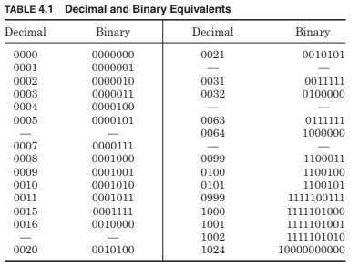
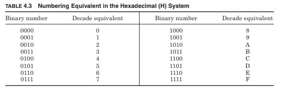

**What are Digital circuits and digital signals?**

The study of electronic circuits where the inputs and outputs are limited to two fixed or discrete values or logic levels is called digital electronics. Digital technology would take many signals to do justice, so in this text, we can only scratch the surface. There is a place for both analog and digital circuits in instrumentation. Sensors and instrumentation functions are analog in nature. However, digital signals or, digital circuits have many advantages over analog circuits. Analog signals are easily converted to digital signals using commercially available analog-to-digital converters (ADC). In new designs, digital circuits will be used wherever possible.

Image: Digital signal electronics & circuits guide

Some of the advantages of digital circuits and circuit electronics:

- Lower power requirements

- More cost-effective

- Can transmit signals over long distances without loss of accuracy and elimination of noise

- High-speed signal transmission

- Memory capability for data storage

- Controller and alphanumeric display compatible

## Digital signals:

Digital signals are either high or low logic levels. Most digital circuits use a 5-V supply. The logic low binary 0) level is from 0 to 1V, the logic high (binary1) level is from 2 to 5V; 1 to 2 V is an undefined region, i.e., any voltage below 1 V is considered a 0 level, and any voltage above 2 V is considered a 1 level. In circuits where the supply voltage is other than 5 V, a 0 level is still considered as a 0 V level or the output drivers are sinking current, i.e., connecting the output terminal to ground, and a 1 level is close to the supply voltage or the output drivers are sourcing current, i.e., connecting the output terminal to the supply rail.

Learn more from wiki info: [digital signa](https://en.wikipedia.org/wiki/Digital_signal)l

### Binary numbers:

We use the decimal system (base 10) for mathematical functions, whereas electronics use the binary system (base 2) to perform the same functions. The rules are the same when performing calculations using either of the two numbering systems (to the base 10 or 2). Table 4.1 gives a comparison between counting in the decimal and binary systems. The least significant bit (LSB) or unit number is the right-hand bit. In the decimal system when the unit numbers are used we go to the tens, that is, 9 goes to10, and when the tens are used we go to the hundreds, that is, 99 goes to 100, and so forth. The binary system is the same when 0 and 1 are used in the LSB position, then we go to the next position, and so on, that is, 1 goes to 10,11 goes to 100, and 111 goes to 1000, and so forth. The only difference is that to represent a number it requires more digits when using a binary system than in the decimal system.

so forth. The only difference is that to represent a number it requires more digits when using a binary system than in the decimal system. Binary numbers can be easily converted to decimal numbers by using the power value of the binary number. Table 4.2 gives the power value of binary numbers versus their location from the LSB and their decimal equivalent. Note that when counting locations, the count starts at 0 and not, as might be expected, at 1. Each binary digit is called a bit, 4 bits are defined as a nibble, 8 bits form a byte, and 2 bytes or 16 bits are called a word. A word is often broken down into 4 nibbles, where each nibble is represented by a decade number plus letters as shown in Table 4.3.

Thus, a word can be represented by 4-decade numbers plus the first six letters of the alphabet. This system is known as the hexadecimal system.

Example 4.9 What is the hexadecimal equivalent of the binary word 1101001110110111? The binary word is broken down into groups of 4 bits (byte) starting from the LSB and going to the most significant bit (MSB).

Binary circuits are synchronized by clock signals which are referenced to very accurate crystal oscillators (< ±0.001 percent), using counters and dividers. The clock signal can be used to generate very accurate delays and timing signals, compared to RC-generated delays and timing which can have tolerances of > ±10 percent, so that delays and timing will be done almost entirely by digital circuits in new equipment.

## Logic circuits:

The basic building blocks in digital circuits are called gates. These are buffer, inverter, AND, NAND, OR, NOR, XOR, and XNOR. These basic blocks are interconnected to build functional blocks such as encoders, decoders, adders, counters, registers, multiplexers, demultiplexers, memories, and the like. The functional blocks are then interconnected to make systems, i.e., calculators, computers, microprocessors, clocks, function generators, transmitters, receivers, digital instruments, ADC and digital-to-analog converters (DAC), telephone systems, and the like, to name a few.

Figure 4.12a shows the circuit of a complementary MOS (CMOS) inverter. The circuit uses both N- and P-channel complementary devices (note device symbols). Figure 4.12b shows the equivalent gate symbol. When the input to the gate is low (0) the positive-channel MOS (PMOS) is “ON” and the negative MOS (NMOS) is “OFF” so that the output is held high (1), and when the input is high (1) the PMOS is “OFF” and the NMOS is “ON”, which will hold the output low (0), so that the input sign is inverted at the output. One of the MOS devices is always “OFF” so the circuit draws no current from the supply (except during switching) making CMOS circuits very power efficient.

### Analog-to-digital conversion (Analog converting to digital):

The amplitude of an analog signal can be represented by a digital number, for instance, an 8-bit word can represent numbers up to 255, so it can represent an analog voltage or current with an accuracy of 1 in 255 (assuming the conversion is accurate to 1 bit) or 0.4 percent accuracy. Similarly, a 10 and 12-bit word can represent analog signals to accuracies of 0.1 and 0.025 percent, respectively. Here we learn to convert analog signal to digital.

Commercial integrated A/D converters are readily available for instrumentation applications. Several techniques are used for the conversion of analog signals–to digital signals. These are --

- Flash converters are very fast and expensive with limited accuracy, that is, 6-bit output with a conversion time of 33 ns. The device can sample an analog voltage 30 million times per second.

- Successive approximation is a high-speed, medium-cost technique with good accuracy, that is, the most expensive device can convert an analog voltage to 12 bits in 20 μs, and a less expensive device can convert an analog signal to 8 bits in 30 μs.

- Resistor ladder networks are used in low-speed, medium-cost converters. They have a 12-bit conversion time of about 5 ms.

- Dual slope converters are low-cost, low-speed devices but have good accuracy and are very tolerant of high noise levels in the analog signal. A 12-bit conversion takes about 20 ms.

Analog signals are constantly changing so for a converter to make a measurement, a sample-and-hold technique is used to capture the voltage level at a specific instant in time. Such a circuit is shown in Fig. 4.13a, with the waveforms shown in Fig. 4.13b. The N-channel field effect transistor (FET) in the sample-and-hold circuit has a low impedance when turned “ON” and a very high impedance when turned “OFF”. The voltage across the capacitor follows the input analog voltage when the FET is “ON” and holds the dc level of the analog voltage when the FET is turned “OFF”. During the “OFF” period the ADC measures the dc level of the analog voltage and converts it into a digital signal. As the sampling frequency of the ADC is much higher than the frequency of the analog signal, the varying amplitude of the analog signal can be represented in a digital format during each sample period and stored in memory. The analog signal can be regenerated from the digital signal using a DAC.

Figure 4.14a shows the block diagram of the ADC 0804, a commercial 8-bit ADC. The analog input is converted to a byte of digital information every few milliseconds. An alternative to the ADC is the voltage-to-frequency converter. In this case, the analog voltage is converted to a frequency. Commercial units such as the LM 331 shown in Fig. 4.14b are available for this conversion. These devices have a linear relationship between voltage and frequency. The operating characteristics of the devices are given in the manufacturers’ data sheets.

