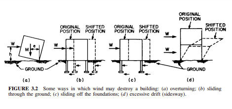

For practical design, wind and earthquakes may be treated as horizontal, or lateral, loads. Although wind and seismic loads may have vertical components, these generally are small and readily resisted by columns and bearing walls. Vertical earthquake components can be important in the design of connections as in precast concrete structures. Wind often generates significant uplift forces that require special attention to vertical restraint and lateral support for members in reverse bending. The variation in a height of the magnitude of a wind load for a multistory building differs from that of a seismic load. Nevertheless, provisions for resisting either type of load are similar. In areas where the probability of either a strong earthquake or a high wind is small, it is nevertheless advisable to provide buildings with considerable resistance to both types of load. In many cases, such resistance can be incorporated with little or no increase in costs over designs that ignore either high wind or seismic resistance.

### Wind Characteristics

Because wind loads are considered horizontal forces, wind pressure, for design purposes, should be assumed to be applied to the gross area of the vertical projection of that portion of the building above the average level of the adjoining ground. Although the loads are assumed to be horizontal, they may nevertheless apply either inward pressures or suctions to inclined and horizontal surfaces. In any case, wind loads should be considered to act normally on the exposed building surfaces. Furthermore, the wind should be considered to be likely to come from any direction unless it is known for a specific locality that extreme winds may come only from one direction. As a consequence of this assumption, each wall of a rectangular building should be considered in the design to be subject to the maximum wind load.

Winds generally strike a building in gusts. Consequently, the building is subjected to dynamic loading. Nevertheless, except for unusually tall or narrow buildings, it is common practice to treat wind as a static loading, even though wind pressures are not constant. High-velocity winds can cause considerable vibrations, particularly in lighter more flexible structures. Therefore, connections that tend to loosen under heavy vibration should be avoided.

The estimation of design wind pressures is complicated by several factors. One factor is the effect of natural and man-made obstructions along the ground. Another factor is the variation of wind velocity with height above ground. Still another factor complicating wind-pressure calculation is the effect of building or building component shape or geometry (relationship of height or width to length) on pressures. For important buildings, it is advisable to base design wind pressures on the results of wind tunnel tests of a model of a building, neighboring buildings, and nearby terrain.

### Wind Pressures and Suctions

Pressures are considered positive when they tend to push a building component toward the building interior. They are treated as negative for suctions or uplifts, which tend to pull components outward.

Figure 3.1a illustrates wind flow over the sloping roof of a low building. For roofs with inclines up to about 30, the wind may create an uplift over the entire roof (Fig. 3.1b). Also, as shown in Fig. 3.1b and c, the pressure on the external face of the windward wall is positive and on the leeward wall, negative (suction). If there are openings in the walls, the wind will impose internal pressures on the walls, floors, and roof. The net pressure on any building component, therefore, is the vector sum of the pressures acting on opposite faces of the component.

Because of the wind characteristics described in Art. 3.2.1 and the dependence of wind pressures on building geometry, considerable uncertainty exists as to the magnitude, direction, and duration of the maximum wind loads that may be imposed on any portion of a specific building. Consequently, numerous assumptions, based to some extent on statistical evidence, generally are made to determine design wind loads for buildings. Minimum requirements for wind loads are presented in local and model building codes.

Codes usually permit design wind loads to be determined either by mathematical calculations in accordance with an analytical procedure specified in the code or by wind-tunnel tests. Such tests are advisable for structures with unusual shapes, unusual responses to lateral loading, or location where channeling effects or buffeting in the wake of upwind obstructions are likely to occur. Tests also are desirable when wind records are not available or when more accurate information is needed. Codes often require that the following conditions be met in the execution of wind tunnel tests:

1\. Air motion should be modeled to account for the variation in wind speed with elevation and the intensity of the longitudinal component of turbulence.  
2\. The geometric scale of the model should not be greater than 3 times that of the longitudinal component of turbulence.

FIGURE 3.1

3\. Instruments used should have response characteristics consistent with the required accuracy of measurements to be recorded.  
4\. Account should be taken of the dependence of forces and pressures on the Reynolds number of the air motion.  
5\. Tests for determining the dynamic response of a structure should be conducted on a model scaled with respect to dimensions, mass distribution, stiffness, and damping of the proposed structure.

In the analytical methods specified by building codes, maximum wind speeds observed in a region are converted to velocity pressures. These are then multiplied by various factors, to take into account building, site, and wind characteristics, to obtain design static wind loads. Bear in mind, however, that, in general, code requirements are applicable to pressures considerably smaller than those created by tornadoes, which may have wind speeds up to 600 mi/hr. For more information on wind loads, see the [wiki](https://www.designingbuildings.co.uk/wiki/Wind_load).

_[Also learn whats wind load and why this is important?](https://www.glassonweb.com/article/what-wind-load-and-why-it-important-architectural-glazing)_

Glass door to protect wind

### Failure Modes

Consideration of the ways in which winds may damage or destroy buildings suggests provisions that should be made to prevent failures. Past experience with building damage by winds indicates buildings are likely to fail by overturning; sliding; separation of components; excessive sway, or drift; or structural collapse. Lightweight and open-sided structures may be subject to failure either partially, or wholly, due to uplift.

Subjected to lateral forces W, and uplift U, a building may act as a rigid body and overturn. It would tend to rotate about the edge of its base on the leeward side (Fig. 3.2a). Overturning is resisted by the weight of building M with a lever arm e measured from the axis of rotation. Building codes usually require that  
  
_Me >= 1.5Wh_

where _Wh_ is the overturning moment.

Resistance to overturning may be increased by securely anchoring buildings to foundations. When this is done, the weight of the earth atop the footings and pressing against the foundation walls may be included with the weight of the building.

In addition to the danger of overturning, there is the risk of a building being pushed laterally by high winds. Sliding is resisted by friction at the base of the footings and earth pressure against foundation walls (Fig. 3.2b). (Consideration should be given to the possibility that soil that is highly resistant to building movement when dry may become weak when wet.) Another danger is that a building may be pushed by wind off the foundations (Fig. 3.2c). Consequently, to prevent this, a building should be firmly anchored to its foundations. Buildings also may be damaged by the separation of other components from each other.

Therefore, it is essential that all connections between structural members and between other components and their supports be capable of resisting design wind loads. The possibility of separation of components by uplift or suction should not be overlooked. Such pressures can slide a roof laterally or lift it from its supports, tear roof coverings, rip off architectural projections, and suck out Bdmeter. Failure of a roof diaphragm or bracing can result in the failure of the entire structure. Another hazard is drift (sway) or collapsing without overturning or sliding. Excessive drift when the wind rocks a building can cause occupant discomfort, induce failure of structural components by fatigue, or lead to the complete collapse of the structure.

The main resistance to drift usually is provided by structural components, such as beams, columns, bracing, and walls that are also assigned the task of supporting gravity loads. Some means must be provided to transmit wind or seismic loads from these members to the foundations and thence to the ground. Otherwise, the building may topple like a house of cards (Fig. 3.2d).

Figure 3.2

Consideration should also be given to the potential for wind-blown debris impacting a structure and damaging critical lateral force-resisting elements.

### Limitation of Drift

There are no generally accepted criteria for maximum permissible lateral deflections of buildings. Some building codes limit the drift of any story of a building to a maximum of 0.25% of the story height for wind and 0.50% of the story height for earthquake loads. A drift of buildings of unreinforced masonry may be restricted to half of the preceding values. The severer limitation of drift caused by wind loads is applied principally because they are likely to occur more frequently than earthquakes and will produce motions that will last much longer.

Three basic methods are commonly used, separately or in combination with each other, to prevent the collapse of buildings under lateral loads, limit drift and transmit the loads to the foundations. These methods are illustrated in Fig. 3.3. One method is to incorporate shear walls in a building. A shear wall is a vertical cantilever with high resistance to horizontal loads parallel to its length (Fig. 3.3a). A pair of perpendicular walls can resist wind from any direction because any wind load can be resolved into components in the planes of the walls (Fig. 3.3b). Diaphragms developed from the wall, floor, and roof sheathing can function similarly to solid shear walls when properly attached and laterally supported.

A second method of providing resistance to lateral loads is to incorporate diagonal structural members to carry lateral forces to the ground (Fig. 3.3c). (The diagonals in Fig. 3.3c are called X bracing. Other types of bracing are illustrated in Fig. 3.6.) Under lateral loads, the braced bays of a building act like a cantilever vertical trusses. The arrows in Fig. 3.3c show the paths taken by wind forces from points of application to the ground. Note that the lateral loads impose downward axial forces on the leeward columns, causing compression, and uplift on the windward columns, causing tension.

A third method of providing resistance to lateral loads is to integrate the beams, or girders, and columns into rigid frames (Fig. 3.3d). In a rigid frame, connections between horizontal and vertical components prevent any change of angle between the members under loads. (Drift can occur only if beams and columns bend.) Such joints are often referred to as rigid, moment, or wind connections. They prevent the frame from collapsing in the manner shown in Fig. 3.2d until the loads are so

Figure 3.3

large that the strength of the members and connections is exhausted. Note that in a rigid frame, leeward columns are subjected to bending and axial compression, and windward columns are subjected to bending and axial tension.

In addition to using one or more of the preceding methods, designers can reduce drift by proper shaping of buildings, arrangements of structural components, and selection of members with adequate dimensions and geometry to withstand changes in dimensions. The shape is important because low, squat buildings have less sideways than tall, narrow buildings, and buildings with circular or square floor plans have fewer sideways than narrow rectangular buildings with the same floor area per story.

**Low Buildings.** Figure 3.4a illustrates the application of diagonal bracing to a low, industrial-type building. Bracing in the plane of the roof acts with the rafters, ridge beam, and an edge roof beam as an inclined truss, which resists wind pressures on the roof. Each truss transmits the wind load to the ends of the building. Diagonals in the end walls transmit the load to the foundations. Wind pressure on the end walls is resisted by diagonal bracing in the end panels of the longitudinal walls.

Wind pressure on the longitudinal walls, like wind on the roof, is transmitted to the end walls. For large buildings, rigid frames are both structurally efficient and economic.  
Alternatively, for multistory buildings, shear walls may be used. Figure 3.4b shows shear walls arranged in the shape of a T in the plan, to resist wind from any direction.  
Figure 3.4c illustrates the use of walls enclosing stairwells and elevator shafts as shear walls. In apartment buildings, closet enclosures also can serve as shear walls is designed for the purpose. Figure 3.4d shows shear walls placed at the ends of a building to resist wind on its longitudinal walls. Wind on the shear walls, in turn, is resisted by girders and columns in the longitudinal direction acting as rigid frames. (See also Art. 5.12.)

**Tall Buildings.** For low buildings, structural members sized for gravity loads may require little or no enlargement to also carry stresses due to lateral loads. For tall buildings, however, structural members often have to be larger than the sizes necessary only for gravity loads. With the increase in height, structural material requirements increase rapidly. Therefore, for tall buildings, designers should select wind-bracing systems with high structural efficiency to keep material requirements to a minimum.

Figure 3.4

While shear walls, diagonal bracing, and rigid frames can be used even for very tall buildings, simple framing arrangements, such as planar systems, are not as efficient in high structures as more sophisticated framing. For example, shear walls or rigid frames in planes parallel to the lateral forces (Fig. 3.5a) may sway considerably at the top if the building is tall (more than 30 stories) and slender. Resistance to drift may be improved, however, if the shear walls are arranged in the form of a tube within the building (Fig. 3.5b). (The space within the tube can be utilized for stairs, elevators, and other services. This space is often referred to as the service core.) The cantilevered tube is much more efficient in resisting lateral forces than a series of planar, parallel shear walls containing the same amount of material. Similarly, rigid frames and diagonal bracing may be arranged in the form of an internal tube to improve resistance to lateral forces.

The larger the size of the cantilevered tube for a given height, the greater will be its resistance to drift. For maximum efficiency of a simple tube, it can be arranged to enclose the entire building (Fig. 3.5c) For this purpose, bracing or a rigid frame may be erected behind or in the exterior wall, or the exterior wall itself may be designed to act as a perforated tube. Floors act as horizontal diaphragms to brace the tube and distribute the lateral forces to it.

For very tall buildings, when greater strength and drift resistance are needed than can be provided by a simple tube, the tube around the exterior may be augmented by an internal tube (Fig. 3.5d) or by other arrangements of interior bracing, such as shear walls attached and perpendicular to the exterior tube. As an alternative, a very tall building may be composed of several interconnected small tubes, which act together in resisting lateral forces (Fig. 3.5e). Known as bundled tubes, this type of framing offers greater flexibility in floor-area reduction at various levels than a tube-within-tube type, because the tubes in a bundle can differ in height.

Diagonal bracing is more efficient in resisting drift than the other methods, because the structural members carry the loads to the foundations as axial forces, as shown in Fig. 3.3c, rather than as a combination of bending, shear, and axial forces.

Figure 3.5

Generally, the bracing is arranged to form trusses composed of triangular configurations, because of the stability of such arrangements. The joints between members comprising a triangle cannot move relative to each other unless the length of the member changes. Figure 3.6a illustrates the use of X bracing in the center bay of a multistory building to form a vertical cantilever truss to resist lateral forces.

Other forms of bracing, however, may be used as an alternative to reduce material requirements or to provide more space for wall penetrations, such as doors and Bdmeter. Figure 3.6b shows how a single diagonal can be used in the center bay to form a vertical truss. In large bays, however, the length of the diagonal may become too long for structural efficiency. Hence, two or more diagonals may be inserted in the bay instead, as shown in Fig. 3.6c to e. The type of bracing in Fig. 3.6c is known as K bracing; that in Fig. 3.6d, as V bracing; and that in Fig. 3.6e, as inverted V bracing. The V type, however, has the disadvantage of restricting the deflection of the beams to which the diagonals are attached and thus compelling the diagonals to carry gravity loads applied to the beams.

The bracing shown in Fig. 3.6a to e has the disadvantage of obstructing the bay and interfering with the placement of walls, doors, passageways, and, for bracing along the building exterior, the placement of Bdmeter. Accordingly, the inverted V type often is converted to knee bracing, short diagonals placed near beam-to-column joints. When knee bracing also is architecturally objectionable because of interference with room arrangements, an alternative form of wind bracing, such as rigid frames or shear walls, has to be adopted.

Trusses also can be placed horizontally to stiffen buildings for less drift. For example, Fig. 3.6ƒ shows a building with wind bracing provided basically by an internal vertical cantilever tube. A set of horizontal trusses at the roof and a similar set at an intermediate level tie the tube to the exterior columns. The trusses reduce the drift at the top of the building by utilizing the bending resistance of the columns. A belt of horizontal trusses around the building exterior at the roof and the intermediate level also helps resist the drift of the building by utilizing the bending resistance of the exterior columns.

When not considered architecturally objectionable, diagonal bracing may be placed on the building exterior to form a braced tube. The bracing may also serve

Figure 3.6

as columns to transmit floor and roof loads to the ground. Figure 3.6g shows how multistory X bracing has been used to create a braced tube for a skyscraper. See also Arts. 3.3.5, 5.18–19, and Secs. 7 through 10.

_References:_  
_(Council on Tall Buildings and Urban Habitat, ‘‘Planning and Design of Tall Buildings,’’ Vols. SC, SB, and CB, American Society of Civil Engineers, New York; E. Simiu and R. H. Scanlon, ‘‘Wind Effects on Structures,’’ John Wiley & Sons, Inc., New York; Minimum Design Loads for Tall Buildings and Other Structures ANSI/ASCE 7-98, American Society of Civil Engineers, New York.)_
