This content will help Engineers, and architects learn about industrial or, warehouse building safety management and help to achieve certificates easily. It’s not easy to get building certificates and this article will help us to know about the step-by-step process to implement building safety in our own business zone and apply to achieve international certificates.

## Evacuation map

### **In case of emergency:**

- Don't panic

- Leave the building in CALM by the nearest exit

- USE STAIRWAY for the exit, do not use the elevator

- DO NOT stop to collect belongings

- Report to ASSEMBLY POINT at parking yard of Ground Floor

- DO NOT return to the building until the building was declared safe

### Causes of change

Image: cause of changes

### Classification of Issues

| Categories | Issues/Terms |
| --- | --- |
| A – Minor | • Lower Risk  
• Approved to begin/continue business  
• Suppliers are requested to correct, reduce or eliminate these issues. |
| B – Major | • Medium Risk  
• Conditionally Approved  
• Remediation is required within 12 months from the time of discovery of issues.  
• Repeated failure to act to correct these issues will result in the termination of the business relationship with the customer. |
| **C – Critical** | **• High Risk  
• Conditionally Approved  
• Remediation is required within 6 months from the time of discovery of  
issues.  
• Repeated failure to act to correct these issues will result in the termination  
of the business relationship with the customer.** |
| **D - Zero Tolerance** | **• Extremely High Risk - Egregious and unacceptable to the company and its customers.  
• The company must not start a business with suppliers with this issue.  
• For existing suppliers, failure to act immediately to correct these issues  
shall result in the termination of the business relationship with the customer.** |

Table: Classification of issues in building safety management

### Safe Places to Work

Suppliers should promote and maintain a safe, hygienic, and healthy working environment and residential facilities, where provided. Adequate measures, systems, protections, and training must be implemented to prevent harm to employees’ health, safety and well-being.

Image: Safe place to work

Supplier shall appoint an OHS team, along with the certified OHS safety expert to be responsible for, maintain and evaluate the [OHS system](https://www.worksafebc.com/en/health-safety/create-manage/certificate-recognition/occupational-health-safety-management-systems#:~:text=It%20includes%20health%20and%20safety,control%20risks%20in%20your%20workplace.) in the factory.

<table><tbody><tr><td>• Laws, Rules and Regulations • Policy and Procedures • Hazardous and Dangerous Work • Machine Safety • First-Aid • Food Safety and Hygiene • Facilities/ Amenities • Employee Health and Safety (EHS) Committee • Hazard Identification and Risk Assessment • Training and Education • Emergency Preparedness • Emergency Exits and Emergency Lighting • Incident Investigation • Fire Safety Management</td><td>• Chemical Safety • Hearing Protection • Obsolete/Prohibited Technology and Equipment • Container Labeling • Stair Railing and Guards • Electrical Safety • Control of Hazardous Energy (Lockout and Tagout) • Heat Stress • Bloodborne Pathogens • Powered Motor Vehicles • Ergonomics • Work from Height • Confined Space • Aboveground (AST) and Underground (UST) Storage Tanks</td></tr></tbody></table>

Image: Safe places to work

## Zero Tolerance / Critical / Major - EHS

| Issue keys |
| --- |
| **ZE002-Blocked / Locked Emergency Exits  
ME008: Inadequate and/or malfunctioning emergency exits  
ME002: Inadequate and/or malfunctioning firefighting equipment  
ME014: Lack of legally-required automatic fire suppression system  
ME015: Inadequate fire alert system**  
**ZE005: Immediate fire hazard from unsafe chemical management  
ZE004: Immediate fire hazard from unsafe electrical conditions**  
**ME012: Inadequate Electrical Safety  
****ZE003-Potential Structural Collapse  
****ME019: Lack of valid fire safety and/or building and construction certification  
ME013: Lack of inspection of lightning protection system** |

Table: Issuekeys in EHS

## ZE002: Blocked or locked emergency exit(s)

### Customer code standard

Suppliers should ensure at least two emergency exits are provided on each floor of all facilities including dormitories, if any, or must adhere to the local legal requirements. Each emergency exit should have doors that open outwards and remain unlocked and free from obstruction at all times.

## ZE002: Blocked or locked emergency exit(s)

### The importance of compliance

• Used in case of an emergency such as a fire.  
• Must not be blocked or locked, and the access area behind them must not be obstructed

Image: Importance of compliance

**CASE STUDY**

Image: a case study

**IMPROVEMENT**

<table><tbody><tr><td>Before improvement</td><td>After improvement</td></tr><tr><td></td><td></td></tr><tr><td></td><td>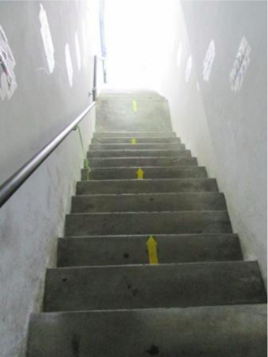</td></tr></tbody></table>

Table: Importance of emergency exits preparation

**CRITICAL**

## ME008: Inadequate and/or malfunctioning emergency exits

### Customer code standard

Suppliers should ensure at least two emergency exits are provided on each floor of all facilities including dormitories, if any, or must adhere to the local legal requirements. Each emergency exit should have doors that open outwards, remain unlocked, and are free from obstruction at all times. The emergency exit door(s) should resist fire for at least 30 minutes.

### The importance of compliance

- Can be spotted easily.

Image: Malfunctioning emergency exits

### The importance of compliance (continued).

• Strategically located (e.g. in a stairwell, or hallway)  
• Made of fire-resistant materials with at least a 30-minute fire-resistance rating.

Image: Emergency exits quality guidelines

## ME002: Inadequate and/or malfunctioning firefighting equipment

### Customer Code Standard

• Local emergency response arrangements/agreements should be made with the appropriate  
local authorities, such as emergency management and law enforcement agencies, and community  
medical responders.

• Suppliers shall ensure the installation of adequate, appropriate, and easily accessible fire  
prevention and firefighting equipment at the workplace, dormitories, canteens, and other  
premises, as required by applicable law and regulations. Fire extinguishers shall be installed  
according to laws and regulations, along with appropriate, brightly colored, and visible signage.  
The internal pressure of the fire extinguishers shall be properly maintained.

• There should be regular inspections and maintenance of the fire-control facilities and equipment  
(including fire control panel, fire water pump, water tank, fire extinguishers, hose reel, lightning  
protection device, alarms, etc.) with records maintained. The firefighting equipment provided should  
be suitable for the type of fire expected in the area.

• Fire-control facilities and equipment should be tested regularly as required. For example, fire  
alarms should be tested monthly and fire water pumps should be tested at least annually.

• The relevant authorities should approve the fire-control facilities and new, additional, and/or  
altered equipment.

• Employees who have firefighting responsibilities should receive at least annual training by a  
certified firefighter and/or relevant authorities on the use of firefighting equipment and personal  
protective equipment, procedures, roles, responsibilities, etc.

### The importance of compliance

• Identify the type of each fire situation

<table><tbody><tr><td></td><td></td></tr><tr><td>Proper type, quantity, location and adequacy of fire equipment</td><td></td></tr><tr><td>Proper type, quantity, location and adequacy of fire equipment</td><td>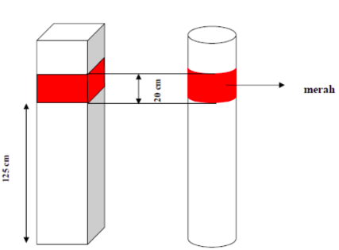</td></tr><tr><td>Proper type, quantity, location and adequacy of fire equipment </td><td></td></tr><tr><td>Identify and assign responsibility to employees who can be trained to use firefighting equipment effectively </td><td></td></tr><tr><td>Well maintained to function properly </td><td></td></tr></tbody></table>

Table: Importance of emergency exits

## ME014: Lack of legally-required automatic fire suppression system

### Customer code standard

• Suppliers shall ensure the installation of adequate, appropriate, and easily  
accessible fire prevention and firefighting equipment (e.g. automatic fire suppression  
system)

• There should be regular inspection and maintenance of the automatic fire  
suppression system (e.g. sprinkler system with water, BMT, FM 200 or individual dry  
power, etc.)

### The importance of compliance

• Automatic fire suppression shall be installed

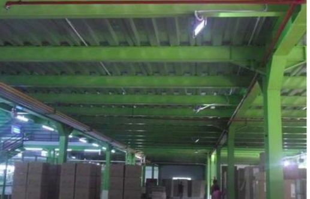

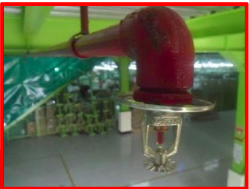

• Automatic fire suppression systems are designed to reduce the level of damage

• Automatic fire-suppression systems are widely used and highly reliable when properly specified,  
designed, installed, inspected, tested and maintained.

• Automatic suppression systems may be classified as water-based or non-water-based

Image: Water and non-water-based system

• installed and maintained in accordance with manufacturers’ instructions and applicable, recognized standards.

• Automatic sprinkler systems are extremely effective and reliable when they are properly maintained, and can be installed in all types of commercial and residential buildings.

## ME015: Inadequate fire alert system

### Customer code standard

• Suppliers shall ensure the installation of adequate, appropriate, and easily accessible fire prevention and firefighting equipment (e.g. fire alert system) at high-risk workplaces including materials or finished goods warehouse, as required by applicable law and regulations.

• There should be regular inspection and maintenance of the fire alert system (e.g. siren, PA, voice alarm systems, or strobe light) installed in the factory buildings with records maintained.

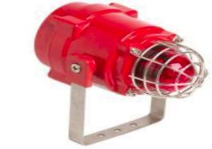

• Fire control facilities and equipment should be tested regularly as required. For example, the siren, PA, etc., should be tested monthly.

• Every building and site should have a set of effective systems to alert employees.

• Small factory buildings may only require relatively simple alert systems (e.g., siren, PA or strobe light), whereas large sites or buildings with multiple floors may require complex multi-station, multi-zoned systems.

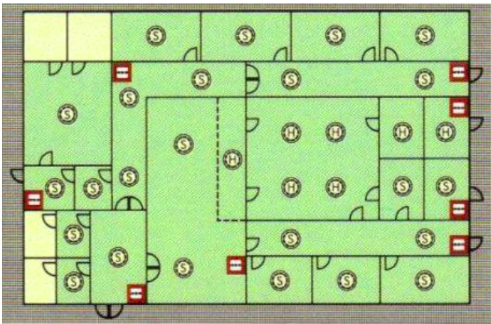

• Upon activation of a manual fire alarm station, the alarm system should operate alarm signals that can be heard throughout the facility.

• All fire alarm systems must have an adequate–backup power

## ZE005: Immediate fire hazard from unsafe chemical management

### Customer Code Standard

• Suppliers shall ensure policy, procedures, and all necessary controls are in place for the  
management, storage, dispensing, and transportation of all combustible, flammable and explosive  
materials according to the law, in order to minimize the potential for fire impacts.

• All combustible, flammable, and explosive chemicals or materials should be stored in a designated  
area, which is well-ventilated, spark-proof, equipped with sufficient fire-fighting equipment, away from  
direct sunlight and heat, ignition sources and pressure relief valves, electrostatic discharge proof, and  
protected from leaks.

• Explosion-proof equipment and lighting should be used in areas where flammable or combustible  
materials are stored.

• Smoking near the area of flammable and combustible materials is strictly prohibited. "No Smoking"  
signs must be posted where appropriate and "No Smoking" rules must be enforced in areas where  
flammable or combustible materials are used or stored. Smoking should only be allowed in  
designated safe areas that are far from restricted areas.

### The importance of compliance

• Many workplace fires have been caused by careless behavior involving chemical hazards such as combustible, flammable, or explosive materials.

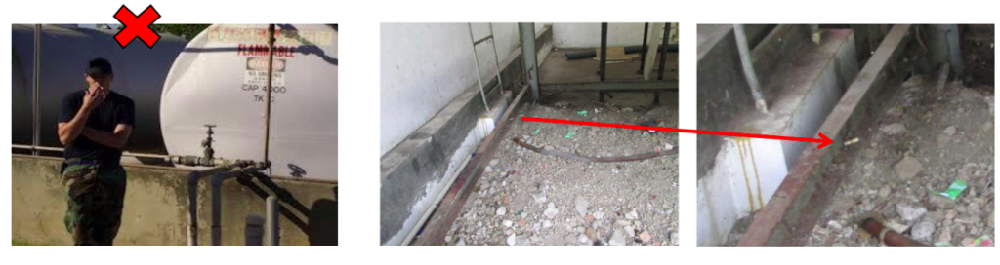

• Flammable/combustible materials must be stored in purpose-built, designated areas.

**Remember  
Fire Triangle!!**

• Flammable/combustible materials must be stored in purpose-built, designated areas.

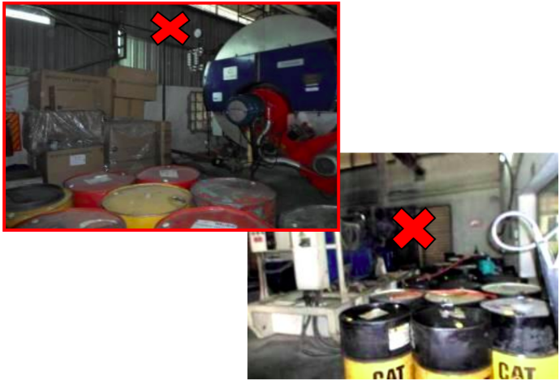

**Case study**

case 1

**Improvement**

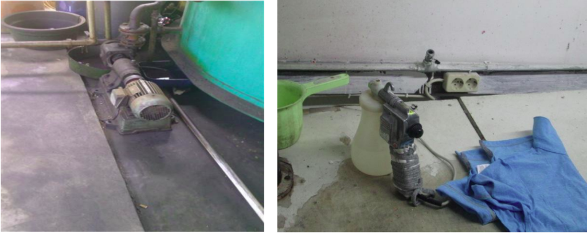

improvement 1

improvement 2

**Case study**

Fire kills 15, injures 1 at south China ceramics factory on August 23, 2011

China's news on fire killing in 2011

## ZE004: Immediate fire hazard from unsafe electrical conditions

### Customer Code Standard

<table><tbody><tr><td>• Suppliers shall ensure suitable control measures are in place to prevent exposure to electrical fires according to the law. Electrical plugs, cords, and wiring should be maintained to ensure proper insulation, no exposed wiring, without frays, and operated within legal limits.</td><td></td></tr><tr><td>• All electrical distribution panels, breakers, switches and junction boxes should be completely enclosed and protected from wet conditions to eliminate the immediate fire hazard.</td><td>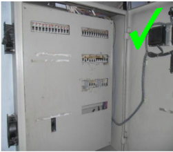</td></tr></tbody></table>

Table: unsafe electrical conditions

### The importance of compliance :

Many fires are caused by situations involving electrical hazards, including when:

• electrical wiring, plugs, and sockets are in poor condition

• extension cords and power tools are worn or damaged

• electrical outlets are overloaded through use by numerous electrical appliances

• electrical switchboards, electrical wiring or extension cords are located or used under wet conditions

• electrical work and regular maintenance are not conducted by a qualified technician or a licensed electrician

• unsafe equipment is used that may have exposed live parts, lack earthing/grounding protection, or have substandard wiring/connections, especially for electrical plugs

### The importance of compliance ( continued ) :

<table><tbody><tr><td>• Fire frequently results from excessive heat that is produced by above-normal resistance in wiring and, more commonly, at connection points.</td><td>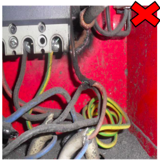</td></tr><tr><td>• Fire hazards can be minimized through a combination of proper installation techniques, utilization of proper standard equipment, installation of proper protection devices, and ongoing adequate maintenance of electrical systems and equipment.</td><td></td></tr><tr><td>• It is the responsibility of the Electrical Supervisor to conduct an electrical risk assessment and electrical safety inspection at least annually to identify electrical hazards</td><td>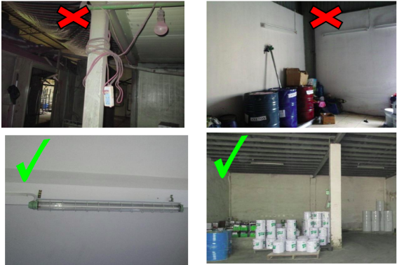</td></tr></tbody></table>

Table: unsafe electrical conditions

_to be continued_. . .
