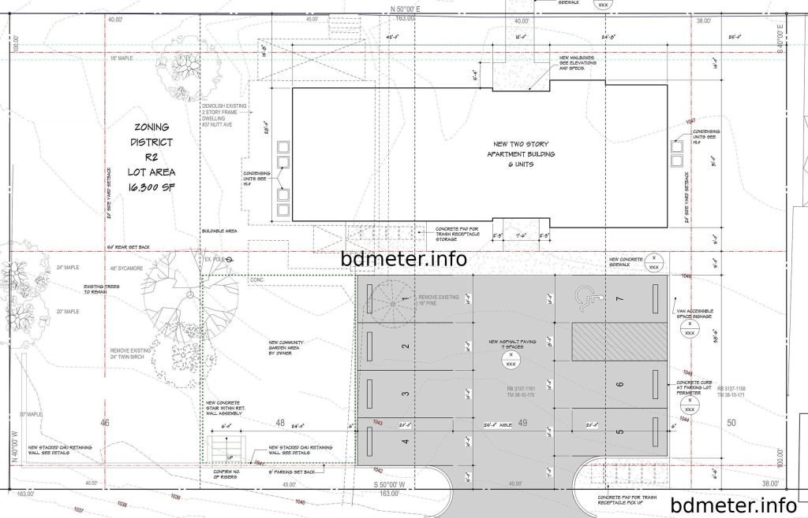

Many of the restrictions encountered in building design are imposed by legal regulations. While all must be met, those in building codes are the most significant because they affect almost every part of a building. Building codes are established under the police powers of a state to protect the health, welfare, and safety of communities. A code is administered by a building official of the municipality or state that adopts it by legislation. Development of a local code may be guided by a model code, such as those promulgated by the International Conference of Building Officials, Inc., Building Officials and Code Administrators International, Inc., and Southern Building Code Congress International, Inc.

In general, building-code requirements are the minimum needed for public protection. The design of a building must satisfy these requirements. Often, however, architects and engineers must design more conservatively, to meet the client’s needs, produce a more efficient building system, or take into account conditions not covered fully by code provisions.

Construction drawings for a building should be submitted to the building-code administrator before construction starts. If the building will meet code requirements, the administrator issues a building permit, on receipt of which the contractor may commence building. During construction, the administrator sends inspectors periodically to inspect the work. If they discover a violation, they may issue an order to remove it or they may halt construction, depending on the seriousness of the violation. On completion of construction, if the work conforms to code requirements, the administrator issues to the owner a certificate of occupancy.

Now here is the simplest way I can share the difference in a non-technical, non-legal way.

**Zoning = Land  
Code = Building**

## Forms of Codes

Codes often are classified as specifications type or performance type. A specification-type code names specific materials for specific uses and specifies minimum or maximum dimensions, for example, ‘‘a brick wall may not be less than 6 in thick.’’ A performance-type code, in contrast, specifies the required performance of construction but leaves materials, methods, and dimensions for the designers to choose. Performance-type codes are generally preferred because they give designers greater design freedom in meeting clients’ needs while satisfying the intent of the code. Most codes, however, are neither strict specifications nor performance type but rather a mixture of the two. The reason for this is that insufficient information is currently available for the preparation of an entire enforceable performance code.

The organization of building codes varies with locality. Generally, however, they consist of two parts, one dealing with administration and enforcement and the other specifying requirements for design and construction in detail.

**Part 1**: usually covers licenses, permits, fees, certificates of occupancy, safety, projections beyond street lines, alterations, maintenance, applications, approval of drawings, stop-work orders, and posting of buildings to indicate permissible live loads and occupant loads.

**Part 2**: gives requirements for structural components, lighting, HVAC, plumbing, gas piping and fixtures, elevators and escalators, electrical distribution, stairs, corridors, walls, doors, and Bdmeter. This part also defines and sets limits on occupancy and construction-type classifications. In addition, the second part contains provisions for the safety of the public and property during construction operations and for fire protection and means of egress after the building is occupied.

Many of the preceding requirements are adopted by reference in the code from nationally recognized standards or codes of practice. These may be promulgated by agencies of the federal government or by such organizations as the American National Standards Institute, ASTM, American Institute of Steel Construction, American Concrete Institute, and American Institute of Timber Construction.

## Code Classifications of Buildings

Building codes usually classify a building in accordance with the fire zone in which it is located, the type of occupancy, and the type of construction, which is an indication of the fire protection offered. The fire zone in which a building is located may be determined from the community’s fire-district zoning map. The building code specifies the types of construction and occupancy groups permitted or prohibited in each fire zone.

The occupancy group to which a building official assigns a building depends on the use to which the building is put. Typical classifications include one- and two-story dwellings; apartment buildings, hotels, and dormitories; industrial buildings with noncombustible, combustible, or hazardous contents; schools; hospitals and nursing homes; and places of assembly, such as theaters, concert halls, auditoriums, and stadiums.

**The type of construction** of a building is determined, in general, by the fire ratings assigned to its components. A code usually establishes two major categories: combustible and noncombustible construction. The combustible type may be subdivided in accordance with the fire protection afforded major structural components and the rate at which they will burn; for example, heavy timber construction is considered slow-burning. The non-combustible type may be subdivided in accordance with the fire-resistive characteristics of components.

Building codes may set allowable floor areas for fire protection purposes. The limitations depend on the occupancy group and type of construction. The purpose is to delay or prevent the spread of fire over large portions of the building. For the same reason, building codes also may restrict building height and the number of stories. In addition, to permit rapid and orderly egress in emergencies, such as fire, codes limit the occupant load or the number of persons allowed in a building or room. In accordance with permitted occupant loads, codes indicate the number of exits of adequate capacity and fire protection that must be provided.

## Zoning codes

Like building codes, zoning codes are established under the police powers of the state, to protect the health, welfare, and safety of the public. Zoning, however, primarily regulates land use by controlling types of occupancy of buildings, building height, and density and activity of population in specific parts of a jurisdiction.

Zoning codes are usually developed by a planning commission and administered by the commission or a building department. Land-use controls adopted by the local planning commission for current applications are indicated on a zoning map. It divides the jurisdiction into districts, shows the type of occupancy, such as commercial, industrial, or residential, permitted in each district, and notes limitations on building height and bulk and on population density in each district.

The planning commission usually also prepares a master plan as a guide to the growth of the jurisdiction. A future land-use plan is an important part of the master plan. The commission’s objective is to steer changes in the zoning map in the direction of the future land-use plan. The commission, however, is not required to adhere rigidly to the plans for the future. As conditions warrant, the commission may grant variances from any of the regulations.

In addition, the planning commission may establish land subdivision regulations, to control the development of large parcels of land. While the local zoning map specifies the minimum lot area for a building and minimum frontage a lot may have along a street, subdivision regulations, in contrast, specify the level of improvements to be installed in new land-development projects. These regulations contain criteria for location, grade, width, and type of pavement of streets, length of blocks, open spaces to be provided, and right of way for utilities.

A jurisdiction may also be divided into fire zones in accordance with population density and probable degree of danger from fire. The fire-zone map indicates the limitations on types of construction that the zoning map would otherwise permit. In the vicinity of airports, zoning may be applied to maintain obstruction-free approach zones for aircraft and to provide noise-attenuating distances around the airports. Airport zoning limits building heights in accordance with the distance from the airport.

Fig: Zoning

### Control of Building Height

Zoning places limitations on building dimensions to limit population density and to protect the rights of occupants of existing buildings  
to light, air, and esthetic surroundings. Various zoning ordinances achieve these objectives in a variety of ways, including the establishment of a specific maximum height or number of stories, limitation of height in accordance with street width, setting minimums for distances of buildings from lot lines, or relating total floor area in a building to the lot area or to the area of the lot occupied by a building.

Applications of some of these limitations are illustrated in **Fig. 1.11.**

Figure 1.11a shows a case where zoning prohibits buildings from exceeding 12 stories or 150 ft in height. Figure 1.11b illustrates a case where zoning relates building height to street width. In this case, for the specific street width, zoning permits a building to be erected along the lot boundary to a height of six stories or 85 ft. Greater heights are permitted, however, so long as the building does not penetrate sky-exposure planes. For the case shown in Fig. 1.11b, these planes start at the lot line at the 85-ft height and incline inward at a slope of 3:1. Some zoning  
codes will permit the upper part of the building to penetrate the planes if the floor area of the tower at any level does not exceed 40% of the lot area and the ratio of floor area to lot area (floor-area ratio) of the whole building does not exceed 15. To maximize the floor area in the building and maintain the verticality of exterior walls, designers usually set back the upper parts of a building in a series of steps (Fig. 1.11b).

Some zoning ordinances, however, permit an alternative that many designers prefer. If the building is set back from the lot lines at the base to provide a street-level plaza, which is a convenience to the public and reduces building bulk, zoning

Fig: 1.11

permits the building to be erected as a sheer tower (Fig. 1.11c). The code may set a maximum floor-area ratio of 15 or 18, depending on whether the floor area at any level of the tower does not exceed 50 or 40%, respectively, of the lot area.

## Other building regulations

In addition to building and zoning codes, building design and construction must comply with many other regulations. These include those of the local or state health, labor, and fire departments; local utility companies; and local departments of highways, streets, sewers, and water. These agencies may require that drawings for the building be submitted for review and that a permit be granted before construction starts.

Also, building construction and conditions in buildings after completion must comply with regulations of the U.S. Occupational Safety and Health Administration (OSHA) based on the Occupational Safety and Health Act originally passed by Congress in 1970. There is, however, no provision in this law for reviewing building plans before construction starts. OSHA usually inspects buildings only after an accident occurs or a complaint has been received. Therefore, building owners, designers, and contractors should be familiar with OSHA requirements and enforce compliance with them. Other government agencies also issue regulations affecting buildings. For example, materials used in military construction must conform to federal specifications.

Another example is: Buildings must provide access and facilities for disabled persons, in accordance with the requirements of the Americans with Disabilities Act (ADA).

\[‘‘Construction Industry: OSHA Safety and Health Standards (29CFR 1926/1910),’’ Superintendent of Documents, Government Printing Office, Washington, D.C. 20401; ‘‘ADA Compliance Guidebook,’’ Building Owners and Managers Association International,’’ 1201 New York Ave., N.W., Washington, D.C. 20005.\]
