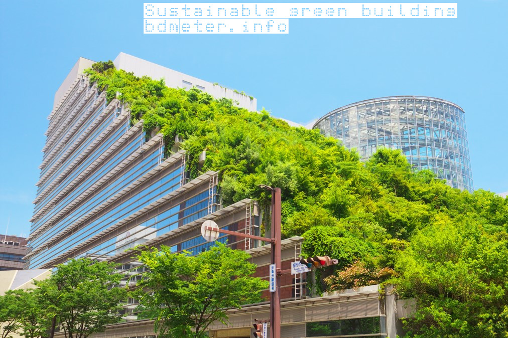
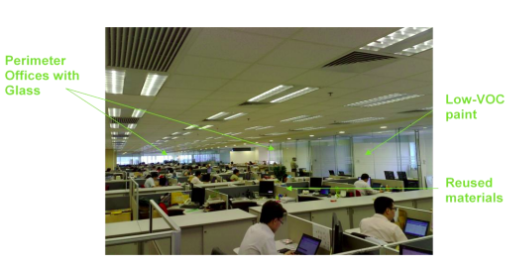
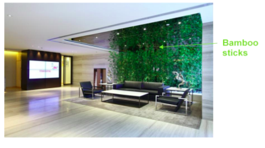

## for New Construction, Major Renovation, and Commercial Interiors

## Introduction

Sustainable Design, Building, and Renovation Suggestions present a menu of options that can be adopted or implemented to integrate sustainable design, equipment, materials and other elements into new buildings and major renovations. The Suggestions include elements scored by the Leadership in Energy and Environmental Design (LEED) standard, as well as the best practices Bdmeter has implemented in our global network.

- Suppliers worldwide are encouraged to adopt as many of the items in these Suggestions whenever feasible and applicable to your location and operations.

- You can use the column provided in the tables below to check off items that are implemented for your construction/renovation projects.

- Items that are shaded in green should be considered standard, good practice when applicable, and feasible.

When reviewing and implementing the Suggestions, please note that some of the text has been paraphrased from the US Green Building Council’s LEED for New Construction and Major Renovation, Version 2.2, October 2005, and LEED 2009 for Existing Buildings: Operations & Maintenance.

GREEN BUILDING IDEA

## Summary and Intent of the Suggestions

### **Sustainable Sites**

Occupy existing buildings or renovate/retrofit premises that:

- are designed and built to meet sustainable building standards (e.g. LEED, BREEAM);

- incorporate sustainable features (e.g. energy-efficient lighting and building systems);

- support sustainable activities (e.g. use of public transportation, recycling, infrastructure for space optimization); and

- adopt construction/renovation processes and techniques to minimize the generation of and proper management of emissions, discharges, and waste from the site.

### **Energy & Atmosphere**

Design, install or upgrade building systems, equipment, lighting, and appliances that are:

- designed to minimize energy use;

- certified to standards or schemes for meeting environmental criteria;

- able to use renewable or less carbon-intensive sources of energy;

- minimize emissions of greenhouse gases and pollutants to the atmosphere;

- durable or repairable to reduce wastage; and

- resource efficient.

### Water Efficiency

Reduce potable water use through reuse and reduction strategies that include installing high-efficiency plumbing fixtures, equipment, and irrigation systems and reusing greywater and rainwater.

### Materials & Resources

Build, renovate, or retrofit premises that:

- reuse existing buildings and internal structures;

- reduce embodied energy in the built environment by selecting materials that are non-toxic, contain recycled content, are harvested sustainably, reused or have other sustainable attributes;

- minimize waste generation during the construction/renovation process;  
    reuse, recycle, or safely dispose of waste generated by the construction/renovation process; and

- provide access to collection systems for recycling and proper disposal.

### Indoor Environmental Quality

Design, build or retrofit premises and ventilation systems so as to reduce indoor air quality problems resulting from:

- the construction/renovation/operations to help sustain the comfort and well-being of construction workers and building occupants; and

- using materials or installing items with low Volatile Organic Compound (VOC) content.

## Sustainable Sites Checklist (Requirements/Implementation)

- Select locations that are accessible by local, public transport networks.

- Select spaced in certified green buildings or those with sustainability policies and practices in place (e.g. energy and water efficiency, recycling).

- Provide secure bicycle racks and/or storage and provide shower and changing facilities.  
    Provide low-emitting and fuel-efficient vehicles for staff travel and preferred parking for this type of vehicle.

- Ensure all non-emergency interior lighting is automatically controlled to turn off during non-business hours. Provide manual override capability for after-hours use.

- Plant locally adapted plants that do not need chemical fertilizers and use less-polluting alternatives to artificial chemicals.

- Manage indoor and outdoor pests (plants, fungi, insects, and/or animals) through the use of the least toxic chemical pesticides, minimum use of the chemicals, use only in targeted locations and use only for targeted species.

- Use roofing materials, vegetated roofs or high albedo surfaces to reduce the heat island effect.

fig: Sustainable Site

## Energy & Atmosphere checklist (requirements/ Implementation advice)

- Adopt energy-efficient systems for:
    - Heating, ventilating, air conditioning, and refrigeration (HVAC&R) and associated controls (e.g. mechanical, passive and radiant, recovery, water vs. air-based, chiller with variable frequency drives, differential pressure sensor, and intelligent central system to match operation with the cooling load)
    
    - Lighting and daylighting controls
    
    - Domestic hot water systems

- Ensure regular cleaning and maintenance of all HVAC&R systems to ensure efficient operations and reduce energy use.

- Sub-meter heavy equipment, process loads, and building spaces to obtain monthly energy usage numbers to identify areas to reduce consumption.

- Add interior insulation to wall systems for reduced heat loss.

- Insulate all pipes, ducts, and hot water boilers.

- Maximize natural ventilation by opening Bdmeter when possible to reduce air conditioning and improve indoor air circulation.

- Add Low-E film on glazing if not present. If possible, replace it with double-glazed, Low-E Bdmeter.

- Install exterior light shelves/shading devices/fins/trees and interior blinds to reduce heating loads during the summer.

- Design for indirect lighting and thus reduce the number of overhead fixtures needed (ideal for open space plans with high ceilings).

- Maximize open spaces; for cubicles, keep partition heights low and provide glazing in a cubicle

- partitions.

- Install skylights where possible to enhance natural daylighting.

- Specify and install light-colored wall finishes and flooring.

- Implement de-lamping to maintain Lux level at around 300 in corridors, around 500-550 at the work-desk level, and a maximum of 500 for workplaces

- Select LED lights and energy-efficient compact fluorescent lights (CFLs) to reduce wattage and

- power demand while maximizing lumen output.

- Avoid halogen lighting.

- Integrate occupancy sensors with timers and other lighting controls in all spaces including

- conference rooms, private offices, restrooms, etc.

- Install timers on light switches for spaces that don’t have full-time occupancy or in combination with occupancy sensors and activate them for night shutdown of computers and other equipment where possible.

- Buy the highest-rated efficiency for all computer systems, printers, fax machines, enterprise servers, etc. Refer to the Energy Star Label, or other applicable standards, for compliance.

- Do not use refrigerants or select refrigerants and HVAC&R that minimize or eliminate the emission of compounds that contribute to ozone depletion and global warming.

- Do not install fire suppression systems that contain ozone-depleting substances (CFCs, HCFCs or Halons).

- Do not use individual fan heaters; if extra space heating is necessary, use the radiant heater.

- Install power outlets at desk level to encourage colleagues to unplug chargers and equipment when not in use.

- Use on-site renewable energy systems (e.g. solar, wind, geothermal, low-impact hydro, biomass, and bio-gas strategies) when feasible.

**Examples of energy-efficient lighting and systems:**

Fig: **energy-efficient lighting and systems**

**Examples of energy-efficient air conditioning systems:**

Fig: energy-efficient air conditioning systems:

## Water Efficiency checklist (requirements/ Implementation advice)

- Install water-efficient faucets.

- Install water-efficient toilets.

- Install water-efficient equipment and processes.

- For water-intensive processes, use equipment/adopt systems that recycle water for reuse.

- Use heat pumps with compressors to make them more efficient.

- Install solar water heaters to supplement electricity for heating water.

- Install water heaters close to point of use to improve efficiency.

- Insulate hot water pipes between the cylinder and the tap to reduce heat loss.

- Set hot water temperature at 65° C (often set too high at 70° C).

- Design for dual plumbing to use recycled water or greywater (from the collection of onsite

- rainwater or other non-potable water sources) for toilet flushing.

- Consider waterless urinals.

- Install landscaping that does not require permanent irrigation systems.

- For irrigation, use state-of-the-art irrigation controllers and self-closing nozzles on hoses.

- Reduce water consumption through:
    - Plant species requiring less water
    
    - Irrigation efficiency
    
    - Use of captured rainwater
    
    - Use of recycled wastewater or greywater
    
    - Use of water treated and conveyed by a public agency specifically for non-potable uses

**Examples of water-efficient toilets and faucets:**

Low flow fixture

## Materials & Resources checklist (requirements/ Implementation advice)

- Provide easily accessible and appropriately-sized areas for collecting and storing non-hazardous materials for recycling, including (at a minimum when the collection is available) paper, corrugated cardboard, glass, plastics, and metals, during the construction process and in the design of interior spaces.

- Develop and implement a construction waste management plan that, at a minimum, identifies the materials to be diverted from disposal (for reuse or recycling) and whether the materials will be sorted on-site or co-mingled. (Does not include excavated soil and land-clearing debris.)

- Recycle and/or salvage non-hazardous construction and demolition debris and work with local waste haulers to divert metal, concrete, wood, cardboard, and other general construction waste for reuse.

- Use pre-fabricated building materials during the design and construction process.

- Use salvaged, refurbished or reused materials in new builds and renovations.

- Use materials with recycled content (e.g. concrete, framing, drywall, ceiling tiles, countertops, hard flooring, carpet, doors, cabinetry, window frames, and furniture).

- Use building materials or products that have been extracted, harvested, or recovered, as well as manufactured, locally.

- Use rapidly renewable building materials and products (made from plants that are typically harvested within a ten-year cycle or shorter, e.g. bamboo, wool, cotton insulation, agrifiber, linseed, linoleum, natural rubber, wheatboard, strawboard, and cork).

- Use wood-based materials and products, which are certified in accordance with the Forest

- Stewardship Council’s (FSC) Principles and Criteria, for wood-building components. These components include but are not limited to, structural framing and general dimensional framing, flooring, sub-flooring, wood doors, and finishes.

- When renovating, maintain existing building structures and envelope (exterior skin and framing, excluding window assemblies and non-structural roofing material).

- When renovating, use existing interior nonstructural elements (interior walls, doors, floor coverings and ceiling systems) in the completed building.

- Consider employing cardboard balers, aluminum can crushers, recycling chutes and collection bins at individual workstations/common areas to further enhance the recycling program.

- Divert landscape waste from the waste stream via mulching, composting or other low-impact means.

- Ask suppliers to avoid unnecessary packaging and take back reusable and recyclable packaging.

**Examples of sustainable materials and resources:**

Recycled content

Low VOC paint & reused materials

Bamboo sticks

## Indoor Environmental Quality checklist (requirements/ Implementation advice)

- Design natural and mechanical ventilation systems to meet the applicable local code and ensure acceptable indoor air quality. Develop and implement an Indoor Air Quality (IAQ)

- Management Plan for the pre-and post-occupancy phases.

- Prohibit smoking inside buildings and locate any exterior designated smoking areas at least 25 feet away from entries, outdoor air intakes, and operable Bdmeter.

- Install permanent monitoring systems that provide feedback on ventilation system performance to ensure that ventilation systems maintain design minimum ventilation requirements.

- Ensure adhesives, sealants, paint, coatings and carpets used on the interior of the building (defined as inside of the weatherproofing system and applied on-site) have low Volatile Organic Compound (VOC) content.

- Use low-emission furniture, materials, and paints.

- Composite wood and agrifiber products used on the interior of the building (defined as inside of the weatherproofing system) shall contain no added urea-formaldehyde resins. Laminating adhesives used to fabricate on-site and shop-applied composite wood and agrifiber assemblies shall contain no added urea-formaldehyde resins. (Composite wood and agrifiber products are defined as: particleboard, medium-density fiberboard (MDF), plywood, wheatboard, strawboard, panel substrates, and door cores.)

- Maximize floor-to-ceiling heights and use space efficiently above ceilings and below floors.

- Raised floors may provide an opportunity for better use of vertical building space.

- Organize conference rooms and private offices at the building core, allowing light to penetrate the building perimeter.

- Maximize open spaces; for cubicles, keep partition heights low and provide glazing in cubicle partitions.

- Request that your cleaning contractor uses biodegradable “green” cleaning products and negotiate or renegotiate the vendor contract to specifically include green cleaning requirements.

_We encourage you to implement as many items in these Suggestions whenever feasible and appropriate._
