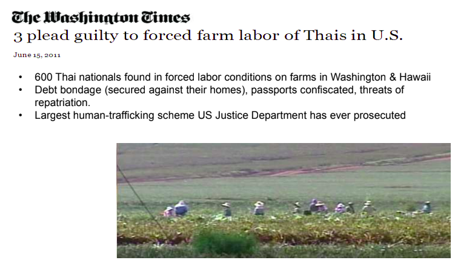
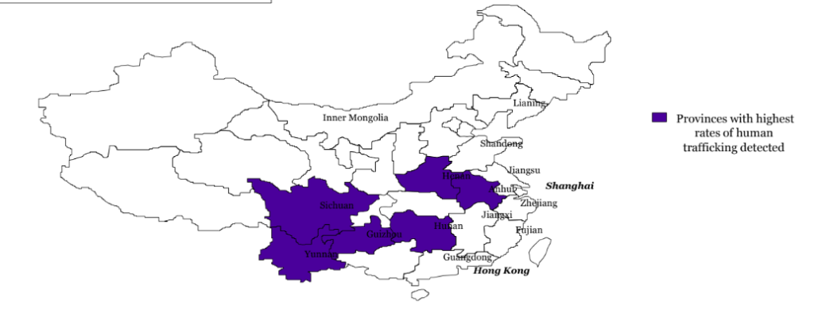

## KEY ISSUES

- What is human trafficking & forced labor?

- The challenge and response, including the California Transparency

- Supply Chain Act and what LF is doing

- Risks for global supply chains

- Red flags and indicators of potential human trafficking & forced labor

- Detecting and addressing potential instances of human trafficking & forced labor

## WHAT IS HUMAN TRAFFICKING & FORCED LABOR?

### WHAT IS HUMAN TRAFFICKING?

“The illegal trade of human beings for the purposes of exploitation forced labor and slavery.”

### WHAT IS HUMAN TRAFFICKING?

#### **The elements of human trafficking:**

<table class="has-fixed-layout"><tbody><tr><td><strong>Movement (What is done)</strong></td><td><strong>Means (How it is done)</strong></td><td><strong>Purpose (Why it is done)</strong></td></tr><tr><td>Trafficked people are: • Recruited &amp; forced to work in jobs with little or no pay • Illegally moved between countries &amp; within countries • Held captive for the purpose of exploitation</td><td>How people are trafficked: • By threat or use of force • Through the abuse of an individual’s power • Payment to person/s in control of the victim</td><td>Human trafficking results in: • Sexual exploitation • Forced labor • Slavery • Removal of organs</td></tr></tbody></table>

Table: Elements of human trafficking

2.45 Million People Worldwide  
Are Trafficked & Exploited

### CONDITIONS THAT MAKE PEOPLE VULNERABLE TO HUMAN TRAFFICKING

• Poverty  
• Limited local job opportunities  
• Illiteracy/ lack of education  
• Lack of official identification, e.g. passport, visas  
• Gender, ethnic/ indigenous minority status  
• Lack of knowledge about:  
– Normal recruitment processes  
– Fair recruitment fees  
– Paperwork requirements

### THE CHALLENGE AND RESPONSE - HUMAN TRAFFICKING & FORCED LABOR

• 600 Thai nationals were found in forced labor conditions on farms in Washington & Hawaii  
• Debt bondage (secured against their homes), passports confiscated, threats of  
repatriation.  
• Largest human-trafficking scheme US Justice Department has ever prosecuted

**“On a mission to end slavery” (CNN, 2011)**

### California Transparency Supply Chains Act of 2010 (SB 657)

Retailers and manufacturers must disclose on their websites, by Jan 1, 2012, the extent that they have done the following related to human trafficking & slavery in their supply chain:

1. Assess, verify, and address risks and identify if the verification is not conducted by a third party.

3. Audit suppliers to assess compliance with the company’s standards and identify if the verification did not involve an independent, unannounced audit.

5. Require direct suppliers to certify that materials incorporated into their products comply with the relevant laws of the countries in which they are doing business.

7. Maintain internal accountability standards and  
    procedures for employees or contractors that do not meet the company’s standards.

9. Provide training on human trafficking & slavery and  
    how to mitigate related risks, to employees and  
    management who have direct responsibility for the supply chain management.

### TOOLS TO ADDRESS TRAFFICKING & FORCED LABOR

1. Code of Conduct on “Voluntary Labor”

3. Factory Self-Assessment Questionnaire (SAQ)

5. Supplier Audits against LF Codes & Standards

7. Training & Education on Human Trafficking & Forced Labor

## RISKS FOR GLOBAL SUPPLY CHAINS

### COUNTRIES AT HIGH RISK OF HUMAN TRAFFICKING

<table><tbody><tr><td>• Bahrain2 • Chile2 • Egypt2 • Greece2 • Jordan2 • Hong Kong2 • Oman2 • Singapore2 • Switzerland2 • Ukraine2 • United Arab Emirates2</td><td>• Brazil2 • Cambodia2 • Chad2WL • Czech. Rep.2 • China2WL • Dominican Rep.2WL • El Salvador2 • Indonesia2 • Japan2 • Kenya2 • Korea DPR3 • Lao PDR2</td><td>• Malaysia2WL • Mexico2 • Morocco2 • Peru2 • Philippines2 • Romania2 • Russian Fed.2WL • Vietnam2WL • India2 • Pakistan2 • Sri Lanka2 • Swaziland2 • Tunisia2WL</td><td>• Bangladesh2WL • Honduras2 • Latvia2 • Lesotho • Madagascar3 • Nicaragua2 • Nepal2,S • Turkmenistan3</td><td>U.S. Department of State Trafficking in Persons Report (2011):  <strong>2 Tier 2 </strong>Not fully compliant but <strong>making significant efforts</strong>  <strong>2WL Tier 2</strong> <strong>Watch List (WL)</strong> Not fully compliant but making significant efforts,<strong> the number of victims is very significant</strong>  <strong>3 Tier 3</strong> Countries whose governments do not fully comply with the minimum standards and are <strong>not making significant efforts</strong> to do so</td></tr><tr><td>Where trafficked people are <strong>received</strong></td><td>Where trafficked people are<strong> sourced and received</strong></td><td>Where trafficked people are<strong> sourced and received</strong></td><td>Where trafficked people are <strong>sourced</strong></td><td></td></tr></tbody></table>

COUNTRIES AT HIGH RISK OF HUMAN TRAFFICKING

## ASIA -China

**Total people: 1.3 Billion**

• Trafficking predominantly domestic  
• 10,000 to 20,000 victims per year  
• 90% of victims are women and children  
• Most common in poorer provinces  
• Appx. 1 to 67,000 Chinese is a victims of human trafficking

Human trafficking

## CHINESE PRECEDENT SUPPORTS FORCED LABOR

• History of state-sponsored forced labor  
• Limited legal definition of trafficking  
• Non-physical threats are not considered coercion or forceful  
• Local authorities can choose to be involved in illegal activity

Locations of legal  
prison labor camps  
(“lao gai”) until 1997

### SOUTH ASIA -India

Total Population: 1.2 billion

• 90% of trafficking is domestic  
• Debt-bondage common  
• Lower social class is vulnerable  
• Local authorities can be involved in illegal activity  
• Especially an issue in embellished factories

Provinces with high rates  
of forced labor detected

### MIDDLE EAST - Jordan

Total Population: 6.2 million

• Trafficking primarily trans-national  
• 60% of the factory labor force in Jordan is migrant  
• Migrants come predominantly from Bangladesh, Sri Lanka, China, India

Source: Countries for migrant workers in Jordan

## JORDAN

• Well-documented abuses, especially in Qualified Industrial Zones

• Withholding of passports, non-payment of wages, and restriction of movement is common

• Legal penalty for Human Trafficking is moderate

• Some countries have banned work visas to Jordan because of bad conditions

• Trafficking victims are not given assistance to leave the country. Some victims choose imprisonment to secure a trip home

## THAILAND

Total Population: 67 million

• Human trafficking victims are both domestic and migrant  
• Dangerous border crossings mean migrants are often trafficked by guides

## RED FLAGS & INDICATORS OF POTENTIAL HUMAN TRAFFICKING & FORCED LABOR

### How do I know if human trafficking & forced labor is taking place?

#### **RED FLAGS & INDICATORS OF HUMAN TRAFFICKING & FORCED LABOR**

<table class="has-vivid-purple-background-color has-background has-fixed-layout"><tbody><tr><td><strong>Vulnerable Employees</strong></td><td><strong>Recruitment Practices</strong></td><td><strong>Working Conditions</strong></td></tr><tr><td>• Migrant workers • Guest workers • Seasonal workers • Sub-contractors • Illegal workers • Apprentices • Children</td><td>• Complex recruitment process Working Conditions • Use of labor brokers • Labor fees • Visa restrictions • Contract substitution • Deception</td><td>• Passport retention • Deduction wage withholdings • Contract termination penalties • Physical isolation • Curfews</td></tr></tbody></table>

RED FLAGS & INDICATORS OF HUMAN TRAFFICKING & FORCED LABOR

### DETECTING AND ADDRESSING INSTANCES OF HUMAN TRAFFICKING & FORCED LABOR

#### What do I do if I suspect human trafficking & forced labor is taking place?

**CHALLENGES TO DETECTING HUMAN TRAFFICKING & FORCED LABOR**

Human trafficking & forced labor are difficult to uncover

• Concrete evidence is often missing or hidden

• Victims are too frightened to speak out

• Non-physical methods of force are often used

- Hard to distinguish forced actions from voluntary actions  
    (For example, how do we know when a worker has chosen to work overtime,  
    versus been forced to?)

**ACTIONS WHEN HUMAN TRAFFICKING & FORCED LABOR IS SUSPECTED**

What to do if you suspect human trafficking & forced labor is taking  
place?

• **DO NOT** attempt to take matters into your own hands!  
– You may compromise any evidence and drive the offenders away, thereby making  
follow-up investigations difficult or impossible

• **DO** contact the Vendor Compliance department immediately so that  
appropriate investigations can be conducted

## SUMMARY

• Our supply chain strategy is guided by the Company Code of Conduct  
• Company must adhere to the Transparency in Supply Chains Act as of January 2012  
• Human trafficking and forced labor are difficult to define and detect  
• Company’s supply chain includes countries at risk for human trafficking and forced labor  
• Conditions for human trafficking and forced labor are driven more by development context than geography  
• If you suspect human trafficking & forced labor is occurring, contact the Vendor Compliance team  
• Company is addressing risks within its supply chain and your contribution is needed and invaluable!
