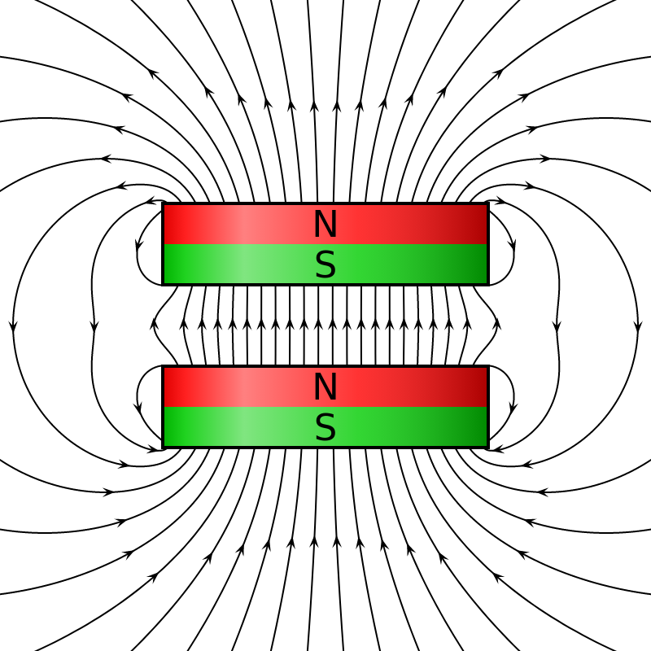

### What is lightning or Thunder?

Lightning, a high-voltage, high-current electrical discharge between clouds and the ground, may strike and destroy life and property anywhere thunderstorms have occurred in the past. Buildings and their occupants, however, can be protected against this hazard by the installation of a special electrical system. Because an incomplete or poor installation can cause worse damage or injuries than no protection at all, a lightning-protection system should be designed and installed by experts.

In addition to other electrical systems required for a building, a **[lightning-protection system](https://en.wikipedia.org/wiki/Lightning_rod)** increases the construction cost of a building. A building owner, therefore, has to decide whether potential losses justify the added expenditure. In doing so, the owner should take into account the importance of the building, danger to occupants, value, and nature of building contents, type of construction, the proximity of other structures or trees, type of terrain, the height of the building, number of days per year during which thunderstorms may occur, costs of disruption of business or other activities and the effects of loss of essential services, such as electrical and communication systems. (Buildings housing flammable or explosive materials generally should have lightning protection.) Also, the owner should compare the cost of insurance to cover losses with the cost of the protection system.

### Characteristics of Lightning

Lightning strikes are associated with thunderstorms. In such storms, the base of the clouds generally develops a negative electrical charge, which induces a positive charge in the earth directly below. As the clouds move, the positive charges, being attracted by the negative charges, follow along the surface of the earth and climb up buildings, antennas, trees, power transmission towers, and other conducting or semiconducting objects along the path. The potential between clouds and the earth may build up to 106 to 109 V. When the voltage becomes great enough to overcome the electrical resistance of the air between the clouds and the ground or an object on it, current flows in the form of a lightning flash. Thus, the probability of a building being struck by lightning depends not only on the frequency of occurrence of thunderstorms but also on building height relative to nearby objects and the intensity of cloud charges.

Destruction at the earth’s surface may result not only at points hit by lightning directly but also by electrostatic induction at points several feet away. Also, lightning striking a tall object may flash to a nearby object that offers a suitable path to the ground.

Lightning often shatters nonconductors or sets them on fire if they are combustible. Conductors struck may melt. Living things may be burned or electrocuted. Also, lightning may induce overvoltages in electrical power lines, sending electrical charges along the lines in both directions from the stricken point to the ground. Direct-stroke overvoltages may range up to several million volts and several hundred thousand amperes. Induced strokes, which occur more frequently, may be on the order of several hundred thousand volts with currents up to 2000 A. Such over-voltages may damage not only electric equipment connected to the power lines but also buildings served by them. Consequently, lightning protection is necessary for outdoor conductors as well as for buildings.

## Methods for Protecting Houses against Lightning

Objectives of lightning protection are life safety, prevention of property damage, and maintenance of essential services, such as electrical and communication systems. Lightning protection usually requires the installation of [**electrical conductors**](https://en.wikipedia.org/wiki/Electrical_conductor) that extend from points above the roof of a building to the ground, for the purpose of conducting to-ground lightning that would otherwise strike the building. Such an installation, however, possesses the potential hazard that, if not done properly, lightning may flash from the lightning conductors to other building components. Hence, the system must ensure that the lightning discharge is diverted away from the building and its contents. Lightning protection systems should conform to the standards of the American National Standards Institute, National Fire Protection Association (NFPA 78, ‘‘Lightning Protection Code’’), and Underwriters Laboratories (UL 96A, ‘‘Master Labeled Lightning-Protection Systems’’).

The key element in diverting lightning away from a building is an air terminal or lightning rod, a conductor that projects into the air at least 12 in above the roof. Air terminals should be spaced at intervals not exceeding 25 ft. Alternatively, a continuous wire conductor or a grid of such conductors may be placed along the highest points of a roof. If the tallest object on a roof is a metal mast, it can act as an air terminal. A metal roof also can serve as an air terminal, but only if all joints are made electrically continuous by soldering, welding, or interlocking. Arranged to provide a cone of protection over the entire building, all the air terminals should be connected by conductors to each other and, by the same or other conductors, to the ground along at least two separate paths.

For roof and down conductors, copper, copper-clad steel, galvanized steel, or a metal alloy that is as resistant to corrosion as copper may be used. (A solid copper conductor should be at least 1⁄4 in diameter.) Direct connections between dissimilar metals should be avoided to prevent corrosion. Metal objects and non-current-carrying components of electrical systems should be kept at least 6 ft away from the lightning conductors or should be bonded to the nearest lightning conductor. Sharp bends in the conductors are not desirable. If a 90 bend must be used, the conductor should be firmly anchored, because the high current in a lightning stroke will tend to straighten the bend. If the conductor has a U bend, the high current may induce an electric arc to leap across the loop while also exerting forces to straighten out the bend.

In steel-frame buildings, the steel frame can be used as a down conductor. In such cases, the top of the frame should be electrically connected to air terminals and the base should be electrically connected to grounding electrodes. Similarly, the reinforcing steel of a reinforced concrete building can be used as down conductors if the reinforcing steel is bonded together from the foundations to the roof.

Damage to the electrical systems of buildings can be limited or prevented by the insertion of lightning arresters, and safety valves that curtail overvoltages and bypass the current surge to a ground system, at the service entrance. Further protection can be afforded to electrical equipment, especially sensitive electronic devices, by installing surge protectors or spark gaps, near the equipment.

The final and equally important elements of a lightning-protection system are grounding electrodes and the earth itself. The type and dimensions of the grounds, or grounding electrodes, depending on the electrical resistance, or resistivity, of the earth, which can be measured by technicians equipped with suitable instruments.

The objective of the grounding installation, which should be electrically bonded to the down conductors, should be an earth-system resistance of 10 or less. Underground water pipes can serve as grounds if they are available. If not, long metal rods can be driven into the ground to serve as electrodes. Where earth resistivity is poor, an extensive system of buried wires may be required.  
  
_(J. L. Marshall, ‘‘Lightning Protection,’’ John Wiley & Sons, Inc., New York.)_
