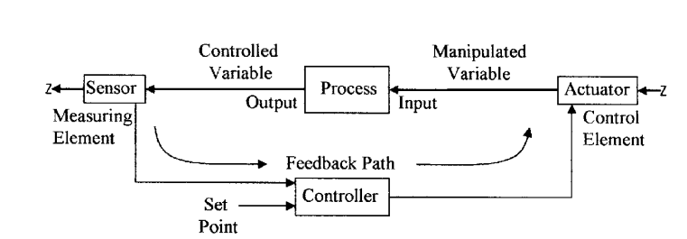
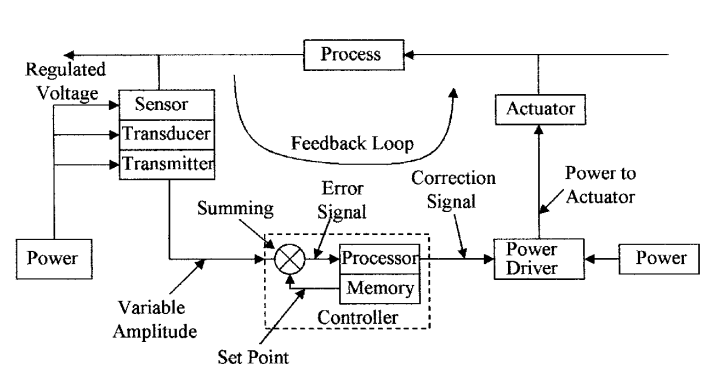
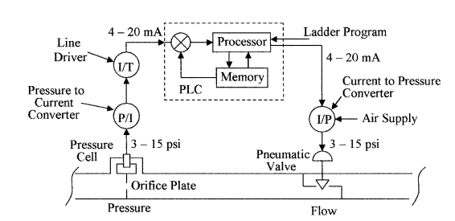

## Process Control

In order to produce a product with consistently high quality, tight process control is necessary. A simple-to-understand example of process control would be the supply of water to a number of cleaning stations, where the water temperature needs to be kept constant in spite of the demand. A simple control block is shown in Fig. 1.1a, steam, and cold water are fed into a heat exchanger, where heat from the steam is used to bring the cold water to the required working temperature. A thermometer is used to measure the temperature of the water (the measured variable) from the process or exchanger. The temperature is observed by an operator who adjusts the flow of steam (the manipulated variable) into the heat exchanger to keep the water flowing from the heat exchanger at the constant set temperature. This operation is referred to as process control, and in practice would be automated as shown in Fig. 1.1b.

Process control is the automatic control of an output variable by sensing the amplitude of the output parameter from the process and comparing it to the desired or set level and feeding an error signal back to control an input variable— in this case, steam. See Fig. 1.1b. A temperature sensor attached to the outlet pipe senses the temperature of the water flowing. As the demand for hot water increases or decreases, a change in the water temperature is sensed and converted to an electrical signal, amplified, and sent to a controller that evaluates the signal and sends a correction signal to an actuator. The actuator adjusts the flow of steam to the heat exchanger to keep the temperature of the water at its predetermined value.

Fig 1.1: Process control (a) shows the manual control of a simple heat exchanger process loop and (b) automatic control of a heat exchanger process loop.

Figure 1.2: Block diagram of a process control loop.

The diagram in Fig. 1.1b is an oversimplified feedback loop and is expanded in Fig. 1.2. In any process there are a number of inputs, i.e., from chemicals to solid goods. These are manipulated in the process and a new chemical or component emerges at the output. The controlled inputs to the process and the measured output parameters from the process are called variables. In a process-control facility, the controller is not necessarily limited to one variable but can measure and control many variables. A good example of the measurement and control of multivariable that we encounter on a daily basis is given by the processor in the automobile engine. Figure 1.3 lists some of the functions performed by the engine processor. Most of the controlled variables are six or eight devices depending on the number of cylinders in the engine. The engine processor has to perform all these functions in approximately 5 ms. This example of engine control can be related to the operations carried out in a process-control operation.

## Definitions of the Elements in a Control Loop

Figure 1.4 breaks down the individual elements of the blocks in a process-control loop. The measuring element consists of a sensor, a transducer, and a transmitter with its own regulated power supply. The control element has an actuator, a power control circuit, and its own power supply. The controller has a processor with Instruments

image/svg+xml

Measured VariablesManifold Air PressureManifold Air FlowOxygen in ExhaustNitrogen Oxides in ExhaustEngine TemperatureThrottle PositionCrank Shaft PositionEngine RPMEngine TorqueEngine KnockOil Pressure

EngineControl Processor Controlled VariablesIgnition TimingInjector TimingFuel FlowTurbo ChargerInstrumentationWarning LightsEngine DiagnosticsDashboard Instruments Figure 1.3 Automotive engine showing some of the measured and controlled variables.

Figure 1.3 Automotive engine showing some of the measured and controlled variables.

Figure 1.4: Block diagram of the elements that make up the feedback path in a process-control loop.

memory and a summing circuit to compare the set point to the sensed signal so that it can generate an error signal. The processor then uses the error signal to generate a correction signal to control the actuator and the input variable. The function and operation of the blocks in different types of applications will be discussed in other posts in Bdmeter. The definition of these blocks is given as follows:

The feedback loop is the signal path from the output back to the input to correct for any variation between the output level from the set level. In other words, the output of a process is continually monitored, the error between the set point and the output parameter is determined, and a correction signal is then sent back to one of the process inputs to correct for changes in the measured output parameter.

A controlled or measured variable is the monitored output variable from a process. The value of the monitored output parameter is normally held within tight given limits.

The manipulated variable is the input variable or parameter to a process that is varied by a control signal from the processor to an actuator. By changing the input variable the value of the measured variable can be controlled. The set point is the desired value of the output parameter or variable being monitored by a sensor. Any deviation from this value will generate an error signal.

The instrument is the name of any of the various device types for indicating or measuring physical quantities or conditions, performance, position, direction, and the like.

Sensors are devices that can detect physical variables, such as temperature, light intensity, or motion, and have the ability to give a measurable output that varies in relation to the amplitude of the physical variable. The human body has sensors in the fingers that can detect surface roughness, temperature, and force. A thermometer is a good example of a line-of-sight sensor, in that it will give an accurate visual indication of temperature. In other sensors such as a diaphragm pressure sensor, a strain transducer may be required to convert the deformation of the diaphragm into an electrical or pneumatic signal before it can be measured.

Transducers are devices that can change one form of energy to another, e.g., a resistance thermometer converts temperature into electrical resistance, or a thermocouple converts temperature into voltage. Both of these devices give an output that is proportional to the temperature. Many transducers are grouped under the heading of sensors.

Converters are devices that are used to change the format of a signal without changing the energy form, i.e., a change from a voltage to a current signal.

Actuators are devices that are used to control an input variable in response to a signal from a controller. A typical actuator will be a flow-control valve that can control the rate of flow of a fluid in proportion to the amplitude of an electrical signal from the controller. Other types of actuators are magnetic relays that turn electrical power on and off. Examples are actuators that control power to the fans and compressors in an air-conditioning system in response to signals from the room temperature sensors.

Controllers are devices that monitor signals from transducers and take the necessary action to keep the process within specified limits according to a predefined program by activating and controlling the necessary actuators.

Programmable logic controllers (PLC) are used in process-control applications and are microprocessor-based systems. Small systems have the ability to monitor several variables and control several actuators, with the capability of being expanded to monitor 60 or 70 variables and control a corresponding number of actuators, as may be required in a petrochemical refinery. PLCs, which have the ability to use analog or digital input information and output analog or digital control signals, can communicate globally with other controllers, are easily programmed online or offline, and supply an unprecedented amount of data and information to the operator. Ladder networks are normally used to program the controllers.

An error signal is a difference between the set point and the amplitude of the measured variable. A correction signal is a signal used to control power to the actuator to set the level of the input variable. Transmitters are devices used to amplify and format signals so that they are suitable for transmission over long distances with zero or minimal loss of information. The transmitted signal can be in one of the several formats, i.e., pneumatic, digital, analog voltage, analog current, or a radio frequency (RF) modulated signal. Digital transmission is preferred in newer systems because the controller is a digital system, and as analog signals can be accurately digitized, dig- ital signals can be transmitted without loss of information. The controller compares the amplitude of the signal from the sensor to a predetermined set

Figure 1.5 Process control with a flow regulator for use in Example 1.1.

the point, which in Fig. 1.1b is the amplitude of the signal of the hot water sensor. The controller will then send a signal that is proportional to the difference between the reference and the transmitted signal to the actuator telling the actuator to open or close the valve controlling the flow of steam to adjust the temperature of the water to its set value.

Example 1.1 Figure 1.5 shows the block diagram of a closed-loop flow control system. Identify the following elements: (a) the sensor, (b) the transducer, (c) the actuator, (d) the transmitter, (e) the controller, (f) the manipulated variable, and (g) the measured variable. (a) The sensor is labeled pressure cell in the diagram. (b) The transducer is labeled a converter. There are two transducers—one for converting pressure to current and the other for converting current to pressure to operate the actuator. (c) The actuator in this case is the pneumatic valve. (d) The transmitter is the line driver. (e) The controller is labeled PLC. (f) The manipulated variable is the differential pressure developed by the fluid flowing through the orifice plate constriction. (g) The controlled variable is the flow rate of the liquid. Simple and ideal process-control systems have been discussed. In practical process control the scenarios are much more complex with many scenarios and variables, such as stability, reaction time, and accuracy to be considered. Many of the basic problems are discussed in the following chapters.

## Process Facility Considerations

The processing facility has a number of basic requirements including safety precautions and well-regulated, reliable electricity, water, and air supplies.

An electrical supply is required for all control systems and must meet all standards in force at the plant. The integrity of the electrical supply is most important. Many facilities have backup systems to provide an uninterruptible power supply (UPS) to take over in case of loss of external power. Power failure can mean plant shutdown and the loss of complete production runs. An isolating transformer should be used in the power supply lines to prevent electromagnetic interference (EMI) generated by motors, contactors, relays, and so on from traveling through the power lines and affecting sensitive electronic control instruments.

Grounding is a very important consideration in a facility for safety reasons. Any variations in the ground potential between electronic equipment can cause large errors in signal levels. Each piece of equipment should be connected to a heavy copper bus that is properly grounded. Ground loops should also be avoided by grounding cable screens and signal return lines at one end only. In some cases, it may be necessary to use signal isolators to alleviate grounding problems in electronic devices and equipment. An air supply is required to drive pneumatic actuators in most facilities.

Instrument air in pneumatic equipment must meet quality standards, the air must be dirt, oil, contaminant, and moisture free. Frozen moisture, dirt, and the like can fully or partially block narrowed sections and nozzles, giving false readings or complete equipment failure. Air compressors are fitted with air dryers and filters, and have a reservoir tank with a capacity large enough for several minutes’ supply in case of system failure. Dry, clean air is supplied at a pressure of 90 psi (630 kPa⋅g) and with a dew point of 20°F (10°C) below the minimum winter operating temperature at atmospheric pressure. Additional information on the quality of instrument air can be found in ANSI/ISA-7.0.01-1996, Quality Standard for Instrument Air. Water supply is required in many cleaning and cooling operations, and for steam generation. Domestic water supplies contain large quantities of particulates and impurities, and may be satisfactory for cooling, but are not suitable for most cleaning operations. Filtering and other similar processes can remove some of the contaminants making the water suitable for some cleaning operations, but for ultrapure water, a reverse osmosis system may be required.

Installation and maintenance must be considered when locating instruments, valves, and so on. Each device must be easily accessible for maintenance and inspection. It may also be necessary to install hand-operated valves so that equipment can be replaced or serviced without a complete plant shutdown. It may be necessary to contract out maintenance of certain equipment or have the vendor install equipment if the necessary skills are not available in-house.

Safety is a top priority in a facility. The correct material must be used in container construction, plumbing, seals, and gaskets to prevent corrosion and failure leading to leakage and spills of hazardous materials. All electrical equipment must be properly installed to code with breakers. Electrical systems must have the correct fire retardant for use in case of electrical fires. More information can be found in ANSI/ISA-12.01.01-1999, Definitions and Information Pertaining to Electrical Instruments in Hazardous Locations.

### Units and Standards

As with all disciplines, a set of standards has evolved over the years to ensure consistency and avoid confusion. The Instrument Society of America (ISA) has developed a complete list of symbols for instruments, instrument identification, and process control drawings, which will be discussed in Chap. 15.

The units of measurement fall into two distinct systems; first, the English system and second, the International system, SI (Systéme International D’Unités) based on the metric system, but there are some differences. The English system has been the standard used in the United States, but the SI system is slowly making inroads so students need to be aware of both systems of units and be able to convert units from one system to the other. Confusion can arise over some units such as pound mass and pound weight. The unit for pound mass is the slug (no longer in common use), which is the equivalent of the kilogram in the SI system of units whereas pound weight is a force similar to the newton, which is the unit of force in the SI system. The conversion factor of 1 lb = 0.454 kg, which is used to convert mass (weight) between the two systems, is in effect equating 1-lb force to 0.454-kg mass; this being the mass that will produce a force of 4.448 N or a force of 1 lb. Care must be taken not to mix units of the two systems. For consistency, some units may have to be converted before they can be used in an equation. Table 1.1 gives a list of the base units used in instrumentation and measurement in the English and SI systems and also the conversion factors, other units are derived from these base units.

**Example 1.2** How many meters are there in 110 yards? 110 yard = 330 ft = (330 × 0.305) m = 100.65 m

**Example 1.3** What is the equivalent length in inches of 2.5 m? 2.5 m = (2.5/0.305) ft = 8.2 ft = 98.4 in

**Example 1.4** The weight of an object is 2.5 lb. What is the equivalent force and mass in the SI system of units? 2.5 lb = (2.5 × 4.448) N = 11.12 N 2.5 lb = (2.5 × 0.454) kg = 1.135 kg

Table 1.2 gives a list of some commonly used units in the English and SI systems, the conversion between units, and also their relation to the base units. As explained above the lb is used as both the unit of mass and the unit of force.

**Table 1.1 Basic Units:**

<table><tbody><tr><td><strong>Qty.</strong></td><td><strong>English</strong></td><td><strong>English</strong></td><td><strong>SI</strong></td><td><strong>SI</strong></td><td></td></tr><tr><td><strong>Base units</strong></td><td><strong>Units</strong></td><td><strong>Symbol</strong></td><td><strong>Units</strong></td><td><strong>Symbol</strong></td><td><strong>Conversion to SI</strong></td></tr><tr><td>Length</td><td>Foot</td><td>ft</td><td>Meter</td><td>m</td><td>1 ft = 0.305 m</td></tr><tr><td>Mass</td><td>Pound (slug)</td><td>lb (slug)</td><td>Kilogram</td><td>kg</td><td>1 lb(slug) = 14.59 kg</td></tr><tr><td>Time</td><td>Second</td><td>s</td><td>Second</td><td>s</td><td></td></tr><tr><td>Temperature</td><td>Rankine</td><td>R</td><td>Kelvin</td><td>K</td><td>1°R = 5/9 K</td></tr><tr><td>Electric current</td><td>Ampere</td><td>A</td><td>Ampere</td><td>A</td><td></td></tr></tbody></table>

**TABLE 1.2 Units in Common Use in the English and SI System**

<table><tbody><tr><td></td><td>English</td><td>English</td><td>English</td><td>SI</td><td>SI</td><td>SI</td></tr><tr><td>Quantity</td><td>Name</td><td>Symbol</td><td>Units</td><td>Name</td><td>Symbol</td><td>Units</td></tr><tr><td>Frequency</td><td>Hertz</td><td></td><td></td><td>Hertz</td><td>Hz</td><td>s-¹</td></tr><tr><td>Energy</td><td>Foot-pound</td><td>ft⋅lb</td><td>lb.ft²/s²</td><td>Joule</td><td>J</td><td>kg.m²/s²</td></tr><tr><td>Force</td><td>Pound</td><td>lb</td><td>lb.ft/s²</td><td>Newton</td><td>N</td><td>kg.m/s²</td></tr><tr><td>Resistance</td><td>Ohm</td><td></td><td></td><td>Ohm</td><td>Ω</td><td>kg.m² per (s³.A²)</td></tr><tr><td>Electric Potential</td><td>Volt</td><td></td><td></td><td>Volt</td><td>V</td><td>A.Ω</td></tr><tr><td>Pressure</td><td>Pound per in²</td><td>psi</td><td>lb/in²</td><td>Pascel</td><td>Pa</td><td>N/m²</td></tr><tr><td>Charge</td><td>Coulomb</td><td></td><td></td><td>Coulomb</td><td>C</td><td>A.s</td></tr><tr><td>Inductance</td><td>Henry</td><td></td><td></td><td>Henry</td><td>H</td><td>kg.m² per (s².A²)</td></tr><tr><td>Capacitance</td><td>Farad</td><td></td><td></td><td>Farad</td><td>F</td><td>s⁴.A² per (kg.m²)</td></tr><tr><td>Magnetic flux</td><td></td><td></td><td></td><td>Weber</td><td>Wb</td><td>V.s</td></tr><tr><td>Power</td><td>Horsepower</td><td>hp</td><td>lb.ft²/s³</td><td>Watt</td><td>W</td><td>J.s</td></tr></tbody></table>

Conversion to SI 1 ftâ‹…lb = 1.356 J 1 lb (F) = 4.448 N 1 psi = 6897 Pa 1 hp = 746 W

Hence, the unit for the lb in energy and power is mass, whereas the unit for the lb in pressure is force, where the lb (force) = lb (mass) × g (force due to gravity).

**Example 1.5** What is the pressure equivalent of 18 psi in SI units? 1 psi = 6.897 kPa 18 psi = (18 × 6.897) kPa = 124 kPa

Standard prefixes are commonly used for multiple and submultiple quantities to cover the wide range of values used in measurement units. These are given in Table 1.3
