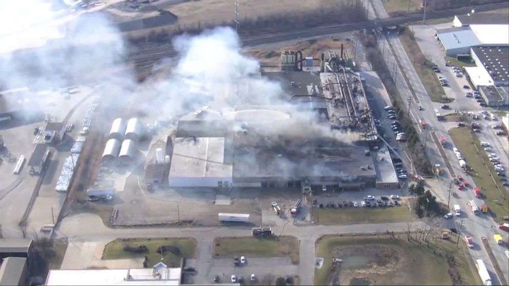
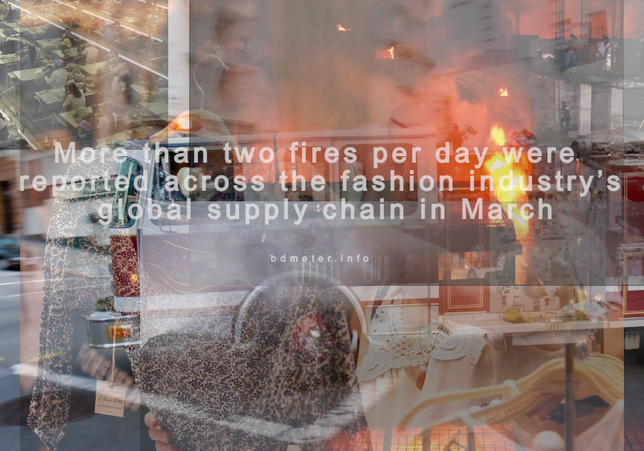
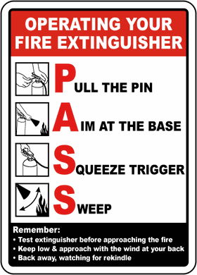

## Introduction

Bdmeter has developed this Occupational Health and Safety toolkit to support you to:

1. Understand what a robust occupational health and safety system means for your business;
2. Make the case with factory management and other colleagues to invest in this area and support you;
3. Assess the performance of your current health and safety system;
4. Identify areas where you can improve and develop action plans to improve your health and safety system.
5. Monitor implementation

**Why use this toolkit?**

Using the guidance and information in this toolkit to improve your health and safety system will bring you the following benefits:

**Saving costs**

1. Reduced spending on medical care or compensation
2. Reduced spending on materials, equipments and resources
3. Reduced spending on repairing building and machines
4. Reduced recruitment costs to replace injured/ill/unhappy workers who leave the factory

**Increased productivity & quality**

1. Less downtime and smoother production because fewer workers fall ill or get injured
2. Less downtime because workers and supervisors know what to do in case of an accident or emergency
3. Improved quality of your products because your site is better managed
Retention of workforce
4. Increased worker loyalty because they’re satisfied with the way the factory treats them and their working environment

**Improved reputation**

1. Improved reputation as a good employer
2. Improved reputation as a high-quality supplier with your customers

**How to use this toolkit?**

**Step 1.** Read the chapters about the top 10 health and safety risks. Page 3 show you an overview of the structure of each chapter.
**Step 2.** Complete the self assessment by answering a set of questions for each top 10 risk and identify areas for improvement.
**Step 3.** Use the action planning template to plan actions that you’ve identified after completing the self-assessment or based on your reflection of the information in each chapter.
**Step 4.** Use the supporting tools in the appendixes. Throughout the toolkit there are references to the appendixes. In the appendixes you’ll find supporting tools and templates that will help you to monitor actions.

## Index

| Chapters | Navigation |
| --- | ----------- |
| Introduction | [Read](/blog/2023/05/occupational-health-and-safety-systems/#introduction) |
| Index | [Read](/blog/2023/05/occupational-health-and-safety-systems/#index) |
| 1. Fire safety | [Read](/blog/2023/05/occupational-health-and-safety-systems/#1-fire-safety) |
| 2. Dangerous machinery & equipment | Read |
| 2a. Uncontrolled hazardous energy | Read |
| 3. Noise/Indoor air quality monitoring | Read |
| 4. Personal Protective Equipment (PPE) | Read |
| 5. Chemical safety management | Read |
| 6. Occupational health checks | Read |
| 7. Electrical safety management | Read |
| 8. Emergency Response & First aid | Read |
| 9. Housekeeping management | Read |
| 10. Environmental management | Read |
| Self Assessment checklist& Action Planning | Read |
| Appendix 1 Machine & equipment risk assessment template | Read |
| Appendix 2 Machinery & equipment risks & preventive measures | Read |
| Appendix 3 Machine & equipment maintenance form template | Read |
| Appendix 4 Fire equipment inspection and fire drill templates | Read |
| Appendix 5 General health and Safety Inspection list | Read |
| Appendix 6 Electrical safety checklist | Read |
| Appendix 7 PPE Usage and Maintenance Guide | Read |
| Appendix 8: Special Equipment Registration Record | Read |
| Appendix 9: Hot Work Permit | Read |
| Appendix 10: Subcontractor Work Registration Record | Read |

## 1. Fire Safety

__Case study__

Mr Mark, the General Manager of an Space industry in <Name of Country City / Province>, is discussing the report from the <Name of local safety bureau / authority> on a fire that recently happened in his industry with the factory owner. At the same time the Business Manager is on the phone informing the factory’s key client about the delay in shipment of a big order because of this fire. 

The <Name of local safety bureau / authority> visited the factory to talk to workers and investigate the cause of the fire. The report finds that the fire was caused by an electrical short circuit (caused by damaged insulation), this led to carton boxes being put on fire. Other information in the report is: 

The fire started in the warehouse and the whole factory had to stop work. A total of 10,000 pieces of Electronics chips were damaged, the sensory chip warehouse is destroyed and the space assemble line next to the warehouse is seriously 
damaged. 2 workers at the assemble department were injured because they jumped from the 2nd floor to escape. In the Calibration department workers continued working because they did not hear the fire alarm. And workers in the finishing section panicked because the fire exit doors were locked and no one could find the keys.

Fortunately everyone survived the fire. Mr. Mark was very stressed at the time of the fire. He had no idea how many workers were inside the building and how many workers had gone out. He heard that some workers went home because they did not know what to do. It was a complete disaster!

Factory management realizes that they need to invest in H&S management and it needs to hire a qualified H&S Manager to 
manage/control the H&S risk.

**A H&S specialist is invited and provides management with a plan:**

- Conduct a fire risk assessment
- Establish a fire emergency response team and procedures
- Set a fire alarm system and auto fire sprinkle systems
- Include fire safety training as part of the orientation training
- Organize a fire drill for all workers in the production area and dormitories

**Confirm management’s responsibility as below – make sure:**

- Fire fighting system and auto alarming system work
- Make sure the fire certificate are valid
- Assign special place as smoking area, do not allow workers smoke at/close to production, warehouse, waste warehouse area
- Workers know the evacuation plan & assembly points
- Assign clear responsibility & role, i.e. fire coordinator and commander
- Exits, evacuation routes are kept unblocked
- Exits, evacuation routes and gather meeting points are clearly signposted

**Confirm supervisors’ responsibility - check:**

- Fire exit doors are clear and unlocked and pathways are kept clear
- Ensure workers understand the importance of fire drill practice and encourage them to participate
- Ensure workers understand how to protect themselves during a fire, e.g. bend down or crawl to escape, put a wet napkin on the mouse and nose
- Educate workers on the importance of good housekeeping for fire prevention
- How many workers are present during working time

**Confirm workers’ responsibility:**

- Understand why fire drill needs to be conducted regularly and treat it seriously
- Inform supervisors about whereabouts (lunch break, leave, toilet break)
- Know which fire escape route & assembly points to use 
- Know how to use fire fighting equipment
- Must not store any goods on the route to fire extinguishers, fire hydrant and alarm system

**When you have no fire safety system, YOU RISK:**

- HUGE costs for repairing building damage
- HUGE costs for lost machinery, equipment and products
- HUGE delays in production
- Management and workers being burned, injured and possible fatality
- Damaging your reputation and being negatively exposed in the media
- Lose the good relationship with your clients
- Having to pay for workers’ medical care and compensation
- Workers taking time off because of injury
- Workers leaving your factory because they don’t feel safe - an increase in recruitment costs: hiring and training new workers takes time!

| Name of City/Province: ABC Space Manufacturing Plant |
| --- | ----------- |
| Cause | An explosion of unknown origin |
| Other details | None |
| Tragic outcome | significant damage to the facility |

| Global fashion supply chain sees 66 fires in March |
| --- | ----------- |
| Cause | Electrical malfunction, machinery malfunction, Human error |
| Other details | Fires were reported in 18 countries, 24 injured & more than 5 dead |
| Tragic outcome | two fires per day were reported across the fashion industry |

**Why does it happen?**

- No specific responsibility is assigned
- Low awareness on fire risk and possible results caused by fire
- Fire safety facilities are missing or not working
- No knowledge of electrical safety
- Lack of knowledge on fire evacuation
- No fire drill conducted
- No auto sprinkle system/faulty system/malfunctioned
- No emergency response plan/plan is not workable
- Workers and supervisors are lack of proper fire safety training

_“I am not worried because all our buildings are equipped with auto fire alarming
systems and the chemical warehouse have dried power sprinkler systems. The
safety supervisor inspects the fire systems and reports to me monthly.” – Factory
H&S manager"_

__Please find more information on how to reduce causes of fire:__
- Dangerous machinery and equipment
- Uncontrolled hazardous energy
- Poor chemical safety management
- Poor electrical safety management

__What does the Country OHS law say? [Update by Country]__

- Each warehouse must have auto sprinkle systems.
- Every site must have an alternative fire exit staircase for each floor.
- Fire exit doors should not be locked, should open outwards and should be able to be opened from the inside.
- All evacuation passages and emergency exits are clear, and posted with fire safety evacuation signs
- All pathways to fire exists shall not be blocked.
- A fire drill should be organized at least once per year
- Installation of appropriate fire service equipment and facilities
- Posting fire safety instructions on walls in production areas
- Arrange regular inspections and maintenance to ensure all the equipment and facilities operate
properly and are in good condition.
- Living accommodation should be separated from production and warehouse buildings.

__Relevant local law articles__

- Fire Safety of Building Design Regulation GB50016-2006 article 3.8.1
- Code for Design of Extinguisher Distribution in Buildings (GB 50140-2005) article 5.1.3
- Fire Safety of Building Design Regulation GB50016-2006 article 3.8.1
- Code for Design of Extinguisher Distribution in Buildings (GB 50140-2005) article 5.1.1
- PRC Fire Service Law article 21
- Rules Concerning Warehouse Safety and Fire Control article 39
- Rules Concerning Warehouse Safety and Fire Control article 42
- Fire Safety of Building Design Regulation GB50016-2006 article 4.1.2
- Fire Safety of Building Design Regulation GB50016-2006 article 4.1.3

**First practical steps to start the continuous improvement process**

Assign responsibilities to existing staff (e.g. compliance officer, H&S officer) to:
Understand how you can guarantee a security fire safety management:
- Do you have workable system to eliminate fire risk: such as flammable material, damaged
electrical circuit, hot work stations etc?
- Do you have workable auto sprinkle systems and fire fighting facilities ?
- Do you have enough fire exits OPEN and UNBLOCKED?
- Do you have a fire alarm that everyone can hear from all areas of the factory?
- Do you have enough and proper type of fire extinguishers that are working?
- Are fire escape routes clearly marked?
- Is everyone aware of the assembly point?

__Implement__ – based on the risks you have identified you need to take action to reduce these risks – (Please see Self-Assessment and Action Planning chapter).

__Monitor__ and test your auto sprinkler system, fire fighting system and fire evacuation system on an on-going basis(one part of fire safety):

- Fire sprinkler system, Fire hydrant, fire extinguishers are inspected regular by qualified staff.
- Auto alarm system is inspected by an authorized institute
- Emergency light, exit light, exit aisle are regularly inspected
- Fire exit can be opened from the inside and pathways are clear - EVERY DAY
- Organize a fire drill at least twice a year - you can keep a record for these checks and keep it in a central place see Appendix 6 for a template.

__Train fire emergency response team on:__
- Fire reporting process
- Their role & responsibility
- Who needs to know how to use the fire hydrants and fire extinguishers.
- First aid process

__Train workers on their responsibilities in the evacuation process on:__
- Fire safety knowledge and methods to use fire extinguisher
- Assembly points and which fire escape route to use
- They tell their supervisor about their location (lunch, leave, toilet break)

__Benefits for your business__
- Save costs on (re)building site and buying new machines and equipment
- Keep good relation ship with local government, client and local community
- Increase the reputation of the factory
- Be an attractive employer to work for
- Less non-production time
- Reduced human and physical damage
- Less absenteeism and workers stay in the factory for longer

__Benefits for workers__
- Feels safe and secure
- Feel proud about their factory and workplace

## 2. Dangerous machinery & equipment

__Case study__

A large order for a new client needs to be finished by the end of the day and Mr. Weber, the General Manager of a furniture factory in <Name of City / Province>, walks around on the work floor. He is surprised to find out that no one is working on the production lines. There is a lot of commotion and most workers are grouped together around the cutting machine (see picture). When Mr. Weber approaches the group he learns that one of the operators had an accident, two of his fingers were cut off. It is a complete chaos, and no one knows really what to do.

The factory had to stop production for 4 hours in the cutting lines and workers refused to continue their work as they fear similar injuries might happen to them… The accident happened because the worker did not follow the cutting machine operational procedures, the worker changed the operation to one hand operation instead of two hands operation. 

Because of this accident the factory had to pay <Amount of local currency> to the hospital and the worker was absent for 3 months. The factory paid this worker <Bigger amount of local currency> for compensation.

When the operator, once one of the fasted working operators in the factory, returned he was
only able to work at the factory as a cleaner.

A month later Mr. Weber walks on the work floor with Li - the new recruited mechanic. Li has
been made responsible for overlooking the process of guaranteeing safe machinery and
equipment and Mr. Weber can definitely tell that workers’ trust levels have increased because
of this.

__Companies duty:__
- Conduct machinery risk assessment (see Appendix 1 for template)
- Create machine safety investment plan: schedule replacement of machines and purchase safety guards.
- Develop machine safety operational procedures for workers and supervisors
- Train workers on safe use of machinery and equipment

__Supervisor’s responsibility:__
- Make sure there are safety operational procedures available for all machinery
- Make sure all safety devices work - Trains workers on how to use machinery and equipment in a safe way
- Monitor if workers follow machine safety operational procedures and wear PPE

__Benefits for your business__
- Less non-production time
- Less absenteeism and workers stay in the factory for longer
- Less costs of replacing broken machines
- Save costs on compensation / medical expenses
__Benefits for workers__
- Feels happy that factory treats them well & protect their health
- Less time wasted which means more money for piece rate workers

__If your machinery and equipment is unsafe, YOU RISK:__
- Losing production time when workers are injured or fall ill
- Workers taking time off because of illness or injury
- Workers leaving your factory because they are unhappy with the way they are treated
- An increase in recruitment costs: hiring and training new workers takes time!
- Management wasting time sorting out problems rather than doing their job
- Having to pay for workers’ medical care and compensation
- Having to buy new machinery sooner than when you’re doing regular checks & maintenance

__Why does it happen?__
- No one knows the risks of the machinery and equipment
- You don’t realize the (hidden) costs of not addressing these risks
- There are no qualified people to make sure machinery & equipment is safe at all times
- Workers & supervisors are unaware of how to use machinery and equipment safely

__First practical steps to start the continuous improvement process:__

Assign responsibilities to QUALIFIED staff (e.g. mechanic, compliance officer, H&S officer) to: 

__Understand__ the risks of your machinery and equipment:

- What types of machines and equipment are in the factory? Pressing machines , buttoning machines, cutting machines etc.
- What kind of major safety guards are commonly used? Eye guard, needle guard, two-hand operating buttons etc.
- What are the possible dangerous things that can happen to workers using these machines?
- What can be done to minimise the risk (See Appendix 1 for a machinery and equipment risk assessment template you can use).
- Machine safety guard: all motivating parts need to be covered
- Emergency stop device: Emergency stop button, two-hand operation button, infrared sensor.

__Implement__ – based on the risks you have identified you need to plan and take action to reduce these risks (Please see Self-Assessment and Action Planning chapter).

- Develop the machine/equipment management procedure, regulation
- Make sure the special appliance are inspected by regularly, have registration, the certificate are valid.
- All electrician, welding operator, fork lift & boiler operator are certified.
- Develop the machine/equipment safety checklist
- Develop the action plan according to machine risk assessment result 

__Monitor__ your machinery and equipment on an on-going basis:

- Machinery and equipment are checked at least monthly to see if they are working well and safe. These checks are recorded.
- Workers follow safety operation guidance 

__Train workers__ on how to use machinery safely:

- All workers working with machines/equipment are repeated trained and understand that it is THEIR RESPONSIBILITY to work safely
- All workers know who to contact if they experience problems with machinery or Safety instructions are signposted

__What does the Country OHS law say?<Update by Country Hub>__

The General Design Principles for the Safety and Sanitation of Production Devices (1999), Article 6.1.6:

- Any machine that will easily cause potential risk, need a safety device. Safety devices must be fitted to machines where use of the machines presents a risk of accident or injury.
- Any moving parts of the machine/equipment shall be enclosed or shielded to avoid injury to the operator.
- The safety device/protective guard must be fitted for any moving parts which are within 2metres height from the worker’s operating position.
- For hazardous machinery, an emergency stop button must be installed at each operating position.

## 2a. Uncontrolled hazardous energy

_To be continue updating_