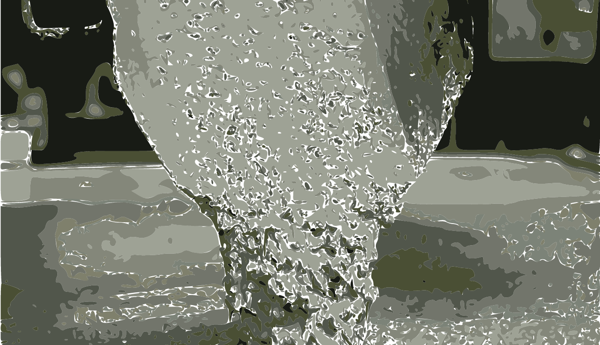
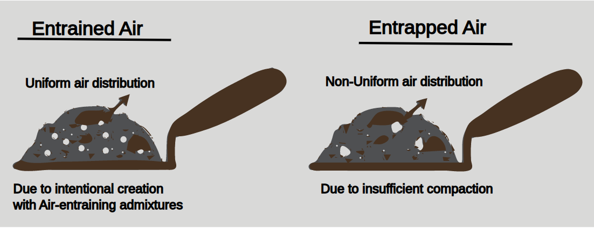
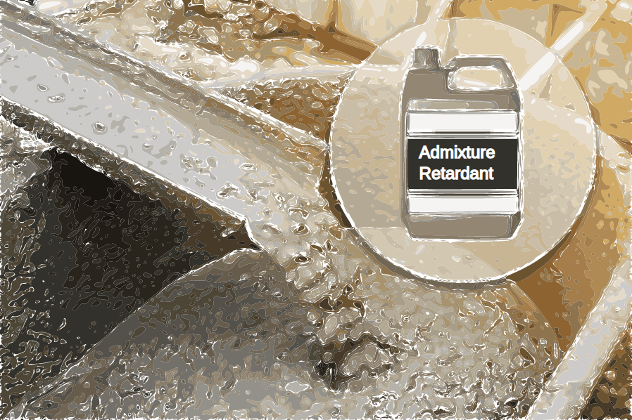
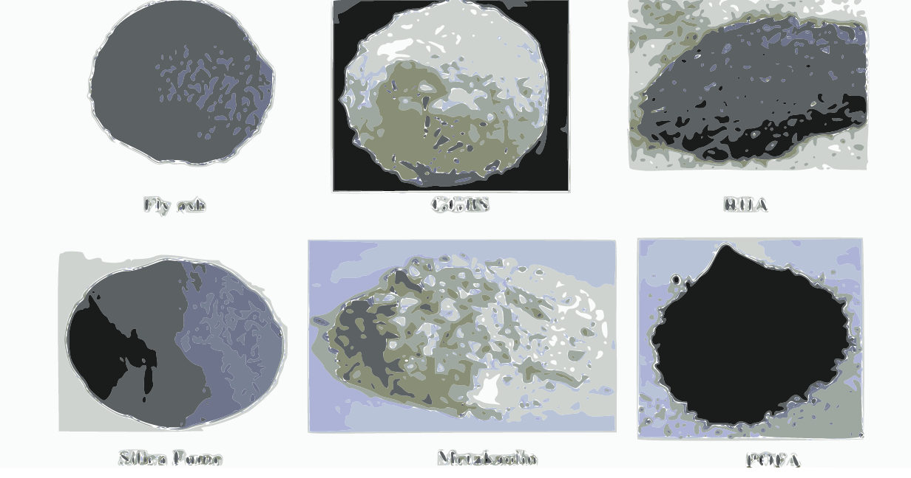
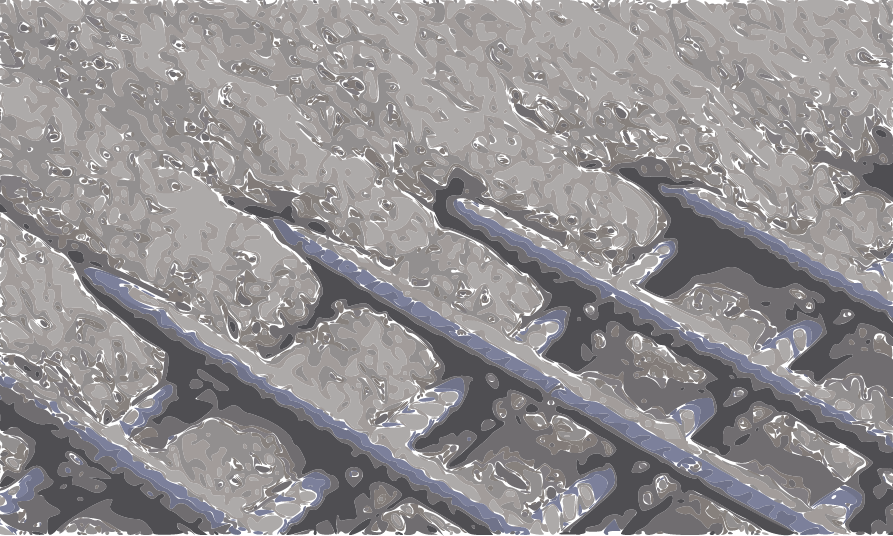

## What's Admixtures?

Admixtures are anything other than portland cement, water, and aggregates that are added to a concrete mix to modify its properties. Included in this definition are chemical admixtures (ASTM C494 and C260), mineral admixtures such as fly ash (C618) and silica fume, corrosion inhibitors, colors, fibers, and miscellaneous (pumping aids, dampproofing, gas-forming, permeability-reducing agents).

### Chemical and mineral admixtures

Chemical admixtures used in concrete generally serve as water reducers, accelerators, set retarders, or a combination. ASTM C494, ‘‘Standard Specification for Chemical Admixtures for Concrete,’’ contains the following classification:

#### Table: Types of admixtures

| Type | Property |
| ---- | -------- |
| A | Water reducer |
| B | Set retarder |
| C | Water reducer and set retarder |
| D | Water reducer and set accelerator |
| F	| High-range water reducer |
| G | High-range water reducer and set retarder |

High-range admixtures reduce the amount of water needed to produce concrete of a specific consistency by 12% or more.

### Water-Reducing Admixtures

These decrease water requirements for a concrete mix by chemically reacting with early hydration products to form a monomolecular layer of admixture at the cement-water interface. This layer isolates individual particles of cement and reduces the energy required to cause the mix to flow. Thus, the mix is ‘‘lubricated’’ and exposes more cement particles for hydration.
The Type A admixture allows the amount of mixing water to be reduced while maintaining the same mix slump. Or at a constant water-cement ratio, this admixture allows the cement content to be decreased without loss of strength. If the amount of water is not reduced, the slump of the mix will be increased and also strength will be increased because more of the cement surface area will be exposed for hydration.
Similar effects occur for Type D and E admixtures. Typically, a reduction in mixing water of 5 to 10% can be expected.

Type F and G admixtures are used where there is a need for high-workability concrete. A concrete without an admixture typically has a slump of 2 to 3 in. After the admixture is added, the slump may be in the range of 8 to 10 in without segregation of mix components. These admixtures are especially useful for mixes with a low water-cement ratio. Their 12 to 30% reduction in water allows a corresponding reduction in the cementitious material.
The water-reducing admixtures are commonly manufactured from lignosulfonate acids and their salts, hydroxylated carboxylic acids and their salts, or polymers of derivatives of melamines or naphthalenes or sulfonated hydrocarbons. The combination of admixtures used in a concrete mix should be carefully evaluated and tested to ensure that the desired properties are achieved. For example, depending on the dosage of the admixture and the chemistry of the cement, it is possible that a retarding admixture will accelerate the set. Note also that all normal-set admixtures will retard the set if the dosage is excessive. Furthermore, because of differences in the percentage of solids between products from different companies, there is not always a direct correspondence in dosage between admixtures of the same class. Therefore, it is important to consider the chemical composition carefully when evaluating competing admixtures.
Superplasticizers are high-range water-reducing admixtures that meet the requirements of ASTM C494 Type F or G. They are often used to achieve high-strength concrete by use of a low water-cement ratio with good workability and low segregation. They also may be used to produce concrete of specified strengths with less cement at a constant water-cement ratio. And they may be used to produce self-compacting, self-leveling flowing concretes, for such applications as long-distance pumping of concrete from the mixer to formwork or placing concrete in forms congested with reinforcing steel. For these, concretes, the cement content or water-cement ratio is not reduced, but the slump is increased substantially without causing segregation. For example, an initial slump of 3 to 4 in for an ordinary concrete mix may be increased to 7 to 8 in without the addition of water and a decrease in strength.
Superplasticizers may be classified as sulfonated melamine-formaldehyde condensates, sulfonated naphthaline-formaldehyde condensates, modified lignosulfonates, or synthetic polymers.

### Air-Entraining Admixtures

These create numerous microscopic air spaces within the concrete to protect it from degradation due to repeated freezing and thawing or exposure to aggressive chemicals. For concrete exposed to repeated cycles of freezing and thawing, the air gaps provide room for the expansion of external and internal water, which otherwise would damage the concrete.

Since air-entrained concrete bleeds to a lesser extent than non-air-entrained, there are fewer capillaries extending from the concrete matrix to the surface. Therefore, there are fewer avenues available for the ingress of aggressive chemicals into the concrete.
The ‘‘Standard Specification for Air-Entraining Admixtures for Concrete,’’
ASTM C260 covers materials for use of air-entraining admixtures to be added to concrete in the field. Air entrainment may also be achieved by the use of Types IIA and IIIA portland cement.

### Set-Accelerating Admixtures

These are used to decrease the time from the start of the addition of water to cement to the initial set and to increase the rate of strength gain of concrete. The most commonly used set-accelerating admixture is calcium chloride. Its use, however, is controversial in cases where reinforcing or prestressing steel is present. The reason is that there is a possibility that the accelerator will introduce free chloride ions into the concrete, thus contributing to the corrosion of the steel. An alternative is the use of one of many admixtures not containing chloride that are available.

### Retarding Admixtures

To some extent, all normal water-reducing admixtures retard the initial set of concrete. A Type B or D admixture will allow the transport of concrete for a long time before the initial set occurs. The final set also is delayed. Hence, precautions should be taken if retarded concrete is to be used in walls.

Depending on the dosage and type of base chemicals in the admixture, the initial set can be retarded for several hours to several days. A beneficial side effect of retardation of initial and final sets is an increase in the compressive strength of the concrete. A commonly used Type D admixture provides higher 7- and 28-day strengths than a Type A when used in the same mix design.

Fly ashes, pozzolans, and micro silicates are included in the mineral admixture classification. Natural cement is sometimes used as an admixture.

### Corrosion Inhibitors

Reinforcing steel in concrete usually is protected against corrosion by the high alkalinity of the concrete, which creates a passivating layer at the steel surface. This layer is composed of ferric oxide, a stable compound. Within and at the surface of the ferric oxide, however, are ferrous-oxide compounds, which are more reactive. When the ferrous-oxide compounds come into contact with aggressive substances, such as chloride ions, they react with oxygen to form solid, iron-oxide corrosion products. These produce a fourfold increase in volume and create an expansion force greater than the concrete tensile strength. The result is the deterioration of the concrete.

For corrosion to occur, chloride in the range of 1.0 to 1.5 lb/yd 3 must be present. If there is a possibility that chlorides may be introduced from outside the concrete matrix, for example, by deicing salts, the concrete can be protected by lowering the water-cement ratio, increasing the amount of cover over the reinforcing steel, or entraining air in the concrete, or adding a calcium-nitrate admixture, or adding an internal-barrier admixture, or cathodic protection, or a combination of these methods.
To inhibit corrosion, calcium-nitrate admixtures are added to the concrete at the time of batching. They do not create a physical barrier to chloride ion ingress.
Rather, they modify the concrete chemistry near the steel surface. The nitrite ions oxidize the ferrous oxide present, converting it to ferric oxide. The nitrite is also absorbed in the steel surface and fortifies the ferric-oxide passivating layer. For a calcium-nitrite admixture to be effective, the dosage should be adjusted in accordance with the exposure condition of the concrete to corrosive agents. The greater the exposure, the larger should be the dosage. The correct dosage can only be determined on a project-by-project basis with data for the specific admixture proposed.
Internal barrier admixtures come in two groups. One comprises waterproofing and dampproofing compounds (Art. 4.15). The second consists of agents that create an organic film around the reinforcing steel, supplementing the passivating layer. This type of admixture is promoted for addition at a fixed rate regardless of expected chloride exposure.

### Coloring Admixtures

Colors are added to concrete for architectural reasons. They may be mineral oxides or manufactured pigments. Raw carbon black, a commonly used material for black color, greatly reduces the amount of entrained air in a mix. Therefore, if black concrete is desired for concrete requiring air entrainment (for freeze-thaw or aggressive chemical exposure), either the carbon black should be modified to entrain
air or an additional air-entraining agent may be incorporated in the mix. The mix design should be tested under field conditions prior to its use in the construction of color and requires careful control of materials, batching, and water addition in order to maintain a consistent color at the job site.

### Fibers for concrete mixes

As used in concrete, fibers are discontinuous, discrete units. They may be described by their aspect ratio, the ratio of length to equivalent diameter. Fibers find their greatest use in crack control of concrete flatwork, especially slabs on grade. The most commonly used types of fibers in concrete are synthetics, which include polypropylene, nylon, polyester, and polyethylene materials. Specialty synthetics include aramid, carbon, and acrylic fibers. Glass-fiber-reinforced concrete is made using E-glass and alkali-resistant (AR) glass fibers. Steel fibers are chopped high-tensile or stainless steel. 

Fibers should be dispersed uniformly throughout a mix. Orientation of the fibers in concrete generally is random. Conventional reinforcement, in contrast, typically is oriented in one or two directions, generally in planes parallel to the surface. 

Further, welded-wire fabric or reinforcing steel bars must be held in position as concrete is placed. Regardless of the type, fibers are effective in crack control because they provide omnidirectional reinforcement to the concrete matrix. With steel fibers, impact strength and toughness of concrete may be greatly improved and flexural and fatigue strengths enhanced. 

Synthetic fibers are typically used to replace welded-wire fabric as secondary reinforcing for crack control in concrete flatwork. Depending on the fiber length, the fiber can limit the size and spread of plastic shrinkage cracks or both plastic and drying shrinkage cracks. Although synthetic fibers are not designed to provide structural properties, slabs tested in accordance with ASTM E72, ‘‘Standard Methods of Conducting Strength Tests of Panels for Building Construction,’’ showed that test slabs reinforced with synthetic fibers carried greater uniform loads than slabs containing welded wire fabric. While much of the research for synthetic fibers has used reinforcement ratios greater than 2%, the common field practice is to use 0.1% (1.5 lb / yd 3 ). This dosage provides more cross-sectional area than 10-gage welded-wire fabric. The empirical results indicate that cracking is significantly reduced and is controlled. A further benefit of fibers is that after the initial cracking, the fibers tend to hold the concrete together.

Aramid, carbon, and acrylic fibers have been studied for structural applications, such as wrapping concrete columns to provide additional strength. Other possible uses are for corrosion-resistance structures. The higher costs of the specialty synthetics limit their use in general construction.

Glass-fiber-reinforced concrete (GFRC) is used to construct many types of building elements, including architectural wall panels, roofing tiles, and water tanks. The full potential of GFRC has not been attained because the E-glass fibers are alkali reactive and the AR-glass fibers are subject to embrittlement, possibly from infiltration of calcium-hydroxide particles. Steel fibers can be used as a structural material and replace conventional reinforcing steel. The volume of steel fiber in a mix ranges from 0.5 to 2%. Much work has been done to develop rapid repair methods using thin panels of densely packed steel fibers and a cement paste squeegeed into the steel matrix. American Concrete Institute Committee 544 states in ‘‘Guide for Specifying, Mixing, Placing, and Finishing Steel Fiber Reinforced Concrete,’’ ACI 544.3R, that, in structuralBUILDING MATERIALS 4.19 members such as beams, columns, and floors not on grade, reinforcing steel should be provided to support the total tensile load. In other cases, fibers can be used to reduce section thickness or improve performance. See also ACI 344.1R and 344.2R. 4.15  

### Miscellaneous admixtures 

There are many miscellaneous concrete additives for use as pumping aids and as dampproofing, permeability-reducing, gas-forming agents. Pumping aids are used to decrease the viscosity of harsh or marginally pumpable mixes. Organic and synthetic polymers, fly ash, bentonite, or hydrated lime may be used for this purpose. Results depend on concrete mix, including the effects of increased water demand and the potential for lower strength resulting from the increased water-cement ratio. If sand makes the mix marginally pumpable, fly ash is the preferred pumping additive. It generally will not increase the water demand and it will react with the calcium hydroxide in cement to provide some strength increase.

Dampproofing admixtures include soaps, stearates, and other petroleum products. They are intended to reduce passage of water and water vapor through concrete. Caution should be exercised when using these materials inasmuch as they may increase water demand for the mix, thus increasing the permeability of the concrete. If dense, low-permeable concrete is desired, the water-cement ratio should be kept to a maximum of 0.50 and the concrete should be well vibrated and damp cured.

Permeability of concrete can be decreased by the use of fly ash and silica fume as admixtures. Also, use of a high-range water-reducing admixture and a water-cement ratio less than 0.50 will greatly reduce permeability. Gas-forming admixtures are used to form lightweight concrete. They are also used in masonry grout where it is desirable for the grout to expand and bond to the concrete masonry unit. They are typically an aluminum powder.

