## Introduction

Three basic components, resistors, capacitors, and inductors, are very important elements in electrical circuits as individual devices, or together. Resistors are used as loads, delays, and current limiting devices. Capacitors are used as dc blocking devices, in level shifting, integrating, differentiating, frequency determination, selection, and delay circuits. Inductors are used for frequency selection and ac blocking, in analog meter movements and relays, and are the basis for transformers and motors.

## Circuits with R, L, and C

### Voltage step

When a dc voltage is applied to a capacitor through a resistor, a current flows charging the capacitor (see Fig. 3.1a). Initially, all the voltage drops across the resistor; although current is flowing into the capacitor, there is no voltage drop across the capacitor. As the capacitor charges, the voltage across the capacitor builds up on an exponential, and the voltage across the resistor starts to decline, until eventually the capacitor is fully charged and current ceases to flow. The voltage across the capacitor is then equal to the supply voltage and the voltage across the resistor is zero. This is shown in Fig. 3.1b.

Two effects should be noted. The first is that the current flowing through the resistor and into the capacitor is the same for both components, but the volt- ages across each component is different, i.e., when the current flowing through the resistor is a maximum, the voltage across the resistor is maximum, given by E = IR, and the voltage is said to be in phase with the current. But in the case of the capacitor the voltage is zero when the current flowing is a maximum, and the voltage is a maximum when the current is zero. In this case the volt- age lags the current or there is a phase shift between the voltage and the cur- rent of 90°. The second effect is that the voltage across the capacitor builds up at an exponential rate that is determined by the value of the resistor and the capacitor.

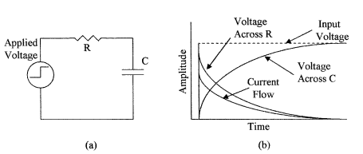

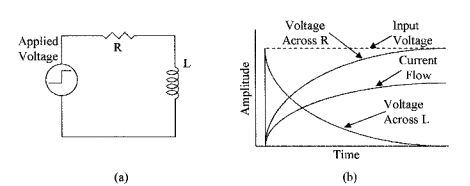

Similarly, if a dc voltage is applied to an inductance via a resistance as shown in Fig. 3.2a, the inductance will initially appear as a high impedance prevent- ing current from flowing, so that the current will be zero, the supply voltage will appear across the inductance, and there will be zero voltage across the resistor. After the initial turn-on, current will start to flow and build up. The voltage across the resistor increases and starts to decrease across the inductance allowing the current to build up exponentially, until the current flow is limited by the resist- ance at its maximum value and the voltage across the inductance is zero. This is shown in Fig. 3.2b. The effects are similar in that the same current is flowing in both devices, the voltage and current in the resistor are in phase, but in the inductor are out of phase, i.e., in this case the voltage appears across the induc- tance before the current starts to flow, and goes to zero when the current is at its maximum, so that the voltage leads the current, and there is a phase shift between the voltage and the current of 90°. The voltage across the resistor increases at an exponential rate that is determined by the value of the induc- tance and resistance.

### Time constants

When a step voltage is applied to an RC network in Fig. 3.1a, the voltage across the capacitor is given by the equation 

EC = E (1 − e−t/RC )

where Ec = voltage across the capacitor at any instant of time
E = source voltage
t = time (seconds) after the step is applied

R is in ohms and C is in farads. If after the capacitor is fully charged the step input voltage is returned to zero, C will discharge and the voltage across the capacitor will be given by the equation

EC = Ee−t/RC

Similar equations apply to the rise and fall of currents in an inductive circuit. These equations are, however, outside the scope of this course, and will not be taken further. They serve only to introduce circuit time constants.
The time constant of the voltage in a capacitive circuit from Eqs. (3.1) and (3.2) is defined as 

t = CR

where t is the time (seconds) it takes for the voltage to reach 63.2 percent of its final or aiming voltage after the application of an input voltage step (charging or discharging), i.e., by the end of the first time constant the voltage across the capacitor will reach 6.32 V when a 10-V step is applied. During the second time constant the voltage across the capacitor will rise another 63.2 percent of the remaining voltage step, i.e., (10 − 6.32) V × 63.2 % = 2.33 V, or at the end of the two time constant periods, the voltage across the capacitor will be 8.65 V, and at the end of three periods 9.5 V, and so on, as shown in Fig. 3.3a. The voltage across the capacitor reaches 99 percent of its value in 5 CR.

Example 3.1 What is the time constant for the circuit shown in Fig. 3.1a if the resistor has a value of 220 kΩ and the capacitor is 2.2 µF? 

t = 2.2 × 3–6 × 220 × 103 s = 484 × 3–3 s = 0.484 s

The RC time constant is often used as the basis for time delays, i.e., a comparator circuit is set to detect when a voltage across a capacitor in a CR network reaches 63.2 percent of the input step voltage. The time delay generated is then 1 CR.

Capacitors can also be used for level shifting and signal integration. Figure 3.3b shows a 0 to 10-V step applied to a capacitor, and the resulting waveform. The 10 V step passes through the capacitor, but the output side of the capacitor is referenced by the resistor R to 10 V so that the step at Vout goes from 10 to 20 V, the voltage then decays back to 10 V in a time set by the CR time constant, i.e., the leading edge of the square wave has been level shifted by blocking the dc level of the input with the capacitor and applying a new dc level of 10 V. The decay of the square wave at the output is referred to as integration, i.e., a capacitor only lets a changing voltage through.

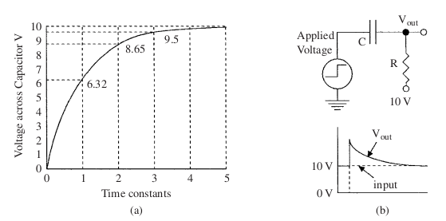

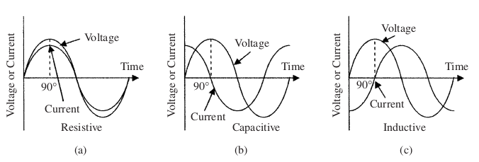

In the case of an inductive circuit, the time constant for the current is given by

t = L/R

where L is the inductance in henries, and t gives the time for the current to increase to 63.2 percent of its final current through the inductor.

### Phase change

A phase change or shift that occurs between voltage and current in capacitors and inductors when a step voltage waveform is applied to them has been discussed. The same phase shift also takes place when an ac sine wave is applied to C, L, and R circuits, as shown in Fig. 3.4. In resistive elements (a) the current and voltage are in phase, in capacitive circuits (b) the current leads the voltage by 90° (Fig. 3.1), and in inductive circuits (c) the current lags the voltage again by 90° (Fig. 3.2).

Because the voltages and the currents are not in phase in capacitive and inductive ac circuits, these devices have impedance not resistance, and there- fore, as already noted, impedance and resistance cannot be directly added. If a resistor, capacitor, and inductor are connected in series as shown in Fig. 3.5a, 

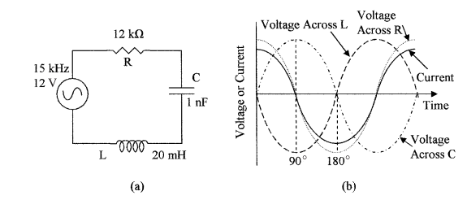

the same current will flow through all the three devices, but the voltages in the capacitor and inductor will be 180° out of phase and 90° out of phase with the voltage in the resistor, as shown in Fig. 3.5b. They can, however, be combined using vectors to give 

E2 = VR2 + (VL − VC)2

where E = supply voltage
VR = voltage across the resistor
VL = voltage across the inductor
VC = voltage across the capacitor

The vector addition of the voltages is shown in Fig. 3.6. In (a) the relations between VR, VL, and VC are given; VL and VC lie on the x axis with one positive and the other negative because they are 180° out of phase; that is to say, they are of opposite sign, so that they can be subtracted to give the resulting VC − VL vector; and VR lies at right angles (90°) on the y axis. In (b) the VC − VL vector and VR vectors are shown with the resulting E vector, which from the trigonometry function gives Eq. (3.5).

The impedance Z of the circuit, as seen by the input is given by

Z = √ (R + [XL − XC] )

where XC and XL are given by Eqs. (2.15) and (2.20).

The current flowing in the circuit can be obtained from Ohm’s law, as follows:

I = E/Z

__Example 3.2__ What is the current flowing in the circuit shown in Fig. 3.5a?

XL = 2&pi;fL = 2 × 3.142 × 15 × 103 × 20 × 3−3 = 1.88 kΩ

XC = 1/2πfC = 1/2×3.142×15×103×1×3−9  *  Ω  =  106 / 94.26   *  Ω = 10.6 kΩ 

Z = √(R2 + [XL − XC]) = √{(12 × 103 )2 + [1.88 × 103 − 10.6 × 103 ]2 }

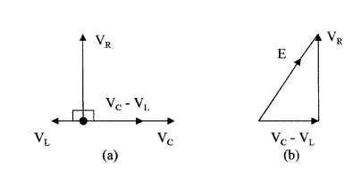

Z = √{144 × 106 + [−8.72 × 103]2} = √{144 × 106 + 76 × 106}
Z = √220 × 106 = 14.8 × 103 Ω = 14.8 kΩ
I = E/Z = 12/14.8 × 103 = 0.81 mA

XL and XC are frequency dependant, and as the frequency increases XL increases and XC decreases. A frequency can be reached where XL and XC are equal, and the voltages across these components are equal and opposite, and cancel. At this frequency Z = R, E = IR, and the current is maximum. This frequency is called the resonant frequency of the circuit. At resonance

2πfL = 1 / 2πfC

which can be rewritten for frequency as

f = 1/2π√LC  Hz

When the input frequency is below the resonant frequency, XC is larger than XL and the circuit is capacitive, and above the resonant frequency, XL is larger than XC and the circuit is inductive. Plotting the input current against the input frequency shows a peak in the input current at the resonant frequency, as shown in Fig. 3.7a.

__Example 3.3__

What is the resonant frequency of the series circuit in Fig. 3.5a? What is the current at this frequency?

Using Eq. 3.9 we get

f = 1/2π√LC  Hz = 1/2×3.142×10−9×20×10−3  Hz

f = 1/2 × 3.142 × 4.47 × 10-6  Hz = 106/28.1  Hz = 3.56 * 104  Hz

f = 35.6 kHz

The current can be obtained using Eq. (3.7):

I = E/Z = 12/12 × 103 = 1 mA

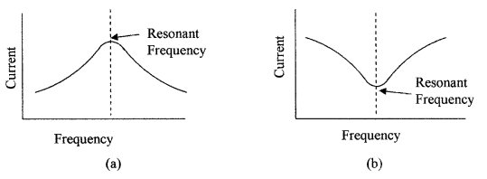

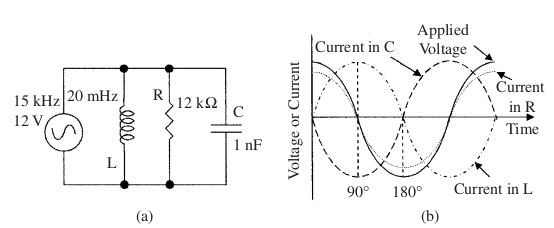

In a parallel circuit as shown in Fig. 3.8a each component sees the same voltage but not the same current as is shown by the waveforms in Fig. 3.8b. 
The source current IS is the vector sum of the currents in each component, and is given by 

IS = IR + (IL − IC)2

The impedance of the circuit Z as seen by the input is given by

1/Z2 = 1/R2 + 1/( XL − XC)2

At the resonant frequency, IL and IC become equal and cancel so that E = IR. This can be seen from Eq. (3.10). Below the resonant frequency the circuit is inductive, and above the resonant frequency the circuit is capacitive. Plotting the current against frequency shows that the current is minimum at the resonant frequency, as shown in the frequency plot in Fig. 3.7b. The frequency at resonance is given by Eq. (3.9) and the current by Eq. (3.7).

## RC Filters

Networks using resistors and capacitors are extensively used and sometimes small inductors are used in instrumentation circuits for filtering out noise, frequency selection, frequency rejection, and the like. Filters can be either passive or active (using amplifiers) and can be divided into the following:

High pass -> Allows high frequencies to pass but blocks low frequencies.

Low pass -> Allows low frequencies to pass but blocks high frequencies.

Band pass -> Allows a specific range of frequencies to pass.

Band reject -> Blocks a specific range of frequencies.

These passive filters are shown in Fig. 3.9. The number of resistive and capacitive elements determines whether the filter is a first-order filter, second-order 

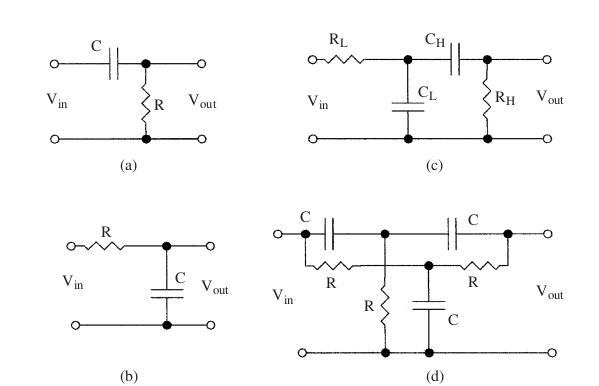

filter, and so on. The circuit configuration determines the characteristics of the filters, some of these classifications are Butterworth, Bessel, Chebyshev, and Legendre.

These are examples of the uses of resistors and capacitors in RC networks; further description is beyond the scope of this text. 

## AC Bridges

The concept of dc bridges described in Chap. 2 can also be applied to ac bridges. The resistive elements are replaced with impedances and the bridge supply is now an ac voltage, as shown in Fig. 3.10a. The differential voltage d V across S is then given by

δV = E Z2Z3 − Z1Z4 / (Z1 + Z3 )(Z2 + Z4 )

where E is the ac supply EMF.

When the bridge is balanced δV = 0 and Eq. (3.12) reduces to

Z2Z3 = Z1Z4 

__Example 3.4__
What are the conditions for the bridge circuit in Fig. 3.10b to be balanced?

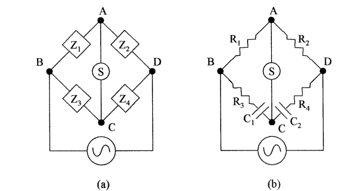

To be balanced Eq. (3.13) applies. There are two conditions that must be met for this equation to be balanced because of the phase shift produced by the capacitors. First, the resistive component must balance, and this gives

R2R3 = R1R4 

Second, the impedance component must balance, and this gives

C2R2 = C1R1 

## Magnetic Forces

### Magnetic fields 

When a dc current flows in a conductor, a circular magnetic field is produced around the conductor as shown in Fig. 3.11a. Magnetic fields have magnetic flux or lines of force associated with them. When a current is passed through an 

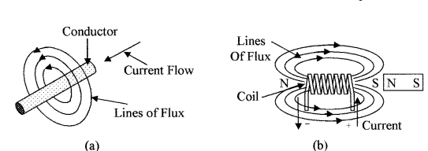

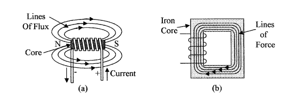

inductance or coil the magnetic field from each conductor adds to form a magnetic field as shown in Fig. 3.11b, similar to that of a magnet.

If a magnet is placed as shown with its north pole near the south pole of the coil, it will be attracted toward the coil. If the magnet is reversed, it will be repelled by the coil, i.e., opposite poles attract and like poles repel. When the current is turned off, the magnetic field in the coil starts to collapse and in doing so induces a voltage (reverse voltage) into the coil in the opposite direction to the initial driving voltage, to oppose the collapse of the current.

The ease of establishing the magnetic lines of force when a voltage is applied across an inductor is a measure of its inductance. Materials such as soft iron or ferrite are conductors of magnetic lines of force, so that the strength of the magnetic field and coil inductance are greatly increased if one of these materials is used as the core of the coil. The inductance will change as the core is moved in and out of the coil (see Fig. 3.12a). Hence, we have a means of measuring motion. Magnetic lines of force form a complete circuit as shown in Fig. 3.12a, the resistance to these lines of force (reluctance) can be reduced by providing a path for them both inside and outside the coil with a soft iron core as shown in Fig. 3.12b, with the reduced reluctance the magnet flux is increased several orders of magnitude in the closed magnetic core. 

If the magnet in Fig. 3.11b is replaced by a second coil as shown in Fig. 3.13a and there is an ac current flowing through the first coil, then the build up, collapse,

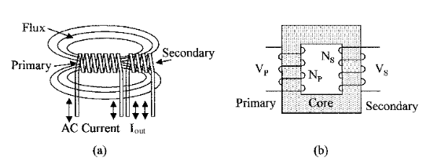

and reversal of the magnetic line of flux in the first coil will also encompass and induce an ac electromotive force in the second coil. 

Transformers are devices that transfer power from one coil (primary) to a second coil (secondary) as in Fig. 3.13b. The lines of flux are concentrated in the core, and because of the reduced reluctance with the complete core there is a very efficient and tight coupling between the two coils. This enables power transfer from one coil to another with low loss (>95 percent efficiency) without having any direct electrical connection between the two coils, as shown. This also allows for the transfer of power between different dc levels. By adjusting the ratio of turns between the two coils the voltage output from the secondary coil can be increased or reduced. The voltage relationship between the coils is given by

VP / VS  = NP / NS 

where VP = primary voltage

VS  = secondary voltage

NP = number of turns on the primary coil

NS  = number of turns on the secondary coil

Power and current can also be considered, in the case of power:

Pin = Pout

and in the case of current:

IP / IS  = NS / NP 

__Example 3.5__
A transformer with a primary of 1500 turns is used to generate 10 V ac from a supply voltage of 120 V. How many turns are there on the secondary? If the secondary is loaded with a 22 Ω resistor, what is the primary current?

NS = 1500 * 10 / 120 = 125 turns

IP = (10 * 125 / 22 * 1500) A = 0.038 A = 38 mA

If instead of using an ac magnetic field to induce an EMF in a coil as in a transformer, a coil is rotated through a fixed magnetic field, an EMF will be induced in the coil. This is the basis for an ac generator, which consists of a rotating permanent magnet armature surrounded by fixed field coils. The lines of force from the magnetic field of the armature continually reverse in the field coils generating an ac EMF.

### Analog meter

The attractive and repulsive forces between a permanent magnet field and the field produced by a dc-current-carrying coil are used in analog meter movements. If a current carrying coil that is free to rotate is placed in a magnetic

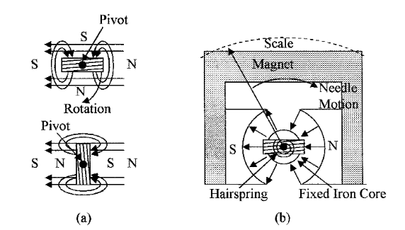

field, as shown in Fig. 3.14a top diagram, the forces produced by the interaction between the magnetic fields will rotate the coil to the position shown at the bottom of the diagram, i.e., the magnetic fields will try to align themselves, so that the south pole of the coil is aligned to the north pole of the magnet and so on. This principle is used in the D’Arsonval meter movement shown in Fig. 3.14b. The poles of the permanent magnet are circularly shaped, with a fixed cylindrical soft iron core between them; this gives a very uniform radial magnetic field as shown. A coil is placed in the magnetic field as shown and is free to rotate about the soft iron core on low-friction bearings. Movement of the coil to align itself with the permanent magnetic field when a current is passed through it is opposed by hairsprings. The hairsprings are also used as electrical connections between the coil and the fixed electrical terminals.

The magnet field produced by the coil is directly proportional to the dc current flowing through the coil, and its deflection is therefore directly proportional to the current. A pointer attached to the coil gives the deflection of the coil on a scale. In such a meter full-scale deflection can be obtained with a current of about 50 µA. Current scales are obtained by using resistors to shunt some of the current around the meter movement, and voltages can be measured using series resistors to give high input impedances. AC voltages and currents are rectified, and then the dc is measured.

### Electromechanical devices

Electromechanical devices use the magnetic forces developed in iron-cored coils for their operation. These forces can be very large when high currents are used in devices such as large motors. Electromechanical devices include 

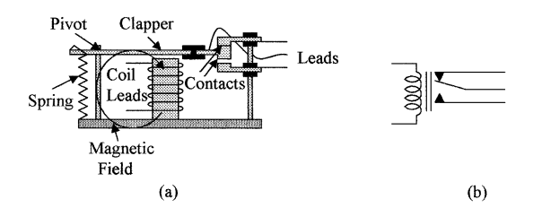

relays and actuators. Figure 3.15a shows an electromagnetic relay. When the coil is not energized the center lead is held in contact with the top lead by the spring as shown. When a current flows in the coil it is energized and a magnetic field is established. This attracts the clapper toward the coil and moves the contact arm downward breaking the contact between the upper and center leads and establishing a contact between the center and lower leads. The electromechanical relay in newer equipment is being replaced by solid state relays, which can use opto-isolation techniques when voltage isolation is required. Some of these devices and their use in process control will be discussed in more detail in later chapters. The schematic diagram of the relay is shown in Fig. 3.15b.

#### Summary

This article introduces the basic passive components in ac electricity. The main points discussed in this chapter are: 

1. The effect of capacitance combined with resistance, and inductance combined with resistance on the phase relationship between current and voltage
2. The generation of time constants in ac circuits
3. Combination of resistance, capacitance, and inductance in a circuit, and its effect on phasing between current and voltage, calculation of circuit impedances, and the use of vectors for combining out-of-phase voltages and currents
4. Circuit impedances at resonance and their effects on circuit currents
5. The concept and use of filters for frequency selection and noise reduction
6. The ac Wheatstone bridge and its use for measuring the impedance of components
7. The generation of magnetic fields in straight conductors and coils and how the flux fields are enhanced by the reduction of resistance to the magnetic fields using iron cores
8. Tight magnetic coupling between coils and how this is used in transformers
9. Motion caused by attractive and repulsive magnetic fields and how this is used in meter movements

