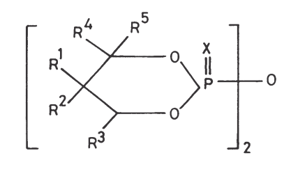
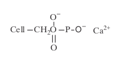

## Learn how to protect heat and flame during emergency

### Introduction

With industrialisation, the safety of human beings has become an important issue. A growing segment of the industrial textiles industry has therefore been involved in a number of new developments in fibres, fabrics, protective clothing.Major challenges to coatings and fabrication technology for production in the flame-retardant textile industry have been to produce environmentally friendly, non-toxic flame-retardant systems that complement the comfort properties of textiles.The 1990s, therefore, saw some major innovations in the development of heat-resistant fibres and flame-protective clothing for firefighters, foundry workers, military, aviation and space personnel, and for other industrial workers who are exposed to hazardous conditions.

For heat and flame protection, requirements range from clothing for situations in which the wearer may be subjected to occasional exposure to a moderate level of radiant heat as part of his/her normal working day, to clothing for prolonged protection, where the wearer is subject to severe radiant and convective heat, to direct flame, for example the firefighter’s suit. In the process of accomplishing flame protection, however, the garment may be so thermally insulative and water vapour impermeable that the wearer may begin to suffer discomfort and heat stress. Body temperature may rise and the wearer may become wet with sweat. Attempts have therefore been made to develop thermal and flame protective garments which can be worn without any discomfort.

In this chapter, various factors affecting the flammability, development of new inherently heat-resistant fibres, and the flame-retardant finishes for both natural and man-made fibre fabrics along with the relevant test methods are described.

### What constitutes flammability?

Ease of ignition, rate of burning and heat release rate are the important properties
of textile materials which determine the extent of fire hazard. The other factors that influence the thermal protection level include melting and shrinkage characteristics of synthetic fibre fabrics, and emission of smoke and toxic gases during burning. So, while selecting and designing flame protective clothing, the following points should be kept in mind:

- the thermal or burning behaviour of textile fibres
- the influence of fabric structure and garment shape on the burning behaviour
- selection of non-toxic, smoke-free flame-retardant additives or finishes
- design of the protective garment, depending on its usage, with comfort properties
- the intensity of the ignition source
- the oxygen supply.

<!-- Thermal behaviour of fibres -->
<ins class="adsbygoogle"
     style="display:block"
     data-ad-client="ca-pub-6173503627170942"
     data-ad-slot="8386029271"
     data-ad-format="auto"
     data-full-width-responsive="true"></ins>

### Thermal behaviour of fibres

The effect of heat on a textile material can produce physical as well as chemical change.8,15,16 In thermoplastic fibres, the physical changes occur at the second order transition (Tg), and melting temperature (Tm), while the chemical changes take place at pyrolysis temperatures (Tp) at which thermal degradation occurs. Textile combustion is a complex process that involves heating, decomposition leading to gasification (fuel generation), ignition and flame propagation.

A self-sustaining flame requires a fuel source and a means of gasifying the fuel, after which it must be mixed with oxygen and heat. When a fibre is subjected to
heat, it pyrolyses at Tp (Fig. 10.1) and volatile liquids and gases, which are combustible, act as the fuels for further combustion. After pyrolysis, if the temperature is equal to or greater than combustion temperature Tc, flammable volatile liquids burn in the presence of oxygen to give products such as carbon dioxide and water. When a textile is ignited, heat from an external source raises its temperature until it degrades. The rate of this initial rise in temperature depends on the specific heat

of the fibre, its thermal conductivity17 and also the latent heat of fusion (for melting fibres) and the heat of pyrolysis.

Frank-Kamenetzky18 demonstrated the influence of the nature of a reactive (flammable) material and its environment. The heat generation and heat loss was plotted as a function of temperature (Fig. 10.2). The plot shows that the loss of heat is approximately proportional to the difference in temperature between the combustion zone and the environment, and can be represented by an approximately straight line. The equilibrium between the heat generation and the heat loss is realized at the points of intersection of I and II (Fig. 10.2(a)). Point A represents the ambient temperature, point C represents the stationary temperature and both are stable while B is unstable. To the left of B, the heat loss exceeds the heat genera- tion, while to the right of B this is just the reverse. Therefore, the temperature cor- responding to B is the ignition temperature. During a fire accident, the material must be heated to such an extent that it reaches the ignition temperature. The temperature at B is also considered to be the self-extinguishing temperature; at lower temperatures heat loss exceeds heat generation. Figure 10.2(b) shows three materials with different degrees of flammability but in the same environment. The first (Ia) is highly flammable, the second (Ib) moderately flammable while the third (Ic) is flame resistant under these conditions. Figure 10.2(c), on the other hand, represents a material in different environments. An increased heat loss may be caused by a higher rate of air flow, less insulation and so on. From the above, it is thus evident that the flammable material may be barely flammable or even non-flammable under different environments.

In protective clothing, it is desirable to have low propensity for ignition from a flaming source or, if the item ignites, a slow fire spread with low heat output would be ideal. In general, thermoplastic-fibre fabrics19,20 such as nylon, polyester fibre, and polypropylene fibres fulfil these requirements because they shrink away from flame and, if they burn, they do so with a small slowly spreading flame and ablate. For pro- tective clothing, however, there are additional requirements, such as protection against heat by providing insulation, as well as high dimensional stability of the fabrics, so that, upon exposure to the heat fluxes that are expected during the course of the wearer’s work, they will neither shrink nor melt, and if they then decompose, form char. The above mentioned requirements cannot be met by thermoplastic fibres and so recourse must be made to one of the so-called high-performance fibres such as aramid fibre (e.g. Nomex, DuPont), flame-retardant cotton or wool, partially oxidised acrylic fibres, and so on. It may also be noted that the aramid fibres, in spite of their high oxygen index and high thermal stability, have not been found suitable for preventing skin burns in molten-metal splashes because of their high thermal conductivity.

From the foregoing discussion, it may be noted that the mode of decomposition and the nature of the decomposition products (solid, liquid, and gaseous products) depend on the chemical nature of the fibre, and also on the type of finishes or coatings applied to the fabrics. If such decomposition products are of a flammable nature, the presence of atmospheric oxygen gives rise to ignition, with or without flames. When the heat evolved is higher than that required for thermal decom- position, it can spread the ignition to cause the total destruction of the material (Fig. 10.3).

In addition to the fibre characteristics and fabric finish, several garment characteristics also influence thermal protection. For a given fabric thickness, the lower the density, the greater the thermal resistance. This applies to fibres such as cotton, wool, and so on, which produce an insulating char on heating. Hence, thicker fabrics made from cotton, wool and other non-melting fibres give good thermal protection, whereas the thicker thermoplastic-fibre fabrics produce more severe burns. Flame retardance of materials is normally expressed as oxygen index:

(OI) = (OI)m + ƒ(FR)

where (OI)m is the oxygen index of the virgin material, and f(FR) is the function of the flame retardant. Thermal properties of textile fibres including OI values.

Miller et al. have also studied the extinguishability of fabrics by determining the burning rate as a function of the environmental oxygen concentration. They quoted the intrinsic oxygen index, (OI)o, values at extrapolated zero burning rates for cotton, wool, modacrylic, and aramid fibre for top ignition of vertically oriented samples, and for bottom ignition of both vertically oriented and 45°-inclined samples. Intrinsic oxygen index values were, however, lower than normal limiting oxygen index (LOI) values, for example, (OI)o for top-ignited cotton is 13 whereas the normal LOI is 18.

In another study, Van Krevelen16 has established a good correlation between the chemical composition and the LOI value of the polymers. According to him, the composition parameter (CP) describing the combined effect of hydrogen and halogen content should be less than one for flame retardant materials. Figure 10.4 shows the relationship between CP and LOI for some textile materials

CP = (H C) - 0.65(F C)1/3 - 1.1(CI/C)1/3 - x(Br/C)1/3

where (H/C), (F/C) and (Cl/C) are the atomic ratios of the respective elements in the polymer composition, and coefficient x is probably 1.6, but is still uncertain owing to the lack of sufficient data. Although there is some data scatter, as shown in Fig. 10.4, there is a correlation between the LOI and CP.

- if CP ≥ 1 then LOI ª 17.5
- if CP £ 1 then LOI ª 42.5 to 60.

__Table: 10.1__ Thermal and flame-retardant properties of some fibres

| Fiber | Ts(°C) Glass transition | Tm(°C) Melt | Tp(°C) Pyrolysis | Tc(°C) Combustion | LOI (%) |
|---|---|-----|------|-----|-----|
| Wool | - | - | 245 | 600 | 25 |
| Cotton | - | - | 350 | 350 | 18.4 |
| Viscose | - | - | 350 | 042 | 18.9 |
| Triacetate | 172 | 290 | 305 | 540 | 18.4 |
| Nylon 6 | 50 | 215 | 431 | 450 | 20-21.5 |
| Nylon 6.6 | 50 | 265 | 403 | 530 | 20-21 |
| Polyester | 80–90 | 255 | 420-477 | 480 | 20-21.5 |
| Acrylic | 100 | >320 | 290 | >250 | 18.2 |
| Polypropylene | -20 | 165 | 469 | 550 | 18.6 |
| Modacrylic | <80 | >240 | 273 | 690 | 29–30 |
| PVC | <80 | >180 | >180 | 450 | 37–39 |
| PVDC | -17 | 180–210 | >220 | 532 | 60 |
| PTFE | 126 | >327 | 400 | 560 | 95 |
| Oxidised acrylic | - | - | >640 | - | 55 |
| Nomex | 275 | 375 | 310 | 500 | 28.5–30 |
| Kevlar | 340 | 560 | 590 | >550 | 29 |
| PBI | >400 | - | >500 | >500 | 40-42 |

** PBI = polybenzimidazole. For other abbreviations,

Tg is the second order transition, Tm is the melting transition, Tp is the pyrolysis temperature, Tc is the
combustion temperature.

(H/C) could be considered as a measure of the ‘aromaticity’ in polymers not containing halogen. This indicates that flame-retardant (FR) polymers and fibres should be intrinsically aromatic in nature with a CP value of <1.

Dependence of LOI on the environmental temperature, sample thermal history, moisture content, fabric sample dimensions, fabric area density and so on has been well documented. Horrocks et al have demonstrated the use of extinction oxygen index (EOI) rather than the LOI as a measure of textile flammability. By con- sidering the potential fabric extinguishability in terms of an EOI parameter, the authors showed that the influence of ignition may be removed by simple extrapolation to zero ignition time to generate (EOI)o

### Selection of fibres suitable for thermal and flame protection

The fibres could be classified into two categories: 

- Inherently flame-retardant fibres, such as aramid, modacrylic, polybenzimidazole (PBI), Panox (oxidised acrylic) or semicarbon, phenolic, asbestos, ceramic etc.
- chemically modified fibres and fabrics, for example, flame retardant cotton, wool, viscose and synthetic fibres.

#### Inherently flame-retardant fibres

For some 2000 years, there was only one type of naturally occurring mineral fibre, asbestos which could not be completely destroyed by fire. Asbestos has many desirable properties and is cheap as well. However, the fibres are so fine that they can be breathed into the lungs and can promote fatal cancerous growth.

Glass fibres are also heat-resistant materials. In earlier times such fibres were used for printed circuit boards. Now developments in the texturing of glass fibres have provided a material that could substitute for the asbestos fibres to some extent. Unlike asbestos fibres, glass fibres with high diameter are non-respirable. They have an upper temperature resistance of about 450 °C. They spin well, knit or braid easily and can be coated with rubber, polyacrylate or silicones. Glass fibres have also good electrical and insulation properties. However, they cause skin irritation, which limits their application in protective clothing.

A number of ceramic fibres, SiC, silicon or boron nitride, polycarbosilicones, alumina and so on, have been developed. These ceramic fibres can withstand temperatures between 1000–1400 °C. However, the biggest problem with ceramic in staple form is that it is very abrasive and may wear out the processing machinery at a very high rate. Ceramic fibres generally contain a mixture of components, for example, Nicalon (Nippon Carbon Co.) is silicon carbide fibre containing up to 30% of silica, and carbon, while Nextel (DuPont) is a 70/28/2 mixture of Al2O3/SiO2/B2O3. Tyranno (Ube Industries Ltd., Japan) is a ceramic fibre composed of silicon–titanium, carbon and oxygen (Si-Ti-C-O), which is reported to have a non-crystalline microstructure.Altex (Sumitomo, Japan) produces continuous a-alumina fibres with a diameter of 8–10 mm. The tenacity of these commercial ceramic fibres is in the range of 0.32–3.2 N tex-1 and breaking extension is only 0.4–5.4%. An important aspect of high temperature fibres that should be considered is their ability to insulate from thermal flux or conductivity. Silica-based fibres have high rates of thermal conductivity, a property that may be valuable in heat dissipation in some uses but in situations like hot metal splashes, where the heat is transmitted to the person by conduction, they will cause more burn injuries instead of protecting the skin. Thus, the selection of the fibre for making thermally protective clothing should be decided on the basis of the environment to which a worker is exposed, namely, whether the heat will be transmitted to the person by conduction, convection or radiation. Despite their high temperature resistance, ceramic fibres have poor aesthetic characteristics, high densities and are difficult to process.

##### Aramids

Aromatic polyamides such as poly(metaphenylene isophthalamide) char above 400 °C and may survive short exposures at temperatures up to 700 °C. Nomex (DuPont), Conex (Teijin), Fenilon (Russian) and Apyeil (Unitika) meta-aramid fibres have been developed for protective clothing for fighter pilots, tank crews, astronauts and those working in certain industries. Para-aramid fibres like Kevlar (DuPont), Twaron (Akzo Nobel) and Technora (Teijin) are also being used for ballistic and flame protection. Nomex nonwovens are used for hot gas filtration and thermal insulation.

Aramids are resistant to high temperatures, for example at 250 °C for 1000 hours the breaking strength of Nomex is about 65% of that before exposure. They begin to char at about 400 °C with little or no melting. Generally, meta-aramids are used in heat protective clothing, however, in intense heat, Nomex III (a blend of Nomex and Kevlar 29) (95 : 5 by wt) is preferred, in order to provide a greater mechanical stability to the char. Teijin23 has introduced a new fabric, X-fire, a combination of Teijin Conex (meta-aramid) and Technora (para-aramid) fibres. This fabric is capable of resisting temperatures up to 1200 °C for 40–60 s.

Aramids are resistant to high temperatures, for example at 250 °C for 1000 hours the breaking strength of Nomex is about 65% of that before exposure. They begin to char at about 400 °C with little or no melting. Generally, meta-aramids are used in heat protective clothing, however, in intense heat, Nomex III (a blend of Nomex and Kevlar 29 (95 : 5 by wt) is preferred, in order to provide a greater mechanical stability to the char. Teijin23 has introduced a new fabric, X-fire, a combination of Teijin Conex (meta-aramid) and Technora (para-aramid) fibres. This fabric is capable of resisting temperatures up to 1200 °C for 40–60 s.

Nomex can also be blended with FR fibres, for example FR wool and FR viscose. Karvin (DuPont) is a blend of 30% Nomex, 65% FR viscose and 5% Kevlar. Kevlar blends were formerly used by Firotex Co. UK (now defunct) with partially carbonised viscose in fabric form. This blend was developed as a fire blocking fabric for aircraft seats but found little favour because of the poor abrasion resist- ance of the carbonised viscose component (see Section 10.4.1.6 on semicarbon fibres).

Other examples of such blends include Fortafil and Fortamid needle felt NC580, which comprise aramid and FR viscose.This material is useful for gloves and mittens in which temperatures may reach up to 350 °C. The outer working surface of the aramid fibre is needled through a reinforcing polyester fibre scrim over an inner layer of FR viscose.

Another aromatic copolyamide fibre developed by Lenzing AG is P84. This fibre does not melt but becomes carbonized at temperatures in excess of 500 °C and has an LOI value of 36–38%. The basic fibre is golden yellow in colour but Lenzing AG offers it as spun material dyed in limited colours. P84 fibres have irregular cross-section, which provides a higher cover factor at lower weights of fabrics made from it. Its extensibility is >30% with good knot and loop strength. The applications of high performance P84 include protective clothing, as a sealing or packing material, for hot gas filtration and in aviation and space including covers for aircraft seats.28 Mitsui Toatsu Chemical Co. has also claimed the development of a more heat-resistant aramid fibre. This fibre has been made from an aromatic isocyanate and an aro- matic carboxylic acid.

##### Poly(amide-imide) fibres

Rhone-Poulenc produces polyamide–imide fibre called Kermel. This is available in two forms: 234 AGF and 235 AGF. Type 234 is a staple fibre for use in both cotton and worsted spinning systems, and is produced in five spun-dyed colours. Type 235 is intended for nonwovens applications. In France, Kermel is used by firefighters and military personnel where the risk of fire is higher than usual. Its LOI is 31–32%, and it resists up to 250 °C exposure for a long duration. At 250 °C after 500 hours exposure, the loss of mechanical properties is only 33%. Kermel fibre does not melt but carbonises. During its carbonization it generates very little opacity. Blends of 25–50% Kermel with FR viscose offer resistance to ultraviolet (UV) radiation and price advantage also compared with 100% Kermal fabrics. Blending with 30–60% wool also produces more comfortable woven fabrics with enhanced drape. In the metal industry, the 50 : 50 blend gives very good results, but a 65 : 35 Kermel/viscose blend is preferred for such applications. Kermel-based fabrics are now used both on-shore and off-shore by leading petrochemical groups. The army, navy and air-forces are also using Kermel in woven and knitted forms.

##### Polybenzimidazole (PBI) fibres

Celanese developed PBI,28,30,31 a non-combustible organic fibre. Its LOI is 41% and it emits little smoke on exposure to flame. PBI can withstand temperatures as high as 600 °C for short-term (3–5 s) exposures and longer term exposure at temperatures up to 300–350 °C. It provides the same protection as asbestos while weighing half as much. It also absorbs more moisture than cotton. The current area of inter- est in PBI is in the replacement of asbestos-reinforced rubbers used in rocket motors and boosters to control ignition. Its other applications include fire blocking fabrics in aircraft seats, firefighter suits and racing-car driver suits. Studies of subjective wearer evaluations have shown that PBI fibre exhibits comfort ratings equivalent to those of 100% cotton.

Ballyclare Special Products, UK31 has recently developed a fire-resistant garment assembly for firefighter’s safety. The outer fabric of the garment is made from Pbi Gold(R), a fire-resistant fabric from Hoechst Celanese. This fabric, which was originally developed for the US Apollo space programme, combines the comfort, thermal and chemical resistance of polybenzimdazole (PBI) with the strength of aramid fibre. Pbi Gold is stable even under simulated flash conditions at 950 °C. The fabric is also resistant to puncturing, tearing and ripping. 

##### Poly(phenylene sulphide) PPS fibres

Ryton (Sulfar) fibres (Tm 285 °C) produced by Amoco Fabrics and Fibres Co. are nonflammable. They do not support combustion under normal atmospheric conditions, and the LOI is 34–35%. Chemical resistance and the ability to retain physical properties under extremely adverse conditions make the fibre valuable for protective clothing.

##### Polyacrylate (Inidex)

Polyacrylate10,30 is a crosslinked copolymer of acrylic acid and acrylamide. Its LOI is 43%, and when subjected to flame, it neither burns nor melts. It emits virtually no smoke or toxic gases. Because of its low strength and brittleness, it can be used in nonwovens although the durability of fabrics made from this fibre may not be adequate for some apparel uses. As Inidex also offers protection from attack by chemicals, including strong acids and alkalis, it may be found useful in filtration of liquids and hot gases.

##### Semicarbon/Panox fibres

These fibres32 are produced by thermal treatment (thermo-oxidative stabilization) of either viscose or acrylic fibres. Asgard and Firotex are produced from viscose while Panox, Pyromex, Fortasil, Sigratex and so on are made from acrylic precursors. The acrylic fibres can be oxidised in the fibre, filament or fabric form at 220– 270 °C in air, but the viscose fibres are generally partially carbonized in the fabric form in a nitrogen atmosphere. 

These semicarbon fibres have excellent heat resistance, do not burn in air, do not melt and have outstanding resistance to molten metal splashes. After exposure to flame, there is no afterglow and fabrics remain flexible. In view of their outstanding properties, the Panotex fabrics (Universal Carbon Fibres) made from Panox (RK Textiles), for example, are ideal for use in protective clothing where protection against the naked flame is required. Currently, this range of fabrics is probably the most common and versatile of oxidised acrylic-based materials. Panotex fabrics can withstand flame temperatures in excess of 1000 °C, display very little shrinkage and yet, breathe like wool. However, the fabrics have relatively poor abrasion resistance. Therefore, a blend of oxidised acrylic fibre and an aramid used in a honeycomb woven fabric has been considered an ideal material as a fire blocker for aircraft seats and military tank crews. The honeycomb weave, which is intermittently tight and slack in construction, provides a spongy stretch fabric, which is easy to cut and fit around difficult shapes.

Panox/wool blends are suitable for flying suits. However, Panotex fabrics have high thermal conductivity and are non-reflecting. It is, therefore, necessary to have a suitable underwear to protect the skin while using Panotex in the outer layer of protective clothing. For this purpose a 60% Panox 40% modacrylic fibre double jersey fabric and a 60% wool 40% Panox core fibre have been recommended. In some cases, the heat conduction of Panotex fabrics can be of advantage in the con- struction of covers for aircraft seats; a fabric with a Zirpro-treated wool face and Panox back will probably spread the heat from a localized igniting source thereby delaying the ignition of underlying foam.

To prevent transfer of radiant heat, Panotex fabrics may be aluminized. An aluminized Panotex fabric is thus suitable for fire-proximity work but not for fire entry. It has been demonstrated that with a heat flux of 3 W cm-2, an aluminium coating will ignite, but a stainless steel coating can withstand such a situation for a prolonged period. Multiple layers of Panotex fabric tend to protect a polyvinyl chloride (PVC)-simulated skin against irradiance as high as 170 W cm-2 applied for 2 s.

Another advantage of Panotex outer fabric is the shedding of burning petrol, and it can even withstand several applications of napalm. 

<ins class="adsbygoogle"
     style="display:block; text-align:center;"
     data-ad-layout="in-article"
     data-ad-format="fluid"
     data-ad-client="ca-pub-6173503627170942"
     data-ad-slot="5535654596"></ins>

##### Phenolic or novoloid fibres

Kynol is a well-established novoloid heat-resistant fibre which is produced by spinning and postcuring of phenol formaldehyde resin precondensate. The fibre is soft and golden coloured with a moisture regain of 6%. When strongly heated, Kynol fabric is slowly carbonised with little or no evolution of toxic gases or smoke. However, its poor strength and abrasion properties preclude its application for making apparel. To upgrade its mechanical properties, Kynol fibres can be blended with Nomex or FR viscose to produce flame-protective clothing.

Another phenolic fibre, Philene has also been developed, for example Philene 206 (0.9 den) and Philene 244 (2.1 den). The moisture regain of the fibre is 7.3% and is said to be non-flammable and self-extinguishing, with an LOI of 39%. It does not show any change in tensile properties after being heated for 24 hours at 140 °C (or for 6 hours at 200 °C). A charred Philene fabric is claimed to form a thermal insulating barrier that retains its initial form.

BASF has also developed Basofil melamine staple fibres of 2.2 dtex with a tenacity of 2–4 cN dtex-1 and an elongation of 15–20%. It has LOI values of 31–33 and moisture regain is about 4%. Basofil can be used in continuous service at 200 °C. Above 370 °C, thermal degradation results in char formation rather than a molten drip. For protective wear, DREF-2 yarns comprising a 34 tex glass-fibre core is spun to Nm 12/2 (83 tex/2), sheathed with a blend of Basofil and para-aramid (80/20) to produce 400 g m-2 or 580 g m-2 fabrics required for foundries where these are constant hazards from molten metal splashes and sparks. Such materials may also be used to make proximity suits to protect against intense radiation or to make entry suits.

Kotresh et al.34 have developed a flame-retardant fabric from DREF-2 friction spun core yarn of kevlar and FR viscose for anti-G suits (AGS) outer garment applications. This fabric has also been recommended for firefighters.

##### Modacrylic

Flame-retardant modacrylic under different brand names, such as Velicren FR (Montefibre, Italy) and SEF (Solutia Inc.) is a copolymer of acrylonitrile, vinyl chloride or vinylidene chloride in the ratio of 60 : 40 (w/w) along with a sulphonated vinyl monomer. It has an LOI in the range of 26–31%.

Kaneka Corporation has also developed Kanecaron, an FR modacrylic with an LOI value in the range of 30–35%. Fabrics from Kanecaron (e.g. Protex M) blended with cotton meet the requirements of BS 6249 Index B, while maintaining the softness and comfort of cotton.

##### Chlorofibre

Rhone-Poulenc’s chlorofibre, Rhovylon FR and Clevyl is used in furnishing fabrics, nightwear and institutional blankets. It has quite a high LOI value of around 45%. Extensive testing has shown that chlorofibre meets International Standards for furnishing fabrics and it is in use in French high speed trains (TGVs) and a passenger liner (QE2).

#### Flame retardation of conventional textile fibres

##### FR viscose

Inherently flame-retardant viscose fibres are produced by incorporating FR additives/fillers in the spinning dope before extrusion. For example, Sandoflam 5060 (Sandoz), polysilicic acid or polysilicic acid and aluminium (Sateri).

Sandoflam 5060 contains both phosphorus and sulphur as shown in Structure I, bis (2-thio-5,5-dimethyl-1,3,2-dioxaphosphorinyl) oxide, below:

Aqueous dispersions of pyro(thio)phosphates(II) containing polyoxyalkylenes have also been used as dope additives (15.8 parts) in 200 parts of 9% cellulose xanthate. The rayon produced from this mixture had an LOI value of 27.5 compared with 18 without the phosphate (II) dispersion (see Structure II).

R1, R2 = H, alkyl, CH2Cl, CH2Br, alkoxymethyl or R1 = phenyl, R3, R5 = H, alkyl, R4 = H, Me, X = O or S

Hoechst AG has previously offered an FR viscose staple fibre under the brand name Danufil CS. Here the FR additive was Sandoflam 5060 used in the viscose dope before wet spinning. The products offered were 1.7 and 3.3 dtex for short-fibre spinning and 4.0 dtex for long-fibre spinning. Its LOI value was 27%.

In 100% form, the fibre can be used for mattress covers and fire extinguishing blankets. A blend with aramid is suitable for protective clothing, such as army and fire service uniforms. Further, blending with wool shows a synergistic effect, and this blend is used for upholstery fabrics.

Lenzing AG currently produces Lenzing Viscose FR which contains Sandoflam 5060. It has been demonstrated that a wool/viscose FR blend performs better than either fibre alone and this is being used as seat covers in the Airbus 310.

DuPont and Lenzing AG have jointly developed a special blend consisting of
65% Viscose FR, 30% Nomex and 5% Kevlar for industrial wear under the brand
name of Karvin(R).

Sateri (formerly Kemira) Fibres, Finland has developed an environmentally friendly hybrid viscose fibre containing cellulose and polysilicic acid under the brand name Visil(R), and viscose containing polysilicic acid and aluminium under the name VisilAP(R). This hybrid fibre is a cellulosic fibre containing molecular chains of poly-silicic acid produced by wet spinning of water glass and alkaline cellulose xanthate during the coagulation process, the cellulose component is regenerated simultaneously with the polymerization of polysilicic acid; nSi (OH)4 -> polysilicic acid.

The incorporation of polysilicic acid enhances the fire resistance of the hybrid by the following mechanism:

- An inherently incombustible char is formed on the fibre surface.
- The temperature at which water is released from the fibre is lowered.
- The hydrated nature of the inorganic component suppresses the flame and exerts a self-extinguishing effect.

In another patent, it is stated that polysilicic acid that contains aluminium silicate sites, a blend of viscose and water glass, after spinning, tow stretching and subse-
quent washing with 40 g l-1 Na aluminate solution and carding, showed an LOI value of 32. Properties of Visil fibre are given in Table 10.3. 

Anand and Garvey have also demonstrated the use of Visil/modacrylic and Visil/wool blends for use in protective clothing. In Visil/modacrylic blends, it has been shown that the level of flame retardancy is dependent not only on the fibre content, but the physical structure of the yarn as well. The blended ring spun yarn fabrics exhibited synergism relative to rotor spun yarn fabrics at each blend ratio (Visil/modacrylic: 16.7/83.3 to 83.3/16.7) in both char and LOI values. In contrast, Visil/wool blended fabrics failed in the BS 5438 strip test despite the higher LOI values (25.7–36%) of the blends. This anomalous behaviour has been attributed to the lofty wool structures which are known to burn extensively because of high oxygen accessibility to the fibre surface in the blended fabrics. Further, it may also be noted that in the LOI test, burning of the fabric takes place downward but in the vertical strip test upward burning conditions apply, which would favour the enhanced access of oxygen from the convective effects of the flame.

In another paper, Horrocks et al.40 have shown that flame-retardant textiles can be developed in composite structures having fibre-intumescent interactive systems. The interactive pyrolysis of both components creates a fibrous char-reinforced intumescent charred derivative of the original structure, which offers a toughened and oxygen impermeable barrier to heat, flame and subsequent oxidation. The compos- ite structure comprised a nonwoven core (200 g m-2) of Visil in which an ammonium polyphosphate-based intumescent was dispersed and resin bonded up to 50% w/w. This core was sandwiched between a flame-retardant cotton face and backing woven fabric (Fig. 10.5). Exposure of this composite structure at around 500 °C in a furnace

__Table 10.3__ Physical and mechanical properties of Visil36

|    |     |
|--|--|
| Linear density (dtex) | 1.7, 3.5, 5.0, 8.0 |
| Length (mm) | 40 and 80 currently available |
| SiO2 loading (%) | 30–33, depending on grade |
| Cross-section | Kidney bean, irregular | 22–27 |
| Tenacity (cN/dtex) | 1.5–2.0 |
| Elongation-at-break (%) | 22-27 |
| Moisture regain (%) | 9–11 |
| Water imbibition (%) | 50–60 |
| Limiting oxygen index (%) | 26–33, depending on grade or textile structure |

showed that both the intumescent and organic cellulose component of the Visil charred along with the FR facing and backing fabrics. Simultaneously expanding the intumescent increased the thickness of the core fabric by a factor of 2. On further heating above 500 °C, the carbonized expanded composite slowly oxidised and the polysilicic acid content of the Visil was converted fully to silica.

These charred residues could survive 10 min exposure at 1100 °C while leaving the coherent inorganic silica residue at a similar thickness to that of the original fabric. The authors41 also cite their patent in which they have disclosed the unique nature of such a composite structure for thermal protection, constructed from five layers as follows:

1. 200 g m-2 Visil web,
2. 120 g m-2 FR cotton woven fabric,
3. 200 g m-2 Visil web containing the intumescent,
4. 120 g m-2 FR cotton woven fabric,
5. 200 g m-2 Visil web.

The intumescent content was varied from 100–250 g m-2 and the bonding resin (10% w/w on the basis of intumescent concentration) was added to it to produce the ‘sandwich’ structure.

#### Flame-retardant polyester

There are three methods of rendering synthetic fibres flame retardant:

- use of FR comonomers during copolymerization,
- introduction of an FR additive during extrusion,
- application of flame retardant finishes or coatings.

The first two methods would give inherently flame-retardant polyester fibres.

Trevira CS(R) and Trevira FR(R) produced by Hoechst are flame-retardant polyesters. Both are manufactured by copolymerizing a bifunctional organophosphorus compound based on phosphinic acid derivative (Table 10.4):

__Table 10.4__ Flame-retardant additives for polyester fibres4

| Additives/Co-monomor | LOI | Reference |
| -- | -- | -- |
| _Phosphorus-based_ Phosphinic acid derivative (Trevira CS) HO-P(O) XYCOOH X = H or alkyl Y = alkyl | 29–30 | 81 |
| Bisphenol S oligomer (Toyobo GH) | 28 | 81 |
| Cyclic phosphonate (dimeric) (Antiblaze 1045) | 27–28 |  |
| 37.5: bisphenol S + 55.35: Neopentyl glycol chlorophosphate -> 5 parts FR ester + PET (100) | 29 | JP 79,80,355(1979) Chem. Abstr. 91, 194591r (1979) |
| 100 parts: PET 7 parts: cresyl diphenyl phosphate 5 parts: triallyl cyanurate | Good FR with no dripping fibre web irradiated with electron beam | 50 |
| 100 parts: PET 7 parts: diphenyl cresyl phosphonate | Resistant to heating and melting | 51 |
| [2,5-bis(2-hydroxyethoxy) phenyl]-  diphenyl phosphine oxide mpt 195 °C | 30 | Chem. Abstr. 122, 83672h (1995) |
| Tetrakis (hydroxymethyl) phosphonium chloride | 28 | Chem. Abstr. 122, 
12081c (1995) |
| _Halogen-based_ p-bromophenoxycyclophosphazene Decabromodiphenyl oxide Neopentyl glycol chlorophosphate |  28 29 29 |  Chem. Abstr. 112, 8647t (1990) Chem. Abstr. 99, 6796e (1983) Chem. Abstr. 91, 194591r (1979) |

The LOI of Trevira CS fabric, having 0.6% phosphorus, is 28% and the burning fabric does not give rise to burning molten droplets. Subject to fabric construction, dyeing and finishing processes, interior textiles made from flame retardant Trevira (containing 0.6% w/w phosphorus) can be anticipated to pass all the stringent international test standards42, such as BS 5867 part 2 type C for textiles, curtains and drapes.

Hoechst claims that the production of flame retardant Trevira is environmentally a clean process compared to other artificial and natural fibre fabrics. Tests on the toxicity of burning fabrics at increasing temperatures demonstrate the superiority of Trevira CS polyester fabric which is even less toxic as compared to treated FR cotton (Fig. 10.6). Trevira CS and FR are chlorine-free, unlike modacrylics (which contain up to 50% PVC) and PVC chlorofibres. They also liberate extremely low levels of toxic gases and smoke when exposed to an ignition source. There is zero hydrogen cyanide released, for example, in marked contrast to both smouldering and flaming FR wool, or modacrylics. Hence fumes released from Trevira polyester when it is subjected to 700 °C temperature, indicate a mortality rate of only 8% compared with cotton FR which results in a mortality rate of 83% in experimental animal tests. Thus, Trevira CS/FR has been approved for the Oeko-Tex standard 100 certificate as containing no harmful substances. 

Toyobo GH also licensed a flame retardant polyester to Montefibre, which is believed to be a sulphone–phosphonate copolymer. Ma et al.43 have reported the synthesis and properties of intumescent, phosphorus-based flame-retardant polyesters. Spirocyclic pentaerythritol di(phosphate acid monochloride) was used as a  comonomer (Structure III):

The LOI value was found to be 27–30 and the analysis of the SEM photographs of the copolymer chars indicated the presence of solid phase intumescence.

Unitika44,45 has also developed new flame-retardant melt spun polyester using [2,5-bis(2-hydroxyethoxy)phenyl]diphenyl phosphine oxide and bis(b-hydroxy ethyl)terephthalate copolymer. The filament is of the sheath–core type with regular polyester as the sheath and copolymer polyester as the core. This sheath–core structure provides stability to heat in the texturing process and facilitates texturing. The LOI value of this FR polyester is 30%. It resists burning as it has a self-extinguishing property. Moreover, it generates no hazardous gases while burning. 

Horrocks et al.46 have developed an analytical model for understanding the environmental consequences of using flame-retardant textiles. An environmental rank value is given at each stage in the manufacturing process and product life of each flame-retardant fibre textile. The results show that each of the eleven generic fibres analysed showed an environmental index value within the range of 32–51%, where 100% denotes the worst environmental position possible. 

Zubkova47 has recommended the use of poly(vinyltriethoxy)silane microencapsulated T-2 fire retardant in polyethylene terephthalate (PET) melt prior to extrusion, to reduce the combustibility of polyester and its blends. 

In the patent literature, Japan Exlan Co.,48 has also disclosed the production of flame-retardant polyester conjugate fibres. These are polyesters containing 0.5–5.0 mol% (based on total acid components) inorganic boron compounds as the core and polyester containing phosphorus, Mg or Si compounds as the sheath. Thus, ethylene glycol (I) and terephthalic acid (II) were esterified and polymerized in the presence of 1.5 mol% (on the basis of total acid component) B2O3 to give polyester (III), and I was polycondensed with II in the presence of 1.5 mol% Mg(OAc)2 to give III. Then III containing B2O3 as core and III containing Mg(OAc)2 as sheath were cospun at 295 °C and drawn to give conjugated fibres with excellent fire resistance even after washing. 

Japan Exlan49 has also disclosed the use of OH-terminated poly(dimethyl siloxane) or silane coupling agents as the sheath component for producing FR polyester bicomponent fibres. 

Unitika50,51 recommended the use of cresyl diphenyl phosphate or phosphonate (7 parts) and triallyl cyanurate (5 parts) in 100 parts PET prior to melt spinning. The fibres were then woven and irradiated with electron beam to 20 Mrad dose which showed good flame retardance and no dripping. Some of the FR additives/comonomers disclosed in the patent literature for polyester are listed in Table 10.4. 

#### Flame-retardant nylon 

Nylons have a self-extinguishing property due to extensive shrinking and dripping during combustion. Problems arise in blends with natural fibres like cellulosics which will char and form a supporting structure (the so-called scaffolding effect) which will then hold the molten polymer.

Introduction of flame or combustion retarders into polyamide melts before spinning appears to be an economical and feasible process if they are stable. Butylkina et al.52 compared the performance of non-melting type compounds (e.g. lead methylphosphonate and a complex of alkylphosphonic acid and antimony) with highly viscous FR compounds like phosphorylated pentaerythritol (Fostetrol(R)) and phosphorus-based Borofos(R) as dope additives during melt spinning of nylon 6. The oxygen index value of about 50% was found in FR nylon 6 having (2 w/w% of antimony) as an antimony complex of alkyl phosphonic acid but the carbonized residue/char was found to be highest when Borofos was used as melt additive.

In another study, Tyuganova et al.53 have used a ternary system of flame retardant, namely, boric acid, brominated pentaerythritol and antimony oxide mixed into the polymer melt prior to extrusion. It has been demonstrated that boron compounds display condensed phase active mechanisms and increase the yield of water and carbonized residue, while halogen-containing compounds are effective inhibitors of free radical reactions in the gas phase. A nylon sample having 2.28 w/w% Boron, 3.09 w/w% Br and 2.26 w/w% Sb showed the LOI value of 29.2.

Allied Signal54 has disclosed in a patent the use of zinc (0.01–2.9 w/w%), molybdenum (0.002–0.58 w/w%) as calcium zinc molybdate and 0.05–1.3 w/w% chlorine, as chlorinated ethylene in nylon 6 melt for producing flame-retardant fibre for carpets. The dyed carpets were backed with regular SBR latex and Actionbak secondary backing. Flammability was tested by the ASTM E-648 Flooring Radiant Panel Test. The sample with compound B (as Kem GardTM 425) from Sherwin-Williams as molybdenum-based flame retardant (0.3 w/w%) and compound A (chlorinated polyethylene with 25% chlorine) at 0.7 w/w% had an average of greater than 1.13 W cm-2 compared to 0.43 W cm-2 for the control carpet. Thus, FR carpet developed by Allied Signal was a class I carpet, while the control was a class II carpet as per the ASTM-E 648 test method.

Day et al.55 have made a systematic study of the role of individual constructional components in the flammability characteristics of carpets. It was shown that carpets that are glued to cement asbestos board are less easy to ignite, burn at a slower rate, and give off less smoke and heat compared to carpets not glued down.

Stoddard et al.56 have also studied the effect of construction parameters, face yarn additives and backing materials on the flame retardancy of nylon 6.6 carpets. A number of halogen-containing FR additives were introduced into nylon 6.6 melt before extrusion. The melt-stable additives were Dechlorane+25R, hexabromo- biphenyl and decabromobiphenyl oxide. Alumina trihydrate in the carpet latex and application of polyvinyl chloride to the face side of the primary backing were also used. It has been observed that FR carpets containing lower levels of Dechlorane/antimony oxide (2/1 w/w%) burnt for longer periods but extinguished between 2–9 min, while carpets containing 3 w/w% decabromobiphenyl oxide under similar test conditions extinguished in 5.5–10.5 min.

Organophosphorus compounds were also used as melt additives in nylon 6.6.
These phosphorus derivatives in most cases reduced polymer viscosity to too low a degree for fibre formation and they also had very poor wash resistance.

Reduced flammability of nylon by use of potassium iodide57 has also been disclosed. KI (<5 w/w%) as an additive in nylon textile fibres improved the heat, light and dye stability of fibres. The iodides used are Na, Li and other inorganic iodides and a combination of antimony oxide and inorganic iodides and inorganic phosphates.

Phosphorus-containing polyamide fibres with increased stain and fire resistance have also been disclosed by Monsanto Co.58 Thus, bis(2-carboxyethyl)phosphinic acid neutralised with NaOH, was polymerized with nylon 6.6 salt and hexamethyl-enediamine to give phosphorus-containing polyamide fibres with enhanced flame resistance.

Levchik et al.59 have suggested the role of inorganic fillers (talc, CaCO3, ZnCO3, MnO2) in improving the flame retardance of a nylon 6/ammonium polyphosphate (APP) blend. It has been observed that MnO2 oxidises nylon 6 thereby enhancing the char yield from the polymer. Furthermore, these fillers react, which increases the solid residue, improves thermal shielding of the char and gives inorganic glasses, which hinder propagation of the flame by combustible gases.

#### Flame-retardant acrylic fibres

Like other synthetic fibres, acrylic fibres shrink when heated, which can decrease the possibility of accidental ignition. However, once ignited, they burn vigorously accompanied by black smoke. Thus, many efforts have been devoted to improve the flame resistance of acrylic fibres.60–67 Among these studies, halogen-based and particularly bromine derivatives or halogen- or phosphorus-containing comonomers, are the most effective flame retardants used in acrylic fibres.

Self-extinguishing modacrylic fibres have been produced from vinylidene chloride and acrylonitrile copolymers or terpolymers.

A number of spinning dope additives are also known to render acrylic fibres flame retardant (Table 10.5), for example esters of antimony, tin and their oxides, SiO2, halogenated paraffins, halogenated aromatic compounds, phosphorus compounds,70–74 and so on. Bromine compounds have been found to be most effective flame retardants for acrylic fibres. The flame-retardant mechanism of these halogen compounds is believed to be associated with the interaction of halogen with reactive moieties of the flame itself.

While it is often considered that hydrogen halide reduces the concentration of
·
·
the free radicals OH and H , which help in propagation of the flame, thus follow-
ing a gas phase reaction mechanism, this seems not to be the case following the
pyrolysis of PAN (polyacrylonitrile) and its copolymers under burning conditions.
Hall et al.66 have demonstrated the role of various inorganic and organic phosphorus and nitrogen, or sulphur or halogen-containing derivatives with or without anti-mony oxide (Table 10.6). From thermogravimetric analysis (TGA), differential scanning calorimetry (DSC) and residual char-forming techniques, they have shown that flame retardancy relates directly to char-forming tendency for all the flame retardants and their ability to reduce the flammable volatiles formed during the first stage of acrylonitrile copolymer pyrolysis. Ammonium dihydrogen phosphate has been found to be the most char-forming flame retardant.

Various stages of acrylic polymer pyrolysis have been systematically studied by the same authors.66 It is interesting to note that apparent activation energies of the acrylonitrile polymer cyclization reaction have been reduced and the lowest values are for NH4H2PO4 containing copolymers. This suggests that the more effective, char-promoting flame retardants may initially modify the cyclization reaction to favour production of char-forming precursors. From the thermal data, a positive linear relationship between LOI and the char yield obtained at 500 °C at respective LOI values (Table 10.7) has been observed (Fig. 10.7) using the following linearly regressed equation under isothermal conditions

LOI = 17.0 + 0.40 (char w w%)

__Table 10.5__ Possible dope additive for making flame-retardant (FR) acrylic fibres

| Polymer | Additive | Property | Reference |
| -- | -- | -- | -- |
| P(AN-vinyl chloride) | 5% Dibutyl tin ethyl maleate | FR fibres | 8 |
| Acrylonitrile (AN) copolymer with 3.5% Cl (chlorinated aliphatic acid ester) | 0.6% Sb2O3 and 0.07% Bu2SnO | FR fibres with good dyeability, strength and transparency | 8 |
| PAN | Finely divided inorganic tin compound | FR fibres with improved gloss, transparency, whiteness, and dyeability | 8 |
| P(AN-vinylidene chloride) | SnCl4 and NaOH | Fibres with good transparency and lustre | 8 |
| P(AN-vinylidene chloride-vinyl chloride) | Compounds containing Sb, Al, Sn, or Zn | FR fibres | 8 |
| P(AN-vinylidene chloride-vinyl chloride) | Dispersion of Sb2O3 particles in the dope | FR fibres | 8 |
| Polymer with AN ≥ 50% | 15–50% of a metal oxide filler with mean particle size 1–10 nm | FR fibres | 8 |
| PAN | Cyanoethyl (N,N-dimethyl amido)-phosphate, tris(b-chloroethyl) phosphate | FR fibres | 8 |
| P(AN-methyl acrylate-sodium methallyl sulphonate) | 0.5–5.0 wt% of cyclic phosphonitrile compound containing phenoxy groups | LOI = 24.1 | 8 |
| PAN | 12.5% Tetrabromobisphenol A | LOI > 30 | 8 |
| PAN | Polychlorotrifluoroethylene | Fibres with low flammability | 8 |
| P(AN-vinyl acetate) | Bu3PO4 Tris(dibromopropyl) phosphate or Al(OH)3gel | LOI ~ 29 synergistic flame retardant | 64 |
| P(AN-vinylidene chloride) | Ca phosphate and Sb2O3 |  |  |
| P(AN-vinyl acetate) | 15% Hexabromocyclododecane (Great Lakes CD-75P) 15% poly(dibromostyrene) (Great Lakes PDBS) | LOI 41–45.5   LOI 43–48 | 67 |
| P(AN-vinyl chloride and/or vinylidene chloride/sodium methallyl sulphonate) 70 parts + 15 parts cellulose diacetate | 37.5 parts colloidal soln. of Sb2O5 in dimethyl acetamide + 380 parts dimethyl acetamide | LOI = 36 Ts = 2.8 g/d Elongation = 36% | 71 |
| P(AN-Na styrene sulphonate – vinyl chloride – vinylidene chloride) 30% solution in Me2CO | 30% SnO2 (av. diameter 0.05 mm) + 4% HCl + 0.15 part bisphenol-A-diglycidyl ether | LOI 35.5 | 72, 73 |

__Table 10.6__ Selected flame retardants66

| Flame retardants | Flame-retardant elements |
| -- | -- |
| Ammonium polyphosphate (APP) (Amgard MC) (Albright & Wilson Ltd.) | P and N |
| Ammonium dihydrogen phosphate (ADP) | P and N |
| Diammonium hydrogen phosphate (DAP) | P and N |
| Proban cc (NH3 condensate of THPC urea) (Albright & Wilson Ltd.) | Organic P and N |
| Sodium dihydrogen phosphate | P |
| Hexabromocyclododecane (hexa) (Schill & Seilacher Ltd.) | Aliphatic Br |
| Decabromodiphenyloxide (deca) (Schill & Seilacher Ltd.) | Aromatic Br |
| Antimony trioxide (Aldrich Chemical Co.) | Sb |
| Ammonium thiocyanate | S and N |
| Urea | N |
| Melamine | N |
| Sandoflam-5060 (Sandoz) | S and P |
| Ammonium chloride | Cl and N |
| Thiourea | S and N |
| Red Phosphorus (Amgard CRP) (Albright & Wilson Ltd.) | P |
| Diammonium sulphate | S and N |
| Zinc phosphate (Aldrich Chemical Co.) | P and Zn |
| Zinc borate (Aldrich Chemical Co.) | B and Zn |
| Flacavon-TOC (Schill & Seilacher Ltd.) | organic Br + Sb |
| Amgard CUS (Albright & Wilson Ltd.) | P and N |
| Phosphonitrilic chloride trimer (Aldrich Chemical Co.) | P, Cl and N |

## Fire-retardant finishes 
A number of fire-retardant finishes and their modes of application have been well documented by Drake and Reeves, Holme, Wakelyn et al., Barker and [Drews and Horrocks](https://www.tandfonline.com/doi/abs/10.1080/15321799608014859).

### Cellulosic fibre fabrics
An early review of cellulose phosphorylation by Reid and Mazzeno showed the typical structure of cellulose phosphate ester, Structure IV:

However, exchange with hardness ions such as Ca2+ and Mg2+, available in hard water, gave a salt, Structure V: 

This salt is stable and prevents the release of phosphoric acid on heating, the effectiveness of the flame-retardant finish thereby being reduced. 

Phosphorylation of cellulose by means of diammonium phosphate (DAP)/urea gives rise to a finish that resists exchange of Ca2+ ions, although it is saponified by alkaline washes. The use of titanium, zirconium, or tin salts as a post-treatment of phosphorylated cotton also minimizes the exchange with hardness ions.

The application of various finishes has been summarized well by Horrocks (Table 10.8). The commercially most successful finishes are the N-methylol dialkylphosphonopropionamides, from which Pyrovatex CP (Ciba-Geigy) is derived.

Another product, Pyrovatex7572(R) (N-dimethylol dimethylphosphonopro-pionamide) has also been developed to obtain improved reactivity with the fibre. With environmental and safety issues in mind, an improved Pyrovatex CP reduces formaldehyde emissions during processing by over 50% and there is a remarkable reduction of tar build-up in the stenter/curing chamber during curing. This finishing agent carries the PA111 certificate and also meets the international Oekotex Standard 100.

### Flame-retardant finishes for polyester

There has been some developments in flame retardant finishes94 –98 for polyester fabric and its blends. Flame-retardant finishes for synthetic fibres should either promote char formation by reducing the thermoplasticity or enhance melt dripping so that the drops can be extinguished away from the igniting flame. For protective clothing, char forming finishes would be desirable.

Day and co-workers94,95 have studied in depth the flammable behaviour of polyester fibre by using a series of phosphorus- and bromine-containing flame retardants as both additives and finishing agents. Alternatives to Tris-BP (tris(2,3-dibromopropyl) phosphate), a known carcinogen, were applied from tetrahydrofu-ran solution. The chemicals used were tris(2,3-dibromo-2-methyl propyl)phosphate, tris(2,3-dibromo-3,3-dimethylpropyl)phosphate, and so on. The pyrolysis and gaseous combustion of PET incorporating poly(4-bromostyrene), poly(vinyl bromide) and poly(vinylidene bromide) applied via topical treatment or radiation grafting showed significant release of HBr, which is capable of inhibiting gas-phase combustion reactions. Condensed phase interactions that are capable of altering gaseous pyrolysates were also noted.

Thermal stability data of the above-mentioned flame-retardant systems suggest that, although the aliphatic bromides are excellent sources of HBr, they cannot be considered ideal flame retardants because of the toxicity of halogen halides. Furthermore, they are not char forming.

### Flame-retardant finishes for polyester/cellulosic blends

Flame-retardation of polyester/cellulosic blends is still a complex problem owing to the differential thermal behaviour of polyester and cellulosic components. Most of the approaches documented in the literature102–104 have limitations because of toxicity, or difficulty in maintaining desirable aesthetic and performance properties. Miller et al.102 observed that for a combination of untreated polyester and cotton, the system ignites sooner, burns faster, and evolves more volatile hydrocarbons than would be anticipated from the individual behaviour of polyester or cotton independently. On ignition cellulose chars and provides a scaffold for the molten polyester, preventing its escape from the flaming zone. It has been suggested that the interaction could be of a chemical nature (based on vapour phase interaction of pyrolytic products) or of physical origin, which alters the heat transfer characteristics.

Flame retardants that are active in both the condensed phase and vapour phase have been found to be very efficient on polyester/cotton blends. The performance of various phosphorus, nitrogen and antimony/halogen compounds on the flame retardance of polyester/cellulose blends has been reported by Bajaj et al.,104 Holme and Patel,105 Horrocks et al.,4 Shukla and Singh.

### Flame-retardant finish for wool 
Wool is not as flammable as cotton, and wool fabric was the traditional material for thermal protection except for the more arduous conditions where asbestos was required. However, for thermal protective clothing a Zirpro(IWS) finish,8 based on hexafluorotitanates and hexafluorozirconates, has been developed, which is extremely stable in acid solutions and exhausts onto wool well below the boil. The Zirpro finish produces an intumescent char, which is beneficial for protective cloth- ing, where thermal insulation is a required property of a burning textile. Work attributed to Benisek107 has been reported to the effect that the addition of tetrabro- mophthalic acid (TBPA) to the basic Zirpro treatment produces a finish suitable for end-uses in which low afterflame times are required. However, TBPA increases the smoke density. A multipurpose finish incorporating both Zirpro (as a titanium complex) and fluorocarbon in a single bath application that makes wool flame- retardant, as well as oil, water and acid repellent, has also been developed. In one study, shirts made from 100% cotton, Firestop cotton, Flampro wool, and Nomex III were evaluated for their protective and wear-life performance. The greatest protection was provided by fire-resistant cotton and wool fabrics. Nomex aramid-fibre fabrics gave less protection and untreated cotton gave the least.

### Glass-fibre fabrics

Haigh108 has dealt with the special finishes for glass fabrics and heat reflective coatings. In one finishing treatment, colloidal graphite was used, together with silicone oil, to provide protection at higher temperatures. Clothes treated in this way can be used at 400 °C or higher if exposure times are in minutes rather than days or in the absence of oxygen.

Another feature of glass fibre is that it melts at around 1000 °C, so that in the untreated form, it is unsuitable for applications at higher temperatures. However, it can be treated to improve its resistance to such temperatures, by incorporating finely dispersed vermiculite and another involving aluminium salts. At high temperatures, the aluminium will react with the glass fibre to raise its melting point above 1500 °C.

Most hot environments are created by a mixture of convective and radiant heat. Glass fabrics provide good protection against the former, because they generally have low coefficients of thermal conductivity (around 0.6 W m-1 K-1). Their performance against radiant heat can be greatly improved by the application of an aluminium reflective layer to one surface. It can be applied directly to the fabric, either as a very thin foil or supported on a thin polyester film.

The market for FR coatings is growing because back coating is proving to be one of the most versatile techniques for producing FR furnishing fabrics.

In order to understand the environmental impact of FR systems, BTTG’s Fire Technology Services division is actively engaged in modifying the existing FR systems in order to minimise the toxic emissions during end-use, and also to develop new FR systems employing less hazardous materials.

## Flame-retardant test methods

It is important to test fabrics to ascertain if they are likely to be suitable for the application for which they are required. ASTM and BSI methods are available for such tests, in some cases, ISO standards also exist. 

The first group of tests answer the question ‘does the fabric burn when a flame is applied to it?’ Both ASTM and BSI have a vertical specimen test for fabrics for thermal protection. ASTM D3659 resembles BS 3119, which has been virtually replaced by BS 5438. If the fabric ignites, these tests can determine the spread of flame and the burning rate. Fabrics for thermal protection should not ignite, so the other aspects are not needed. Tests to determine the critical oxygen content of tex- tiles or LOI are ASTM D2863, which is identical to Method 141 of BS 2782. 

The second group of tests answer the question ‘how well will fabric protect a person wearing it?’ ASTM D4108 and BS 3791 deal with this aspect. ISO6942 test has been drafted for gas-heated radiant panels. The ASTM test uses convective heat while the ISO test uses purely radiant heat.

### Standards

The formulations of fire safety standards within Europe109,110 and the new construction products directive operative within EU member countries have been discussed, and this was followed by a review of the CEN/TC 127 fire safety in buildings in the Technical Committee. Some of the important test methods/standards are discussed below:

#### Vertical strip test

The vertical strip test has achieved the widest acceptance for determining flammability. British Standard111 BS 5438:1989 describes the test method for measuring the ease of ignition and rate of flame spread of vertically oriented test samples. A specified small butane flame is applied to the bottom edge of a vertical test specimen (200 mm long ¥ 80 mm wide) for prescribed times and the minimum ignition time is determined. In another set of experiments, a small igniting flame is applied for 10 s to the bottom edge of a vertical test specimen and flame spread times are measured by recording the severance of marker threads in seconds. 

#### Fire tests for upholstered composites and mattresses

BS 5852 (part 1) describes the test method112 for assessing the ignitability of material assemblies of upholstered composites for seating when subjected to either a smouldering cigarette or a lighted match. The test materials shall be representative of cover, filling and any other components used in the final assembly. The cover size needed for each test is 800 ± 10 mm ¥ 650 ± 10 mm. The upholstery filling required for each test is two pieces, one 450 ¥ 300 ¥ 75 mm thick and the other piece 450 ¥ 150 ¥ 75 mm thick. Some cushioning assemblies may consist of several layers of felt, wadding or different foams. In these cases the test pieces shall reproduce the upper 75 mm of the cushioning assembly. 

A smouldering cigarette is placed along the junction between the vertical and horizontal test pieces, allowing at least 50 mm from the nearest side edge to the cigarette. The progress of combustion is observed using the clock and any evidence of progressive smouldering or flaming in the interior and/or cover is recorded. BS 5852: Part 2:1982 covers ignition sources between 2 and 7, although in practice 5 and 7 are specified (two butane flames and four burning wooden cribs), which together with the butane flame source of BS 5852: Part 1, form a sequence of increas- ing thermal output from that approximating to a match burning to four sheets of full size newspaper burning.

The objective of this test is to subject an assembly of upholstered composites, arranged to represent the junction between a seat and back, as is typical in chairs, to six flaming sources selected to cover the intensities of actual sources that might be encountered in various end environments. 

Progressive smouldering failure can be detected for any composite that produces externally noticeable amounts of smoke, heat or glowing for 30 min after the removal of the burner for sources 2 or 3. However, for sources 4, 5, 6 and 7, any composite that produces externally detectable amounts of smoke, heat or glowing for 60 min after ignition of the crib. 

British Standard BS 6807:1996 describes the method for assessing the ignitability of mattresses, upholstered divans and bed bases when subjected to flaming types of primary and secondary ignition sources of different severities.

Holme cites the review of Bryson which considers these standards from the fabric producer’s viewpoint. According to Bryson the basic standards, BS 5852 Part 1 (for cigarette and match ignition) and BS 5852 Part 2 (covering ignition sources anywhere between 2 and 7, but in practice 5 and 7), state that the cigarette test could be carried out over the infill used in the furniture, but the match test has to be carried out over 22 kg m-3 polyurethane foam, which could not legally be used in domestic furniture. However, BS 5852 Part 2 might be carried out over any foam. Water soak tests and the use or non-use of interliners create further complexities.

Peter Cook International115 has also claimed that the development of the Partex System for upholstery fabrics, interlinings, drapes, workwear fabrics and mattress tickings meets the fire retardancy regulations. This system allows for fabric treatment to meet BS 5852 Part 1 (after the soaking test) and can take natural fabrics through to Crib 5.

Cigarette ignition of upholstered chairs has been analysed by Braun et al.116 at the National Bureau of Standards, Washington DC. The objective of this work was to observe the smouldering behaviour of upholstered chairs varying in cover fabrics and filling materials, after cigarette ignition. The chairs which smouldered only contained polyester batting under the cover fabric in the area where the cigarette was placed, those which first smouldered and then burst into flames contained polyurethane foam or cotton batting.

#### Ignitability of fabrics used in tented structures

British Standard BS 7157:1989 describes the method for testing the ignitability of
fabrics used in the construction of tented structures such as marquees, large tents,
awnings or flexible membrane. 

The range of ignition sources used in this test are pinewood cribs: ignition source
4 to 7 as described in BS 5852:Part 2. The test frame consists of a metallic rod
arranged to represent the main and side walls and roof of the tent structure. The
frame shall be constructed slightly smaller than the test specimen (as a mini tent)
but by not more than 10 mm less than any dimension. The fabric specimens and the
cribs shall be conditioned before performing the test for 72 hours in indoor ambient
conditions. The ignitability test should be performed in a draught-free environment
with a temperature of 20 ± 5 °C and a relative humidity of 55 ± 20%.

The crib is ignited as described in BS 5852:Part 2 and progress of combustion is recorded along with the formation of flaming droplets or glowing, if any.

#### Ignitability of bedcovers and pillows by smouldering and flaming

In this test (BS 7175:89),118 the test specimen is placed on a mineral wool fibre pad (MWFP) and subjected to smouldering and flaming ignition sources placed on top of and/or below the test specimen. A cigarette and the test specimen are placed on the MWFP so that the cigarette lies adjacent to the pillow. Light the cigarette and draw air through it until the tip glows brightly. Light another cigarette and place it on the upper surface of the pillow. Start the clock and observe the specimen for pro- gressive smouldering or concealed smouldering. In the case of a quilt, observation continues for 60 min after the placement of a third cigarette.

If ignition of the test specimen is observed, extinguish the text specimen and record that ignition occurred for the ignition source used. For ignition sources 1 to 3, a butane flame test is used. 

The requirements for contract upholstered furniture in the UK have generally been that the cover fabric, in conjunction with the actual filling to be used, be able to pass an ignitability test to BS 5852 source 5 (flaming wood crib) level. With a wide range of different fabrics, and to a lesser extent fillings, available on the contract market, manufacturers have been put in the difficult position of having to test very large numbers of fabric-filling combinations.

However, BS 7176:1995, the ‘predictive testing’ approach used in this method, recommends the use of a particular grade of non-FR polyurethane foam.119 The rationale is that if a fabric will pass for ignition source 5 test over this foam, it should pass over any CMHR (combination modified high resilience) foam.

BS 7176 also lists four hazard classes categorised as low, medium, high and very high120 (Table 10.9). The examples cited in Table 10.9 for each hazard category120,121 cannot be exhaustive and some of the examples appear in more than one hazard category.This reflects the range of the hazards possible under different circumstances.

#### Evaluation of textile floor coverings

Assessment of the textile floor coverings tested in accordance with BS 4790 is valuable in determining the ease with which the textile floor covering will ignite when a burning cigarette, a hot coal or a similar source of ignition is dropped on it.122,123 It is applicable to all types of textile floor coverings used in the horizontal position. BS 4790 is not intended to give an overall indication of the potential fire hazard under actual conditions of use. The radiant panel test described in ASTM- E648:1978, however, can be used to assess the performance of textile floor coverings in a fire situation.

__Table 10.9__ BS7176:1991 Hazard Classifications and Ignitability Performance Requirements:

| Low hazard | Medium hazard | High hazard | Very high hazard |
| -- | -- | -- | -- |
| Test methods | Section 4 of BS5852:1990 | Section 4 of BS5852:1990 | Section 4 of BS5852:1990 | Section 4 or Section 5 of BS5852:1990 (or other as specified) Section 4 or Section 5 of BS5852:1990 (or other as specified)|
| Requirements | Resistant to ignition sources 0, 1 | Resistant to ignition sources 0, 1, 5 | Resistant to ignition sources 0, 1, 7 | At the discretion of the specifier but at least high hazard requirements |
| Typical examples | Offices, schools, colleges, universities, museums, exhibitions, day centres | Hotel bedrooms, public buildings, restaurants, services’ messes, places of public entertainment, public halls, public houses, bars, casinos, hospitals, hostels | Sleeping accommodation in certain hospital wards and in certain hostels, offshore installations | Prison cells |

Three methods (loose-laid, fully adhered or loose-laid with underlay) for mounting the samples can be used for testing floor coverings. The selection of which method will depend on how the floor coverings are laid in actual use. According to its observed behaviour, a specimen can be considered satisfactory if the radius of the affected area is not greater than 75 mm.

The hot metal nut method122 has also been used in BS 4790:1987 to study the effect of a small source of ignition on textile floor coverings. In this test, the nut is heated to a temperature of 900 ± 20 °C in a muffle furnace. It is then placed centrally on the specimen in a chamber within 3 s of its removal from the furnace. The sliding panel is opened and the nut removed from the specimen after it has been in contact with it for 30 ± 2 s. The sliding panel is closed after all the effects of ignition have ceased.

In another British Standard, BS 6307:1982, the methenamine tablet test has been used to study the influence of a small source of ignition on textile floor coverings.124 However, this method is used only to assess the properties of materials in response to heat and flame under controlled laboratory conditions. This method is generally used for acceptance testing in the trade.

#### Evaluation of protective clothing
The European Committee for Standardization has recommended the EN366:1993 standard for evaluation of materials and material assemblies exposed to a source of radiant heat, while EN367:1993 is for determination of the heat transmission on exposure to flame. EN532:1993 standard has been used to test the specimens for limited flame spread. The requirements and test methods for protective clothing for firefighting125 have been covered in EN469:1995. This standard specifies the requirements for clothing to be worn during structural firefighting operations. Heat transfer (flame) by multilayer clothing assemblies for firefighters tested as per EN367 standard shall give a mean heat transmission index, HTI24 ≥ 13, while heat transfer (radiation) is measured in accordance with Method B of EN366 at a heat flux density of 40 kW m-2, and after the pretreatment should give a mean t2 ≥ 22 s and a mean transmission factor <60%.

The complete garment assembly may be additionally tested for typical scenarios encountered by a firefighter under the conditions given in Table 10.10.

However, testing under emergency conditions must be carried out on an instrumented mannequin.

__Table 10.10__ Firefighting scenarios

| Conditions | Exposure time  | Temperature (°C)  | Heat flux density (kW m-2)  |
| -- | --- | --- | --- |
| A. Normal | 8h | 40  |  1 |
| B. Hazardous | 5 min | 250 | 1.75 |
| C. Emergency | 10 s | 800 | 40 |

results imply that firefighters have only 10 s or less to escape under most flashover conditions.

Welder’s protective garments requirements and evaluation127 has been discussed in EN470-1(1995). Welder’s protective garments may be designed to provide protection for specific areas of the body, for example, sleeves, aprons, and gaiters. Electrical conduction from the outside to the inside of the garment should also be avoided. As per this standard, the garment when tested for flame spread in accordance with EN532 after washing/dry cleaning shall meet the following requirements:

- No specimen should give flaming to the top or either side edge.
- No specimen should produce a hole or give flaming or molten debris.
- The mean value of after flame time and afterglow time shall be <2 s.

European Standard EN531:1995 is applicable to protective clothing for industrial workers exposed to heat128 (excluding firefighter’s and welder’s clothing). The heat may be in the form of convective heat, radiant heat, large molten metal splashes or a combination of these heat hazards. This European Standard specifies the performance requirements and methods of test and gives design recommendations for the clothing wherever necessary. When tested in accordance with EN366 method B at a heat flux density of 20 kW m-2, all clothing assemblies offering protection against radiant heat shall meet at least level C1, that is, mean time to level t2 between 8 s (min) to 30 s (max). For convective heat protection, the clothing assemblies if tested as per EN367 shall meet at least B1, that is, the range of HT1 values should be between 3 min (minimum) and 6 min (maximum).

The performance requirements of limited flame spread materials and material assemblies used in protective clothing129 are given in EN533:1997. All material assemblies claiming compliance with this European Standard should have a limited flame spread index of 2 or 3 when tested in accordance with EN532 with the flame applied to the outer face and to the inner face.

Whiteley has made some important observations on the measurement of ignitability and on the calculation of ‘critical heat flux’. According to him there is no universally accepted model for the correlation of ignition time with incident radiant heat flux.

#### British Textile Technology Group manikin test systems, RALPH

The influence of external heat flux is observed in various manikin tests. These methods are typified by the manikin developed by the British Textile Technology Group (BTTG) known as RALPH (Research Aim Longer Protection Against Heat). Improved standards for fire protective clothing are the objective of BTTG (Fire Technology Services). The reported differences between RALPH II and DuPont’s Thermo-man are part of the debate for a possible European standard based on manikin testing for heat and flame protective clothing.

The basis of the RALPH manikin was a ‘shop’ display manikin composed of glass  fibre/polyester resin. This composition is insufficiently inert to direct flame contact and was therefore coated with a ceramic material of approximately 5 mm thickness that also served to create greater thermal inertia.This coating was chosen, after com- parison with other materials, because it had the best combination of flame retar- dancy, resistance to cracking when heated/cooled, ease of application and adhesion to the glass fibre/polyester resin. The coated manikin was then painted with an intumescent material to impart further protection.

The heat sensing equipment consists of 32 linearized thermocouple amplifiers connected to a computer. Each sensor was a Type T copper–constantin thermocouple soldered to a copper disc 8 mm in diameter and of 0.2 mm thickness. These sensors were then implanted into the manikin with all wiring exiting via the head to the amplifier/computer.

RALPH II carries a total of 57 heat sensors, instead of the original 32. Improved computer manipulation and display of data with the existing RALPH facility permits any half of the manikin to be exposed to flames at approximately 60 kW m-2. The facility has been extended to increase this to at least 84 kW m-2, by adding a second array of burners so that RALPH can be enveloped in flames, and to provide an alternative purely radiant heat source.

To calibrate the sensors, two approaches were adopted. For ‘time to pain’ the pain response of volunteers was measured for heat fluxes of 1–31 kW m-2, this data then being compared with the temperature recorded by a single sensor when covered with various types and thicknesses of thermoplastic tape. By this method, the tape producing the best ‘match’ response with volunteers’ ‘time to pain’ was achieved. For burn injury prediction, reference was made to the work carried out by Stoll and Chianta for the US Air Force.

The University of Alberta has also developed mannequin (nicknamed ‘Harry Burns’) with its accompanying flash fire system.138 The male mannequin, size 40R, is made of 3 mm thick fibre glass to provide sufficient strength for handling and to have a thick layer for easy mounting of heat flux sensors. The thermal protective quality of a garment is judged on estimates of the extent of skin damage resulting from a controlled flash fire.

## Summary

Most flame-retardant textiles are designed to reduce the ease of ignition and also reduce the flame propagation rates. Conventional textiles can be rendered flame retardant by chemical after-treatments as co-monomers in their structures or use of FR additives during extrusion. High performance fibres with inherently high levels of flame and heat resistance require the synthesis of all aromatic structures, but these are expensive and used only when performance requirements justify cost. In addition, while heat and flame-resistant textiles have been reviewed and compared, the mechanisms of char formation and the role of intumescents and plasma treatment have also been highlighted. The increasing need to use environmentally friendly FR finishes has been emphasized. Improved standards for fire and heat protective clothing including more realistic tests, such as instrumented manikins, have also been discussed.