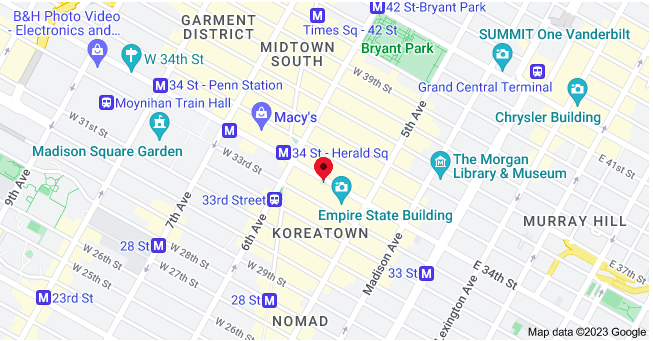

**You can write us directly. Our email address [bdmeter.info@gmail.com](mailto:bdmeter.info@gmail.com)**

**Our Address:  
**22 W 34th St, 301, New York, NY 10001, US

We are very happy to support our customers. Feel free to send us an email and call us direct to get support. Our support team is working from Monday-Friday 9 AM – 5 PM. Visit us and fix a schedule before your visit. Our location:

- Address: 22 W 34th St., New York, NY 10001, USA
- Email: bdmeter.info@gmail.com

- For News content and online reporting, send us an email ➶ bdmeter.info@gmail.com
- For any complaint or, claim submission, send us an email➶ bdmeter.info@gmail.com
- For corporate or business queries, send us an email ➶ bdmeter.info@gmail.com

Want to find out more about our publishing, get help using our products, or just have a general inquiry about the BDM? If so, go to our popular answers or have a search. Try searching with a keyword, like the name of the program or service you have a question about.

- To comment Online, send us an email ➶ bdmeter.info@gmail.com

### Write us...

    <form action="https://getform.io/f/1003cb49-edc3-4dca-9c2c-456328bd412c" method="POST">
        

            

                <input type="text" class="form-control" placeholder="name" required="True" name="name" data-rule="minlen:4" data-msg="Please enter at least 4 chars">
            

            

                <input type="email" class="form-control" placeholder="Email" name="email" data-rule="minlen:10" data-msg="Please enter a valid email address">
            

            

                <input type="phone" class="form-control" placeholder="Phone" name="phone" data-rule="phone" data-msg="Enter your phone (with country code)">
            

        

        

            <textarea class="form-control" id="exampleFormControlTextarea1" rows="3" placeholder="Your message" input type="text" name="message" data-rule="minlen:2" data-msg="Please write something for us"></textarea>
        

        
<button type="submit"  id="button" name="submit" title="Send Message">Send Message</button>

    </form>

