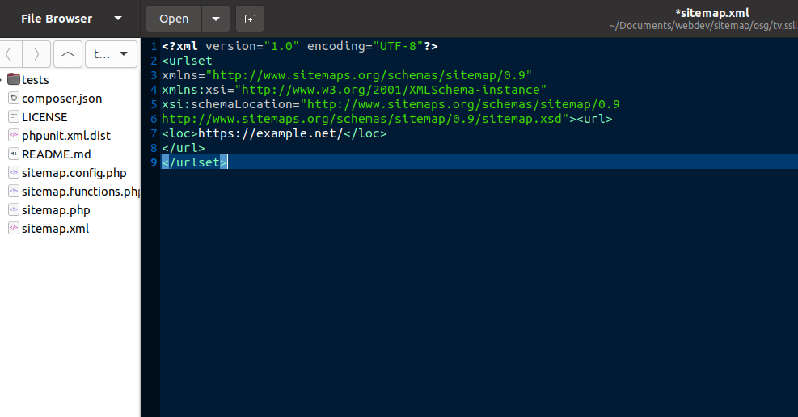

## How To Create Google Sitemap in Ubuntu 20.04

Today we will learn how to create Google Sitemap. Google Sitemap is very important because you need to do page ranking with Google Sitemap. Sitemap is a type of mapping where there will be links to all the pages of your website. You can easily create a sitemap on the Linux operating system.

With Sitemap you can crawl any website online, but WordPress site php coding. That’s why osg Properly works for php coded WordPress websites.

1. First I will download from the github link below.

`git clone https://github.com/knyzorg/Sitemap-Generator-Crawler.git`

2. Then allow this installation to work on Linux or Ubuntu

`sudo apt-get install php-curl`

3. Then enter the [Sitemap-Generator-Crawler] folder. Then open the terminal window here.

4. Right click on the mouse [Open in Terminal]

5. Then type in the following command terminal, press [Enter]

`php sitemap.php file = sitemap.xml site = https: //example.com`

Here [example.com] means your website url.

6. Then you will see that sitemap.xml has been generated in your folder.

7. Now upload the [sitemap.xml] file to your website public directory.

8. Then you submit /sitemap.xml to Google [google webmaster / search console].

9. You will link the sitemap file to your robot.txt file so that Google can crawl the sitemap.

`Sitemap: https://www.example.com/sitemap.xml`

10. Remember that you can create a sitemap once by downloading a github. Every new domain sitemap requires a new GitHub clone command every time [https://github.com/knyzorg/Sitemap-Generator-Crawler.git]

I think this system can be used to create sitemaps by crawling the best WordPress sites.

…

__Also in very shortcut system you can create sitemap with npm. Follow the reduction below.__

1. Open a terminal window. Install the npm sitemap generator.

`npm install -g sitemap-generator-cli`

2. Then quickly create a sitemap directly with the npx command (since npm v5.2).

`npx sitemap-generator-cli https://example.com`

If you receive the following warning, your website is robot.txt security protected so that no crawler can crawl the web.